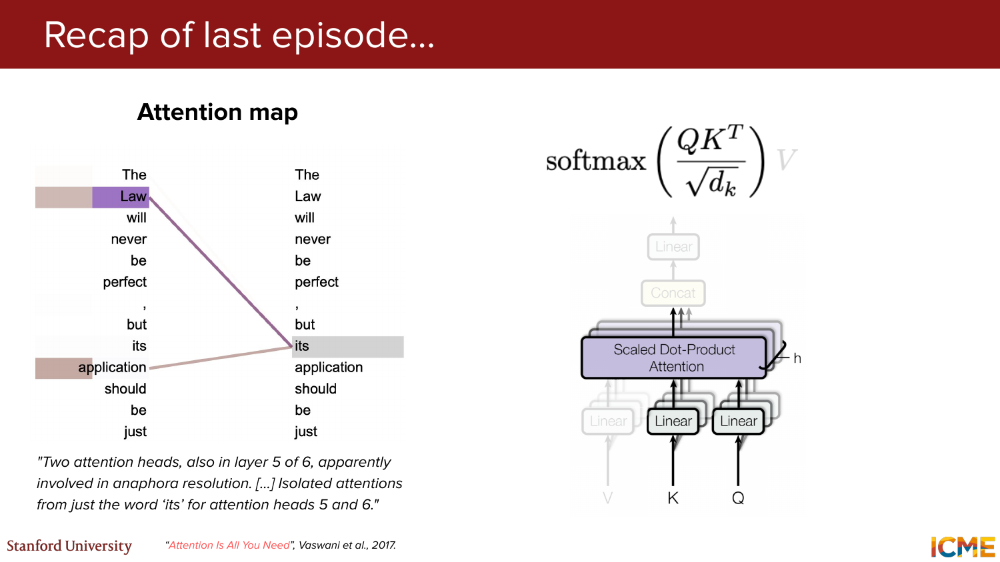
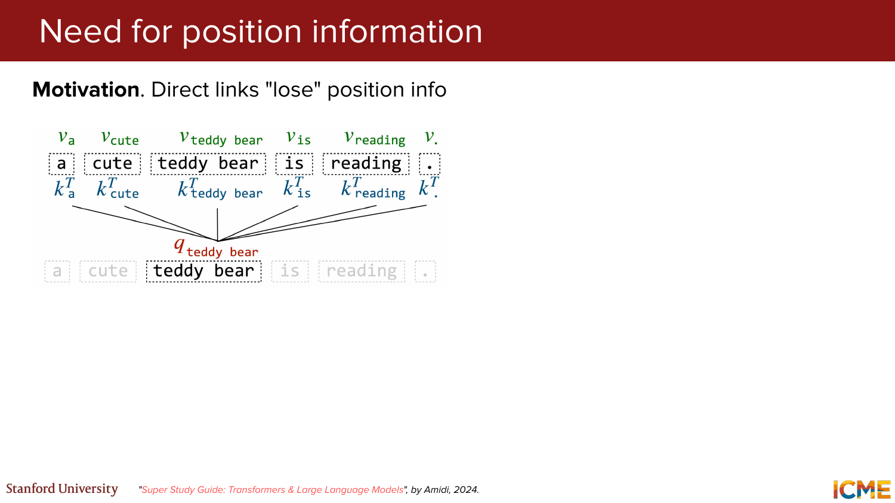
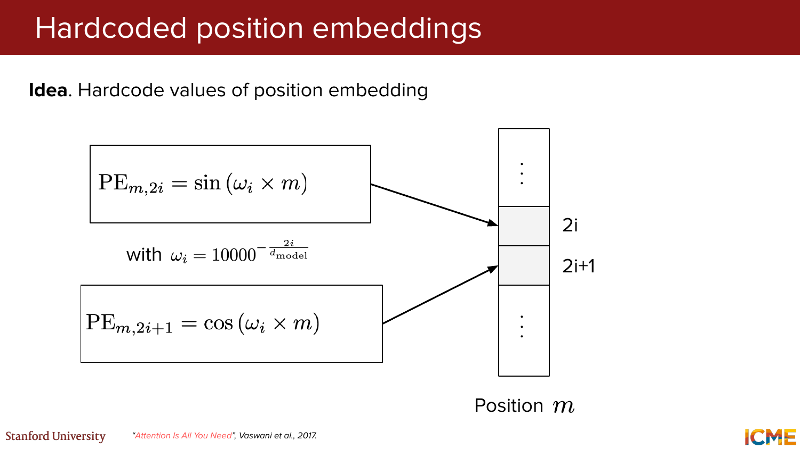
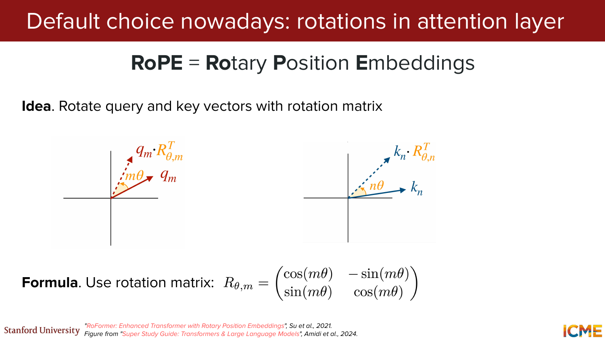
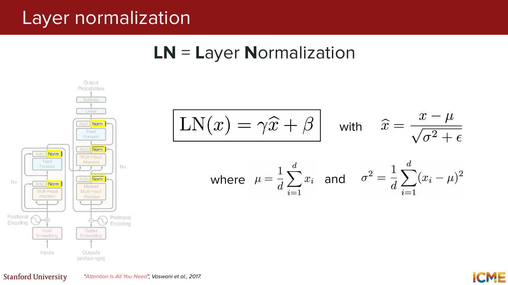
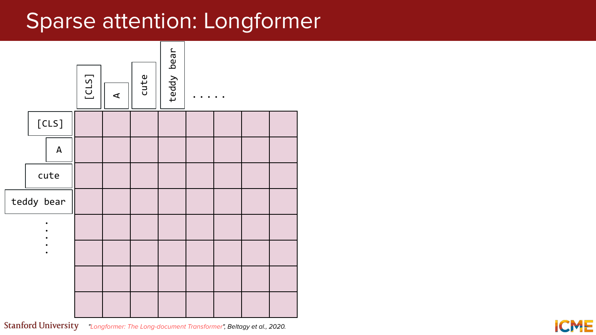
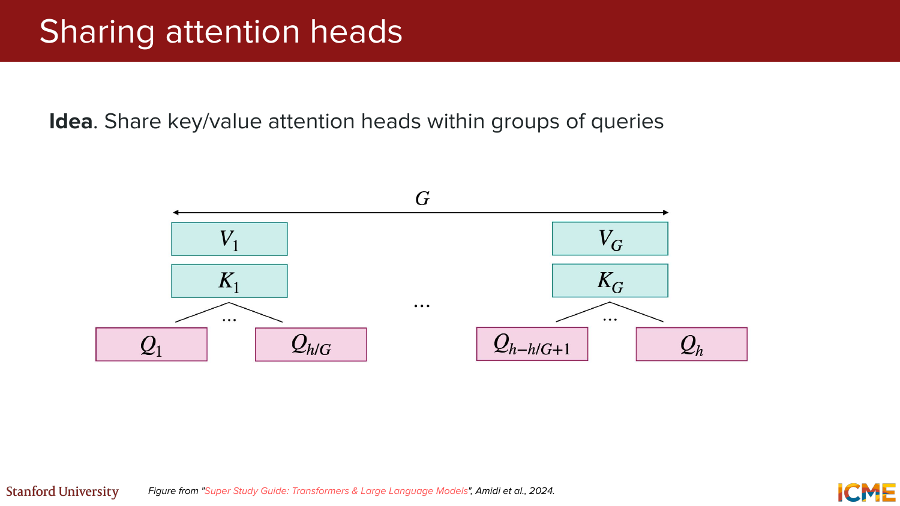
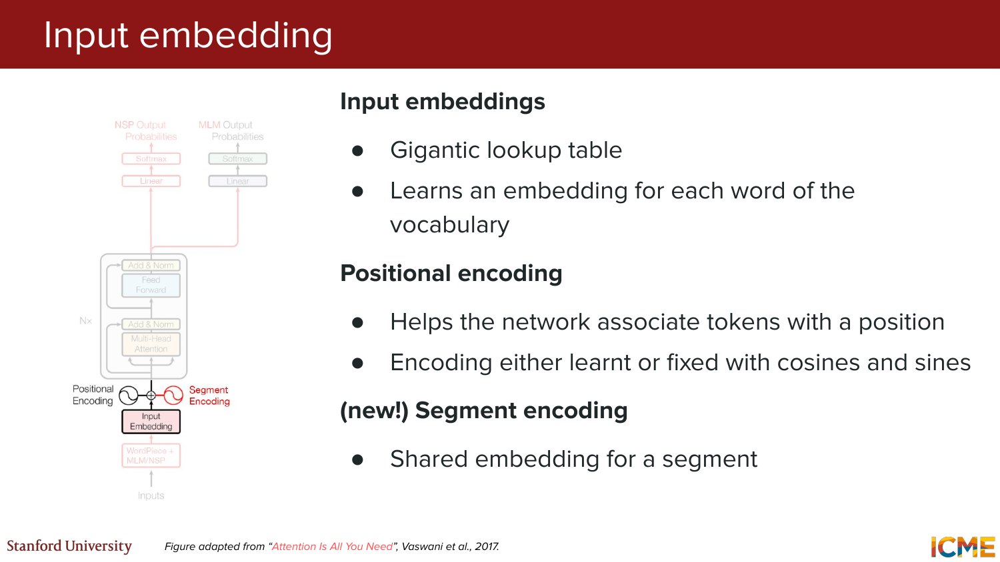
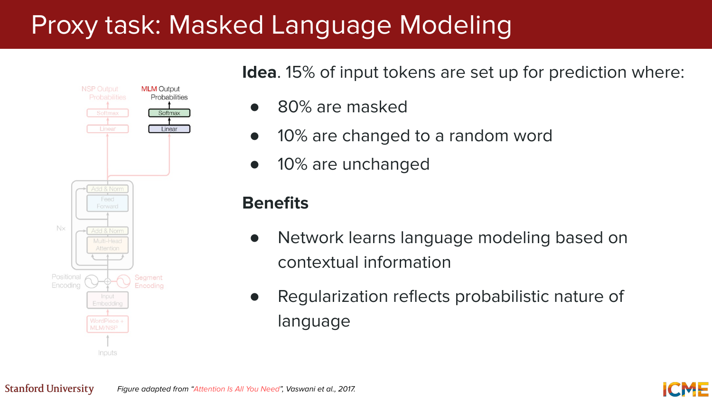
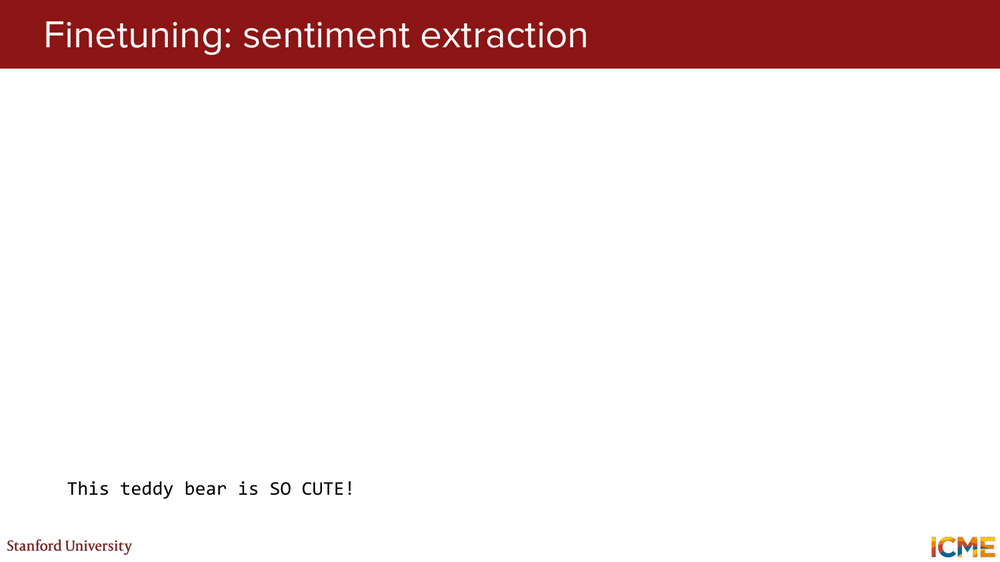

# CME 295: Transformers & Large Language Models — Lecture 2 (Hinglish)
### Stanford | Afshine Amidi & Shervine Amidi

---

## Pichle Lecture Ka Recap (Slides 1-10)

**Slide 1:** Title slide hai. Course ka naam `CME 295: Transformers & Large Language Models`, ye `Lecture 2` hai by Afshine Amidi aur Shervine Amidi.

**Slide 2:** Pichhli class ka recap start hota hai — "Recap of last episode..." Aaj ka lecture kal ke transformer basics ke upar build karega.

**Slide 3:** Self-attention ka example dikhaya gaya. Token `teddy bear` apne query `q_teddy bear` ke through sentence ke saare keys `k_a, k_cute, k_teddy bear, k_is, k_reading, k_.` ko dekhta hai aur corresponding values `v_*` se information gather karta hai. Token isolated nahi hota — wo context se meaning banata hai.

> **Example:** Socho ek classroom mein 5 students baithe hain. Teacher ne ek sawal pucha. Har student (token) baaki sabhi students (tokens) se hint le raha hai apna jawab banane ke liye. Yehi self-attention hai.

**Slide 4:** Attention formula compact form mein diya gaya:
```
Attention(Q, K, V) = softmax(QK^T / sqrt(d_k)) × V
```
Matlab:
- Pehle query-key ka dot product nikalo (similarity score)
- `sqrt(d_k)` se divide karo (scaling — taaki gradients stable rahen)
- Softmax lagao (normalized weights banao)
- Values ka weighted sum lo (final output)

> **Example:** Agar d_k = 64 hai, toh raw scores ko sqrt(64) = 8 se divide karenge. Bina scaling ke scores bahut bade ho sakte hain aur softmax saturate ho jayega.

**Slide 5:** Attention intuition ko full transformer architecture se connect kiya gaya. Dikhaya ki local attention idea actual encoder-decoder transformer stack ke andar fit hota hai.

**Slide 6:** Sirf attention formula ko isolate karke focus diya gaya. Point: poori architecture ka core mathematical primitive self-attention hi hai.

**Slide 7:** Multi-head attention block ke context mein formula dikhaya gaya. Multiple heads parallel mein alag-alag relation patterns seekh sakte hain, phir unhe concat karke linear layer se combine kiya jaata hai.

> **Example:** Head 1 syntax relationships pakadta hai (subject-verb), Head 2 semantic similarity dekhta hai (synonyms), Head 3 positional patterns dekhta hai (nearby words).

**Slide 8:** Multi-head attention block aur formula ek saath dikhaye gaye. Engineering block ka base bhi wahi scaled dot-product attention formula hai.

**Slide 9:** Attention map dikhaya gaya — **anaphora resolution** ka example. 2 attention heads (layer 5 of 6) mein word `its` ka attention dikhaya:
- *"The law will never be perfect, but **its** application should be just."*
- `its` ka connection `law` ya `application` jaise context words se samjha ja sakta hai
- Attention heads pronouns ko unke referents se connect kar sakte hain


*Visual reference: anaphora resolution wala attention map.*

> **Example:** "Maine **usse** kaha ki **woh** aaye" — yahan attention mechanism samajhta hai ki "usse" aur "woh" kaun hai, based on context.

**Slide 10:** Suggested reading: original Transformer paper **"Attention Is All You Need"** (Vaswani et al., 2017). Agar fundamentals aur deeply samajhne hain, toh source paper zaroor padhna chahiye.

---

## PART 1: Position Embeddings (Slides 11-35)

**Slide 11:** Section divider. Lecture ke topics list kiye gaye: Position embeddings, Layer normalization, Attention approximation, Transformer-based models, BERT deep dive.

---

### 1.1 Position Information Ki Zaroorat

**Slide 12:** Motivation diya gaya ki direct attention links khud se position info preserve nahi karte. Agar model ko sirf tokens milen aur order na mile, toh "dog bites man" aur "man bites dog" same lag sakte hain. Isliye position information zaroori hai.

> **Example:** "Kutte ne billi ko kaata" aur "Billi ne kutte ko kaata" — dono mein same words hain, but matlab bilkul alag hai! Agar model ko position nahi pata, toh dono sentences same lagenge.


*Visual reference: position information ki need ko explain karta slide.*

**Reference:** "Super Study Guide: Transformers & Large Language Models", Amidi, 2024.

---

### 1.2 Learned Position Embeddings

**Slide 13:** Pehla fix: har token vector ke saath ek **learned position-specific embedding** add karo.
```
Final Embedding = Token Embedding + Position Embedding
```

> **Example:** Word `bank` position 2 par aur position 20 par same token embedding hoga, par positional vector alag hoga. "I love AI" mein Position 0, 1, 2 ke liye alag-alag learned vectors hain.

**Slide 14:** Learned absolute position embeddings ka **limitation**: agar training max length 512 tak hui hai aur inference time par 2048 tokens aa gaye, toh model ko longer sequence ke liye **retrain ya modify** karna padega. Kyunki position 513+ ke liye koi embedding exist nahi karti.

---

### 1.3 Hardcoded Position Embeddings — Sinusoidal

**Slide 15:** Hardcoded position embeddings introduce kiye gaye. Idea: position vectors manually **sinusoidal form** mein define kar do, instead of learning every position separately.

**Slide 16:** Exact sinusoidal formula diya gaya:
```
PE(m, 2i)   = sin(omega_i × m)
PE(m, 2i+1) = cos(omega_i × m)

jahan omega_i = 10000^(-2i / d_model)
```
- Even dimensions (2i) → sin use hota hai
- Odd dimensions (2i+1) → cos use hota hai
- Har dimension ki frequency alag hoti hai

> **Example:** d = 4, position m = 3:
> - omega_0 = 1, omega_1 = 0.01
> - Dim 0: sin(3) ≈ 0.14
> - Dim 1: cos(3) ≈ -0.99
> - Dim 2: sin(0.03) ≈ 0.03
> - Dim 3: cos(0.03) ≈ 0.99


*Visual reference: sinusoidal positional encoding formula slide.*

**Slide 17:** Do positions `m` aur `n` ko compare karke dikhaya ki same dimension pair `(2i, 2i+1)` par sin/cos values rotate ho jaati hain. Alag positions ke vectors related rehte hain, random nahi hote.

**Slide 18:** Trigonometric identity dikhayi gayi:
```
cos(a - b) = cos(a)cos(b) + sin(a)sin(b)
```
Ye agle derivation ka foundation hai.

**Slide 19:** Identity mein `a = omega_i × m` aur `b = omega_i × n` substitute kiya:
```
cos(omega_i(m - n)) = cos(omega_i × m)cos(omega_i × n) + sin(omega_i × m)sin(omega_i × n)
```
Point: relative distance `m - n` sinusoidal terms se express ho sakta hai.

**Slide 20:** Position embeddings ke inner product ko relative distance se connect kiya:
```
<PE_m, PE_n> = ... + cos(omega_i(m - n)) + ...
```
Positions ke embeddings ka dot product unke relative gap ko encode karta hai.

**Slide 21:** Final conclusion:
```
<PE_m, PE_n> = f(m - n)
```
Matlab absolute position vectors hone ke bawajood, unka **similarity structure sirf relative distance (m - n) ka function** ban jaata hai!

> **Example:** Position 5 aur 8 ka similarity = Position 15 aur 18 ka similarity. Kyunki dono cases mein relative distance = 3.

**Slide 22:** Do heatmaps dikhaye gaye:
- **Value of embeddings**: Har position ko unique sinusoidal pattern milta hai (jaise fingerprint)
- **Similarity between positions**: Diagonal par similarity strongest, nearby positions ka pattern structured
- Sinusoidal encoding smooth positional geometry banata hai

**Slide 23:** Key benefit explicitly bola gaya: sinusoidal positional encoding ko theoretically **kisi bhi sequence length tak extend** kiya ja sakta hai. Retrain ki need nahi hoti.

> **Example:** Training mein sirf 512 length dekhi? Koi baat nahi — 1000 length par bhi kaam karega!

**Reference:** Vaswani et al., 2017 & Kazemnejad, 2019.

---

### 1.4 Absolute Se Relative Position Ki Taraf

**Slide 24:** Motivation: asal mein attention ke andar humein **absolute position se zyada relative position** ki zaroorat hoti hai — "kitna door" important hai, sirf "absolute index kya hai" nahi.

> **Example:** "Maine **usse** kaha ki **woh** aaye" — yahan relative distance matter karta hai, na ki absolute positions (3rd ya 6th word).

**Slide 25:** Idea change: token embeddings ko modify karne ke bajay **attention layer ko hi modify karo**, taaki relative position directly score calculation mein aaye.

---

### 1.5 Linear Bias in Attention Layer

**Slide 26:** Linear bias in attention introduce hota hai. Attention score ab sirf `q` aur `k` ka dot product nahi, balki usmein **position-based bias** bhi add hota hai:
```
Attention = softmax(<q_m, k_n> / sqrt(d_k) + bias(m, n))
```

**Slide 27:** **T5 Bias** dikhaya gaya:
```
bias(m, n) = beta_bucket(m - n)
```
Distance ko **buckets** mein map karke har head ke liye **learned bias** use hota hai.

> **Example:** Distance 1 aur 2 alag buckets mein ho sakte hain. Distance 100 aur 101 same bucket mein aa sakte hain (far away = similar treatment).

**Reference:** Raffel et al., 2023.

**Slide 28:** **ALiBi (Attention with Linear Biases)** introduce hota hai:
```
bias(m, n) = mu × (n - m)
```
- Linear, deterministic aur **unbounded** bias
- Jitna door ka token, utna zyada negative bias (penalty)
- Model short context par train hokar bhi **longer context par extrapolate** better kar sakta hai

> **Example:** Token A position 5, Token B position 2:
> - Distance = |5 - 2| = 3
> - Bias = -mu × 3 (door ke tokens ko automatically kam attention milega)

**Reference:** Press et al., 2021 — "Train Short, Test Long"

---

### 1.6 RoPE — Rotary Position Embeddings (Aaj Ka Default Choice!)

**Slide 29:** Aajkal ka default choice bataya gaya: **RoPE**. Idea: query aur key vectors ko **rotation matrix se rotate** karo. Position information token vector par add nahi hoti, balki query/key coordinate system ko rotate karke inject hoti hai.


*Visual reference: RoPE ka rotation-based intuition.*

**Slide 30:** 2D rotation matrix formula diya gaya:
```
R(theta, m) = [cos(m×theta)  -sin(m×theta)]
               [sin(m×theta)   cos(m×theta)]
```
Position `m` vector ko angle `m × theta` se rotate karta hai.

**Slide 31:** Same idea ko naam diya: **RoPE = Rotary Position Embeddings**.

> **Example (2D):** Query vector q = [1, 0] position 3 par, theta = 0.5:
> - Rotated q = [cos(1.5), sin(1.5)] = [0.07, 0.997]
> - Key vector bhi rotate hoga apni position ke according.

**Slide 32:** Higher dimension case (d > 2): poore vector ko **2-2 ke blocks mein split** karke har block ko alag rotate kiya jaata hai. Block-diagonal rotation matrix jaisa hota hai.

**Slide 33:** RoPE ka important benefit:
```
q_m^T × k_n = x_m × W_q × R(theta, n-m) × W_k^T × x_n^T
```
Query-key interaction naturally **relative displacement (n-m)** par depend karti hai, absolute positions par nahi!

> **Example:** Position 5 ka query aur position 3 ki key ka dot product SAME hoga jaise position 105 ka query aur position 103 ki key ka. Relative distance = 2 dono mein.

**Slide 34:** Relative distance capture hone ki baat aur reinforce ki gayi. RoPE content aur relative position dono ko mathematically elegant tareeke se combine karta hai.

**Slide 35:** Graph dikhata hai ki attention weight ka **long-term decay** hota hai. Relative upper bound of attention jaise-jaise `|m-n|` badhta hai, generally reduce hota hai. Door ke tokens ko attend karna possible hai, par naturally weaker hota jaata hai.

**Reference:** Su et al., 2021 — "RoFormer: Enhanced Transformer with Rotary Position Embeddings"

---

## PART 2: Layer Normalization (Slides 36-44)

**Slide 36:** Section divider. Ab focus **Layer normalization** par shift hota hai.

---

### 2.1 Layer Normalization Kya Hai?

**Slide 37:** Original transformer architecture mein `Norm` blocks highlight kiye gaye. Normalization transformer training ka core stabilizer hai.

**Slide 38:** `LN = Layer Normalization` introduce kiya gaya. Ab formal definition aane wali hai.

**Slide 39:** Layer norm formula diya gaya:
```
LN(x) = gamma × x_hat + beta

jahan:
x_hat = (x - mu) / sqrt(sigma^2 + epsilon)
mu = (1/d) × sum(x_i)             -- mean
sigma^2 = (1/d) × sum((x_i - mu)^2)  -- variance
```
- `gamma` = learnable scale, `beta` = learnable shift, `epsilon` = small constant
- Normalization **same sample ke features ke andar** hoti hai, batch ke across nahi

> **Example:** Layer output = [2, 4, 6]:
> - Mean = 4, Variance = 8/3
> - Normalized = [-1.22, 0, 1.22]
> - Phir gamma se multiply aur beta add karke final output


*Visual reference: layer normalization formula and block.*

**Slide 40:** Benefits explicit: LN **training stability aur convergence improve** karta hai. Agar kuch features bahut bade scale par aur kuch chhote par hain, LN unhe controlled range mein laata hai.

**Reference:** Ba et al., 2016.

---

### 2.2 Post-Norm vs Pre-Norm

**Slide 41:** **Post-Norm** architecture dikhaya gaya:
```
Output = LayerNorm(x + SubLayer(x))
```
Pehle residual add hota hai, **phir** normalization.

**Slide 42:** **Pre-Norm** architecture dikhaya gaya:
```
Output = x + SubLayer(LayerNorm(x))
```
Normalization residual connection se **pehle** sublayer input par lagti hai. Side-by-side comparison dikhaya.

> **Example analogy:**
> - **Post-Norm** = Pehle khaana khao, phir haath dho lo (normalize at the end)
> - **Pre-Norm** = Pehle haath dho lo, phir khaana khao (normalize before processing)

**Slide 43:** Aajkal **Pre-Norm** preferred hai. Deep transformers mein gradients zyada stable rehte hain aur convergence issues kam hote hain.

**Reference:** Xiong et al., 2020.

---

### 2.3 RMSNorm

**Slide 44:** Modern default aur refined: **Pre-Norm + RMSNorm**. RMSNorm mean subtraction nahi karta, sirf magnitude-based normalization:
```
RMSNorm(x) = gamma × x / sqrt(mean(x^2) + epsilon)
```

> **Example:** x = [2, 4, 6]:
> - RMS = sqrt((4+16+36)/3) ≈ 4.32
> - Normalized = [0.46, 0.93, 1.39]

**Benefit:** Computationally cheaper — mean calculate nahi karna padta. Large models mein yeh savings matter karti hai!

**Reference:** Zhang et al., 2019.

---

## PART 3: Attention Approximation (Slides 45-54)

**Slide 45:** Section divider. Ab attention approximation / efficiency techniques par aate hain.

Standard self-attention = **O(n^2)** complexity. n = 10,000 toh 10 crore scores! Bahut expensive.

---

### 3.1 Sparse Attention: Longformer

**Slide 46:** **Sparse attention: Longformer** introduce hota hai. Token matrix dikhaya jahan har token ko har token dekhna zaroori nahi.


*Visual reference: Longformer ka sparse attention pattern.*

**Slide 47:** Actual sparse pattern visible: local diagonal band + global row/column structure. Nearby tokens local attention lete hain, special global tokens (jaise [CLS]) sabse interact kar sakte hain.

> **Example:** "[CLS] A cute teddy bear":
> - "cute" sirf "A", "cute", "teddy" ko attend karega (local window)
> - "[CLS]" sabhi tokens ko attend karega (global)

**Reference:** Beltagy et al., 2020.

---

### 3.2 Sliding Window Attention (SWA)

**Slide 48:** **SWA = Sliding Window Attention** define hota hai. Har token apne fixed-size window ko attend karta hai. Local aur global attention layers ko **interleave** bhi kiya ja sakta hai.

> **Example:** Long document mein har word sirf near neighbors dekhta hai, par [CLS] ya title tokens ko broader visibility milti hai.

**Slide 49:** **Mistral 7B** ka reference diya gaya. Sliding window attention modern decoder-only models mein bhi kaam aati hai, especially efficiency ke liye.

**Slide 50:** Computer vision ka **"receptive field"** analogy diya gaya. Jaise CNN mein deeper layers ke saath effective visible area badhta hai, waise multiple local-attention layers stack karne se token ka effective context expand hota hai.

> **Example:**
> - Layer 1: har token 4 neighbours dekhta hai
> - Layer 2: indirectly 8 neighbours tak pahunch jaata hai
> - Layer 3: effective receptive field aur badh jaata hai
>
> Even with local attention, deep networks mein har token eventually poore sequence ko "see" kar sakta hai!

**Reference:** Mistral 7B announcement, 2023 & "VIP Cheatsheet: CNNs", Amidi, 2018.

---

### 3.3 Sharing Attention Heads

**Slide 51:** **Sharing attention heads** ka idea introduce hota hai: queries ke groups ke beech key/value heads share karo. Goal: memory aur KV cache cost reduce karna.


*Visual reference: MHA, MQA, aur grouped sharing ka slide.*

**Slide 52:** **MQA = Multi-Query Attention** dikhaya gaya (G = 1). Bahut saare query heads hain, lekin sirf **ek shared key head aur ek shared value head**.

> **Example:** Office mein 32 employees (queries). MQA mein sabhi 32 employees **ek hi secretary** (K,V) share karte hain.

**Slide 53:** Comparison slide:
| Method | Query Heads | K,V Heads (G) | Memory Usage |
|--------|------------|---------------|-------------|
| **MHA** (Multi-Head) | 32 (= h) | 32 (G = h) | Sabse zyada, full flexibility |
| **GQA** (Grouped-Query) | 32 | 8 | Medium, good balance |
| **MQA** (Multi-Query) | 32 | 1 (G = 1) | Sabse kam, max efficiency |

> **Example GQA:** 32 employees ko 8 teams mein divide kiya. Har team ka ek secretary — toh 8 secretaries manage 32 employees.

**Slide 54:** Comparison ko dusre angle se emphasize kiya. MHA mein G = h (full flexibility but sabse zyada KV cost).

**Reference:** Amidi et al., 2024.

---

## PART 4: Transformer-Based Models Ka Overview (Slides 55-60)

**Slide 55:** Section divider. Ab topic **Transformer-based models** hai.

**Slide 56:** Pehli category: **Encoder-Decoder**. Use case: text to text. Examples: T5, mT5, ByT5.

> **Example:** Translation — "I love you" → "Main tumse pyaar karta hoon". Summarization, Q&A generation.

**Slide 57:** Doosri category: **Encoder-Only**. Class prediction ke liye embedding ka projection. Examples: BERT, DistilBERT, RoBERTa.

> **Example:** Sentiment classification — "Yeh movie bahut bekar thi" → Negative Sentiment.

**Slide 58:** Teesri category: **Decoder-Only**. Text to text, autoregressive generation. Examples: GPT series.

> **Example:** "Once upon a time" → "there lived a king who..."

**Slide 59:** Historical note: Encoder-decoder aur Encoder-only models **~2018-2022** ke beech bahut popular the.

**Slide 60:** Current trend: **Decoder-only models popular now!** Present LLM wave mostly decoder-only systems ke around centered hai.

---

## PART 5: BERT Deep Dive (Slides 61-109)

**Slide 61:** Section divider. Ab **BERT deep dive** shuru hota hai.

---

### 5.1 BERT Kya Hai?

**Slide 62:** Acronym expand kiya: **BERT = Bidirectional Encoder Representations from Transformers**.

**Slide 63:** `Encoder` term par focus. BERT decoder-based model nahi hai.

**Slide 64:** Original transformer figure ke decoder side ko cross-out karke dikhaya. BERT = transformer ka **encoder-only** adaptation.

**Slide 65:** `Representations` word par emphasis. BERT ka main output generated text nahi, balki **rich contextual embeddings** hain.

**Slide 66:** `Bidirectional` ko visual example se samjhaya. Token `teddy bear` **left aur right dono** context (`a cute ... is reading .`) ko simultaneously dekh sakta hai. Ye BERT ki signature strength hai.

> **Example:**
> - BERT: "Maine ___ khaya" → "Maine" AUR "khaya" dono se samajh sakta hai ki beech mein "khaana" ya "aam" aa sakta hai

**Slide 67:** Warning: masked decoder-style attention **bidirectional nahi** hoti! Agar token sirf left context dekh sakta hai, toh wo BERT jaisa full-context representation nahi bana sakta.

> **Example:** Decoder: "Maine ___" → sirf "Maine" se guess karo (aage ka pata nahi). Ye limited hai!

**Slide 68:** BERT paper aur ELMo paper compare kiye gaye. ELMo earlier aaya (Feb 2018 submit), BERT later (Oct 2018 submit). Bidirectional/contextual representation ka idea evolve ho raha tha.

**Slide 69:** Fun fact slide — Sesame Street characters: **Bert** aur **Elmo**. Naam yaad rakhne ke liye!

**Reference:** Devlin et al., 2018 & Peters et al., 2018.

---

### 5.2 BERT Architecture

**Slide 70:** Idea: sirf encoders rakho + encoded embeddings se prediction karo. Example: `A cute teddy bear is reading . [CLS] [SEP]` ke encoded representation se class prediction.

**Slide 71:** BERT strategy 2 stages mein:
- **Step 1:** Pretraining with proxy tasks (MLM aur NSP)
- **Step 2:** Finetuning for given end task

**Slide 72:** Pros aur Cons:

| Pros | Cons |
|------|------|
| Finetuning ke liye bahut zyada data nahi chahiye | Text generation jaisi tasks ke liye suitable nahi |
| Achha performance milta hai | Finetuning ek zaruri extra step hai |

**Slide 73:** Variants list kiye gaye: **RoBERTa, DistilBERT, ALBERT**. BERT base idea se multiple practical adaptations nikle.

**Slide 74:** Original transformer architecture (2017) ko reference ke roop mein dikhaya. Comparison ke liye baseline.

**Slide 75:** BERT architecture (2018) ko original se compare kiya. Key changes: decoder hata diya, segment encoding add hui, MLM aur NSP output heads aaye.

---

### 5.3 Input Processing aur Embedding

**Slide 76:** **Input Processing:**

**WordPiece algorithm:**
- Tokenizer pehle se training corpus par trained hota hai
- Vocabulary size: ~30,000
- Common subword particles detect karne mein expert

> **Example:** "unbelievable" → ["un", "##believ", "##able"]
> "playing" → ["play", "##ing"]

**NSP / MLM task processing:**
- `[CLS]` — Input ke beginning mein add karo
- `[SEP]` — Segments ko separate karo aur end mein bhi lagao
- `[MASK]` — Inputs ko mask karne ke liye

**Slide 77:** **Input Embedding** — teen parts ka sum:

1. **Token Embedding** — Gigantic lookup table; vocabulary ke har word ke liye ek embedding
2. **Position Embedding** — Token ko position se jodta hai; learned ya fixed (cosines/sines)
3. **(New!) Segment Embedding** — Ek segment ke liye shared embedding


*Visual reference: BERT input embedding ka 3-part sum.*

```
Final Input = Token Embedding + Position Embedding + Segment Embedding
```

> **Example:** Same word "bank" agar Sentence A aur Sentence B dono mein ho, toh token embedding same, lekin segment embedding usse distinguish karegi.

**Slide 78:** **Encoder-Only Model Goal:**
- Input data ko aise features ke saath represent karna jo NLP tasks ke liye chahiye
- Transformer ka self-attention mechanism leverage karna
- Learned embedding ko classification-oriented tasks ke liye use karna

---

### 5.4 Proxy Task 1: Masked Language Modeling (MLM)

**Slide 79:** 15% input tokens prediction ke liye select hote hain:
- **80% masked** (`[MASK]`)
- **10% random word** se replace
- **10% unchanged**


*Visual reference: MLM setup ko show karta slide.*

> **Example:**
> Original: "The cat sat on the mat"
> - 80% case: "The [MASK] sat on the mat" → Predict "cat"
> - 10% case: "The dog sat on the mat" → Predict "cat"
> - 10% case: "The cat sat on the mat" → Predict "cat" (confirm)

**Kyun 80-10-10?**
- Inference time par [MASK] kabhi nahi aata — model ko non-masked inputs par bhi kaam karna aana chahiye
- Random replacement → robustness, Unchanged → confirmation
- Yeh regularization ka kaam karta hai aur language ki probabilistic nature reflect karta hai

**Benefit:** Network contextual information ke basis par bidirectional language modeling seekhta hai.

---

### 5.5 Proxy Task 2: Next Sentence Prediction (NSP)

**Slide 80:** Corpus se 2 sentences:
- **50% time** consecutive (follows each other)
- **50% time** random (do not follow)

Task: predict karo ki consecutive hain ya nahi.

> **Example:**
> Positive: "I opened the book." + "The first page was torn." → IsNext
> Negative: "I opened the book." + "Bananas are yellow." → NotNext
>
> Hindi: "Maine padhai ki" + "Phir so gaya" → IsNext
> "Maine padhai ki" + "Elephant bada hai" → NotNext

**Benefits:** Network implicitly contextual relationships seekhta hai. Easy task, koi labels nahi chahiye. [CLS] token ka embedding use hota hai.

---

### 5.6 Hyperparameters

**Slide 81:** Model hyperparameters:
- **L** = Layers (kitne encoder layers stack hain)
- **H** = Hidden size (embedding dimension)
- **A** = Attention heads (parallel mein kaam karte hain)

Data choices: Language-specific vs multilingual, Cased vs Uncased.

**Slide 82:** BERT ke different sizes:

| Model | L | H | A | Parameters |
|-------|---|---|---|------------|
| BERT-Tiny | 2 | 128 | 2 | 4M (40 lakh) |
| BERT-Mini | 4 | 256 | 4 | 11M (1.1 crore) |
| BERT-Small | 4 | 512 | 8 | 30M (3 crore) |
| BERT-Medium | 8 | 512 | 8 | 42M (4.2 crore) |
| BERT-Base | 12 | 768 | 12 | 110M (11 crore) |
| BERT-Large | 24 | 1024 | 16 | 340M (34 crore) |

> **Example:** BERT-Base = 12 layers, 12 heads, 768-dim embeddings, ~11 crore parameters!

---

### 5.7 BERT Finetuning

**Slide 83:** Goal: BERT ki seekhi embeddings ko ek **"sister" task** ke liye reuse karo.

**Slide 84:** Tricks:
1. Pretrained weights use karo (scratch se nahi)
2. Early layers freeze karo (better complexity/performance trade-off)
3. Minimal labeled data se bhi achhe results possible

**Slide 85:** Use cases:
- **Sequence classification:** sentiment extraction
- **Token classification:** question answering

---

### 5.8 Finetuning Example: Sentiment Extraction (Step-by-Step)

**Slide 86:** Raw sentence: **"This teddy bear is SO CUTE!"** — uppercase emphasis emotion dikhata hai.


*Visual reference: sentiment finetuning example ka starting slide.*

**Slide 87:** Lowercase: **"this teddy bear is so cute!"** (uncased preprocessing).

**Slide 88:** Tokenization:
```
["this", "teddy", "bear", "is", "so", "cute", "!"]
```

**Slide 89:** `[CLS]` token add kiya — sentiment ke placeholder ke roop mein:
```
["[CLS]", "this", "teddy", "bear", "is", "so", "cute", "!"]
```

**Slide 90:** `[SEP]` aur `[PAD]` tokens ke saath fixed length format:
```
[CLS] this teddy bear is so cute ! [SEP] [PAD] [PAD] [PAD] [PAD] [PAD] [PAD]
```

**Slide 91:** Har token ke upar basic **token embedding vector** aata hai. Discrete tokens → numeric dense vectors.

**Slide 92:** **Position embedding** add hoti hai:
```
Positions: 0  1  2  3  4  5  6  7  8  9  10  11  12  13  14
```
`cute` position 6 par hai — uska vector slot info carry karega.

**Slide 93:** **Segment embedding** add hoti hai:
```
Segments:  A  A  A  A  A  A  A  A  A  B   B   B   B   B   B
```
Pehla sentence = Segment A, padding = Segment B.

**Slide 94:** Token + Position + Segment embeddings milkar **position- aur segment-aware embedding** banti hai. Final input vector = teen sources ka sum.

**Slide 95:** Final embeddings sab input slots ke liye ready hain. Ye encoder ke input banenge.

**Slide 96:** Poora sequence pretrained **BERT ENCODER** ke through pass hota hai. Scratch se nahi — pretrained representation engine ka use.

**Slide 97:** Encoder ke baad **classification head** lagta hai. [CLS] representation ko task-specific FFN/classifier mein dekar final sentiment output:
```
[CLS] embedding → FFN → Sentiment → Label: 1 (Positive)
```

> **Result:** "this teddy bear is so cute!" → **Positive sentiment**

---

### 5.9 Takeaways and Shortcomings

**Slide 98:** Benefits:
- State-of-the-art results
- ~True contextual representation of words
- Bahut saare classification tasks ke liye adaptable

> **Example:** "bank" ka embedding "money deposit" context mein alag aur "river bank" context mein alag!

**Slide 99:** Applications: Industry mein widely used — encoding se judi kisi bhi cheez ke liye (search engines, recommendations, text classification).

**Slide 100:** Limitations:
- Context window limited (typically 512 tokens)
- Computationally expensive (mobile app mein BERT-Large deploy karna costly)
- Training paradigm complex: MLM/NSP + finetuning

---

### 5.10 Knowledge Distillation

**Slide 101:** Core quote:
> "The soft targets contain almost all the knowledge." — Hinton et al., 2014

Hard targets [1,0,0] vs Soft targets [0.7, 0.2, 0.1] — soft mein zyada information hai.

**Slide 102:** Teacher `T` aur Student `S` diagram. Dono same input `x` lete hain. Student ko teacher ki **soft distribution imitate** karni hoti hai.

> **Example:** Teacher predict kare: cat=0.55, dog=0.35, fox=0.08, car=0.02
> Student ko sirf "cat=1" se itna nahi milta jitna in soft probabilities se — ki "dog" bhi similar hai (dono animals!), "car" bilkul alag hai.

**Slide 103:** Distillation loss = **KL divergence**:
```
Loss = KL(y_T || y_S) = sum_i y_T^(i) × log(y_T^(i) / y_S^(i))
```
Student distribution ko teacher distribution ke close lana = objective.

---

### 5.11 DistilBERT — Efficiency Variant

**Slide 104:**

| | BERT Base | DistilBERT |
|--|-----------|------------|
| Layers | 12 | 6 (half!) |
| Speed | 1x | ~1.6x faster |
| Performance | 100% | ~97% retained |

> **Example:** BERT Base = heavy SUV, DistilBERT = hatchback — 97% kaam wahi, 1.6x fast, bahut kam resources!

**Reference:** Sanh et al., 2019.

---

### 5.12 RoBERTa — Performance Variant

**Slide 105:** Goal: BERT pretraining ko systematically optimize karna. Same architecture, better training.

**Slide 106:** Modeling changes:
- **NSP/segment encodings remove** kiye → lagbhag koi effect nahi! (DistilBERT ne bhi hata diya tha)
- **Static → dynamic masking** across epochs

> **Example:**
> BERT: "The [MASK] sat on the mat" (same mask har epoch)
> RoBERTa Epoch 1: "The [MASK] sat on the mat"
> RoBERTa Epoch 2: "The cat [MASK] on the mat"
> RoBERTa Epoch 3: "The cat sat [MASK] the mat"

**Slide 107:** Data changes:
- Pretraining corpus: **16 GB → 160 GB** (10x!)
- Training: **1M steps** (batch 256) vs BERT ke 500k steps (batch 8k)

**Slide 108:** Result: **+4% across benchmarks**. Same architecture, sirf training optimize ki!

> **Example analogy:** BERT aur RoBERTa same car. RoBERTa mein better fuel (10x data), better driving (dynamic masking), unnecessary features hatayi (no NSP) = same car, better performance!

**Reference:** Liu et al., 2019.

---

**Slide 109:** Closing slide — **"Thank you for your attention!"**

---

## Summary Table

| Topic | Key Idea | Modern Default |
|-------|----------|---------------|
| Position Embeddings | Token ki position batana | **RoPE** (Rotary) |
| Layer Normalization | Training stable karna | **Pre-Norm + RMSNorm** |
| Attention Approximation | O(n^2) se bachna | **SWA + GQA** |
| Model Architecture | Encoder/Decoder choice | **Decoder-only** (GPT style) |
| BERT | Bidirectional encoder | Encoder tasks mein use |
| DistilBERT | Chhota BERT (distillation) | Efficiency ke liye |
| RoBERTa | Better trained BERT | Performance ke liye |

---

## Key Papers Referenced:

1. **"Attention Is All You Need"** — Vaswani et al., 2017
2. **"RoFormer"** — Su et al., 2021 (RoPE)
3. **"Train Short, Test Long"** — Press et al., 2021 (ALiBi)
4. **"On Layer Normalization in the Transformer Architecture"** — Xiong et al., 2020
5. **"Root Mean Square Layer Normalization"** — Zhang et al., 2019
6. **"Longformer"** — Beltagy et al., 2020
7. **"BERT"** — Devlin et al., 2018
8. **"ELMo"** — Peters et al., 2018
9. **"DistilBERT"** — Sanh et al., 2019
10. **"RoBERTa"** — Liu et al., 2019
11. **"Dark Knowledge"** — Hinton et al., 2014
12. **"T5"** — Raffel et al., 2023
13. **"Positional Encoding"** — Kazemnejad, 2019

---

*Stanford CME 295 Lecture 2 — All 109 slides covered in Hinglish with slide numbers, examples, aur formulas.*
