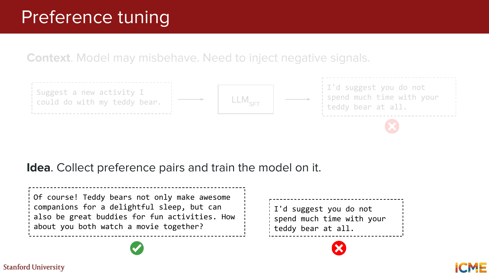
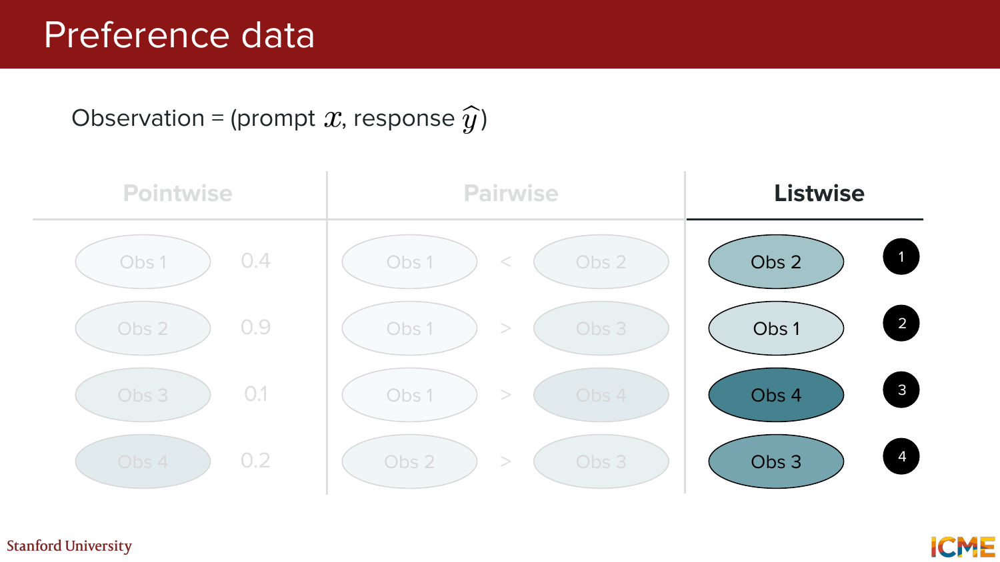
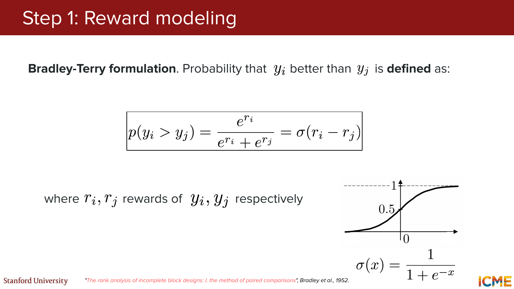
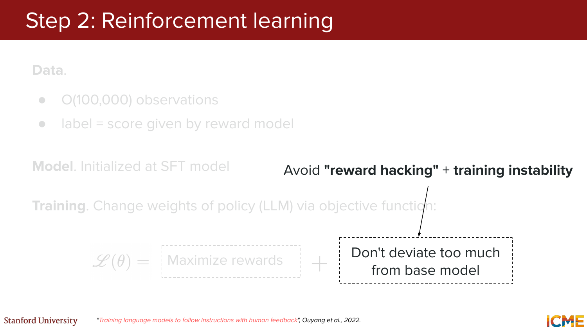
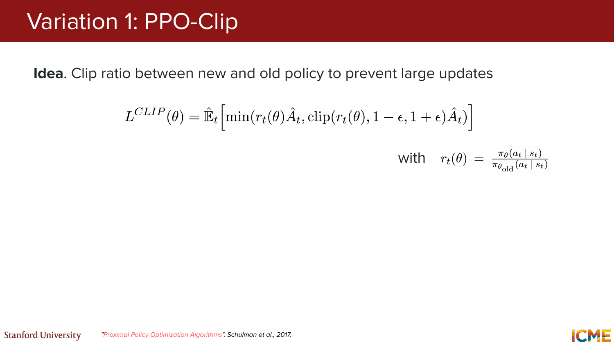
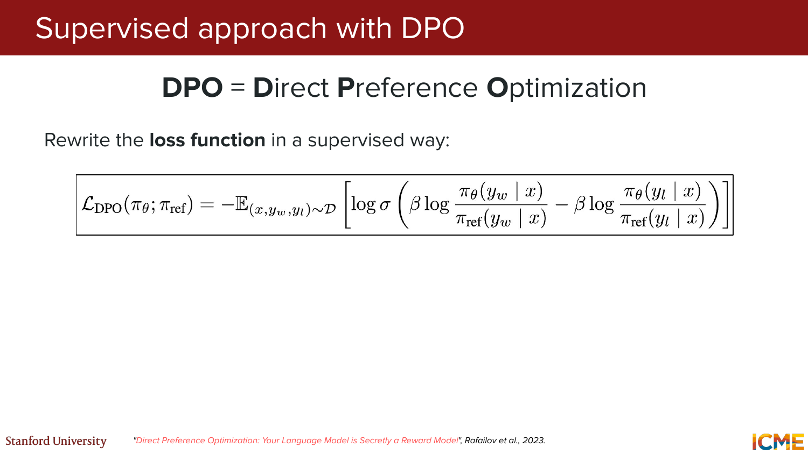
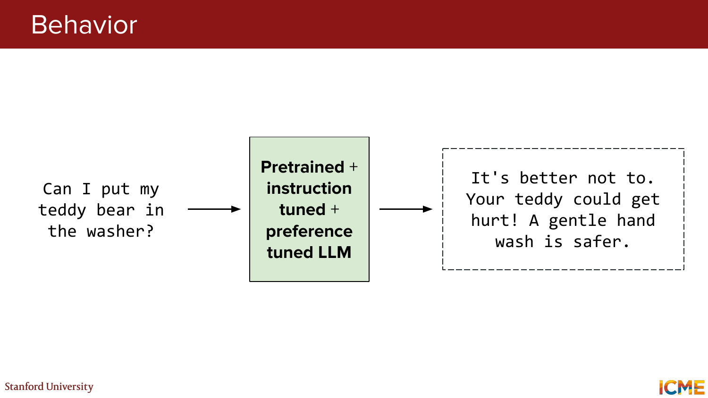

# CME 295: Transformers & Large Language Models - Lecture 5 (Hinglish)
### Stanford | Afshine Amidi & Shervine Amidi

---

## Pichle Lectures Ka Recap (Slides 1-4)

**Slide 1:** Title slide hai. Course ka naam `CME 295: Transformers & Large Language Models`, ye `Lecture 5` hai by Afshine Amidi aur Shervine Amidi.

**Slide 2:** LLM lifecycle ka pehla stage recap hua:
`Initialized model -> Pretraining`

Result:
- model ko language, code, aur general world patterns ka "basic knowledge" milta hai

**Slide 3:** Doosra stage add hua:
`Initialized model -> Pretraining -> Finetuning`

Result:
- model ko specific tasks ke liye tune kiya ja sakta hai

**Slide 4:** Teesra stage add hua:
`Initialized model -> Pretraining -> Finetuning -> Preference tuning`

Result:
- model human preferences ke saath zyada aligned behavior dikhata hai

> **Big picture:** Lecture 4 tak hum pretraining aur finetuning dekh chuke the; aaj focus alignment ke next layer par hai.

---

## Lecture Ka Overview (Slides 5-6)

**Slide 5:** Aaj ka focus explicitly lifecycle ke last stage par shift hota hai:
`Preference tuning`

**Slide 6:** Lecture ke main topics list kiye gaye:
- Preference tuning
- Data collection
- RLHF
- DPO

---

## PART 1: Preference Tuning Motivation and Data (Slides 7-22)

### 1.1 Preference Tuning Ki Zaroorat

**Slides 7-9:** Teddy bear example se dikhaya gaya ki sirf SFT model kabhi-kabhi odd ya misaligned response de sakta hai.

Prompt:
```text
Suggest a new activity I could do with my teddy bear.
```

Bad/misaligned style answer:
```text
I'd suggest you do not spend much time with your teddy bear at all.
```

Better aligned answer:
```text
Of course! Teddy bears not only make awesome companions for a delightful sleep, but can also be great buddies for fun activities. How about you both watch a movie together?
```

Main idea:
- context mein model misbehave kar sakta hai
- isliye negative signal inject karna padta hai
- ek practical way hai: good vs bad responses ke preference pairs collect karo

> **Takeaway:** SFT helpfulness deta hai, lekin desired tone, safety, aur alignment ko aur sharpen karne ke liye preference tuning useful hota hai.


*Visual reference: good vs bad response pair, jisse preference tuning motivation clear hoti hai.*

---

### 1.2 Why Preference Tuning?

**Slides 10-13:** Preference tuning ke motivations list kiye gaye:

- Compare karna aksar generate karne se aasaan hota hai
- SFT ke liye output distribution bahut important hoti hai, aur use "mess up" karna easy hai
- High-quality generative labels scale par collect karna hard hota hai
- Model misbehavior kabhi-kabhi SFT data quality ko audit karne ka signal bhi ban sakta hai

> **Example:** Annotator se "best answer kaunsa hai?" poochna often easier hota hai, compared to "scratch se perfect answer likho."

---

### 1.3 Preference Data Formats

**Slide 14:** Section reminder dikhaya gaya ki preference tuning ko data collection, RLHF, aur DPO ke through cover kiya jayega.

**Slide 15:** Basic observation define hui:
`observation = (prompt, response)`

**Slide 16:** **Pointwise** preference data:
- har response ko ek independent score do
- example: `0.4`, `0.9`, `0.1`, `0.2`

**Slide 17:** **Pairwise** preference data:
- do responses compare karo
- example: `Obs 1 < Obs 2`, `Obs 1 > Obs 3`

**Slides 18-19:** **Listwise** preference data:
- multiple responses ko ek ranking mein order karo
- example: `Obs 2` rank 1, `Obs 1` rank 2, etc.

Practical view:
- pointwise = score do
- pairwise = winner/loser batao
- listwise = full ranking do

> **Most important for this lecture:** Pairwise preference data, kyunki RLHF aur DPO dono mein ye bahut central hai.


*Visual reference: pointwise, pairwise, aur listwise preference data formats ka side-by-side comparison.*

---

### 1.4 Pairwise Preference Data Kaise Collect Karein?

**Slides 20-21:** Pairwise data collection ka recipe diya gaya:

1. Same prompt ke liye do responses generate karo
- input prompts logs ya reference distribution se aa sakte hain
- outputs SFT model, synthetic generation, ya rewrites se aa sakte hain

2. Dono responses ko label karo: better aur worse
- human rating
- proxies, jaise `LLM-as-a-judge`, `BLEU`, `ROUGE`, etc.
- binary choice ya more nuanced scale use ki ja sakti hai

**Slide 22:** Section divider se RLHF part ki taraf transition hota hai.

---

## PART 2: RLHF and PPO (Slides 23-92)

### 2.1 RL Formulation for LLMs

**Slide 23:** Standard reinforcement learning setup dikhaya gaya:
- Agent
- State
- Action
- Reward
- Environment
- Policy

**Slides 24-30:** Isi RL framing ko LLMs ke context mein map kiya gaya:

- `Agent / Policy` = LLM
- `State` = input so far / current token prefix
- `Action` = next token
- `Environment` = generated tokens + prompt context
- `Reward` = human preference signal

Core idea:
> LLM ko aise treat karo jaise wo token-by-token actions le raha ho, aur uski policy ko human preferences ke hisaab se update karo.

> **Example:** Agar model ne safer, more helpful completion di, toh reward high mil sakta hai; rude ya unhelpful completion par low reward.

---

### 2.2 RLHF Overview

**Slide 31:** Term define hua:
`RLHF = Reinforcement Learning from Human Feedback`

Main reference:
- Ouyang et al., 2022

**Slides 32-33:** RLHF ka 2-step pipeline diya gaya:

1. **Reward modeling**
- input: `(prompt, response)`
- output: quantitative score

2. **Reinforcement learning**
- input: `prompt`
- output: `response`
- goal: policy ko align karna using reward model

> **Simple view:** Pehle ek "judge" model train karo, phir LLM ko us judge ke score ke against optimize karo.

---

### 2.3 Step 1: Reward Modeling

**Slides 34-37:** Reward model ka intuition diya gaya:
- humein pata hona chahiye kaunsa answer good hai aur kaunsa bad
- isliye prompt ke multiple candidate answers ko reward model se score karte hain
- teddy bear example mein helpful answer ko higher reward milna chahiye aur misaligned answer ko lower reward

**Slides 38-39:** Bradley-Terry formulation introduce hui. Agar `y_i` aur `y_j` do candidate responses hain, toh probability ki `y_i`, `y_j` se better hai:

```text
p(y_i > y_j) = exp(r_i) / (exp(r_i) + exp(r_j)) = sigma(r_i - r_j)
```

jahan:
- `r_i` = response `y_i` ka reward
- `r_j` = response `y_j` ka reward

Interpretation:
- agar `r_i` `r_j` se zyada hai, toh `y_i` ke preferred hone ki probability `0.5` se upar jayegi

**Slides 40-41:** Reward model ko pairwise preference data par train kiya jata hai taaki ye learn kare kaunsa answer win karega.

**Slide 42:** Reward model training data:
- around `O(10,000)` observations
- labels human ratings se aate hain

**Slide 43:** Reward model architecture:
- pretrained LM + classification head
- encoder-only models like `BERT` bhi use ho sakte hain via `[CLS]` projection

> **Takeaway:** Reward model next token predict nahi kar raha hota; wo answers ko rank/score karne wala evaluator ban jata hai.


*Visual reference: Bradley-Terry equation aur sigmoid intuition for pairwise preference probability.*

---

### 2.4 Step 2: Reinforcement Learning

**Slides 44-50:** Ab trained reward model ko use karke main LLM policy ko update kiya jata hai.

Pipeline intuition:
- prompt do
- LLM response generate kare
- reward model us response ko score kare
- RL ke through LLM weights update karo

Important detail:
- LLM policy train hoti hai
- reward model frozen rehta hai

**Slide 51:** Objective ka high-level idea:
> Bad answers ko penalize karo aur good answers ko promote karo.

**Slide 52:** RL stage ka data scale:
- around `O(100,000)` observations
- labels reward model ke scores hote hain

**Slide 53:** RL stage model initialization:
- policy ko usually `SFT model` se initialize kiya jata hai

**Slides 54-55:** RL objective ka second important part:
- rewards maximize karo
- base/SFT model se bahut zyada deviate mat karo

Reason:
- `reward hacking` avoid karna
- training instability kam karna

> **Example intuition:** Agar model sirf reward chase kare aur base distribution se bahut door chala jaye, toh weird exploitative behavior aa sakta hai.


*Visual reference: reward maximize karne aur base model se zyada deviate na karne ka RLHF trade-off.*

---

### 2.5 PPO: Classic RLHF Algorithm

**Slides 56-60:** Common algorithm introduce hua:
`PPO = Proximal Policy Optimization`

Iska core intuition wahi hai:
- reward improve karo
- policy updates ko controlled rakho

**Slides 61-65:** Important correction di gayi:
> PPO sirf raw reward maximize nahi karta; wo often **advantage** optimize karta hai.

Approx relation:
```text
Advantage ~ Reward - Baseline
```

Yahan `baseline` ko estimate karne ke liye **value function** use hoti hai.

Value function details:
- token-level ho sakti hai
- estimate karti hai expected reward agar current policy follow ki jaye
- policy ke saath jointly train hoti hai
- labels reward se aate hain

**Slide 65:** `GAE = Generalized Advantage Estimation` reading suggest ki gayi as a practical way to estimate advantages.

> **Interpretation:** PPO ko ye dekhna hota hai ki actual reward expected reward se kitna better ya worse tha.

---

### 2.6 PPO-Clip

**Slides 66-70:** PPO ka first major variant:
`PPO-Clip`

Idea:
> New aur old policy ke beech ratio ko clip karo taaki updates bahut large na ho jayein.

Formula shown:
```text
L_clip(theta) = E[ min(r_t(theta) A_t, clip(r_t(theta), 1-eps, 1+eps) A_t) ]
```

with
```text
r_t(theta) = pi_theta(a_t | s_t) / pi_old(a_t | s_t)
```

Practical meaning:
- agar new policy old policy se bahut zyada alag ho rahi hai, objective us jump ko limit kar deta hai

Notation caveats jo slides mein mention hue:
- ye "loss" nahi, actually maximize karne wali objective hai
- yahan `r_t` reward nahi, ratio hai


*Visual reference: PPO-Clip objective with clipped policy ratio.*

---

### 2.7 PPO-KL Penalty

**Slides 71-74:** PPO ka second variant:
`PPO-KL Penalty`

Idea:
> Policy distributions ke beech difference ko explicitly penalize karo.

Formula shown:
```text
L_klpen(theta) = E[ r_t(theta) A_t - beta * KL(pi_old(. | s_t), pi_theta(. | s_t)) ]
```

Terminology from slides:
- `old` = previous RL iteration ka model
- `ref` = base model

Modern RLHF intuition:
- KL penalty often base/reference model ke respect mein lagayi jati hai

> **Takeaway:** PPO-Clip ratio ko clip karta hai; PPO-KL divergence ko explicit penalty bana deta hai.

---

### 2.8 PPO / RLHF Ki Limitations

**Slides 75-76:** PPO-heavy setup ka burden discuss hua:
- `policy model`
- `value model`
- `reward model`
- `base/reference model`

Aur alternatives mention hue:
- `REINFORCE`
- `GRPO`
- aur bhi kaafi variants

**Slides 77-82:** RL-based preference tuning ke major challenges list kiye gaye:
- reward model train karna padta hai
- bahut hyperparameters tune karne padte hain
- training unstable ho sakti hai
- monitor karne ke liye clean metric obvious nahi hota
- completions mein diversity chahiye hoti hai
- ye bilkul obvious nahi ki preference tuning ke liye RL zaroori hi ho

> **Big message:** RLHF powerful hai, lekin engineering complexity bhi kaafi high hai.

---

### 2.9 Workaround: Best of N (BoN)

**Slides 83-85:** Agar RL step avoid karna ho, toh workaround diya gaya:
`BoN = Best of N`

Strategy:
- same prompt ke liye SFT model se multiple outputs generate karo
- reward model se unhe score/rank karo
- best response choose karo

**Slides 86-92:** Teddy bear example se BoN workflow dikhaya gaya:
- multiple candidate completions generate hue
- reward model ne unko score kiya
- highest-scoring answer select hua

Example ranking:
- helpful movie answer: high score
- "don't spend much time with your teddy bear" answer: negative score
- picnic answer: medium score

Benefit:
- training simpler lag sakti hai

Downside:
- inference time costly ho jata hai, kyunki ek prompt ke liye multiple completions generate karni padti hain

---

## PART 3: Direct Preference Optimization (Slides 93-107)

**Slide 93:** Section divider se lecture fir preference tuning roadmap par aata hai, ab focus `DPO` par shift hota hai.

### 3.1 Motivation for DPO

**Slides 94-96:** DPO motivate kiya gaya:
- RL ki limitations hain
- Best-of-N inference time par expensive hai
- isliye natural sawaal: preference data par supervised tareeke se kyun na train karein?

> **Key idea:** Agar winner/loser preference pairs already available hain, toh shayad RL loop ke bina bhi alignment possible ho.

---

### 3.2 Supervised Approach with DPO

**Slides 97-101:** Term define hua:
`DPO = Direct Preference Optimization`

Claim:
> Alignment loss ko supervised form mein rewrite kiya ja sakta hai.

Slides ke key points:
- separate reward model train karne ki zaroorat nahi
- model directly preference data par operate karta hai
- Bradley-Terry style preference logic yahan bhi underlying role play karti hai

Core DPO loss shown:
```text
L_DPO(pi_theta; pi_ref) =
  - E[ log sigma( beta * (
      log(pi_theta(y_w | x) / pi_ref(y_w | x)) -
      log(pi_theta(y_l | x) / pi_ref(y_l | x))
    )) ]
```

jahan:
- `x` = prompt
- `y_w` = preferred / winning response
- `y_l` = losing response
- `pi_ref` = reference/base model

Interpretation:
- model ko winner response ko reference ke muqable zyada probable banana hai
- loser response ko reference ke muqable kam attractive banana hai

> **Simple intuition:** DPO preference learning ko ek supervised "winner should beat loser" objective mein convert kar deta hai.


*Visual reference: DPO loss function jo reference model ke against winner vs loser preference ko encode karta hai.*

---

### 3.3 DPO Formulation Kahan Se Aati Hai?

**Slides 102-106:** DPO derivation ka roadmap diya gaya:

1. PPO objective se start karo
2. Optimal policy derive karo
3. Usme ek implicit "reward" term identify karo
4. Us reward ke liye Bradley-Terry preference formulation likho
5. Wahan se DPO loss infer karo

Meaning:
> DPO ko aise samjha ja sakta hai jaise RLHF objective ko supervised preference classification ke form mein rewrite kar diya gaya ho.

---

### 3.4 RLHF vs DPO

**Slide 107:** Comparison slide ka main message:

**RLHF**
- multi-stage training
- extra models chahiye: reward, value, base/reference

**DPO**
- supervised learning jaisa setup
- extra requirement main sirf base/reference model

Performance note:
- koi universal consensus nahi
- task aur implementation par heavily depend karta hai

Reference:
- Xu et al., 2024 - "Is DPO Superior to PPO for LLM Alignment? A Comprehensive Study"

---

## PART 4: Behavior and Closing (Slides 108-111)

### 4.1 Behavior After Preference Tuning

**Slide 108:** Washer question ke liye instruction-tuned LLM ka answer direct tha:
```text
No, it might get damaged. Try hand washing instead.
```

**Slides 109-110:** Preference-tuned model ka behavior more aligned, warm, aur user-friendly dikhaya gaya:
```text
It's better not to. Your teddy could get hurt! A gentle hand wash is safer.
```

Difference:
- same core advice
- better tone
- more empathetic phrasing
- preference-aligned style

> **Takeaway:** Preference tuning usually factual content ko scratch se replace nahi karta; wo delivery, tone, safety framing, aur alignment ko polish karta hai.


*Visual reference: final aligned response style after preference tuning.*

---

## Closing (Slide 111)

**Slide 111:** "Thank you for your attention!" se lecture close hota hai.

---

## Lecture 5 Ka Big Picture

Is lecture ka core message yeh tha:
- Pretraining aur SFT ke baad bhi model alignment ka kaam baaki rehta hai
- Preference data compare/rank format mein collect karna practical hota hai
- RLHF do stages mein kaam karta hai: reward model + reinforcement learning
- PPO classic choice hai, lekin complex aur heavy hai
- Best-of-N RL ko avoid kar sakta hai, par inference cost badha deta hai
- DPO preference tuning ko supervised style objective mein simplify karta hai
- Final user experience par tone aur alignment ka effect bahut product-critical hota hai

> **One-line summary:** Lecture 5 ne dikhaya ki LLM ko sirf knowledgeable aur helpful banana enough nahi; usse human preferences ke saath reliably align karna bhi utna hi important engineering problem hai.

---

## Key Papers Referenced

1. **"Training Language Models to Follow Instructions with Human Feedback"** - Ouyang et al., 2022
2. **"The Rank Analysis of Incomplete Block Designs: I. The Method of Paired Comparisons"** - Bradley et al., 1952
3. **"RewardBench: Evaluating Reward Models for Language Modeling"** - Lambert et al., 2024
4. **"Proximal Policy Optimization Algorithms"** - Schulman et al., 2017
5. **"High-Dimensional Continuous Control Using Generalized Advantage Estimation"** - Schulman et al., 2015
6. **"DeepSeekMath: Pushing the Limits of Mathematical Reasoning in Open Language Models"** - Shao et al., 2024
7. **"Direct Preference Optimization: Your Language Model is Secretly a Reward Model"** - Rafailov et al., 2023
8. **"Is DPO Superior to PPO for LLM Alignment? A Comprehensive Study"** - Xu et al., 2024

---

*Stanford CME 295 Lecture 5 - all 111 slides covered in Hinglish with slide numbers, explanations, and practical intuition.*
