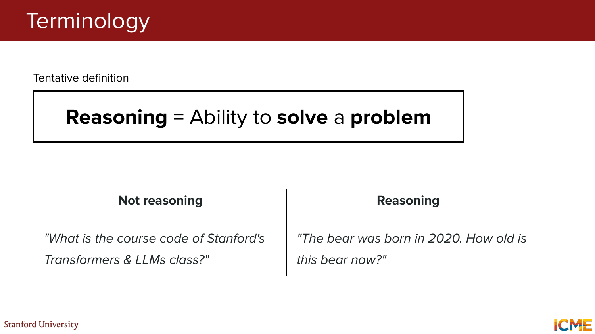
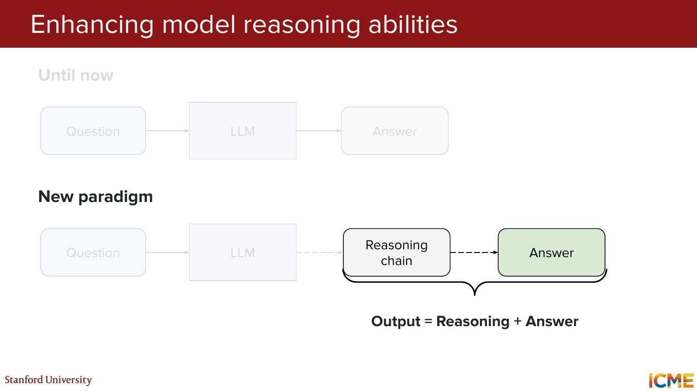
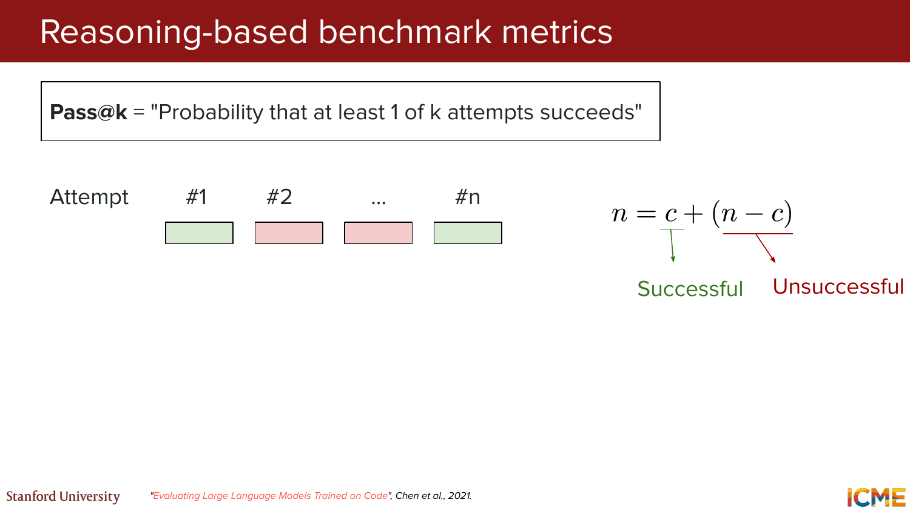
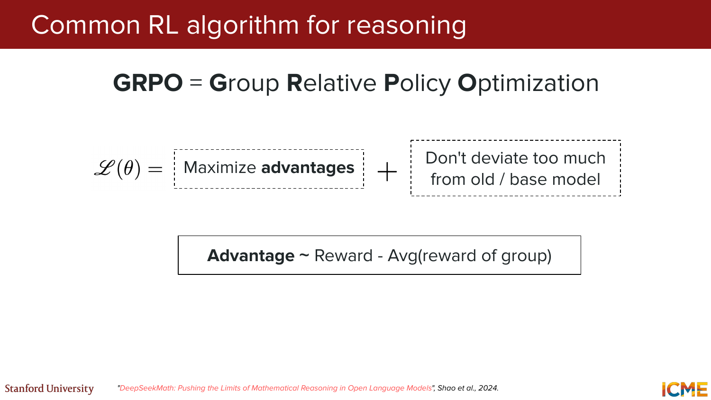
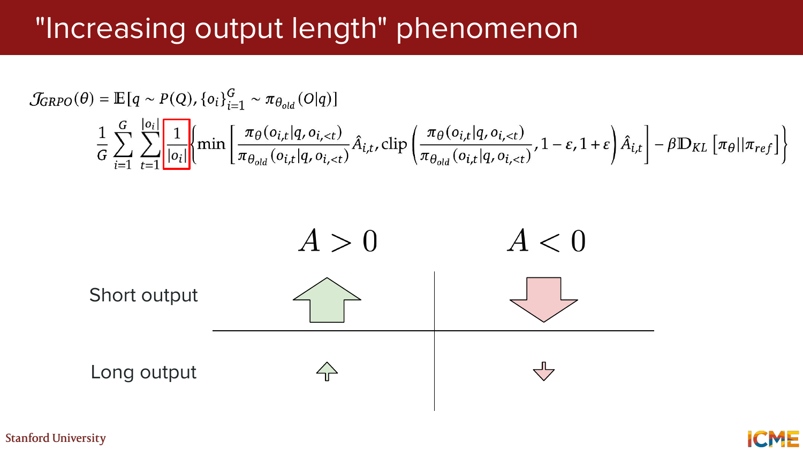
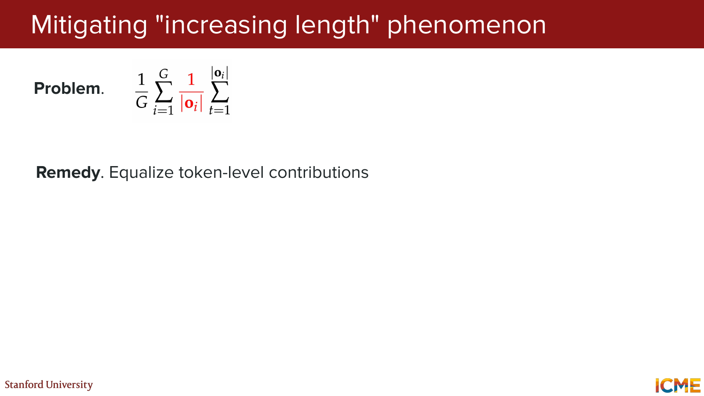
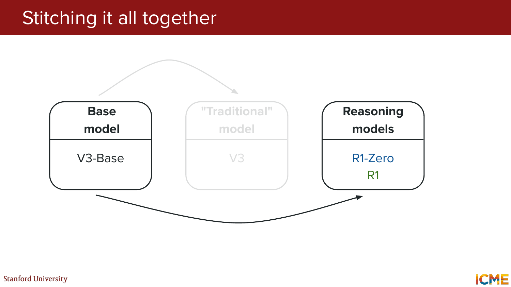
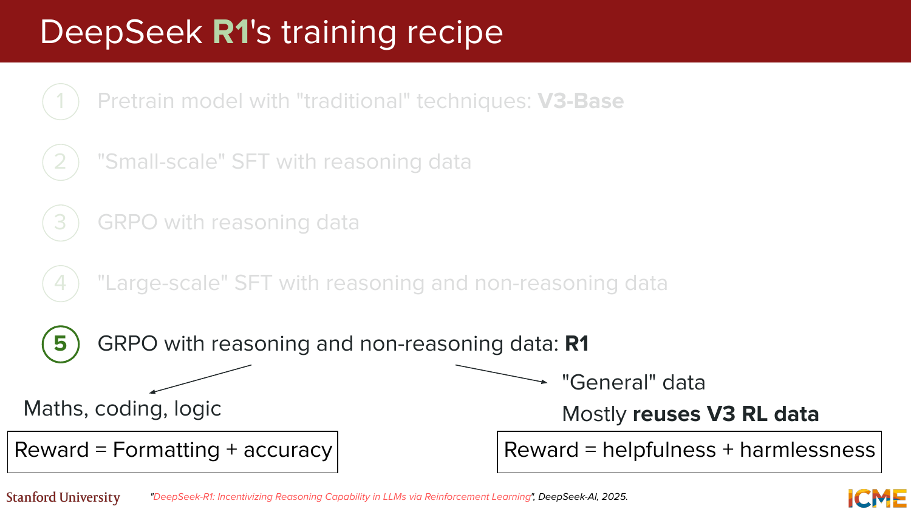
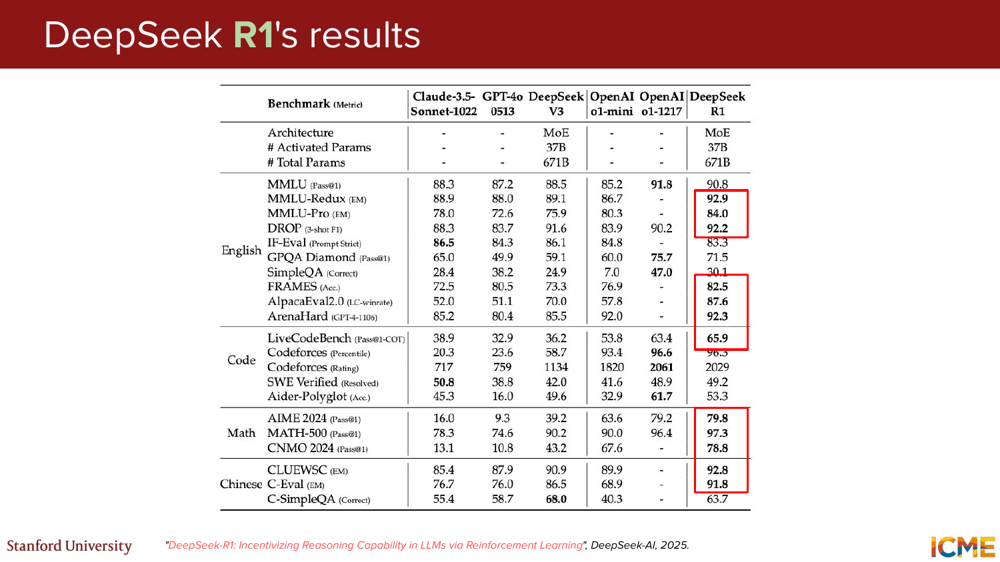
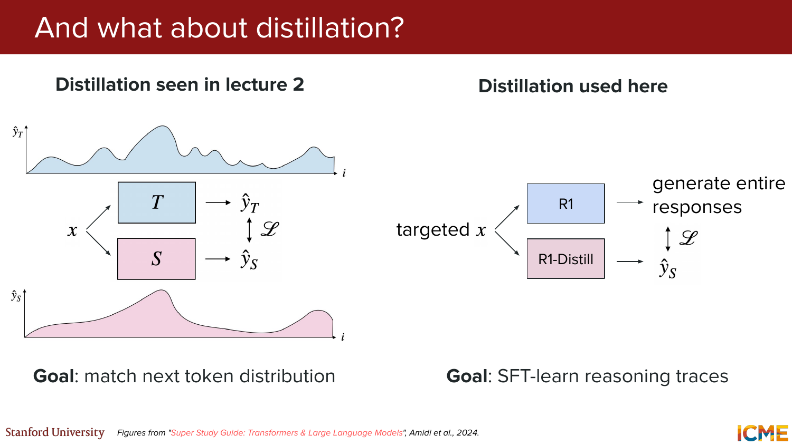

# CME 295: Transformers & Large Language Models - Lecture 6 (Hinglish)
### Stanford | Afshine Amidi & Shervine Amidi

---

## Pichle Lecture Ka Recap (Slides 1-7)

**Slide 1:** Title slide hai. Course ka naam `CME 295: Transformers & Large Language Models`, ye `Lecture 6` hai by Afshine Amidi aur Shervine Amidi.

**Slide 2:** Pichle lecture ka lifecycle recap hua:
`Initialized model -> Pretraining -> Finetuning -> Preference tuning`

Meaning:
- pretraining se basic language/code knowledge
- finetuning se task-specific behavior
- preference tuning se human preference alignment

**Slides 3-4:** RLHF framing recap hui:
- `Agent / Policy` = LLM
- `State` = input so far
- `Action` = next token
- `Reward` = human preference

**Slide 5:** RL-style objective recap:
> Advantages maximize karo, lekin old/base model se bahut zyada deviate mat karo.

**Slide 6:** `PPO-Clip` recap hua.

**Slide 7:** `PPO-KL penalty` recap hua.

> **Takeaway:** Lecture 5 ne dikhaya tha ki preference tuning RL ke through bhi ki ja sakti hai. Lecture 6 usi RL framing ko reasoning models tak extend karta hai.

---

## Practical Motivation (Slides 8-15)

**Slides 8-14:** Vanilla LLMs ke practical strengths aur weaknesses list kiye gaye:

**Strengths**
- Imitation ya idea generation me strong
- Code generate aur debug karne me kaafi achhe

**Weaknesses**
- Limited reasoning
- Knowledge static hoti hai
- Actions perform nahi kar sakte
- Evaluate karna hard hota hai

Slide progression ka message:
- lectures 7 aur 8 baad me action-taking side cover karenge
- aaj ka focus specifically `limited reasoning` par hai

**Slide 15:** Aaj ke lecture ke main topics:
- Reasoning models
- Scaling with RL
- GRPO
- Applications

---

## PART 1: Reasoning Basics (Slides 16-24)

### 1.1 Terminology

**Slides 16-17:** Tentative definition di gayi:
> **Reasoning = ability to solve a problem**

Comparison:
- **Not reasoning:** factual recall jaisa question
- **Reasoning:** multi-step computation ya inference jaisa question

Example from slide:
- Not reasoning: "What is the course code of Stanford's Transformers & LLMs class?"
- Reasoning: "The bear was born in 2020. How old is this bear now?"


*Visual reference: factual recall aur actual problem-solving ke beech difference.*

---

### 1.2 Chain-of-Thought Se Reasoning Improve Karna

**Slides 18-21:** Core idea diya gaya:
> Model ko answer dene se pehle apni reasoning explain karna sikhao.

Isko hi lecture explicitly `Chain of Thought (CoT)` strategy ke roop me present karti hai.

Bear example:
- direct answer style: `"It will be 5."`
- reasoning-first style: `"Bear 2020 me born hua, current age 4 hai, next year 5 hoga."`

Main message:
- reasoning steps ko externalize karne se harder tasks par better performance mil sakti hai
- reasoning models isi idea ko much larger scale par le jaate hain

Reference:
- Wei et al., 2022 - "Chain-of-Thought Prompting Elicits Reasoning in Large Language Models"

---

### 1.3 New Output Paradigm

**Slides 22-24:** Old vs new paradigm compare kiya gaya:

**Until now**
```text
Question -> LLM -> Answer
```

**New paradigm**
```text
Question -> LLM -> Reasoning chain -> Answer
```

Key point:
> Output = `Reasoning + Answer`

Yani model sirf final answer nahi deta; wo intermediate thought process bhi generate karta hai.


*Visual reference: old answer-only pipeline se reasoning-plus-answer pipeline tak ka shift.*

---

## PART 2: Reasoning Models in the Wild and Evaluation (Slides 25-47)

### 2.1 Reasoning Model Release Trend

**Slide 25:** Reasoning model releases ko 2024-2025 timeline me dikhaya gaya. Slide ke exact public announcement dates:
- `2024-09-12`: OpenAI `o1-preview`
- `2024-12-19`: Gemini `2.0 Flash Thinking`
- `2025-01-20`: DeepSeek `R1`
- `2025-02-19`: `Grok 3 Beta`
- `2025-02-24`: Claude `3.7 Sonnet`
- `2025-06-10`: `Magistral`

Message:
- reasoning model release ek clear trend ban chuki thi
- multiple labs ne "thinking" ya "reasoning" branded models launch kiye

---

### 2.2 Reasoning Model Ko Kaise Spot Karein?

**Slides 26-30:** Practical cues dikhaye gaye:
- chat UIs me kabhi `"thought summary"` dikh sakta hai
- full chain of thought often hidden rehta hai
- vendor docs / pricing pages me model ko reasoning or thinking variant ke roop me label kiya jata hai

> **Practical takeaway:** Product me reasoning model ka matlab aksar hidden internal thinking + visible summary + higher-latency premium capability hota hai.

---

### 2.3 Reasoning-Based Benchmarks

**Slides 31-38:** Benchmarks ka focus two families par tha:

**Coding**
- coding problem solve karna
- bug fix karna
- solution ko test cases se verify karna

Examples:
- `HumanEval`
- `CodeForces`
- `SWE-bench`

**Math**
- challenging math solve karna
- multi-step reasoning dikhana
- final answer ko ground truth ya verifier se check karna

Examples:
- `AIME`
- `GSM8K`

Slide flow ka main message:
- reasoning benchmarks me sirf output text important nahi hota
- problem solving + verification loop central hota hai

> **Example:** Coding task me model code likhta hai, phir unit tests se check hota hai. Math task me model reasoning likhta hai, phir final answer verify hota hai.

---

### 2.4 Benchmark Metrics

**Slides 39-47:** Reasoning benchmark metrics discuss hue.

**Pass@k**
> Probability that at least 1 of `k` attempts succeeds.

Practical meaning:
- agar model multiple attempts generate kar sakta hai
- aur verification easy hai
- toh `Pass@k` important metric ban jata hai

**Pass@1**
- jab sirf single generation matter kare

**Cons@k**
- "Consensus at k"
- majority voting answer ko ground truth se compare karta hai

> **Interpretation:** Reasoning evaluation me single-shot accuracy ke saath multi-attempt performance bhi important hoti hai.


*Visual reference: `Pass@k` ka intuition, jahan `k` attempts me se kam se kam ek successful ho.*

References:
- Chen et al., 2021 - "Evaluating Large Language Models Trained on Code"
- DeepSeek-AI, 2025 - `Cons@k` mention in R1 context

---

## PART 3: Scaling with RL and GRPO (Slides 48-115)

**Slide 48:** Section divider. Ab lecture reasoning ko RL ke saath scale karne ki taraf shift hoti hai.

### 3.1 Test-Time Scaling Ki Motivation

**Slides 49-53:** Lecture ka idea:
> Model ko answer se pehle reason karne ke liye incentivize karo.

Key considerations:
- scratch se reasoning chains likhna hard hai
- hand-written SFT data impractical hai
- model ko sirf human-written reasoning tak limit nahi karna
- many tasks me natural verifiable reward available hota hai

Slide ka punchline:
```text
Let's try RL!
```

Yani reasoning ko large scale par encourage karne ke liye reinforcement learning attractive lagta hai.

---

### 3.2 Verifiable Rewards

**Slides 54-58:** Two reward families introduce ki gayi:

**Reward 1: verify that CoT is there**
- formatting check
- e.g. response me `<think> ... </think>` style reasoning block ho

**Reward 2: verify that solution is correct**
- code ke liye test cases pass kare
- math ke liye final answer sahi ho

Message:
- reasoning traces ko structure-wise bhi reward kiya ja sakta hai
- correctness ko outcome-wise bhi reward kiya ja sakta hai

---

### 3.3 RL on Verifiable Rewards

**Slides 59-62:** Reward construction ko combine kiya gaya:

```text
Reward = formatting + accuracy
```

Matlab RL signal kuch aisa ho sakta hai:
- think delimiters sahi use hue ya nahi
- final solution correct tha ya nahi

This is powerful because:
- reward manually likhna nahi padta in full detail
- many tasks me verification automated ho sakta hai

---

### 3.4 Thinking Ko Inference Time Par Control Karna

**Slides 63-67:** Important caveat:
> Har prompt equal nahi hota.

Isliye "thinking budget" ko control karne ke ideas diye gaye:
- Dynamic budget
- Context awareness
- Budget forcing
- "Continuous" thoughts

Practical meaning:
- easy prompt ko short thinking chahiye
- hard prompt ko longer reasoning budget mil sakta hai

References:
- Han et al., 2024 - "Token-Budget-Aware LLM Reasoning"
- Muennighoff et al., 2025 - "s1: Simple test-time scaling"
- Hao et al., 2024 - "Training Large Language Models to Reason in a Continuous Latent Space"

---

### 3.5 GRPO

**Slide 68:** Section divider. Ab focus `GRPO` par aata hai.

**Slides 69-72:** Term define hua:
`GRPO = Group Relative Policy Optimization`

Slide ka high-level objective PPO jaisa hi lagta hai:
- advantages maximize karo
- old/base model se zyada deviate mat karo

Main difference slide par explicitly diya gaya:
```text
Advantage ~ Reward - Avg(reward of group)
```

Interpretation:
- same prompt ke liye multiple sampled responses ek group banate hain
- har response ka advantage us group ke average reward ke relative measure hota hai

> **Practical intuition:** PPO me baseline/value function important hoti hai; GRPO me baseline ka role group-average reward le leta hai.


*Visual reference: GRPO objective with group-relative advantage and base-model regularization.*

Reference:
- Shao et al., 2024 - "DeepSeekMath: Pushing the Limits of Mathematical Reasoning in Open Language Models"

---

### 3.6 GRPO vs PPO

**Slides 73-87:** Comparison slides ka main message:

**Similarities**
- ratio-based policy update
- clipping style intuition

**Differences**
- KL penalty handling
- advantage estimation
- GRPO me group-relative reward baseline hota hai

Practical interpretation:
- PPO aur GRPO dono conservative RL optimization family me aate hain
- but GRPO reasoning tasks ke liye simpler aur more tailored lagta hai

> **Big difference from lecture flow:** GRPO ka selling point ye hai ki reasoning setting me separate value-model dependence ko reduce/simplify kiya ja sakta hai.

---

### 3.7 "Increasing Output Length" Phenomenon

**Slides 88-105:** Observation diya gaya:
> RL training ke saath response length barhti rehti hai.

Lecture isko ek training pathology ke roop me present karti hai:
- short aur long outputs token-level objective me same tarah contribute nahi karte
- length khud incentive ka part ban sakti hai
- model pathological way me longer outputs produce karne lag sakta hai

Slide ka warning:
> `Bad incentive!`


*Visual reference: token-level objective ka length bias kaise short vs long outputs ko unevenly reward/penalize kar sakta hai.*

---

### 3.8 Length Bias Ko Mitigate Karna

**Slides 106-111:** Remedy diya gaya:
> Token-level contributions ko equalize karo.

Methods mentioned:
- `DAPO`
- `Dr. GRPO`

Message:
- RL objective ke normalization details matter karte hain
- small formulation tweaks reasoning quality aur behavior par large effect daal sakte hain


*Visual reference: problematic normalization term aur equalized token-level contribution remedy.*

References:
- Yu et al., 2025 - "DAPO: An Open-Source LLM Reinforcement Learning System at Scale"
- Liu et al., 2025 - "Understanding R1-Zero-Like Training: A Critical Perspective"

---

### 3.9 Other RL Adjustments

**Slides 112-115:** Additional ideas:
- difficulty-linked bias
- diversity encourage karna
- aur bhi adjustments possible hain

> **Takeaway:** Reasoning RL sirf ek reward formula ka kaam nahi; exploration, diversity, aur task difficulty handling bhi important hain.

---

## PART 4: Applications - DeepSeek Case Study (Slides 116-147)

**Slide 116:** Section divider. Ab lecture `Applications` ki taraf move karti hai.

### 4.1 Stitching It All Together

**Slides 117-119:** High-level ecosystem map dikhaya gaya:

```text
V3-Base -> V3 -> R1-Zero -> R1
```

Interpretation:
- `V3-Base` = base pretrained model
- `V3` = traditional/chat-style model
- `R1-Zero` = proof-of-concept reasoning-first RL system
- `R1` = full pipeline reasoning model


*Visual reference: base model se traditional model aur phir reasoning models tak ka pipeline map.*

---

### 4.2 DeepSeek R1-Zero Training Recipe

**Slides 120-126:** R1-Zero ka recipe stepwise dikhaya gaya.

**Step 1:** Traditional pretraining
- model: `V3-Base`
- architecture note from slide:
  - `MoE`
  - around `~671B total`
  - around `~37B active`

**Step 2:** `GRPO with reasoning data -> R1-Zero`

Prompt template from slide:
- assistant pehle `<think> ... </think>` style reasoning kare
- phir `<answer> ... </answer>` style answer de

Benefits:
- explicit SFT ke bina bhi reasoning emerge ho sakti hai

Challenges:
- formatting issues
- readability issues

> **Meaning:** R1-Zero ek strong proof of concept tha ki RL alone se reasoning-like behavior induce kiya ja sakta hai.

---

### 4.3 DeepSeek R1 Training Recipe

**Slides 127-138:** Full `R1` pipeline R1-Zero se zyada polished hai.

**Step 1:** Pretrain with traditional techniques
- base: `V3-Base`

**Step 2:** Small-scale SFT with reasoning data
- source: long CoTs generated with `R1-Zero`
- humans ne unhe rewrite/clean kiya

**Step 3:** GRPO with reasoning data
- roughly same RL process as `R1-Zero`
- reward includes:
  - formatting
  - accuracy
  - language consistency

**Step 4:** Large-scale SFT with reasoning + non-reasoning data
- around `~600k` reasoning pairs
- around `~200k` general pairs

Reasoning data source:
- maths
- coding
- logic
- rejection sampling of "R1 so far" responses
- filtering via rules + `V3` judge

General data source:
- mostly reuses `V3` SFT data

**Step 5:** GRPO with reasoning + non-reasoning data -> `R1`

Final reward split:
- reasoning side: formatting + accuracy
- general side: helpfulness + harmlessness

> **Big picture:** R1-Zero "RL-only proof of concept" tha; R1 ek hybrid system ban gaya jisme SFT clean-up + RL refinement dono hain.


*Visual reference: final DeepSeek R1 pipeline jahan reasoning aur general-data RL objectives alag tarah combine hote hain.*

---

### 4.4 DeepSeek R1 Results

**Slides 139-141:** Results slides ka high-level message:
- `DeepSeek R1` multiple reasoning-heavy benchmarks par competitive dikhta hai
- coverage English, code, math, aur Chinese benchmarks tak jati hai

Highlighted strengths visible on slide:
- strong reasoning/math performance
- competitive code performance
- broad benchmark coverage instead of one single narrow win


*Visual reference: DeepSeek R1 benchmark table across English, code, math, aur Chinese evaluations.*

---

### 4.5 Distillation: Lecture 2 Wali Distillation Se Kya Alag?

**Slides 142-147:** Distillation ko lecture 2 ki distillation se compare kiya gaya.

**Lecture 2 style distillation**
- goal: next-token distribution match karna

**Yahan use hui distillation**
- teacher: `R1`
- student: `R1-Distill`
- teacher entire responses / reasoning traces generate karta hai
- student SFT ke through un traces ko learn karta hai

Slide ka contrast:
- old goal: `match next token distribution`
- new goal: `SFT-learn reasoning traces`

Results slide message:
- distilled models competitive ho sakte hain
- ye compute ka "good" use ho sakta hai


*Visual reference: classic token-distribution distillation aur reasoning-trace distillation ke beech comparison.*

---

## Closing (Slide 148)

**Slide 148:** "Thank you for your attention!" se lecture close hota hai.

---

## Lecture 6 Ka Big Picture

Is lecture ka core message yeh tha:
- vanilla LLMs ka major weakness limited reasoning hai
- CoT ne reasoning improvement ka direction dikhaya, aur reasoning models usi idea ko scale karte hain
- reasoning evaluation me verification-heavy benchmarks aur `Pass@k` jaise metrics important hote hain
- RL-based reasoning systems verifiable rewards se train kiye ja sakte hain
- `GRPO` reasoning RL ka important algorithm hai
- RL training me output-length pathology jaise optimization bugs aate hain
- DeepSeek `R1-Zero` ne RL-only proof of concept dikhaya
- DeepSeek `R1` ne SFT + RL hybrid recipe ke saath more polished reasoning pipeline build ki
- distillation reasoning capability ko cheaper students tak transfer kar sakti hai

> **One-line summary:** Lecture 6 ne dikhaya ki reasoning models magical nahi hote; wo careful prompting ideas, verifiable rewards, RL optimization, pipeline engineering, aur distillation ka combination hote hain.

---

## Key Papers Referenced

1. **"Chain-of-Thought Prompting Elicits Reasoning in Large Language Models"** - Wei et al., 2022
2. **"Evaluating Large Language Models Trained on Code"** - Chen et al., 2021
3. **"Token-Budget-Aware LLM Reasoning"** - Han et al., 2024
4. **"s1: Simple test-time scaling"** - Muennighoff et al., 2025
5. **"Training Large Language Models to Reason in a Continuous Latent Space"** - Hao et al., 2024
6. **"DeepSeekMath: Pushing the Limits of Mathematical Reasoning in Open Language Models"** - Shao et al., 2024
7. **"DeepSeek-R1: Incentivizing Reasoning Capability in LLMs via Reinforcement Learning"** - DeepSeek-AI, 2025
8. **"DAPO: An Open-Source LLM Reinforcement Learning System at Scale"** - Yu et al., 2025
9. **"Understanding R1-Zero-Like Training: A Critical Perspective"** - Liu et al., 2025
10. **"DeepSeek-V3 Technical Report"** - DeepSeek-AI, 2024

---

*Stanford CME 295 Lecture 6 - all 148 slides covered in Hinglish with slide numbers, explanations, and practical intuition.*
