# CME 295: Transformers & Large Language Models - Lecture 7 (Hinglish)
### Stanford | Afshine Amidi & Shervine Amidi

---

## Pichle Lecture Ka Recap (Slides 1-9)

**Slide 1:** Title slide hai. Course ka naam `CME 295: Transformers & Large Language Models`, aur ye `Lecture 7` hai by Afshine Amidi aur Shervine Amidi.

**Slides 2-3:** Last lecture ka main framing recap hua:

```text
Question -> LLM -> Reasoning chain -> Answer
```

Aur RL-based reasoning optimization ke context me `GRPO` bhi recap hua.

**Slides 4-6:** DeepSeek-R1 aur uske related follow-up directions ka visual recap diya gaya:
- `DeepSeek-R1`
- `DAPO`
- `Dr. GRPO`

Main point:
- reasoning models ab sirf theory topic nahi rahe
- real training recipes aur post-R1 variants actively develop ho rahe hain

**Slides 7-9:** LLM strengths vs weaknesses dobara summarize kiye gaye:

**Strengths**
- imitation aur idea generation me strong
- code generation/debugging me kaafi achhe

**Weaknesses**
- limited reasoning
- knowledge static hoti hai
- actions perform nahi kar sakte
- evaluate karna hard hota hai

Slide progression ka message:
- last lecture ka focus `limited reasoning` tha
- aaj ka focus `knowledge is static` aur `cannot perform actions` ki taraf shift hota hai

> **Takeaway:** Lecture 6 ne reasoning capability ko improve karna cover kiya tha. Lecture 7 dikhata hai ki reasoning ke baad agla big step hai model ko external knowledge aur actions se connect karna.

---

## Lecture Ka Overview (Slide 10)

**Slide 10:** Aaj ke lecture ke three big topics list hue:
- `RAG`
- `Tool calling`
- `Agents`

Yani aaj ka lecture pure "model alone" se nikal kar "model + external systems" world me enter karta hai.

---

## PART 1: RAG Motivation and Basics (Slides 11-35)

### 1.1 RAG Ki Zaroorat Kyun Padti Hai?

**Slides 11-19:** Motivation layer-by-layer build ki gayi:

1. **Knowledge pretraining data tak constrained hoti hai**
- agar event ya fact training cutoff ke baad ka hai, raw LLM directly reliable source nahi hota

2. **Context size limited hoti hai**
- theoretically large context helpful lag sakta hai
- practically har cheez prompt me daal dena scalable nahi hota

3. **Model useless information se distract ho sakta hai**
- long context me relevant signal drown ho sakta hai
- `Needle in a Haystack` style tests isi issue ko stress-test karte hain

4. **Pricing token-based hoti hai**
- extra prompt tokens aur extra output tokens dono cost badhate hain

Main message:
> Sab kuch model ke prompt me dump kar dena robust strategy nahi hai.

Practical interpretation:
- humein relevant information chahiye
- lekin sirf relevant information
- aur preferably retrieval cost prompt cost se cheaper ho

---

### 1.2 RAG Kya Hai?

**Slides 20-24:** Definition di gayi:
`RAG = Retrieval-Augmented Generation`

Core idea:
> Prompt ko relevant external information ke pieces se augment karo.

Yani answer directly sirf model memory se nahi aata. Pehle supporting information retrieve hoti hai, phir model augmented prompt par response generate karta hai.

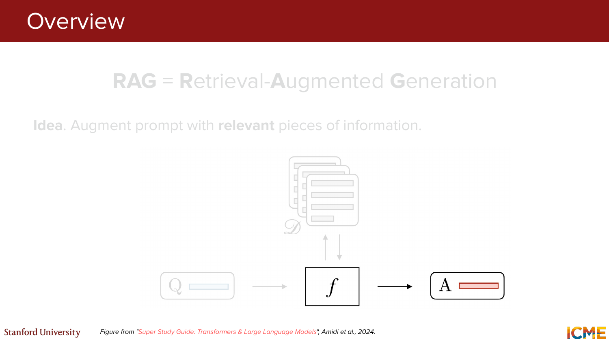
*Visual reference: query, retrieved documents, aur final answer ke beech RAG ka high-level pipeline.*

---

### 1.3 Retrieve, Augment, Generate Pipeline

**Slides 25-29:** Simple 3-step recipe diya gaya:

1. Knowledge base me similarity operation ke through relevant document retrieve karo
2. Retrieved information ko prompt ke saath combine karo
3. LLM se response generate karvao

Pipeline:

```text
User prompt
  -> retrieve relevant info
  -> augment prompt with that info
  -> LLM generates response
```

**Slide 29** ka emphasis important tha:
- poore pipeline me sabse critical design choice aksar `retrieval stage` hota hai
- agar wrong ya weak chunks aaye, generation stage bhi weak ho jayegi

---

### 1.4 Knowledge Base Kaise Banti Hai?

**Slides 30-33:** Retrieval start karne se pehle knowledge base prepare karni padti hai.

Process:
- documents collect karo
- documents ko chunks me divide karo
- har chunk ko embed karo

Important hyperparameters:
- embedding size
- chunk size
- chunk overlap

Intuition:
- chunk bahut chhota hua toh context lose ho sakta hai
- bahut bada hua toh retrieval noisy ho sakta hai
- overlap kuch boundary information bachata hai

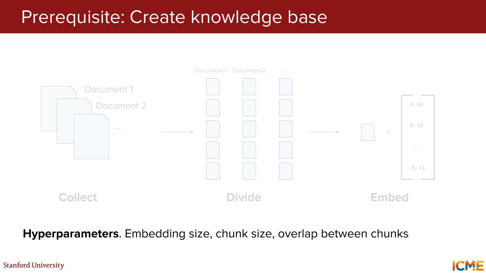
*Visual reference: collect -> divide -> embed workflow, plus chunking-related hyperparameters.*

---

### 1.5 Retrieval Ke Do Stages

**Slides 34-35:** Lecture ne retrieval ko clean 2-stage system ke roop me frame kiya:

**Step 1: Candidate retrieval**
- objective: `maximize recall`
- large knowledge base me se potentially relevant candidates lao
- semantic embeddings aur optionally keyword methods use ho sakte hain

**Step 2: Ranking**
- objective: `maximize precision`
- smaller candidate set ko re-rank karke final best chunks choose karo

> **High-level principle:** Pehle broad net phenko, phir shortlist ko carefully sort karo.

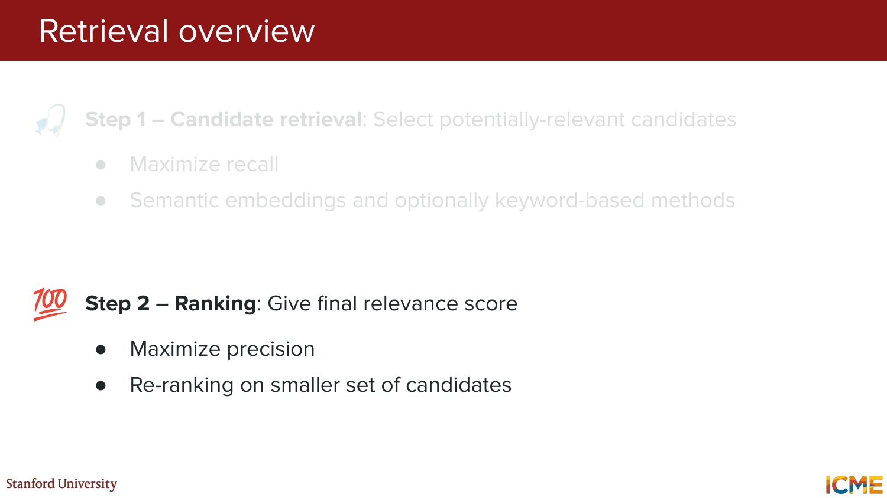
*Visual reference: candidate retrieval recall-oriented hai, ranking precision-oriented hai.*

---

## PART 2: Retrieval Mechanics and Evaluation (Slides 36-76)

### 2.1 Candidate Retrieval Methods

**Slides 36-47:** Candidate retrieval ke teen methods dikhaye gaye.

#### Method 1: Semantic Search

**Slides 37-43:** Query aur chunk dono ko embeddings me encode karke similarity compute ki jati hai.

Lecture framing:
- query vector banta hai
- chunk vector banta hai
- similarity operation se relevance estimate hoti hai

Reference architecture:
- `bi-encoder`
- query aur chunk alag-alag encode hote hain
- phir vector similarity compare hoti hai

Benefit:
- semantic similarity capture hoti hai
- exact keyword match na ho tab bhi relevant chunk mil sakta hai

Example intuition from slides:
- query `"Where is Cuddly?"`
- exact words mismatch ho sakte hain
- semantic model phir bhi `"Cuddly spends most days surrounded by books"` jaise chunk ko surface kar sakta hai

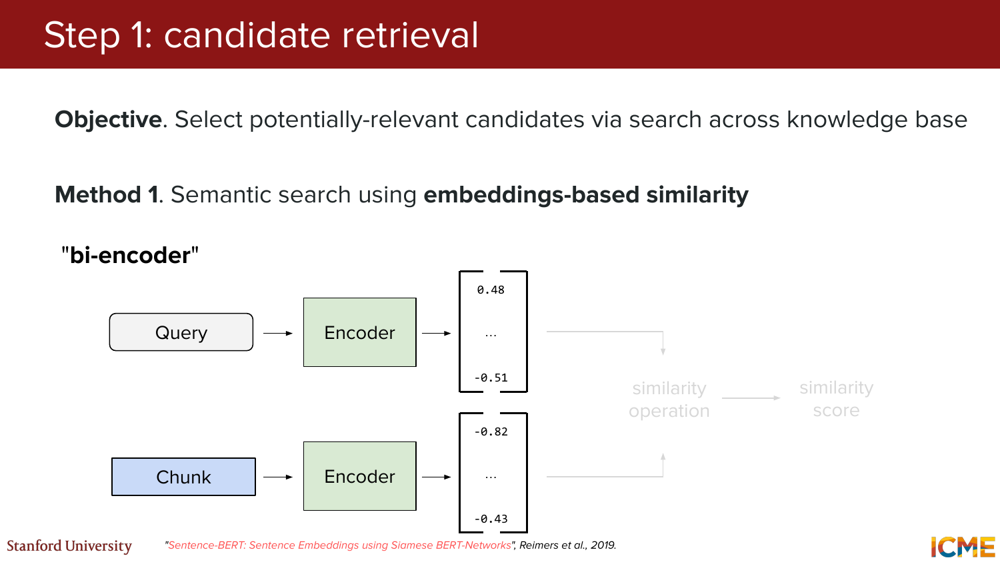
*Visual reference: query aur chunk separate encoders se embeddings banate hain, phir similarity score compute hota hai.*

#### Method 2: BM25 / Keyword Search

**Slides 44-45:** Traditional keyword matching-based retrieval dikhaya gaya:
- exact ya near-exact term overlap important hota hai
- lexical matching strong hota hai
- jab proper nouns ya exact strings matter karte hain, ye helpful hota hai

#### Method 3: Hybrid Retrieval

**Slides 46-47:** Semantic + BM25 combine karne ka idea diya gaya.

Why hybrid?
- semantic search concept-level matching me achha
- BM25 lexical precision me achha
- dono combine karke broader recall mil sakta hai

> **Practical takeaway:** Production systems me single retrieval strategy par rely karna zaroori nahi. Hybrid retrieval often stronger hota hai.

---

### 2.2 Initial Retrieval Ko Improve Karne Wale Extensions

**Slides 48-57:** Candidate retrieval ko aur improve karne ke liye do important extensions diye gaye.

#### Extension A: Query-Document Embedding Mismatch Mitigate Karna

**Slides 48-51:** Problem:
- user query aur stored chunks ki language style alag ho sakti hai
- short question ko directly document chunk ke against embed karna ideal nahi hota

Slide idea:
- prompt ko ek synthetic ya "fake" document style text me expand karo
- phir us expanded form ko retrieval ke liye use karo

Intuition:
- question ko answer-like/document-like form dene se chunk embeddings ke saath comparison better ho sakta hai

#### Extension B: Contextualize Document Chunks

**Slides 52-57:** Problem:
- isolated chunk aksar document-level context lose kar deta hai
- same paragraph alag chapter me different meaning le sakta hai

Solution:
- har chunk ke liye short extra context generate karo
- chunk ko whole document ke context me situate karo

Prompt template ka idea:
- whole document do
- specific chunk do
- bolo: short succinct context generate karo jo retrieval improve kare

Important operational note from slides:
- is process me repeated long prompts aa sakte hain
- isliye `prompt caching` useful ho sakti hai
- aur kyunki ye extra generation step hai, model pricing bhi matter karti hai

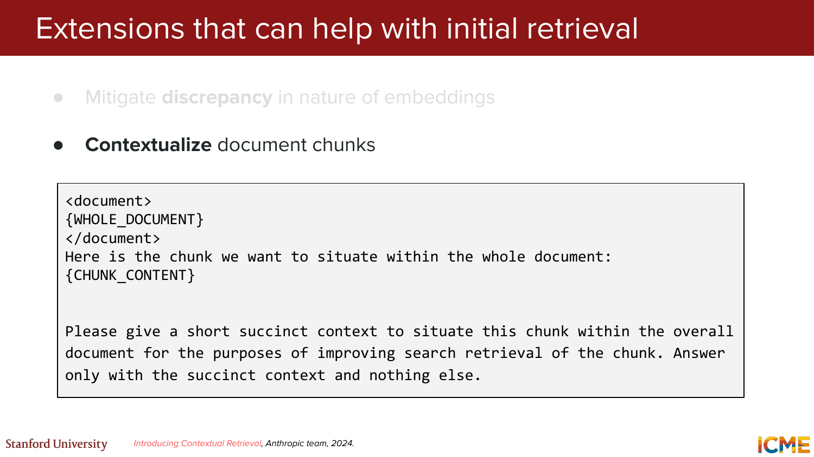
*Visual reference: chunk ko whole document ke context me situate karne ke liye prompt template.*

---

### 2.3 Ranking / Re-ranking

**Slides 58-62:** Candidate retrieval ke baad final ranking aati hai.

Objective:
> Smaller shortlisted chunks ko more sophisticated model se relevance score do.

Lecture framing:
- step 1 wide net daalta hai
- step 2 shortlist ko reorder karta hai

Architecture:
- `cross-encoder` style setup
- query aur chunk jointly encode kiye jate hain
- output direct relevance score hota hai

Difference from bi-encoder:
- bi-encoder fast aur scalable hota hai
- cross-encoder deeper interaction dekh sakta hai
- isliye precision better hoti hai, but cost zyada hoti hai

Slides 61-62 me explicit re-ranking flow dikhaya gaya:
- `Chunk d`, `Chunk b`, `Chunk a`, `Chunk c`
- user prompt ke basis par re-ranker final order nikalta hai

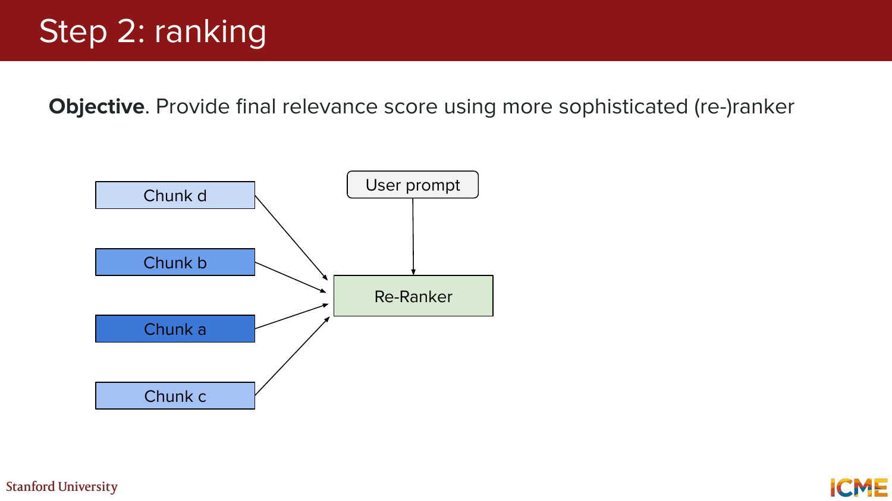
*Visual reference: shortlisted chunks ko re-ranker user prompt ke against compare karke reorder karta hai.*

---

### 2.4 Retrieval Ko Evaluate Kaise Karein?

**Slides 63-76:** Setup diya gaya:
- dekhna hai ki retrieved chunks relevant hain ya nahi
- top-`k` ranking ke basis par metrics compute hote hain

Mentioned metrics:

**NDCG@k**
- ranking quality evaluate karta hai
- relevant results kitne upar aaye, ye matter karta hai

**RR@k**
- first relevant chunk kitni jaldi mila
- pehle useful hit ki position capture karta hai

**Recall@k**
- top-`k` me kitne relevant chunks include hue
- candidate retrieval ke liye especially useful

**Precision@k**
- top-`k` me se kitne actually relevant the
- final shortlist quality measure karta hai

Big picture:
- early retrieval stage mostly recall-oriented hota hai
- ranking stage precision-oriented hota hai
- evaluation bhi isi design philosophy ko reflect karti hai

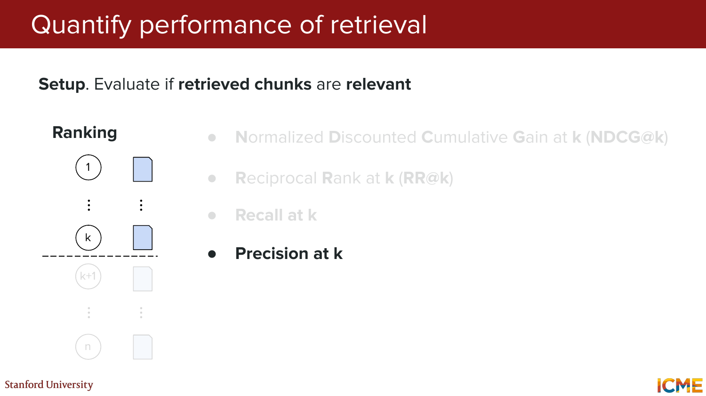
*Visual reference: ranking-based retrieval evaluation aur `Precision@k` emphasis.*

---

## PART 3: Tool Calling (Slides 77-114)

### 3.1 RAG Se Tool Calling Tak Shift

**Slides 77-80:** Lecture ne RAG aur tool calling ka distinction explain kiya.

RAG best hota hai jab data:
- unstructured ho
- documents ke form me ho
- search + reading style access chahiye ho

Tool calling useful hota hai jab data ya behavior:
- structured ho
- table/API/function ke form me ho
- direct operation ya computation chahiye ho

Slide example:
- structured fields `ID`, `Field`, ...
- inhe read karne ke liye function `get_data(id, field, ...)`

> **Takeaway:** Har external capability ko document retrieval ki tarah treat karna sahi nahi hota. Kuch cheezein direct tool/function ke through zyada natural hoti hain.

---

### 3.2 Tool Calling Kya Hai?

**Slides 81-82:** Definition di gayi:
tool calling autonomous systems ko external resources access karne aur kabhi-kabhi un par act karne deta hai.

Yani model:
- information fetch kar sakta hai
- computation kara sakta hai
- external system ko action trigger kar sakta hai

---

### 3.3 Teddy Bear Example

**Slides 83-89:** Real-life example diya gaya:

Without tools:
- user: `Find a bear near me!`
- plain LLM: `"Sorry, I don't know which bears are near you."`

With tools:
- LLM ke paas function API available hai
- wo location infer karke `find_teddy_bear()` call kar sakta hai

Slides 86-89 ka extra message:
- tool ideally descriptive aur well-documented API hona chahiye
- backend call ho sakta hai
- return value structured info dena chahiye

Example function behavior:
- GPS coordinates leti hai
- backend/API call karti hai
- nearest teddy bear ka info return karti hai

---

### 3.4 Tool Calling Flow

**Slides 90-93:** Tool-calling ka canonical 3-step flow diya gaya:

1. LLM relevant function aur uske arguments determine kare
2. Backend actual function call execute kare
3. Result ke basis par LLM final response deduce kare

Example:
- prompt: `Find a bear near me!`
- model chooses:
  `location = (37.42, -122.17) with find_teddy_bear()`
- backend returns JSON-like structured result
- LLM user-facing response banata hai

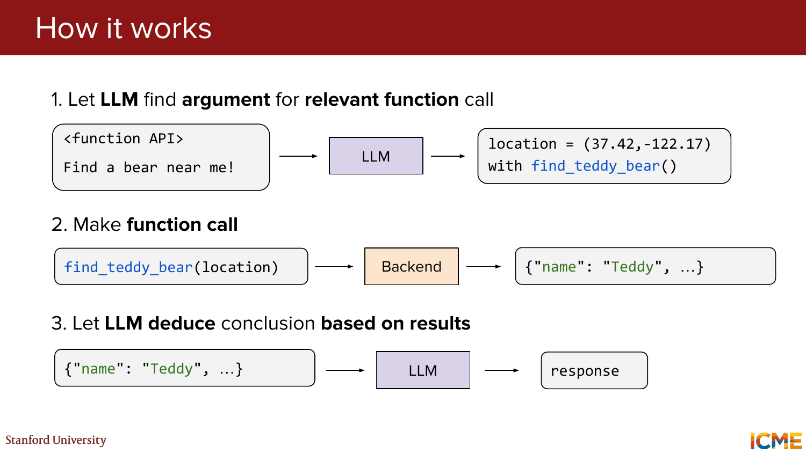
*Visual reference: tool prediction, backend function call, aur final response generation ka end-to-end flow.*

---

### 3.5 Model Ko Tool Use Karna Kaise Sikhate Hain?

**Slides 94-101:** Do broad methods diye gaye.

#### Method 1: Via Training

Idea:
- function API + user request + desired tool call pairs ke through train karo
- model tool prediction aur response generation dono learn kar sakta hai

Training framing from slides:
- conversation history
- desired prediction
- backend result
- final response

Yani tool use ko supervised pattern ki tarah sikhaya ja sakta hai.

#### Method 2: Via Prompting

Idea:
- function API ke saath detailed explanation/model instructions do
- model runtime par prompt dekhkar correct tool call choose kare

Challenge:
- API description kaise likhen?

Slide suggestion:
- powerful reasoning model se tool description draft karva sakte ho
- SFT pairs ko evaluation ke roop me use kar sakte ho

> **Practical takeaway:** Tool use sirf model weights ki problem nahi; good API descriptions aur good prompting bhi kaafi important hain.

---

### 3.6 Tool Use Cases, Benefits, and Challenges

**Slides 102-106:** Common use cases teen buckets me group kiye gaye.

**Information**
- web/database search
- weather, stocks, trackers
- codebase access

**Computation**
- calculator
- code execution, often Python me

**Action**
- email/message bhejna
- in-computer actions
- assistant domain ke andar aur bhi kaafi actions

Benefits:
- LLMs much more useful ban jate hain
- real world ke saath interact kar pate hain
- knowledge cutoff limitation ko partially overcome karte hain

Challenges:
- tools zyada hue toh performance degrade ho sakti hai
- finite context length scalability issue ban jata hai
- bahut saare tools define aur maintain karna expensive hota hai

---

### 3.7 Tool Selection

**Slides 107-109:** Problem:
- agar model ko bahut saare function APIs de diye jayein
- toh latency aur quality dono hurt ho sakte hain

Solution:
- pehle ek `router` ya selector run karo
- wo request ke basis par selected tools ka subset choose kare
- phir LLM ko sirf relevant function APIs dikhao

Pipeline:

```text
User request -> Router -> Selected tool list -> LLM
```

Benefits:
- latency reduce ho sakti hai
- performance improve ho sakti hai
- prompt clutter kam hota hai

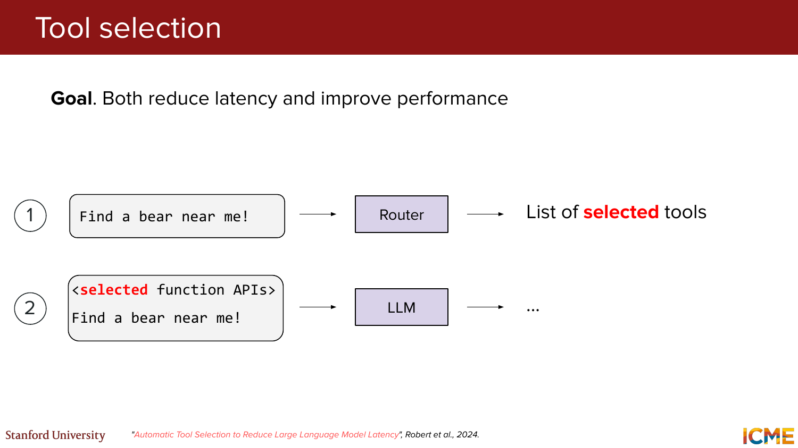
*Visual reference: router pehle selected tools shortlist karta hai, phir LLM unhi ke saath kaam karta hai.*

---

### 3.8 Standardization with MCP

**Slides 110-114:** Motivation diya gaya:
- har LLM-tool pair ke liye bespoke integration banana duplication create karta hai

Is problem ke solution ke roop me lecture ne introduce kiya:
`MCP = Model Context Protocol`

Core idea:
> Tools aur data ko LLMs se standard way me connect karo.

Architecture terms from slides:
- `MCP host`
- `MCP client`
- `MCP server`
- server side capabilities: `Tools`, `Prompts`, `Resources`

Practical example:
- `Claude Desktop` client side par hai
- ek `Book provider` MCP server se connect karta hai
- server kuch tools/resources expose karta hai
- user request jaisi `"Recommend a new poetry book to my teddy bear"` standardized interface ke through solve ho sakti hai

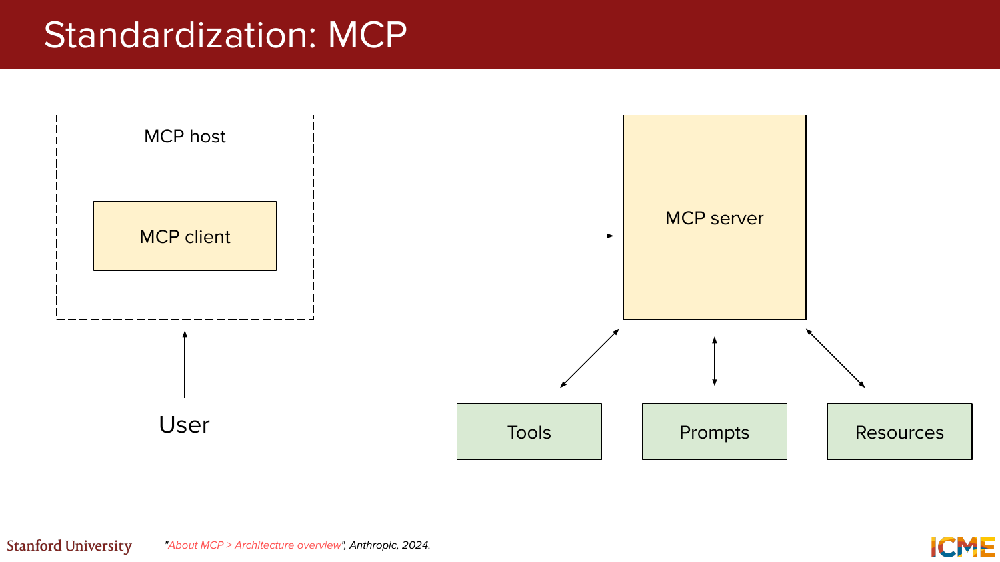
*Visual reference: user -> MCP host/client -> MCP server -> tools/prompts/resources architecture.*

---

## PART 4: Agents (Slides 115-144)

### 4.1 Agent Kise Kehte Hain?

**Slides 116-119:** Definition di gayi:
> Agent ek aisa system hai jo autonomously user ke behalf par goals pursue kare aur tasks complete kare.

Comparison:

**Traditional**
```text
Question -> LLM -> Answer
```

**Reasoning**
```text
Question -> LLM -> Reasoning -> Answer
```

**Agent**
```text
Question -> LLM -> Calls -> LLM -> ... -> Answer
```

Meaning:
- agent sirf sochta nahi
- act bhi karta hai
- looped interaction me tools/useful calls karta hai

---

### 4.2 ReAct Framework

**Slide 120:** Agent behavior ko `ReAct = Reason + Act` ke roop me summarize kiya gaya.

Main components:
- `Input`
- `Observe`
- `Plan`
- `Act`
- `Output`

Flow:
- input aata hai
- system current state observe karta hai
- plan banata hai
- act karta hai
- nayi observation milti hai
- cycle repeat hoti hai

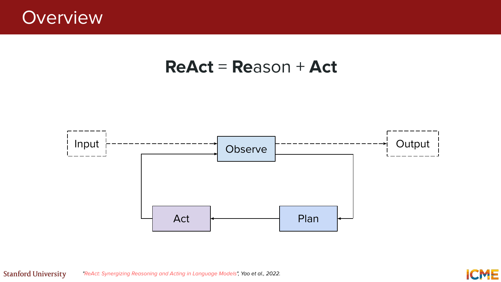
*Visual reference: observe-plan-act loop jo final output tak repeatedly chal sakta hai.*

---

### 4.3 ReAct in Action

**Slides 121-135:** Teddy bear thermostat example ke through full loop dikhaya gaya.

#### Step 1: Input

Input:
```text
My teddy bear is cold.
Please do something.
```

Slide note:
- input manual user query bhi ho sakta hai
- ya external event bhi ho sakta hai

#### Step 2: Observe

System infer karta hai:
- teddy bear cold hai
- shayad room temperature issue ho
- current room temperature abhi unknown hai

Observe step ka role:
- previous state summarize karna
- kya pata hai aur kya unknown hai, explicitly state karna
- reasoning-heavy assessment karna

#### Step 3: Plan

Initial plan:
`Determine the temperature of the room.`

Plan step:
- subtask identify karta hai
- decide karta hai kaunsa tool/API call karna chahiye

#### Step 4: Act

First action:
`get_current_room_temperature()`

Phir observation update hoti hai:
- room temperature `65F` hai
- roughly `5F` below average hai
- temperature badhani chahiye

Updated plan:
`Increase the temperature by 5F.`

Second action:
`increase_temperature(value=5)`

Final observation:
- thermostat `70F` par set ho gaya
- environment warm enough hona chahiye

Final output:
- user ko bataya jata hai ki thermostat 70F par set ho gaya aur teddy bear warmer feel karega

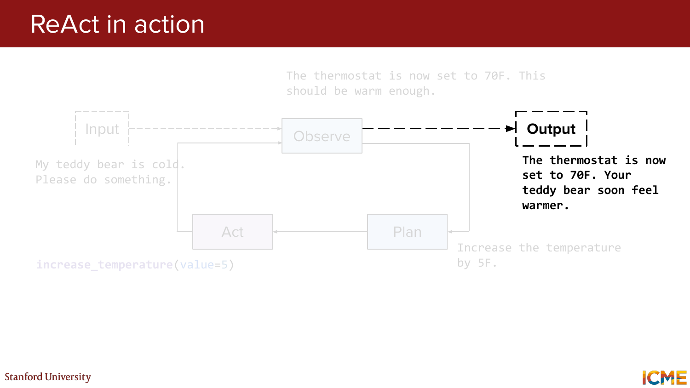
*Visual reference: observe-plan-act loop ke baad final user-facing output produce hota hai.*

> **Takeaway:** Agent ka real value single tool call me nahi, balki repeated observe-plan-act loop me hota hai.

---

### 4.4 Single Agent Se Multi-Agent Tak

**Slides 136-138:** Example diya gaya ki ek dedicated `Thermostat agent` input se output tak kaam kar sakta hai.

Phir lecture ne dikhaya ki alag-alag domains ke liye alag agents ho sakte hain:
- occupancy agent
- thermostat agent
- energy management agent
- air quality agent

Problem:
- ye agents ek-doosre se communicate kaise karein?

---

### 4.5 Standardization with A2A

**Slides 139-140:** Is communication problem ke liye introduce hua:
`A2A = Agent2Agent`

Idea:
- agents ek standard protocol ke through interact karein
- coordination ad hoc na ho

Slide 139 ka message:
- multiple agents mutual communication links ke through collaborate kar sakte hain

Slide 140 ka message:
- ek agent ko structured components ke roop me define kiya ja sakta hai:
  - `AgentSkill`
  - `AgentCard`
  - `AgentExecutor`

Practical interpretation:
- skill batata hai agent kya kar sakta hai
- card batata hai agent ko discover/access kaise karein
- executor actual logic run karta hai

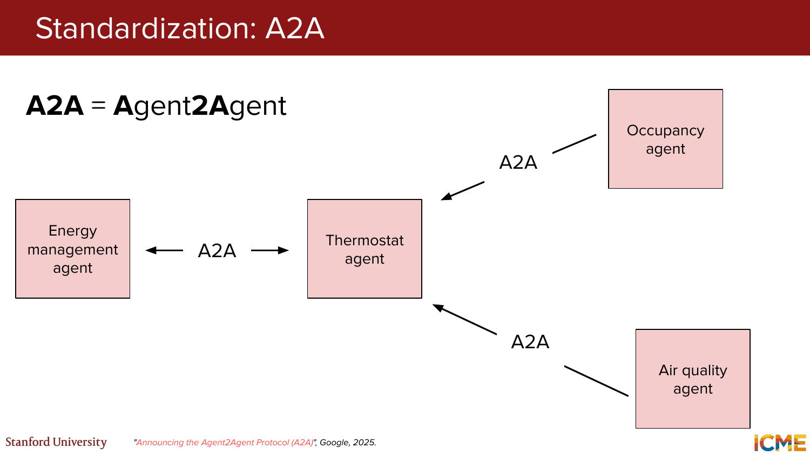
*Visual reference: multiple specialized agents A2A links ke through coordinate karte hue.*

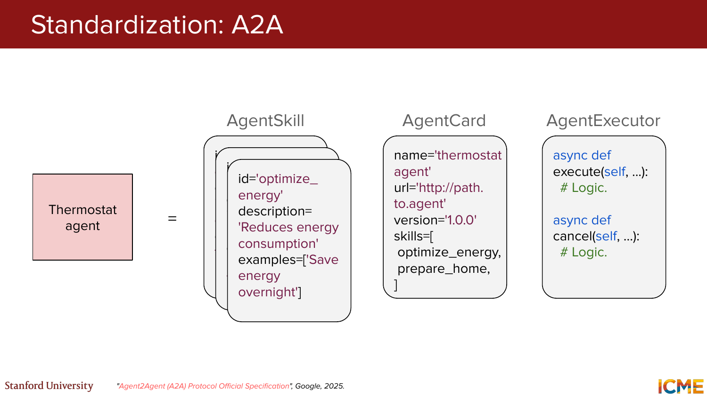
*Visual reference: ek agent ko skills, metadata card, aur executor logic ke structured package ke roop me dikhaya gaya hai.*

---

### 4.6 Safety

**Slides 141-144:** Agentic systems aur tool use ke safety risks explicitly highlight kiye gaye.

Risks:
- real world harm ka potential
- example: `data exfiltration`

Remediations:
- training steps
- inference safeguards
- benchmarks, e.g. `Agent-SafetyBench`

**Slide 144:** Recent news example ka reference diya gaya to show ki agentic misuse theoretical problem nahi hai; ye real operational risk hai.

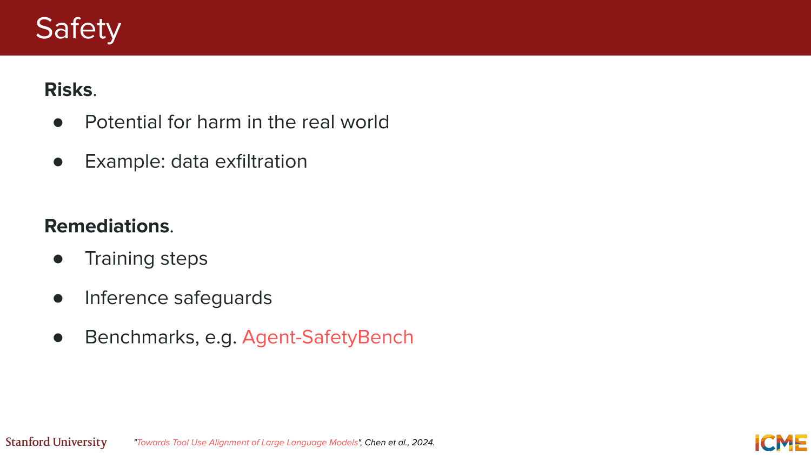
*Visual reference: risk list aur mitigation buckets for tool-using / agentic systems.*

> **Important message from lecture:** Capability excitement ke saath safety discipline equally important hai.

---

## Closing Thoughts (Slides 145-151)

**Slides 145-149:** Final summary bullets:

1. `Hallucination` abhi bhi big problem hai
2. `Reasoning abilities` bottleneck hain
- finetuning helpful hai, but hard
- new capabilities welcome hain

3. `Evaluation` challenging hai

4. Practical engineering advice:
- simple se start karo
- iterate karo
- progressively scale up karo
- pehle capable models se start karo, later size optimize karo
- transparency / observability user trust aur debuggability ke liye important hai

**Slide 150:** Bonus note:
- daily life me AI agents ka personal favorite use case = `coding`

**Slide 151:** Thank you slide.

---

## Final Big Picture

Lecture 7 ka main arc ye tha:

1. **RAG**
- model ko better external knowledge dene ka structured tareeqa
- retrieval quality sabse important bottleneck ban sakti hai

2. **Tool calling**
- model ko static text generator se useful system operator banata hai
- structured data, computation, aur actions ke liye essential hai

3. **Agents**
- model ko loops, planning, observation, aur action-taking ke through autonomous behavior deta hai
- lekin safety aur evaluation ko much harder bana deta hai

One-line summary:
> **Reasoning model soch sakta hai. Tool-using model duniya se interact kar sakta hai. Agent dono ko loop me daal kar goal pursue kar sakta hai.**
