# CME 295: Transformers & Large Language Models - Lecture 8 (Hinglish)
### Stanford | Afshine Amidi & Shervine Amidi

---

## Pichle Lecture Ka Recap (Slides 1-7)

**Slide 1:** Title slide hai. Course `CME 295: Transformers & Large Language Models` ka `Lecture 8`.

**Slides 2-4:** Lecture 7 ka progression quickly recap hua:

```text
RAG -> Tool calling -> Agents
```

Meaning:
- pehle model ko external knowledge diya gaya
- phir model ko functions/tools call karna sikhaya gaya
- phir same cheez ko looped, goal-directed behavior tak extend kiya gaya

**Slides 5-7:** Strengths aur weaknesses dobara summarize hue:

**Strengths**
- imitation aur idea generation me strong
- code generation/debugging me impressive

**Weaknesses**
- limited reasoning
- knowledge static hoti hai
- actions perform nahi kar sakte
- evaluate karna hard hota hai

Lecture framing:
- Lecture 6 ne `limited reasoning` ko address kiya
- Lecture 7 ne `static knowledge` aur `actions` ko cover kiya
- Lecture 8 ka focus hai: `evaluation`

> **Takeaway:** Capability build karna ek side hai; us capability ko reliably measure karna equally important engineering problem hai.

---

## Lecture Ka Overview (Slide 8)

**Slide 8:** Aaj ke lecture ke four big blocks list hue:
- `Rule-based metrics`
- `LLM-as-a-Judge`
- `Extensions`
- `Benchmarks`

Yani lecture ka central question hai:
> Model output ya model system ko objectively, repeatably, aur practically evaluate kaise karein?

---

## PART 1: Evaluation Setup and Human Rating (Slides 9-25)

### 1.1 "Evaluation" Se Lecture Ka Kya Matlab Hai?

**Slides 9-11:** Lecture ne pehle clarify kiya ki "evaluation" ek single metric ka naam nahi hai. Broadly do buckets hote hain:

1. **Output quality**
- instruction following
- coherence
- factuality

2. **System performance**
- latency
- pricing
- reliability

Important note:
- aaj ke lecture ka main focus `output quality` side par tha
- lekin production me dono dimensions matter karte hain

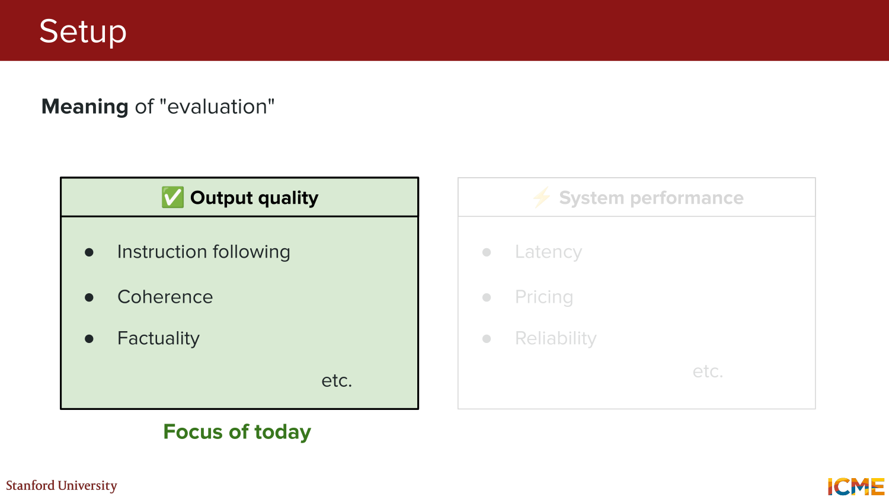
*Visual reference: output quality aur system performance ko do alag but complementary evaluation axes ke roop me dikhaya gaya hai.*

---

### 1.2 Ideal Gold Standard: Human Ratings

**Slides 12-13:** Free-form LLM outputs ko evaluate karna hard hota hai kyunki exact string match usually enough nahi hota.

Ideal world me:
- human raters output dekhte
- task-specific criteria apply karte
- aur rating ko "closest to truth" gold standard maana jata

Isliye human judgments ko lecture ne baseline reference point maana.

Why humans?
- nuance samajh sakte hain
- multiple acceptable phrasings ko tolerate kar sakte hain
- usefulness jaise fuzzy criteria par judgment de sakte hain

---

### 1.3 Human Rating Ki Limitations

**Slides 14-25:** Human evaluation best available standard ho sakta hai, lekin perfect nahi hota.

#### Problem 1: Subjectivity

Ek hi prompt-response pair ko do alag raters different tarah se score kar sakte hain.

Example framing from slides:
- prompt: birthday gift advice
- response: teddy bear recommendation
- criterion: usefulness

Issue:
- "useful" ka meaning raters ke liye slightly different ho sakta hai

#### Problem 2: Agreement Ko Measure Karna Padta Hai

Lecture ka key idea tha:
- sirf raw agreement dekhna enough nahi
- humein dekhna padta hai observed agreement chance se kitna better hai

Yahi intuition `Kappa` family ke metrics ke peeche hai.

Named variants:
- `Cohen's Kappa`
- `Fleiss' Kappa`
- `Krippendorff's alpha`

Intuition:
- `Observed agreement`: raters kitni baar same label dete hain
- `Expected agreement`: chance se kitna agreement aa sakta tha
- useful metric wo hoga jo chance-adjusted agreement bataye

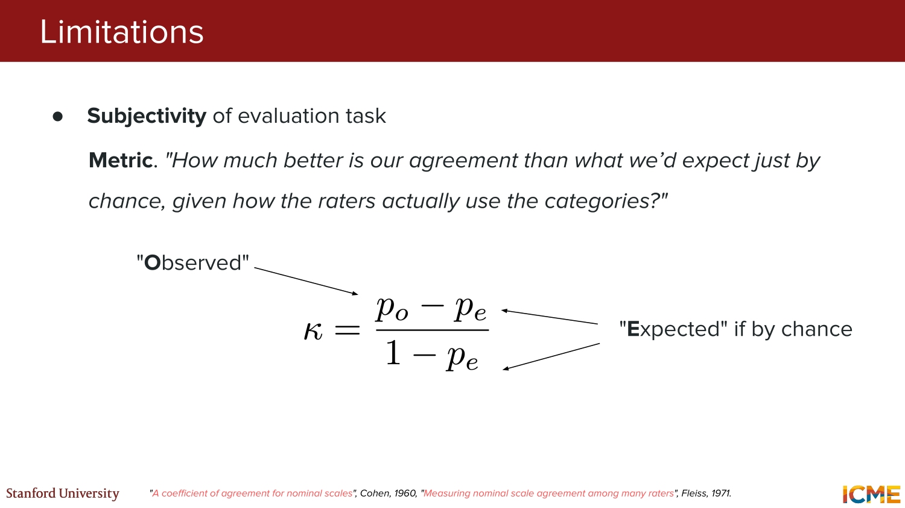
*Visual reference: observed agreement ko chance-based expected agreement ke against compare karke inter-rater agreement samjhaya gaya hai.*

#### Problem 3: Human Evaluation Slow Aur Expensive Hai

**Slides 24-25:** Even if raters good hon, human evaluation:
- slow hota hai
- expensive hota hai
- large-scale iteration ko bottleneck bana deta hai

> **Practical takeaway:** Humans high-quality signal dete hain, but every experiment ko fully human-rate karna scalable nahi hota.

---

## PART 2: Rule-Based Metrics and LLM-as-a-Judge (Slides 26-95)

### 2.1 Rule-Based Metrics Ka Basic Setup

**Slides 27-28:** Human labels ko repeatedly collect karne ke bajay ek alternative diya gaya:

1. reference / label ek baar likho
2. model output ko us reference ke against compare karo
3. score ko automatic metric se compute karo

Yani idea hai:
- humans up front reference banayein
- baad me evaluation automated ho jaye

---

### 2.2 Common Rule-Based Metrics

**Slides 29-33:** Lecture ne teen familiar automatic metrics mention kiye:

1. `METEOR`
2. `BLEU`
3. `ROUGE`

High-level view:
- ye metrics output aur reference ke overlap patterns dekhte hain
- wording match jitna close hota hai, score utna better aata hai
- different tasks me different variants useful ho sakte hain

Slide emphasis:
- `ROUGE` ke multiple variants hote hain, jaise `ROUGE-N`, `ROUGE-L`
- automatic evaluation ka classic toolbox translation/summarization style tasks se aaya

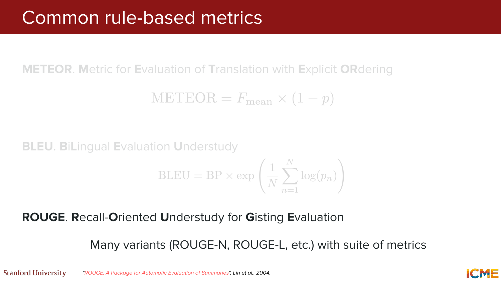
*Visual reference: METEOR, BLEU, aur ROUGE ko classic reference-based metrics ke roop me stack kiya gaya hai.*

---

### 2.3 Rule-Based Metrics Ki Limitations

**Slides 34-37:** Lecture ne in metrics ki major weaknesses clearly batayi:

1. **Stylistic variations ignore ho sakti hain**
- do semantically same responses different wording use kar sakte hain
- overlap-based metric phir bhi weak score de sakta hai

2. **Human judgments ke saath correlation perfect nahi hoti**
- automatic score high hona zaroori nahi ki human ko bhi response good lage

3. **Reference phir bhi human se hi banana padta hai**
- matlab human dependency fully gayab nahi hoti

Conclusion:
- rule-based metrics cheap aur easy hain
- lekin nuanced, open-ended LLM outputs ke liye kaafi limited hain

---

### 2.4 LLM-as-a-Judge (LaaJ) Kya Hai?

**Slides 38-46:** Agla step introduce hua:
`LaaJ = LLM-as-a-Judge`

Core idea:
- ek LLM ko evaluator bana do
- usko prompt, model response, aur evaluation criterion do
- judge model rationale aur score return kare

Simple template:

```text
Prompt
Model Response
Criterion
-> Judge LLM returns rationale + score
```

Lecture example:
- user prompt: `"Why are teddy bears comforting?"`
- model response given
- criterion: `Relevance`
- judge output: rationale + `PASS/FAIL` style score

Why this matters:
- exact string overlap par depend nahi karna padta
- semantic aur task-aware judgment mil sakti hai

---

### 2.5 Structured Output Se Judge Reliable Kaise Banate Hain?

**Slides 47-51:** Lecture ne emphasize kiya ki judge se free-form response lene ke bajay structured output enforce karna better hota hai.

Flow:

1. Desired schema define karo

```text
class Response:
  rationale: str
  score: Literal[0, 1]
```

2. Model call me isi schema ko required output format ke roop me pass karo

Benefits:
- parse karna easy hota hai
- downstream aggregation simple ho jati hai
- judge output more predictable hota hai

Slide references ne is point ko vendor docs aur earlier lecture ke guided decoding discussion se connect kiya.

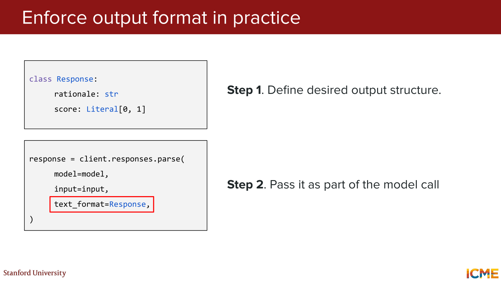
*Visual reference: pehle output schema define karke, phir model call ko us structured format se bind karne ka workflow dikhaya gaya hai.*

---

### 2.6 LaaJ Ke Benefits

**Slides 52-55:** Rule-based metrics ke comparison me do big gains highlight hue:

1. **Reference / label ki dependency kam ho jati hai**
- har example ke liye gold reference likhna zaroori nahi

2. **Interpretability improve hoti hai**
- judge rationale de sakta hai
- sirf scalar score nahi, explanation bhi milti hai

Important nuance:
- rationale perfect truth nahi hota
- but debugging aur qualitative analysis me useful hota hai

---

### 2.7 Pointwise vs Pairwise Judging

**Slides 56-59:** LaaJ ke do common modes dikhaye gaye.

#### Pointwise

Judge ek single response ko independently rate karta hai.

Use case:
- absolute quality estimate
- pass/fail style checks
- rubric-based scoring

#### Pairwise

Judge do responses compare karta hai:

```text
Which one is better: Response A or Response B?
```

Use case:
- model A vs model B comparisons
- A/B evaluation
- preference-style benchmarking

Tradeoff:
- pairwise comparison kabhi easier hota hai than assigning an absolute score
- lekin pairwise mode apni biases bhi introduce karta hai

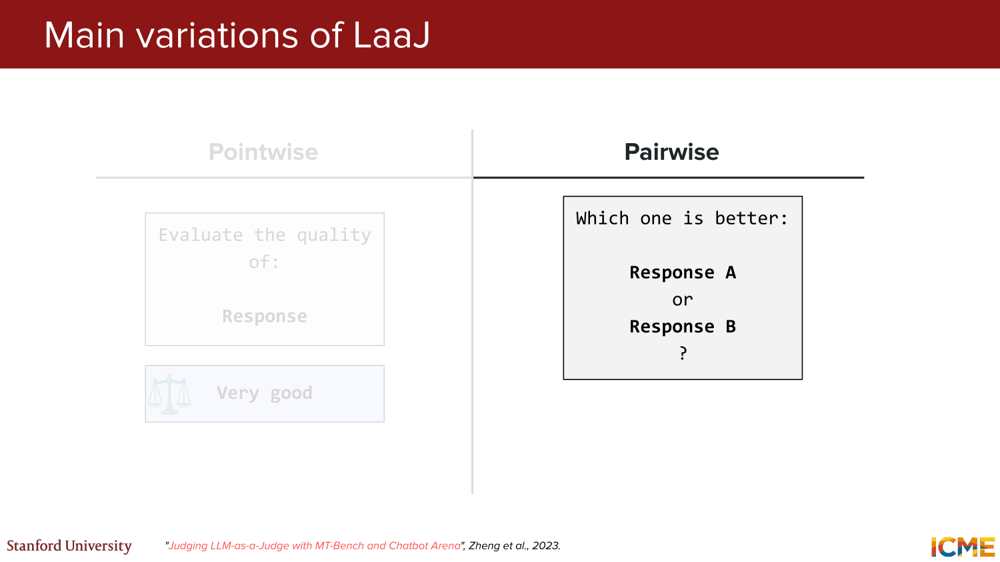
*Visual reference: pointwise absolute rating aur pairwise A/B comparison ko side-by-side contrast kiya gaya hai.*

---

### 2.8 Biases in LLM-as-a-Judge

**Slides 60-72:** Lecture ne teen especially important judge biases cover kiye.

#### Bias A: Position Bias

Problem:
- judge kabhi first-listed response ko prefer karta hai
- order reverse karne par decision flip ho sakta hai

Remedy from slides:
- both orderings score karo aur average lo
- ya position embedding behavior ko tune karo

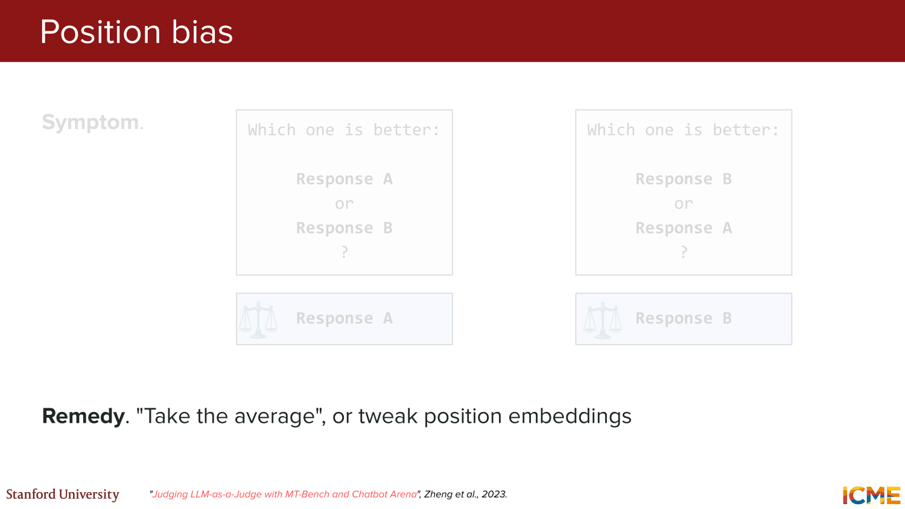
*Visual reference: same pair ko A/B aur B/A order me dikhakar inconsistent preference expose ki gayi hai.*

#### Bias B: Verbosity Bias

Problem:
- longer answer ko judge "better" samajh leta hai
- chahe short answer actually zyada correct aur useful ho

Typical symptom:
- detailed but noisy answer wins
- concise correct answer lose kar deta hai

Remedies:
- explicit judging guidelines
- few-shot examples
- output length par penalty / normalization

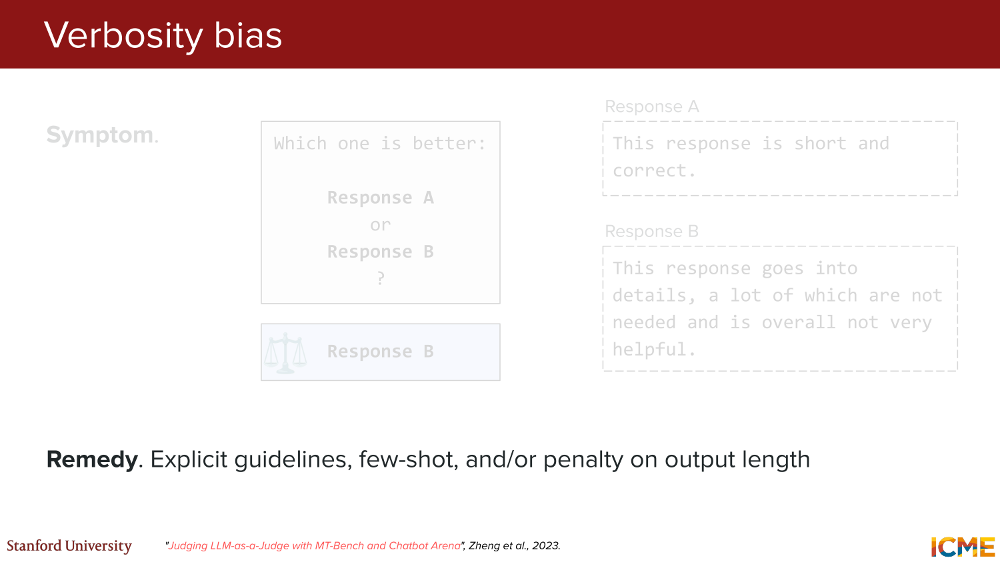
*Visual reference: short-correct response ke against longer-but-worse response ko judge incorrectly prefer karta hua example.*

#### Bias C: Self-Enhancement Bias

Problem:
- judge model apni hi style/model-family ke generated outputs ko prefer kar sakta hai

Interpretation:
- agar same model contestant bhi hai aur judge bhi, evaluation contaminated ho sakti hai

Lecture remedy:
- judge aur evaluated system ko identical na rakho
- especially self-judging setups se bacho

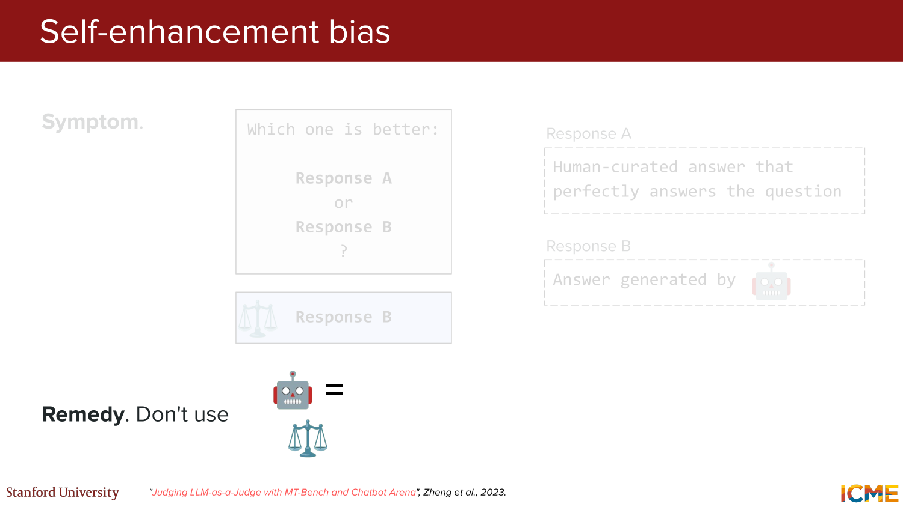
*Visual reference: human-curated answer ke against model-generated answer ko judge unfairly prefer karta hua example.*

---

### 2.9 Judge Prompt Likhnay Ki Best Practices

**Slides 73-78:** Practical guidance ka concise checklist diya gaya:

- crisp guidelines likho
- granular scale se better often binary scale hota hai
- score se pehle rationale likhvayo
- known biases mitigate karo
- human judgments ke against calibration rakho
- low temperature use karo for reproducibility

Ye section lecture ka highly practical part tha:
- judge banana easy hai
- reliable judge banana hard hai

---

### 2.10 Revised Evaluation Workflow

**Slides 79-83:** Lecture ne final recommendation diya ki human raters ko fully replace karna goal nahi hona chahiye.

Better workflow:
- large-scale fast screening `LLM-as-a-Judge` se karo
- smaller calibrated subset par humans use karo
- judge ko human ratings ke against periodically align karo

Interpretation:
- rabbit = fast automated judging
- turtle = slower but stronger human signal

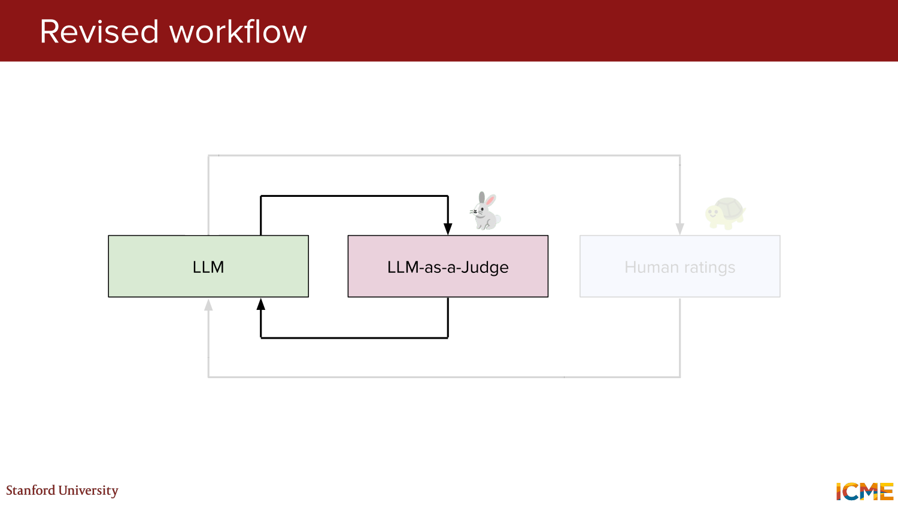
*Visual reference: LLM-as-a-Judge ko fast middle layer aur human ratings ko slower calibration layer ke roop me show kiya gaya hai.*

> **Takeaway:** Human evaluation ko replace nahi, amplify karna zyada sensible strategy hai.

---

### 2.11 Typical Evaluation Dimensions

**Slides 84-86:** Lecture ne remind kiya ki ek hi model ko multiple axes par judge karna padta hai.

**Task performance**
- usefulness
- factuality
- relevance

**Alignment**
- tone
- style
- safety

Lesson:
- "good response" ek single scalar concept nahi hai
- task ke hisaab se right dimension select karna zaroori hai

---

### 2.12 Factuality Ko Score Karna

**Slides 87-95:** Factuality ko more nuanced way me quantify karne ka extension dikhaya gaya.

Problem:
- long-form answer me kuch claims sahi ho sakte hain, kuch galat
- ek single all-or-nothing label information lose kar deta hai

Lecture recipe:

1. original text lo
2. usko atomic facts me decompose karo
3. har fact ko importance weight do
4. factual support / correctness ko assess karo
5. weighted score aggregate karo

Teddy-bear example se intuition:
- response me multiple claims the
- sab claims equal importance ke nahi the
- final score weighted average jaisa bana

Yani factuality ko claim-level granularity par dekhna better hai than whole paragraph ko ek hi label dena.

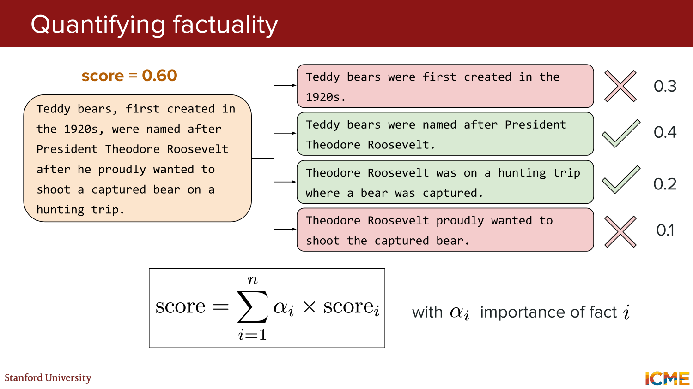
*Visual reference: long-form statement ko fact decomposition, per-fact importance, aur final weighted factuality score me break kiya gaya hai.*

---

## PART 3: Evaluation Extensions for Tool Use and Agents (Slides 96-135)

### 3.1 Agentic Mindset: Single Output Nahi, Multi-Step Loop

**Slides 97-99:** Lecture wapas `ReAct` framing par gaya:
- `Observe`
- `Plan`
- `Act`

Main point:
- agentic systems ka output ek single generation event nahi hota
- multiple loops aur intermediate states hote hain

Implication for evaluation:
- agar final answer wrong hai, failure kisi bhi intermediate step me ho sakta hai

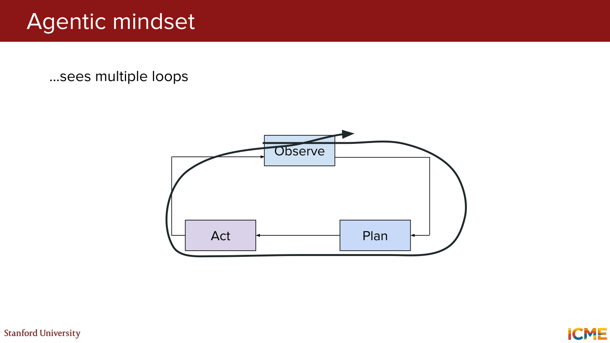
*Visual reference: observe-plan-act framework ko repeated loops ke roop me dikhaya gaya hai, not just one-shot execution.*

---

### 3.2 Tool-Using Pipeline Ko Evaluate Kaise Socha Jaye?

**Slides 100-101:** Lecture 7 ke teddy-bear tool example ko evaluation lens se rewrite kiya gaya.

Pipeline ke three stages:

1. relevant function aur arguments choose karna
2. actual tool call execute karna
3. tool output se final user-facing response synthesize karna

Yani tool-using system ko judge karte waqt "final answer sahi tha ya nahi" enough nahi hai. Humein stage-by-stage dekhna padta hai.

---

### 3.3 Failure Mode A: Tool Prediction Errors

**Slides 102-118:** Pehla failure bucket tha `tool prediction`.

#### Case 1: Model Tool Use Hi Nahi Karta

Symptom:
- LLM directly answer de deta hai
- available tool hone ke bawajood call nahi karta

Potential causes from slides:
- tool router error
- model ko tool use karna properly nahi aata

Remedies:
- tool router retrain karo
- SFT / prompting improve karo

#### Case 2: Model Non-Existent Tool Hallucinate Karta Hai

Symptom:
- model `find_bear()` jaisa invented tool call karta hai

Potential causes:
- model too weak
- API naming illogical
- instructions unclear

Remedies:
- stronger model
- better API naming
- clearer top-level instructions

#### Case 3: Wrong Tool Use Karta Hai

Symptom:
- correct intent ke liye wrong available tool choose ho jata hai

Potential causes:
- tool router issue
- model ne wrong affordance infer ki

Remedies:
- router retraining
- better prompting / SFT

#### Case 4: Wrong Argument Infer Karta Hai

Symptom:
- right tool select hua, wrong arguments pass hue

Example from slides:
- location unknown hone par `(0, -0)` jaisa bogus argument

Potential causes:
- argument infer hi nahi ho sakta
- model ko required argument protocol samajh nahi aaya

Remedies:
- helper tool introduce karo
- context me required info ensure karo
- prompting / SFT improve karo

---

### 3.4 Failure Mode B: Tool Call Errors

**Slides 119-125:** Kabhi model sahi tool call karta hai, lekin problem backend/tool implementation side par hoti hai.

#### Case 1: Wrong Response Ya Error

Symptoms:
- tool incorrect value return karta hai
- ya exception / error de deta hai

Lecture remedy:
- tool implementation fix karo

#### Case 2: No Response

Symptom:
- tool kuch meaningful return hi nahi karta

Observed downstream effect:
- final model response hallucinate ho sakta hai, because grounding signal missing ho jata hai

Slide recommendation:
- empty JSON jaisa minimal structured output bhi return karo
- generally tool outputs meaningful aur explicit hone chahiye

---

### 3.5 Failure Mode C: Response Generation Errors

**Slides 126-131:** Final stage me bhi failure aa sakta hai even if tool call successful tha.

Symptom:
- tool ne correct object ya data diya
- final LLM response us data ko sahi tareh convey nahi karta

Potential causes:
- weak grounding capabilities
- tool output context window spam kar raha hai
- tool output descriptive enough nahi hai

Remedies:
- synthesis LLM improve karo
- backend output trim karo
- tool output format ko more descriptive banao

Key insight:
- grounded generation separate capability hai
- correct tool result hona alone sufficient nahi hai

---

### 3.6 Debugging Takeaway

**Slides 132-135:** Full summary diya gaya ki agent/tool evaluation me failures roughly teen layers par milte hain:

1. tool selection / argument inference
2. tool execution / backend behavior
3. final response synthesis

Common issue buckets:

**Modeling**
- weak reasoning / grounding
- context window overload
- poor tool modeling

**Tool**
- tool implementation buggy
- tool output uninterpretable

Main engineering message:
- tool/agent debugging me patience chahiye
- final output ko dekhkar immediately blame assign nahi karna chahiye
- pipeline tracing necessary hai

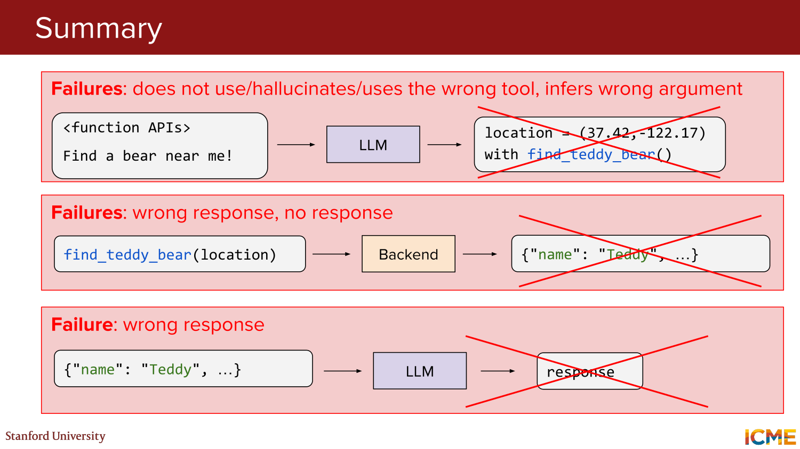
*Visual reference: tool prediction, tool call, aur response generation failures ko ek consolidated debugging map me summarize kiya gaya hai.*

---

## PART 4: Benchmarks and Their Limits (Slides 136-169)

### 4.1 Benchmark Landscape Overview

**Slides 137-149:** Lecture ne common benchmark families ko four buckets me organize kiya:

- `Knowledge`
- `Reasoning`
- `Coding`
- `Safety`

High-level point:
- different benchmarks different capability slices measure karte hain
- kisi ek benchmark se "overall best model" conclude karna risky hai

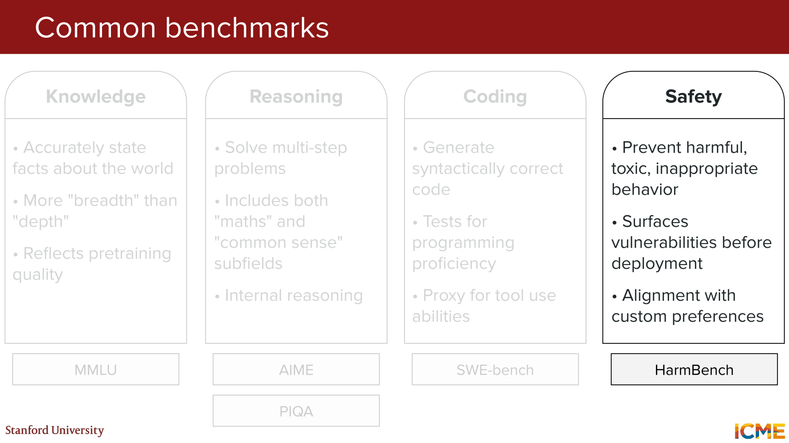
*Visual reference: knowledge, reasoning, coding, aur safety benchmark families ko ek capability map ke roop me dikhaya gaya hai.*

---

### 4.2 Knowledge Benchmarks: MMLU

**Slides 138-140:** `MMLU = Massive Multitask Language Understanding`

Characteristics:
- 57 tasks
- 4 multiple-choice options per question
- breadth-heavy benchmark

Example subject areas:
- elementary mathematics
- US history
- computer science
- law

Evaluation criterion:
- A/B/C/D me correct option choose karna
- i.e. hardcoded exact match style scoring

Interpretation:
- world knowledge breadth aur pretraining quality ka proxy

---

### 4.3 Reasoning Benchmarks: AIME and PIQA

**Slides 141-145:** Reasoning bucket ko lecture ne do examples se ground kiya.

#### AIME

`AIME = American Invitational Mathematics Examination`

Characteristics:
- roughly 30 math problems
- geometry, algebra, analysis jaisi topics
- multi-step reasoning required

Evaluation:
- correct 3-digit answer dena

#### PIQA

`PIQA = Physical Interaction: Question Answering`

Characteristics:
- everyday physical commonsense scenarios
- 2 candidate solutions

Evaluation:
- `Sol1` ya `Sol2` me correct choice pick karna

Together these show:
- reasoning benchmark sirf pure math nahi hota
- commonsense reasoning bhi important subfield hai

---

### 4.4 Coding Benchmark: SWE-bench

**Slides 146-148:** `SWE-bench` ko coding benchmark example ke roop me discuss kiya gaya.

Definition:
- real GitHub issues se derived software engineering tasks
- 12 popular Python repositories
- each problem ke saath base commit aur already merged PR + tests

Evaluation criterion:
- generated patch / PR ko all tests pass karne chahiye

Why interesting:
- code generation ko real repository context me test karta hai
- programming proficiency ke saath tool-use proxy bhi ban sakta hai

---

### 4.5 Safety Benchmark: HarmBench

**Slides 149-151:** `HarmBench = Harmful Behavior Benchmark`

Characteristics:
- 510 harmful behaviors
- text-based aur multimodal examples
- categories include standard, copyright, contextual, multimodal

Evaluation criterion:
- `Attack Success Rate (ASR)`

Interpretation:
- refusal robustness aur harmful compliance risk ko measure karne ki koshish

Important nuance:
- safety ko bhi benchmark ki tarah formalize kiya ja sakta hai
- but safety score bhi complete story nahi batata

---

### 4.6 Agent Benchmark: tau-bench and Pass^k

**Slides 152-157:** Lecture ne poocha:
`What about agents?`

Answer:
`tau-bench = Tool-Agent-User Interaction Benchmark`

Characteristics:
- realistic domains
- APIs, policies, aur database schema available
- two example domains:
  - airline agent
  - retail agent

Tasks:
- multiple tools
- realistic operational workflows

Evaluation criteria:
- reward maximize karna
- `pass^k` dekhna

Lecture definition:
> `Pass^k = Probability that all k attempts succeed`

Yani agent reliability sirf single best run se judge nahi hoti; repeated attempts me consistency bhi matter karti hai.

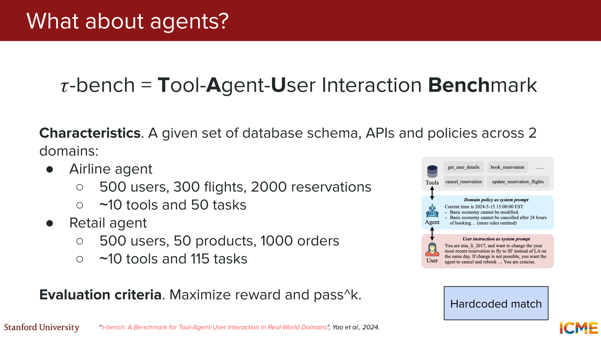
*Visual reference: agent benchmark ko domains, tools, policies, aur task sets ke saath structured environment ke roop me present kiya gaya hai.*

---

### 4.7 Benchmarks Ko Interpret Kaise Karein?

**Slides 158-163:** Lecture ne recent model launch references aur leaderboard framing ke through benchmark interpretation discuss ki.

Important messages:

1. **Benchmark results model profile batate hain**
- they are projection on specific axes
- har model alag strengths dikha sakta hai

2. **One model sab cheezon me best hona zaroori nahi**
- kisi ko coding me advantage ho sakta hai
- kisi ko low-cost serving me
- kisi ko reasoning ya tool use me

3. **Pareto frontier soch useful hai**
- best choice absolute score nahi hota
- often trade-off based choice hota hai

Common trade-offs from slides:
- quality vs cost/latency
- quality vs safety
- quality vs context length

Historical note from lecture slides:
- benchmark-centric product positioning ko illustrate karne ke liye slides ne November 18, 2025 ke `Gemini 3` launch example ka use kiya

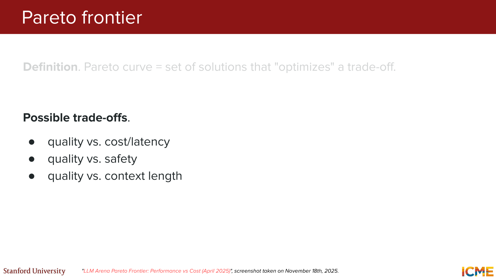
*Visual reference: benchmark performance ko trade-off frontier ke saath interpret karne ki framing di gayi hai.*

---

### 4.8 Data Contamination and Goodhart's Law

**Slides 164-169:** Final warning section kaafi important tha.

#### Risk: Data Contamination

Problem:
- benchmark clues ya exact items training set me leak ho sakte hain
- phir benchmark score genuine generalization ko reflect nahi karega

Precautions from slides:
- identifiers / hashes use karo
- tool evaluations ke liye blocklist use karo
- newer test versions par evaluate karo

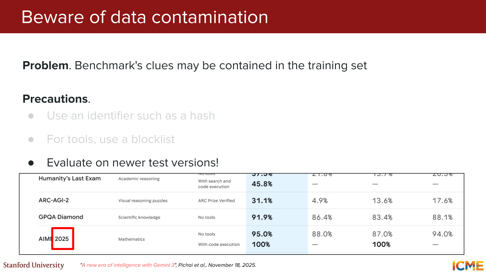
*Visual reference: contamination risk aur uske concrete mitigations ko checklist form me summarize kiya gaya hai.*

#### Final Warning: Goodhart's Law

Lecture quote:
- jab measure target ban jata hai, wo good measure rehna band kar sakta hai

Practical lessons:
- benchmarks par over-index mat karo
- organic perspectives bhi chahiye, e.g. `Chatbot Arena`
- khud thode models try karna bhi valuable hai

> **Main point:** Benchmarks useful hain, but they are maps, not the territory.

---

## Closing (Slide 170)

**Slide 170:** Thank-you slide.

Lecture ka closing mood ye tha:
- evaluation essential hai
- but evaluation itself noisy, biased, aur incomplete ho sakta hai
- isliye single metric obsession se bachna chahiye

---

## Final Big Picture

Lecture 8 ka main arc kuch is tarah tha:

1. **Human evaluation**
- highest-quality signal de sakta hai
- but subjective, slow, aur expensive hai

2. **Rule-based metrics**
- cheap aur automatic hain
- but narrow aur wording-sensitive hain

3. **LLM-as-a-Judge**
- flexible aur scalable hai
- but structured prompting, calibration, aur bias mitigation ke bina unreliable ho sakta hai

4. **Tool / agent evaluation**
- single output scoring se kaam nahi chalta
- pipeline ke har stage ko separately inspect karna padta hai

5. **Benchmarks**
- capability slices ko summarize karte hain
- but data contamination, trade-offs, aur Goodhart-style over-optimization ke risks rehte hain

One-line summary:
> **LLM evaluation ka real lesson ye hai: fast metrics useful hain, but trustworthy judgment tab aata hai jab human calibration, stage-wise debugging, aur benchmark skepticism saath me use kiye jayein.**
