# CME 295: Transformers & Large Language Models - Lecture 9 (Hinglish)
### Stanford | Afshine Amidi & Shervine Amidi

---

## Course Ka Rewind (Slides 1-41)

**Slide 1:** Title slide hai. Ye `Lecture 9` course ka closing lecture hai.

**Slides 2, 42, 70, 99:** Lecture ne apna roadmap baar-baar repeat kiya:
- recap
- beyond Transformer-based LLMs
- diffusion LLMs
- closing thoughts

Yani ye lecture ek naya isolated topic nahi hai. Ye poore quarter ko summarize karke next frontiers ki taraf point karta hai.

---

### 1.1 Lecture 1 Se Lecture 3 Tak: Foundations Se LLMs Tak

**Slides 3-17:** First block ne course ke early arc ko rewind kiya.

#### Lecture 1

Main reminder:
- transformers ka origin `machine translation` me tha
- attention aur sequence modeling ne course ki foundation banayi
- teddy-bear prompt examples se model behavior intuition build ki gayi

#### Lecture 2

Lecture ne transformer tricks aur variants ko signal kiya:
- positional encoding evolutions
- `RoPE`
- `GQA`
- architecture-level efficiency ideas

#### Lecture 3

LLM block recap:
- decoder-only modeling
- mixture-of-experts style specialization
- large language model scaling aur inference behavior

Overall message:
- course ne pehle building blocks ko samjhaya
- phir unhi blocks ke optimized modern forms tak progress kiya

---

### 1.2 Lecture 4 and 5: Training and Tuning Stack

**Slides 18-30:** Rewind phir training pipeline tak aaya.

Topics referenced:
- scaling laws
- Chinchilla / compute-optimal training intuition
- FlashAttention and systems efficiency
- pretraining
- finetuning
- preference tuning

Slide progression ka structure:

```text
Initialized model
-> Pretraining
-> Finetuning
-> Preference tuning
```

Interpretation:
- pehle raw model language/code/world patterns learn karta hai
- phir task-specific adaptation hoti hai
- phir human preference alignment se behavior polish hota hai

Slides 27-30 ne human preference aur token probabilities ko remind karke tuning lecture ka essence summarize kiya:
- alignment sirf next-token prediction nahi hai
- desired behavior ko preference signal se shape karna padta hai

---

### 1.3 Lecture 6 to 8: Reasoning, Agents, and Evaluation

**Slides 31-41:** Last rewind block ne recent lectures ko summarize kiya.

#### Lecture 6

Reasoning recap:
- chain-of-thought style reasoning
- `DeepSeek-R1`
- RL-based reasoning improvement
- `GRPO` vs `PPO`

#### Lecture 7

Agentic recap:
- `RAG`
- tool calling
- agents

#### Lecture 8

Evaluation recap:
- prompt
- model response
- criteria
- `LLM-as-a-Judge`
- benchmark families: knowledge, reasoning, coding, safety

> **Big recap takeaway:** Course ka overall arc tha: architecture -> scaling/training -> tuning -> reasoning -> tools/agents -> evaluation.

---

## PART 1: Beyond Transformer-Based LLMs (Slides 43-69)

### 2.1 Kya Transformers Text Ke Bahar Bhi Kaam Kar Sakte Hain?

**Slides 43-48:** Lecture ne pehle high-level motivation diya.

Context from slides:
- Transformers 2017 me machine translation ke liye introduce hue
- self-attention par rely karte hain
- query, key, value framework core building block hai

Benefits highlighted:
- weaker inductive biases
- more generalizability

Meaning:
- CNN jaise models kuch domains me stronger built-in assumptions leke aate hain
- transformers zyada generic representation machinery provide karte hain
- isi wajah se unko text se bahar bhi adapt karna natural bana

Slides 45-48 ne query-key-value intuition ko refresh kiya aur phir same attention idea ko images tak extend karne ka setup banaya.

---

### 2.2 Vision Transformer (ViT)

**Slides 49-62:** Image understanding ke liye transformer adaptation dikhaya gaya.

Central question on slides:
> Image understanding tasks ke liye transformer ko kaise adapt karein?

Basic answer:
- image ko directly ek monolithic tensor ki tarah nahi feed karte
- usko smaller patches me todte hain
- patches ko embeddings ki tarah treat karke sequence banate hain

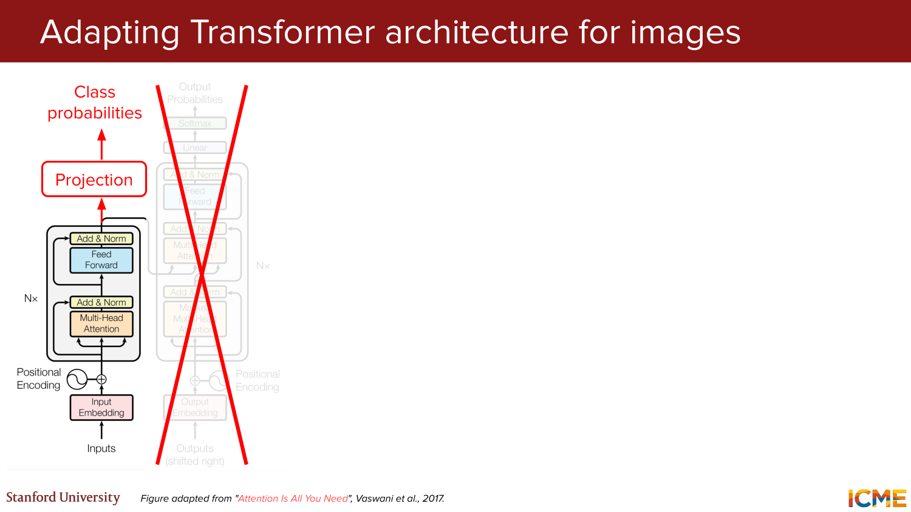
*Visual reference: original Transformer skeleton ko image-classification style pipeline me adapt karne ka framing.*

#### ViT Kya Hai?

**Slide 51:** `ViT = Vision Transformer`

Core idea:
- image patches become token-like units
- phir standard transformer encoder un par operate karta hai

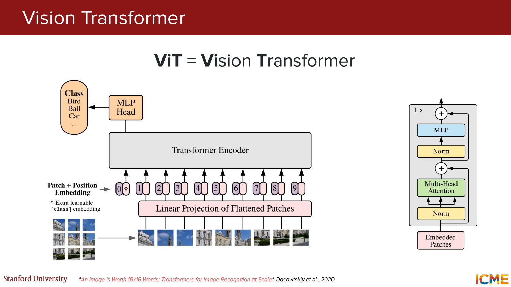
*Visual reference: ViT ko image patches aur transformer encoder ke combination ke roop me introduce kiya gaya hai.*

#### End-to-End Flow

**Slides 52-62:** Lecture ne step-by-step ViT walkthrough diya.

Pipeline:

1. image ko patches me split karo
2. har patch ko linear projection se embedding me map karo
3. `[CLS]` token add karo
4. positional embeddings add karo
5. sequence ko encoder me pass karo
6. final encoded representation se class prediction nikalo

Slide 62 tak teddy-bear example ke saath final classification demonstrate hua.

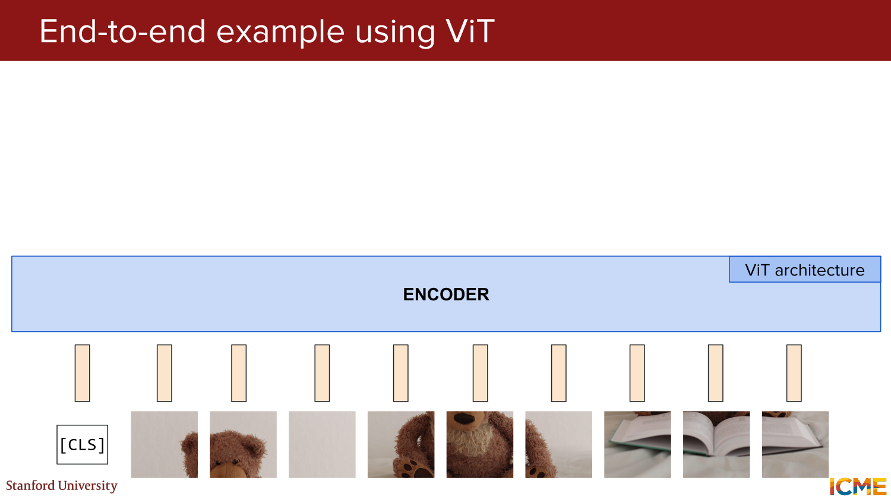
*Visual reference: patches + embeddings + encoder + class head ka complete ViT pipeline.*

Practical takeaway:
- image ko "pixels only" view se nikal kar "sequence of visual tokens" view me convert kiya gaya
- isse transformer machinery vision par apply ho gayi

---

### 2.3 VLMs: Vision Language Models

**Slides 63-68:** Agla step image understanding se multimodal understanding tak gaya.

Definition:
- `VLM = Vision Language Model`

Example prompt from slides:
- image of teddy bear
- question: `"How cute is this teddy bear?"`
- model outputs language answer: `"Very cute!"`

Iska matlab:
- model ko image encode bhi karna hai
- aur natural language me respond bhi karna hai

#### Method 1: Decoder-Only Architecture Recycle Karna

**Slides 64-65:** Existing decoder-only LLM stack ko reuse karke visual instruction tuning ki direction dikhayi gayi.

Idea:
- already-strong language generator ko multimodal input consume karne layak banao

#### Method 2: Cross-Attention Layer Leverage Karna

**Slides 66-68:** Dusra route tha cross-attention based design.

Intuition:
- visual features alag represent ho sakte hain
- language decoder cross-attention ke through un visual features se attend kare

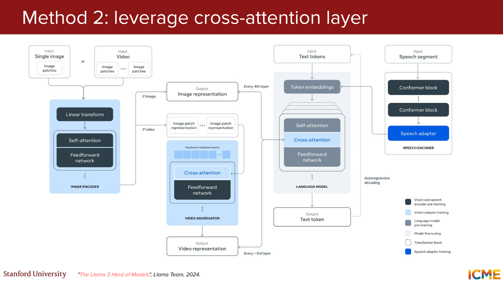
*Visual reference: image-conditioned language decoding me cross-attention ka role dikhaya gaya hai.*

Lecture message:
- multimodal models ke liye ek hi architecture recipe fixed nahi hai
- existing text-first architectures ko extend karna bhi possible hai
- aur explicitly multimodal layers use karna bhi

---

### 2.4 Transformers Har Jagah

**Slide 69:** Section ka punchline direct tha:
> Transformers sirf text generation ke liye nahi hain.

Slides ne concrete usage buckets diye:
- text generation
- vision understanding via `ViT`
- image generation via `DiT`, `MM-DiT`
- aur recommendation, speech, etc.

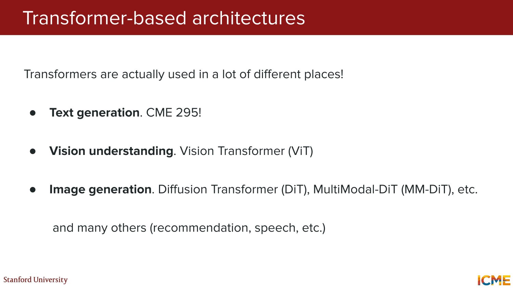
*Visual reference: transformer family ko multiple modalities aur tasks me reuse hota hua summarize kiya gaya hai.*

> **Takeaway:** Transformer ko lecture ne ek "text model" nahi, balki ek broadly reusable sequence-processing idea ke roop me position kiya.

---

## PART 2: Diffusion LLMs (Slides 70-98)

### 3.1 ARM Ki Limitation: Token-by-Token Decoding

**Slides 71-81:** Lecture ne current mainstream LLM decoding paradigm ko revisit kiya:
`ARM = AutoRegressive Modeling`

Autoregressive flow:

```text
[BOS] -> A -> teddy -> bear -> is -> ...
```

Har step par:
- next token previous tokens par conditioned hota hai
- token one-by-one generate hota hai

Main problem from slides:
- inference-time generation parallelizable nahi hoti
- training parallel ho sakti hai, but decoding bottleneck sequential hi rehta hai

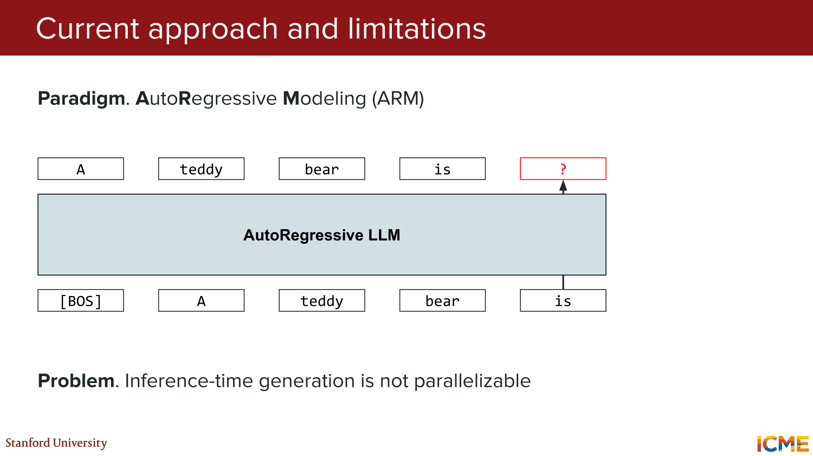
*Visual reference: autoregressive decoding ko strictly left-to-right token generation ke roop me dikhaya gaya hai, jisme inference parallel nahi hota.*

Yani large quality gains ke baad ek new question naturally aata hai:
> Kya text generation ko kisi aur paradigm me kiya ja sakta hai jo faster ho?

---

### 3.2 Diffusion-Based LLMs Ka Motivation

**Slide 82:** Lecture ne diffusion-based text models ko "in the news" framing ke saath introduce kiya.

Slides cited:
- Google I/O showcase on **May 20, 2025**
- TechCrunch announcement on **November 6, 2025**
- Inception website screenshot on **November 26, 2025**
- ByteDance announcement on **July 31, 2025**

Main point:
- diffusion-style text modeling ab sirf speculative research topic nahi hai
- industry me bhi visible direction ban raha hai

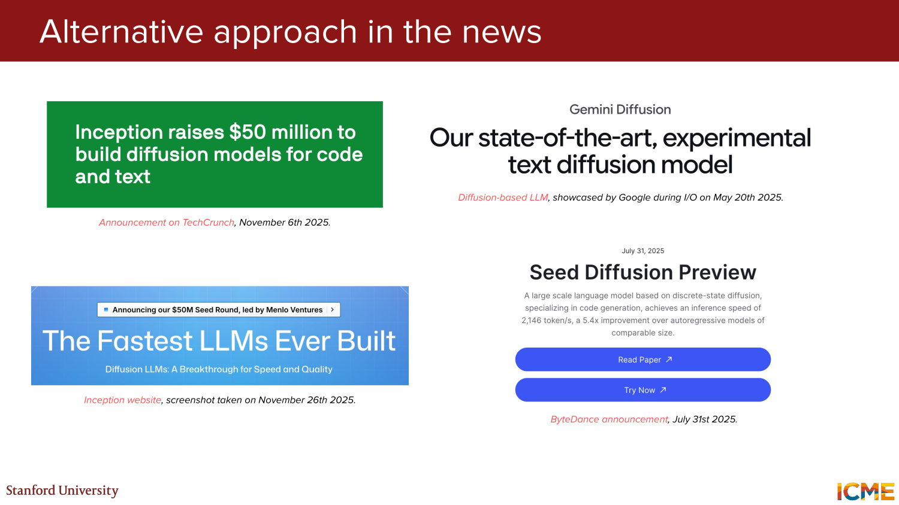
*Visual reference: 2025 ke public references ke through diffusion-based LLM direction ko real, current trend ke roop me frame kiya gaya hai.*

---

### 3.3 Diffusion Intuition: Pehle Images Se Samjho

**Slides 83-89:** Lecture ne text diffusion samjhane se pehle image generation diffusion ka intuition diya.

Key ideas:
- noise sample karna easy hai
- learned transformation ke through useful data distribution tak jana goal hai
- process mathematically well-defined hota hai

Analogy from slides:
- sculpture marble block ke andar already hoti hai
- artist bas extra material remove karta hai

High-level goal:
- noise se desired image distribution tak mapping learn karna

Diffusion for images:

1. forward process: image me gradually noise add karo
2. reverse process: model ko denoise karna sikhao

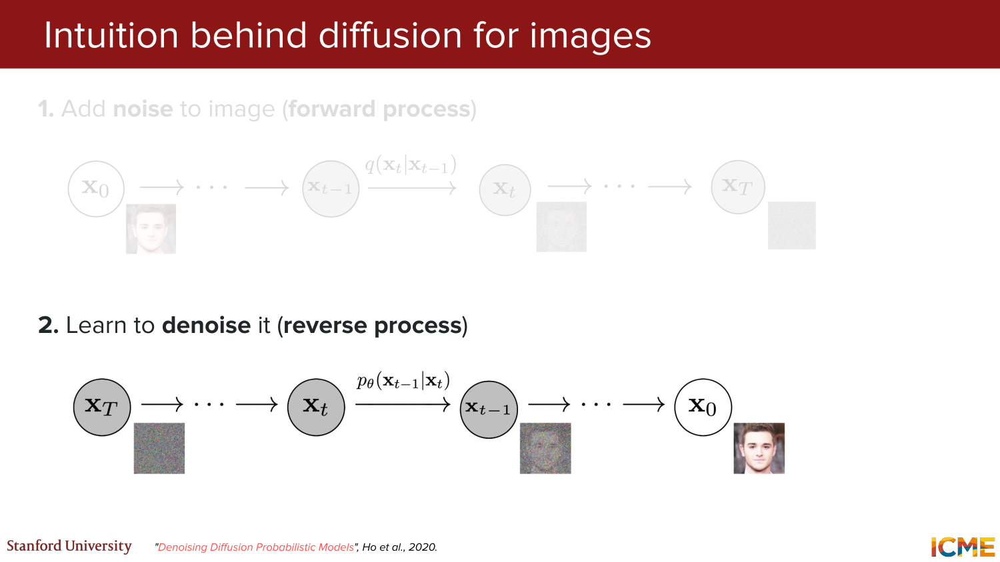
*Visual reference: forward noising aur reverse denoising ke two-stage image diffusion intuition ko summarize kiya gaya hai.*

---

### 3.4 Image Se Text Tak: Masking as Diffusion

**Slides 90-92:** Text domain me same idea ko direct Gaussian noise ke saath apply nahi kiya gaya. Instead lecture ne masking intuition dikhayi.

Text adaptation:

1. forward process:
- kuch tokens mask karo

2. reverse process:
- masked tokens ko recover/unmask karna sikhao

Example from slides:

```text
A teddy bear is reading
-> A MASK bear is MASK ...
-> gradually reconstruct full text
```

Important intuition:
- images me "noise add" karte hain
- text me often "masking / corruption" analog use karte hain

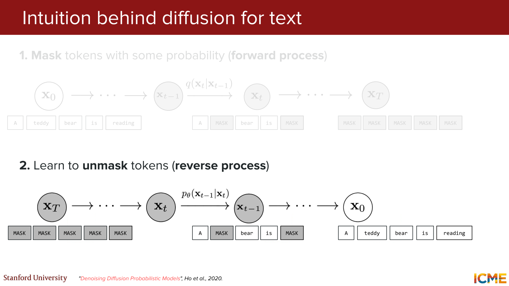
*Visual reference: masked-token corruption aur reverse unmasking ke through text diffusion intuition dikhayi gayi hai.*

---

### 3.5 MDM: Masked Diffusion Model

**Slides 93-96:** Lecture ne diffusion LLM formulation ko `MDM = Masked Diffusion Model` ke roop me summarize kiya.

Core picture:
- input side par masked tokens
- model repeatedly refine karke final text recover karta hai

Key selling point from slides:
- decoding fewer forward passes me ho sakti hai

Yani target yeh tha:
- ARM jaisa strictly one-token-at-a-time process avoid ho
- multiple positions ko jointly refine kiya ja sake

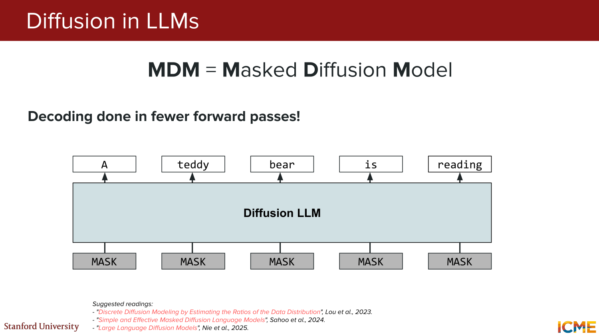
*Visual reference: all-mask initialization se repeated refinement ke through final text sequence tak pahunchne ka MDM flow.*

Lecture ne suggested readings bhi diye:
- Lou et al., 2023
- Sahoo et al., 2024
- Nie et al., 2025

---

### 3.6 Diffusion LLMs: Advantages and Open Challenges

**Slides 97-98:** Section ka balanced conclusion diya gaya.

Advantages:
- around `10x output tokens per second` compared to ARM
- kuch tasks ke liye better suited ho sakte hain

Challenges and ongoing work:
- raw performance
- ARM-based techniques ko diffusion setting me adapt karna

Interpretation:
- diffusion LLMs exciting hain
- lekin ARM ko replace karne ke liye ecosystem, methods, evaluation, aur deployment maturity abhi develop ho rahi hai

> **Takeaway:** Diffusion LLMs ka core promise speed aur alternate decoding dynamics hai, but research abhi active aur unsettled hai.

---

## PART 3: Closing Thoughts and Future Frontiers (Slides 99-121)

### 4.1 Modalities Ek-Dusre Se Seekh Rahi Hain

**Slides 100-104:** Lecture ne ek broad trend highlight kiya:
`Cross-pollination between modalities`

Statement:
- modalities good ideas ko borrow karti rehti hain

Examples from slides:
- text output ke liye diffusion training
- images ko handle karne ke liye transformers
- `DeepSeek-OCR` style input representation ideas
- RoPE variants, e.g. multimodal/image settings

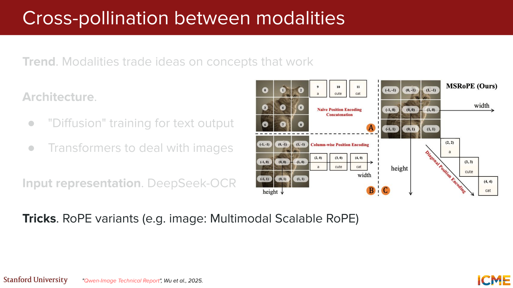
*Visual reference: architecture, input representation, aur positional tricks ke cross-modal reuse ko concrete examples ke saath summarize kiya gaya hai.*

Main message:
- research silos porous hain
- ek modality ki breakthrough dusri modality me transplant ho sakti hai

---

### 4.2 Back to the Basics: Foundational Research Khatam Nahi Hua

**Slides 105-108:** Lecture ne emphasize kiya ki foundational research abhi bhi open hai.

Microscopic design choices still vary:
- optimizer: `AdamW`, `MuonClip`, etc.
- normalization choices
- `MHA` / `MQA` / `GQA`
- activation functions
- `MoE` vs dense
- number of layers

Do aur bigger questions raise hue:

1. **Future fuel**
- high-quality data streams kahan se aayenge?

2. **Architecture question**
- kya transformer hi best architecture hai?

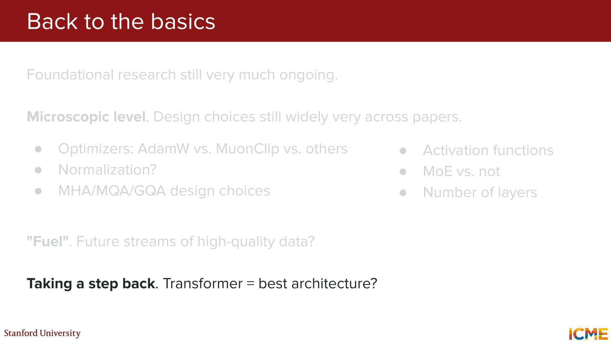
*Visual reference: micro-level design decisions, future data concerns, aur architecture-level uncertainty ko ek saath frame kiya gaya hai.*

Interpretation:
- field mature lag sakti hai
- but many "obvious" design choices actually still unsettled hain

---

### 4.3 Performance Se Pare: Quality/Cost Frontier

**Slides 109-110:** Lecture ne benchmark-era mindset par ek subtle shift point kiya.

Old emphasis:
- best absolute performance

Increasing emphasis:
- best `quality / cost` trade-off

Meaning:
- production systems me sirf smartest model enough nahi
- latency, price, energy, and deployability bhi central metrics ban gaye hain

Ye point lecture 8 ke Pareto-frontier mindset ko continue karta hai.

---

### 4.4 Hardware Optimization as a Frontier

**Slides 111-115:** Closing lecture ne software ke bahar hardware frontier ko bhi highlight kiya.

Observation:
- current GPUs matrix-vector aur matrix-matrix ops ke liye optimize hain

Problem:
- transformer attention ko frequent KV reads/writes chahiye
- memory movement cost dominate kar sakta hai

Idea from slides:
- attention operations ko hardware me more natively support karo
- dedicated cells me KV cache store karo
- analog signals se computations model karo

Result cited on slides:
- up to roughly `100x latency` savings
- up to roughly `70,000x energy` savings
- reference point: Nvidia `H100`

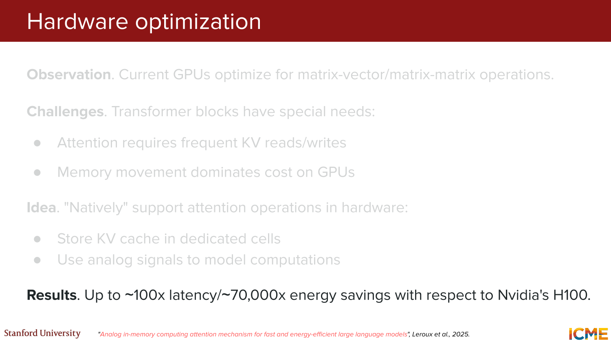
*Visual reference: attention-aware hardware design aur claimed latency/energy gains ko summarize kiya gaya hai.*

Main lesson:
- architecture progress sirf algorithms ka question nahi
- hardware-software co-design bhi next leap ka source ho sakta hai

---

### 4.5 LLMs Ne Daily Life Ko Already Change Kar Diya Hai

**Slide 116:** Lecture ne present-day impact ko simple list me summarize kiya.

Current strong application areas:
- coding
- text-to-query / structured query generation
- general conversational assistance
- creativity
- learning

Tone of slide important tha:
- future potential alag topic hai
- but real impact already today visible hai

---

### 4.6 Aage Ke Use Cases

**Slides 117-120:** Lecture ne time horizons ke saath future outlook diya.

#### Tomorrow

Slides example:
- Google Workspace Studio launch on **December 3, 2025**
- idea: existing work software me agents ki democratization

#### Near Term

Slides example:
- OpenAI `ChatGPT Atlas` launch on **October 21, 2025**
- browser-level assistant
- further-out thought: OS-level LLM

#### Long Term

Questions raised:
- truly autonomous agents with large responsibilities?
- impossible?
- maybe actually useful customer service?

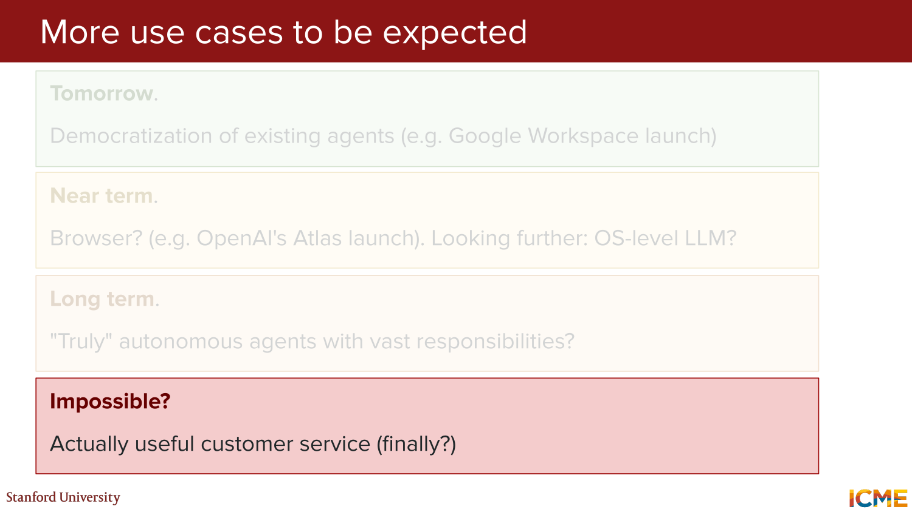
*Visual reference: tomorrow / near-term / long-term timeline ke through agentic use cases ka escalating outlook.*

Main point:
- lecture blind optimism nahi dikha raha tha
- but clear expectation tha ki deployment surface area expand hota rahega

---

### 4.7 Ongoing Challenges

**Slide 121:** Despite all progress, top-of-mind problems remain:
- fixed weights, i.e. no continuous learning
- hallucinations
- personalization
- interpretability
- safety

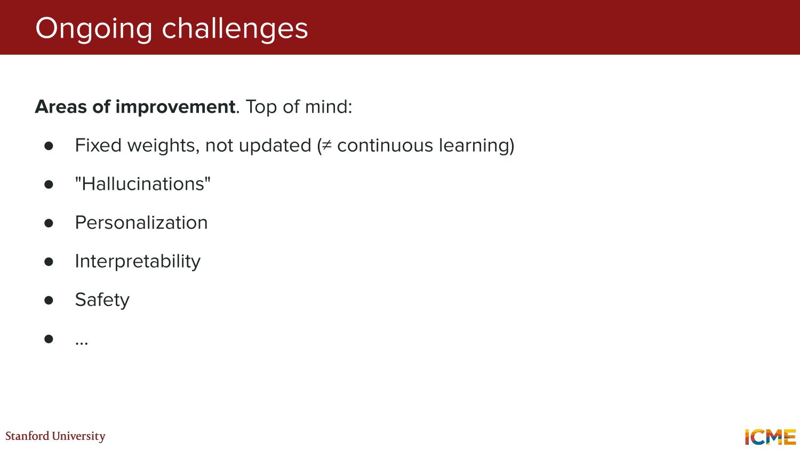
*Visual reference: LLM progress ke saath-saath unresolved practical and scientific challenges ki shortlist.*

Important interpretation:
- course end ka message triumphalist nahi tha
- powerful systems ke saath unresolved weaknesses bhi equally real hain

---

## PART 4: Staying Up To Date and After-Class Resources (Slides 122-128)

### 5.1 NLP Advances Ke Saath Updated Kaise Rahein?

**Slides 122-124:** Lecture ne concrete advice diya.

#### Papers

- `arXiv > Computer Science > Computation and Language`
- general ML venues: `NeurIPS`, `ICML`, `ICLR`
- NLP venues: `ACL`, `EMNLP`

#### Code

- authors ke GitHub repositories
- Hugging Face `trending papers`

#### Miscellaneous

- Twitter / X for researchers and industry leaders
- YouTube theoretical + practical channels
- company and academia technical blogs/papers:
  - Amazon Science
  - Anthropic
  - Apple ML
  - Google DeepMind
  - Meta AI
  - Microsoft AI
  - OpenAI
  - Stanford NLP

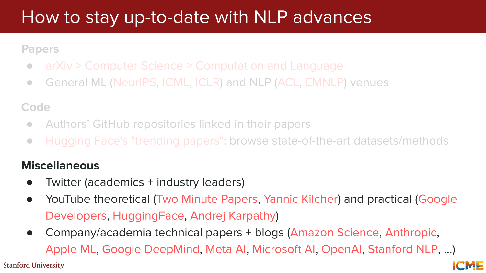
*Visual reference: papers, code, aur broader community channels ke through field ke saath current rehne ka checklist.*

---

### 5.2 After Class Useful Resources

**Slides 125-128:** Final slides practical resources aur warm closing par end hue.

Referenced resources:
- course `VIP Cheatsheet`
- GitHub repository:
  `https://github.com/afshinea/stanford-cme-295-transformers-large-language-models`
- multilingual cheatsheet availability
- `Super Study Guide` book:
  `https://superstudy.guide`

Final emotional tone:
- thank-you for the quarter
- stay in touch
- best wishes

---

## Final Big Picture

Lecture 9 ka main arc ye tha:

1. **Course recap**
- transformers se lekar evaluation tak poora intellectual arc summarize hua

2. **Beyond text**
- transformers ko vision aur multimodal settings me adapt karna ab standard direction ban chuka hai

3. **Diffusion LLMs**
- autoregressive decoding ke alternative ke roop me serious research frontier emerge ho raha hai

4. **Future frontiers**
- cross-modal idea sharing
- unresolved basic research questions
- hardware co-design
- broader deployment surfaces

5. **Reality check**
- applications strong hain
- but hallucination, safety, personalization, and continuous learning jaise issues abhi unsolved hain

One-line summary:
> **Lecture 9 ne course ko is note par close kiya: Transformers ne bahut kuch unlock kiya hai, lekin architecture, decoding, hardware, and safe deployment ke next chapters abhi likhe ja rahe hain.**
