# MIT 15.773 Hands-on Deep Learning: Detailed Hinglish Notes

These notes are based primarily on the MIT `15.773 / 15.S04` Spring 2024 lecture PDFs and the accompanying notebooks in this repo. Goal simple hai: slides ko sirf summarize nahi karna, balki unhe samajhne layak Hinglish study notes me convert karna.

Is README me:
- lecture-by-lecture detailed explanation hai
- slide visuals embedded hain
- examples aur analogies diye gaye hain
- short memory tricks included hain
- under-explained topics ko extra depth me cover kiya gaya hai
- recall questions end me diye gaye hain

---

## Table of Contents

- [How to Use These Notes](#how-to-use-these-notes)
- [Lecture 1: Introduction to Neural Networks and Deep Learning](#lecture-1-introduction-to-neural-networks-and-deep-learning)
- [Lecture 2: Training Deep Neural Networks](#lecture-2-training-deep-neural-networks)
- [Lecture 3A: Keras-TensorFlow and Structured Data Training](#lecture-3a-keras-tensorflow-and-structured-data-training)
- [Lecture 3B: Computer Vision Basics and Fashion MNIST](#lecture-3b-computer-vision-basics-and-fashion-mnist)
- [Lecture 4: CNNs and Transfer Learning](#lecture-4-cnns-and-transfer-learning)
- [Lecture 5: Text Vectorization and Bag-of-Words](#lecture-5-text-vectorization-and-bag-of-words)
- [Lecture 6: Embeddings](#lecture-6-embeddings)
- [Lecture 7: Transformers I](#lecture-7-transformers-i)
- [Lecture 8: Transformers II and Hugging Face Pipelines](#lecture-8-transformers-ii-and-hugging-face-pipelines)
- [Lecture 9: Large Language Models I](#lecture-9-large-language-models-i)
- [Lecture 10: Large Language Models II and RAG](#lecture-10-large-language-models-ii-and-rag)
- [Lecture 10.5: Fine-Tuning and LoRA](#lecture-105-fine-tuning-and-lora)
- [Lecture 11: Diffusion Models for Image Generation](#lecture-11-diffusion-models-for-image-generation)
- [Course-Wide Quick Revision](#course-wide-quick-revision)
- [Formula Sheet](#formula-sheet)
- [Lecture-Wise External Links](#lecture-wise-external-links)

---

## How to Use These Notes

- Pehli reading me `Big Picture`, `Core Concepts`, aur `Memory Tricks` padho.
- Dusri reading me images dekhte hue concept ko lecture slides se map karo.
- Teesri reading me `Common Mistakes` aur `Recall Questions` attempt karo.
- Agar exam-style revision chahiye, last ke `Quick Revision` aur `Formula Sheet` par jao.

Short mental model:

`Lecture 1 -> neural networks kya hain`

`Lecture 2 -> unhe train kaise karte hain`

`Lecture 3A -> Keras/TF me tabular problem solve kaise hota hai`

`Lecture 3B -> wahi ideas images par kaise lagte hain`

`Lecture 4 -> dense image model se CNN aur transfer learning`

`Lecture 5 -> text vectorization aur bag-of-words`

`Lecture 6 -> embeddings se semantic meaning capture karna`

`Lecture 7 -> transformer encoder se context aur order ko handle karna`

`Lecture 8 -> full transformer block aur Hugging Face pipelines`

`Lecture 9 -> causal masking se autoregressive LLM banana`

`Lecture 10 -> instruction tuning aur RAG se useful LLM banana`

`Lecture 10.5 -> LoRA se cheap fine-tuning`

`Lecture 11 -> diffusion se image generation`

---

## Lecture 1: Introduction to Neural Networks and Deep Learning

### Lecture Snapshot

Lecture 1 ka core kaam hai poora mental frame set karna:

- AI, ML, Deep Learning, aur Generative AI ka relation
- structured vs unstructured data ka difference
- neural network ko logistic regression ke extension ki tarah dekhna
- hidden layers ka intuition
- activation functions ka role
- simple forward pass ka worked example

### 1.1 Big Picture: AI se GenAI tak

MIT lecture ka early portion ek important hierarchy set karta hai:

- `Artificial Intelligence`: broad goal, machines ko intelligent tasks karwana
- `Machine Learning`: explicit rules likhne ke bajay examples se pattern seekhna
- `Deep Learning`: raw complex data se representation automatically seekhna
- `Generative AI`: unstructured output generate karna, jaise text, image, music

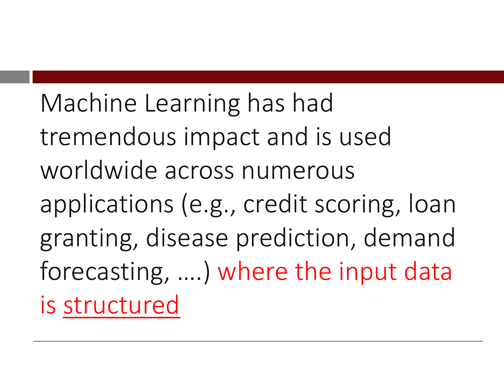
*Visual: traditional rule-based AI se learning-based systems ki shift.*

Traditional AI me idea tha: expert se pucho wo kaise decision leta hai, phir IF-THEN rules likho. Problem ye hai ki real duniya me edge cases bahut hote hain. Human kai kaam kar leta hai, but exact rules likhna mushkil hota hai. Isko lecture me Polanyi-style intuition se explain kiya gaya: `we know more than we can tell`.

### 1.2 Machine Learning ne kya badla

Machine Learning ne bola:

- rules mat likho
- input-output examples do
- statistical model ko relationship seekhne do

Example:

- input: applicant GPA + experience
- output: interview call ya no call

Ya:

- input: borrower data
- output: repay karega ya nahi

Structured data problems me traditional ML kaafi strong raha hai:

- credit scoring
- loan approval
- disease prediction
- demand forecasting

### 1.3 Structured vs Unstructured Data

Lecture ka ek bahut important distinction:

- `Structured data`: spreadsheet jaise columns-rows me represent ho sake
- `Unstructured data`: raw images, audio, video, text

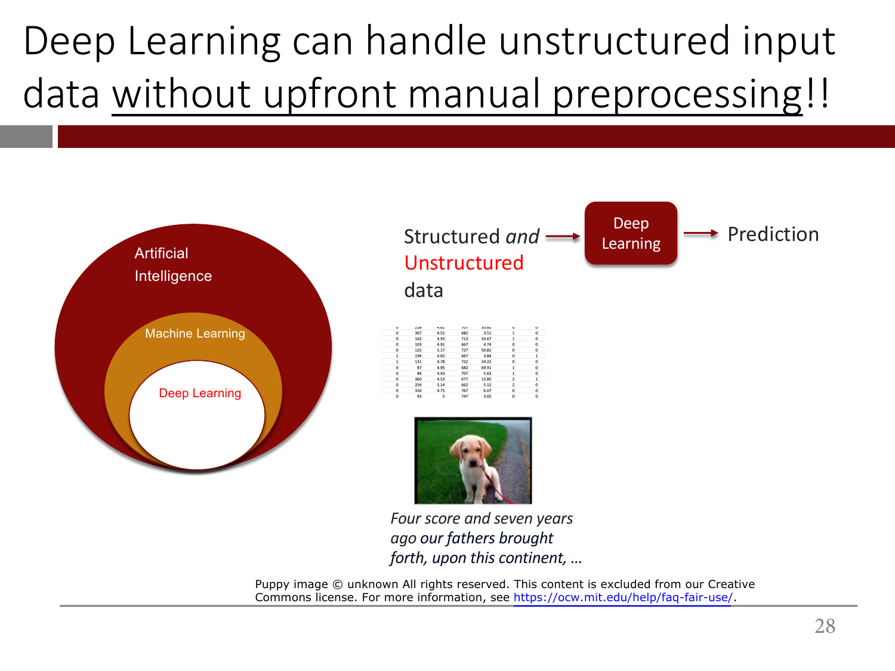
*Visual: Deep Learning ka promise ye tha ki raw data se useful representation khud seekh sakta hai.*

Structured data me har feature already meaningful hota hai:

- age
- salary
- cholesterol
- years of experience

Unstructured data me raw form directly meaningful nahi hota:

- image = pixel intensities
- audio = waveform values
- text = symbols/tokens

Yahan old ML ka problem tha `human bottleneck`.

### 1.4 Human Bottleneck kya tha

Deep Learning se pehle, raw unstructured data ko ML me use karne ke liye manually feature engineering karni padti thi.

Example:

- bird image se manually edges, corners, texture features nikaalo
- audio se MFCC ya hand-crafted signal features nikaalo
- text se bag-of-words ya engineered features banao

Iska matlab:

- bahut human effort
- domain expertise ki dependency
- scale karna mushkil

Deep Learning ki badi victory ye thi ki representation learning automated ho gayi.

### 1.5 Deep Learning ki real breakthrough

Lecture ne teen enabling forces highlight kiye:

- new algorithmic ideas
- huge data availability
- compute power, especially GPUs

Deep Learning koi bilkul naya biological magic nahi tha. Core idea purana neural network hi tha, but ab:

- zyada data available tha
- zyada layers train karna possible hua
- GPU matrix multiplications ko fast bana raha tha

### 1.6 Generative AI ne kya add kiya

Deep Learning pehle mostly `input -> structured output` me strong tha. Generative AI ne `input -> unstructured output` ko mainstream bana diya.

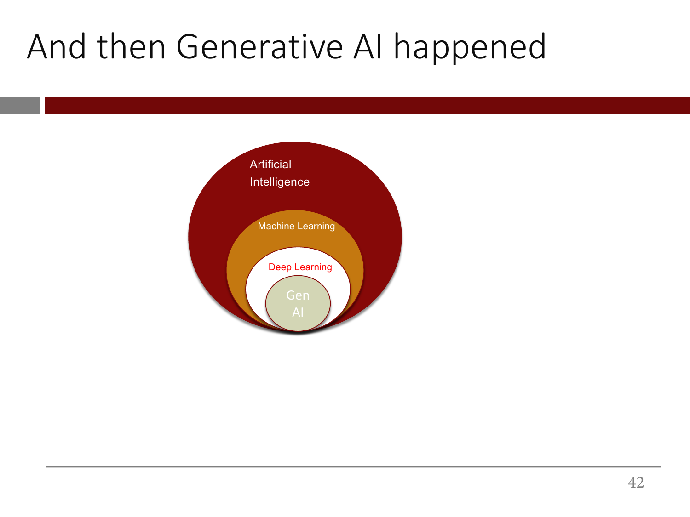
*Visual: GenAI unstructured output generate kar sakta hai, jaise text prompt se image.*

Lecture ka powerful reframing tha:

`X -> Deep Learning / GenAI -> Y`

Yahan X aur Y almost kuch bhi ho sakte hain.

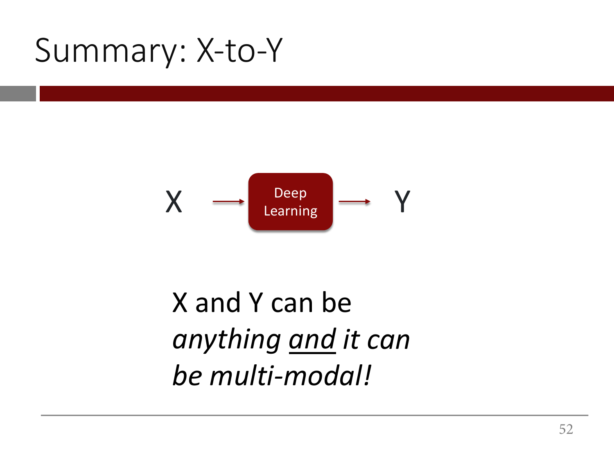
*Visual: Deep learning ko general X-to-Y mapping machine ki tarah dekhna useful hai.*

Examples:

- text -> text
- image -> text
- text -> image
- image -> class label
- sensor stream -> anomaly score

Memory trick:

`AI wanted intelligence`

`ML learned from examples`

`DL learned representations`

`GenAI learned to generate`

### 1.7 Logistic Regression ko network ki tarah dekhna

Ab lecture ek smart pedagogical move karta hai: neural network ko zero se invent nahi karta, balki logistic regression ko network view me rewrite karta hai.

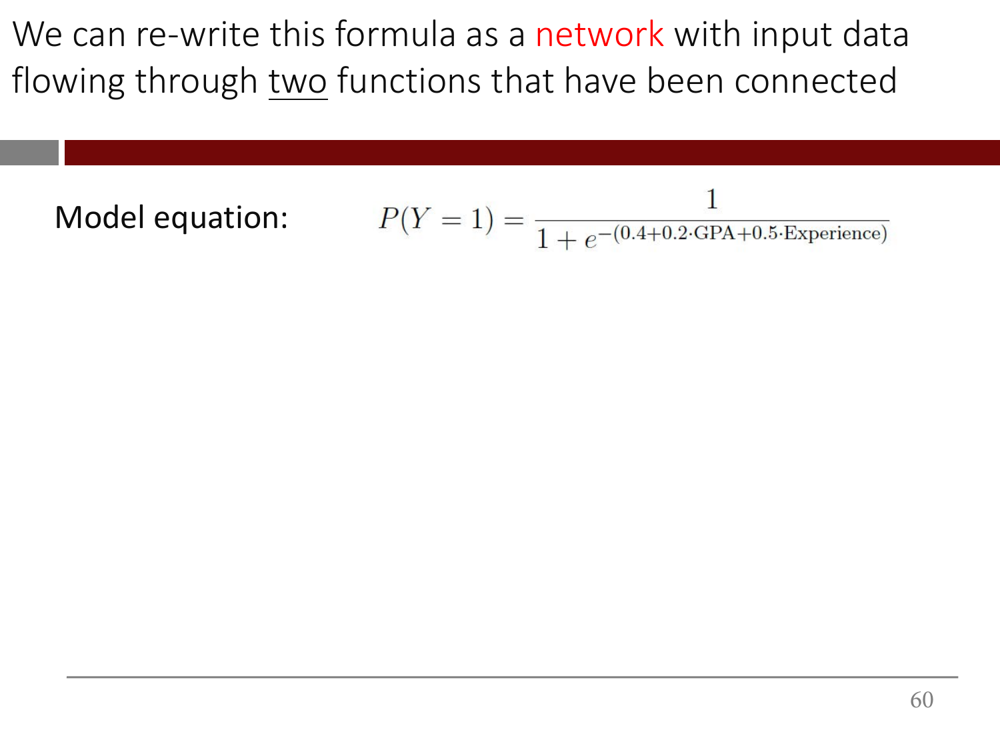
*Visual: logistic regression me inputs linear combination aur sigmoid se probability banati hai.*

Socho model:

`z = b + w1*x1 + w2*x2 + ... + wk*xk`

`y_hat = sigmoid(z)`

Network view me:

- inputs left se aate hain
- har input ka weight se multiplication hota hai
- sab sum hote hain
- output sigmoid se probability ban jaati hai

Key insight:

`Logistic regression bhi ek neural network hi hai, bas hidden layer ke bina.`

Ye line bahut important hai. Neural network ko alien cheez mat samjho. It's logistic regression plus extra transformation layers.

### 1.8 Neural network actually kya karta hai

Lecture ka central conceptual jump:

Instead of raw input ko directly logistic regression me dene ke, hum input ko repeatedly transform karte hain.

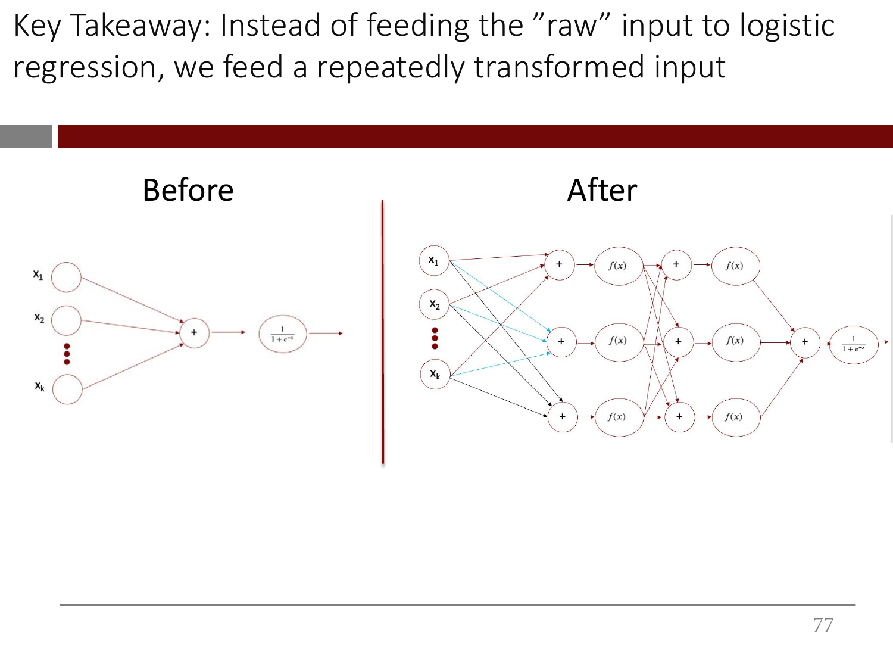
*Visual: raw input se transformed representation aur phir final prediction.*

Yaani:

- pehle features ko transform karo
- phir transformed features se prediction banao

Ye transformed internal values hi `smart representations` hain.

Example intuition:

Suppose job interview prediction me raw inputs:

- GPA
- years of experience

Hidden neurons shayad internally ye jaisi quantities learn kar saken:

- academic strength
- professional maturity
- balanced profile

Human ne manually define nahi kiya. Network ne training ke dauraan khud discover kiya.

### 1.9 Terminology: neuron, layer, dense, input, output

Lecture ne basic vocabulary set ki:

- `Neuron`: ek small computation unit
- `Layer`: neurons ka vertical stack
- `Input layer`: jahan raw features enter karte hain
- `Hidden layer`: internal transformed representation
- `Output layer`: final answer produce karta hai
- `Dense / fully connected`: jab ek layer ka har neuron next layer ke har neuron se connected ho

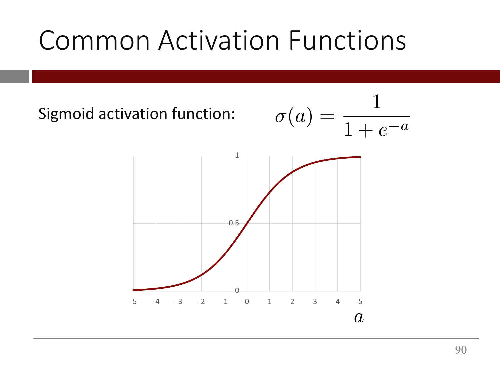
*Visual: input, hidden, output layer aur activation functions ki placement.*

### 1.10 Activation Functions ka role

Lecture ne teen common activations introduce ki:

- `Linear`
- `Sigmoid`
- `ReLU`

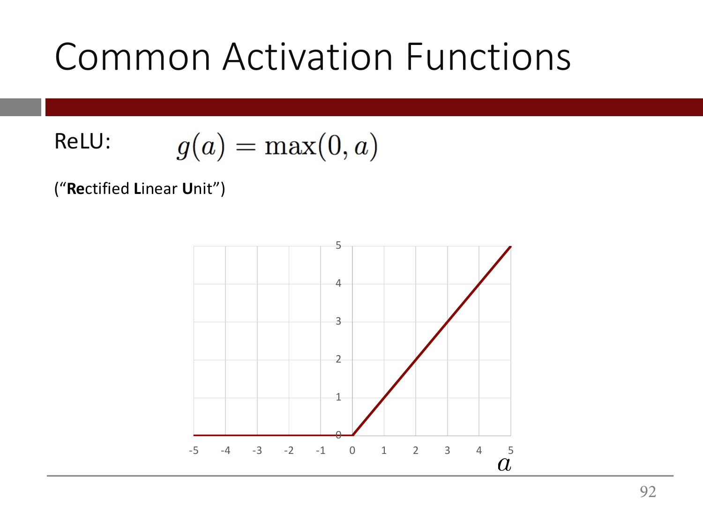
*Visual: linear, ReLU, aur sigmoid activations ka shorthand.*

#### Linear

`f(x) = x`

Kaam: output ko unchanged pass karna.

Use cases:

- regression output
- kabhi-kabhi internal mathematical simplicity

#### Sigmoid

`sigmoid(x) = 1 / (1 + e^-x)`

Range:

- 0 se 1 ke beech

Best when:

- binary classification output chahiye

Intuition:

- bada positive input -> probability near 1
- bada negative input -> probability near 0

#### ReLU

`ReLU(x) = max(0, x)`

Range:

- negative values -> 0
- positive values -> same

Best when:

- hidden layers me fast, simple, widely effective default

Memory trick:

- `ReLU hidden ke liye`
- `Sigmoid binary output ke liye`
- `Softmax multi-class output ke liye`

### 1.11 Deep Dive: Why nonlinearity zaroori hai

Ye lecture ka under-explained but foundational topic hai.

Question:

Agar hum multiple hidden layers laga dein but sab linear हों, to kya network powerful ho jayega?

Answer:

`Nahi.`

Reason:

Do linear transformations ko compose karo:

`h = W1*x + b1`

`o = W2*h + b2`

Substitute:

`o = W2*(W1*x + b1) + b2`

`o = (W2*W1)*x + (W2*b1 + b2)`

Matlab final result fir se ek hi linear transformation hai.

So:

- many linear layers != true depth benefit
- actual expressive power tab aata hai jab बीच me nonlinear activation ho

Isi liye ReLU, sigmoid etc critical hain.

### 1.12 Worked Example: Interview Classifier Network

Lecture ne ek simple network diya:

- 2 inputs
- 1 hidden layer
- 3 ReLU neurons
- 1 sigmoid output

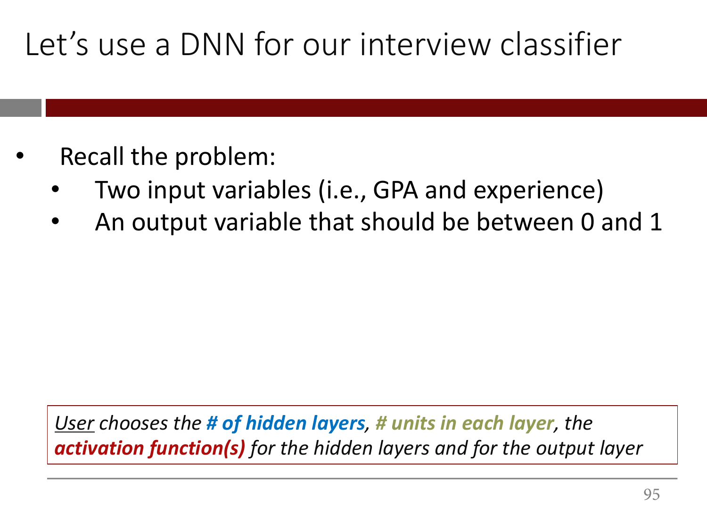
*Visual: two-input problem ke liye one hidden layer with 3 ReLU neurons aur sigmoid output.*

Suppose hidden layer formulas:

- `a1 = ReLU(b1 + w11*x1 + w12*x2)`
- `a2 = ReLU(b2 + w21*x1 + w22*x2)`
- `a3 = ReLU(b3 + w31*x1 + w32*x2)`

Then output:

- `y_hat = sigmoid(c + v1*a1 + v2*a2 + v3*a3)`

Lecture example me kuch actual weights diye gaye the aur forward pass compute kiya gaya.

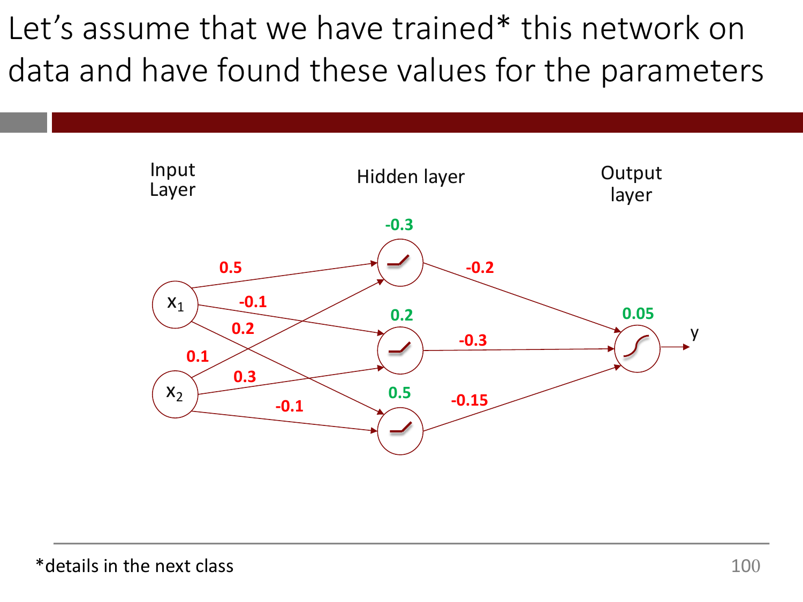
*Visual: hidden neurons ka output actual numbers ke saath compute kiya ja raha hai.*

Sample values:

- `x1 = 2.3`
- `x2 = 10.2`

Lecture ke according hidden outputs aaye:

- `a1 = 1.87`
- `a2 = 3.03`
- `a3 = 0`

Notice third ReLU zero ho gaya. Ye important hai: ReLU kuch neurons ko effectively inactive kar sakta hai.

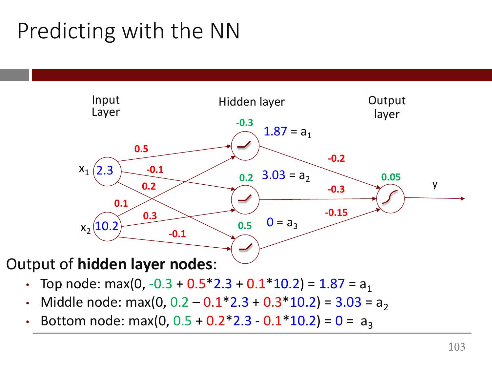
*Visual: hidden outputs ke baad final sigmoid probability compute hoti hai.*

Final output around:

- `y_hat = 0.226`

Interpretation:

- network bol raha hai roughly 22.6% probability

### 1.13 Lecture 1 ke सबसे important takeaways

1. Neural network ko logistic regression ke bigger cousin ki tarah socho.
2. Hidden layers ka goal raw input se smarter representation banana hai.
3. Activation functions nonlinearity laate hain, jo depth ko meaningful banati hai.
4. Deep Learning structured aur unstructured dono data par kaam kar sakta hai.
5. Generative AI Deep Learning ka extension hai, alag planet ki cheez nahi.

### 1.14 Common Mistakes

- `AI, ML, DL, GenAI` ko interchangeable samajhna.
- Sochna ki neural network magic hai, jabki base idea weighted function composition hai.
- Sochna ki zyada layers automatically better hain.
- Bhool jana ki nonlinearity ke bina deep network collapse ho kar linear model ban sakta hai.
- Sigmoid ko hidden layers ka universal default samajhna. Modern practice me ReLU family zyada common hai.

### 1.15 Memory Tricks

- `Rules -> Learn -> Represent -> Generate`
- `Logistic regression + hidden layers = neural network mindset`
- `Forward pass = data goes left to right`
- `ReLU cuts negatives, sigmoid squashes to probability`

### 1.16 Recall Questions

1. Traditional AI aur ML me main philosophical difference kya hai?
2. Structured data aur unstructured data me practical difference kya hai?
3. Human bottleneck ka meaning kya tha?
4. Logistic regression ko network ki tarah kaise dekh sakte ho?
5. Hidden layer ka core purpose kya hai?
6. Activation function kyu chahiye?
7. ReLU aur sigmoid ka best use case kya hai?
8. Agar saari layers linear hon to problem kya hai?

### Short Answer Key

1. Traditional AI me rules manually likhe jaate the; ML me model examples se pattern seekhta hai.
2. Structured data predefined columns/features hota hai; unstructured data raw image, audio, ya text hota hai jise representation learning chahiye.
3. Human bottleneck ka matlab tha ki raw unstructured data ke liye features manually engineer karne padte the.
4. Logistic regression ko ek single neuron ki tarah dekh sakte ho: weighted sum plus sigmoid output.
5. Hidden layer ka kaam intermediate useful features ya representations learn karna hai.
6. Activation function nonlinearity laati hai; bina iske deep network expressive nahi banta.
7. ReLU usually hidden layers me strong default hai; sigmoid binary classification output ke liye useful hai.
8. Saari linear layers compose hoke ek hi linear transformation ban jaati hain, to depth ka real benefit khatam ho jata hai.

---

## Lecture 2: Training Deep Neural Networks

### Lecture Snapshot

Lecture 2 answer karta hai:

- network design ko Keras code me kaise translate karein
- training exactly kaunsi cheez optimize karti hai
- loss function kya hota hai
- binary cross-entropy kyu use hota hai
- gradient descent ka intuition kya hai
- backpropagation ka role kya hai
- SGD aur Adam ka practical meaning kya hai

### 2.1 Heart Disease Prediction Problem

Lecture ka running example hai Cleveland Clinic heart disease dataset.

Goal:

- patient features dekh kar predict karna ki heart disease diagnosed hai ya nahi

Output binary hai:

- 1 = disease
- 0 = no disease

Slide ke according original 13 variables the, but categorical variables ko one-hot encode karne ke baad total `29 inputs` bane.

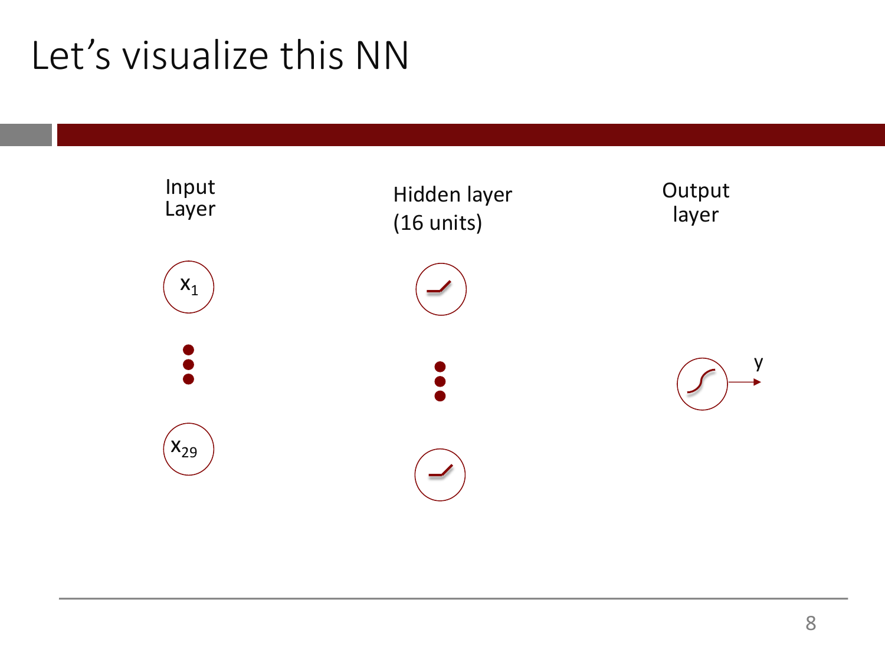
*Visual: 29-input structured data problem ke liye hidden layer aur output layer setup.*

Chosen architecture:

- input dimension = 29
- hidden layer = 16 ReLU neurons
- output layer = 1 sigmoid neuron

### 2.2 Parameter Count kaise nikalte hain

Lecture ne network parameter count explicitly karaya.

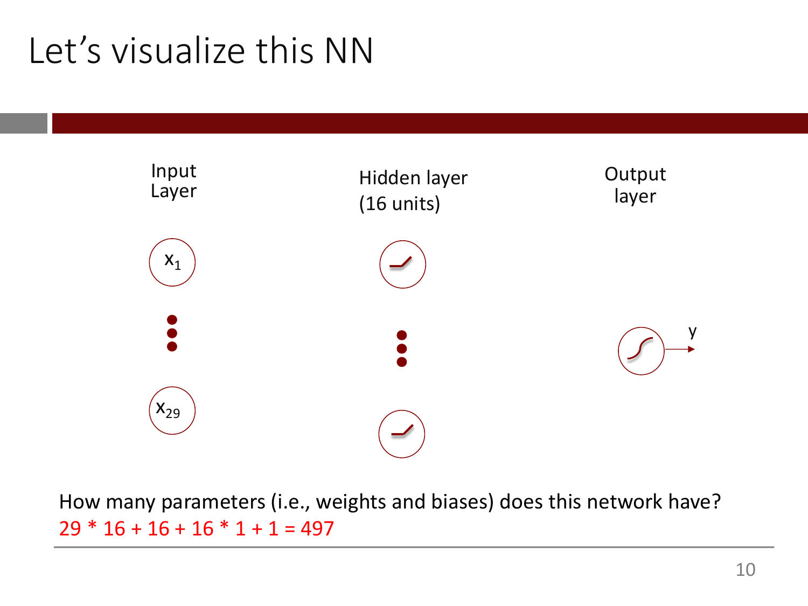
*Visual: 29 x 16 hidden layer aur final output layer ka parameter count.*

Formula:

- input-to-hidden weights = `29 * 16`
- hidden biases = `16`
- hidden-to-output weights = `16 * 1`
- output bias = `1`

Total:

`29*16 + 16 + 16*1 + 1 = 497`

Memory trick:

`weights between layers + biases of receiving layer`

Yaani har layer ke parameters count karte waqt:

- previous units * current units
- plus current layer biases

### 2.3 Keras Translation

Lecture ka acha point ye hai ki mathematical network aur code network same cheez hain.

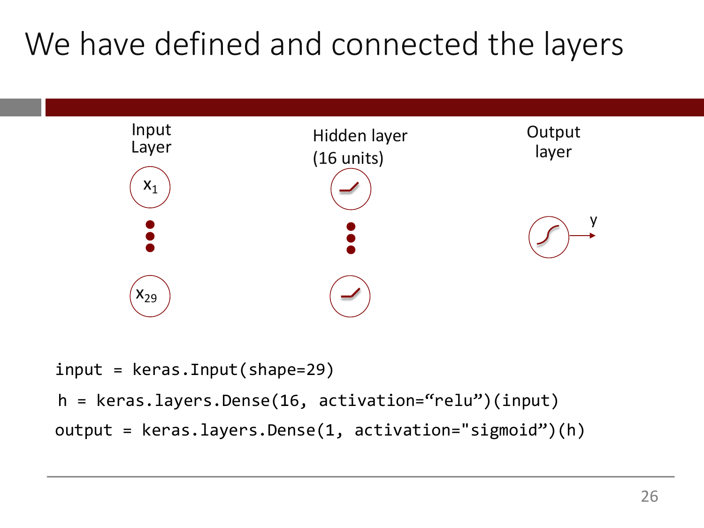
*Visual: functional Keras API me input, hidden, output, aur model assembly.*

Core code structure:

```python
input = keras.Input(shape=29)
h = keras.layers.Dense(16, activation="relu")(input)
output = keras.layers.Dense(1, activation="sigmoid")(h)
model = keras.Model(input, output)
```

Important observations:

- `Input(shape=29)` means 29 features expected
- `Dense(16, activation="relu")` hidden layer define karta hai
- `Dense(1, activation="sigmoid")` binary probability output deta hai
- `keras.Model(input, output)` graph ko final model banata hai

Functional API ko graph thinking ke saath samjho:

- nodes = tensors
- layers = transformations
- arrows = data flow

### 2.4 Training actually karta kya hai

Lecture ne important reminder diya:

Training ka matlab architecture banana nahi hai. Training ka matlab hai:

`weights aur biases ke best values dhoondhna`

Jo prediction ko actual target ke closest le aayein.

Data fixed hota hai:

- `x`
- `y`

Trainable cheez hoti hai:

- weights
- biases

### 2.5 Loss Function kya hota hai

Loss function prediction ki error quantify karta hai.

Good model:

- low loss

Perfect model:

- zero loss

Loss selection output type par depend karta hai.

Examples:

- regression -> MSE common
- binary classification -> binary cross-entropy
- multi-class classification -> categorical family

### 2.6 MSE intuition

Regression ke liye lecture ne `Mean Squared Error (MSE)` mention kiya:

`MSE = average of (actual - predicted)^2`

Why square?

- negative aur positive errors cancel na hon
- large mistakes ko zyada punish kare

### 2.7 Binary Cross-Entropy: binary classification ke liye kyu

Heart disease model probability predict karta hai, isliye ordinary MSE se better choice hoti hai binary cross-entropy.

Lecture ne do cases se intuition build ki:

#### Case 1: true label `y = 1`

Agar patient ko disease hai, to low predicted probability ko heavily punish karna chahiye.

Loss:

`-log(p)`

jahan `p = predicted probability`

If:

- `p = 1` -> loss `0`
- `p = 0.5` -> moderate loss
- `p = 0.001` -> huge loss

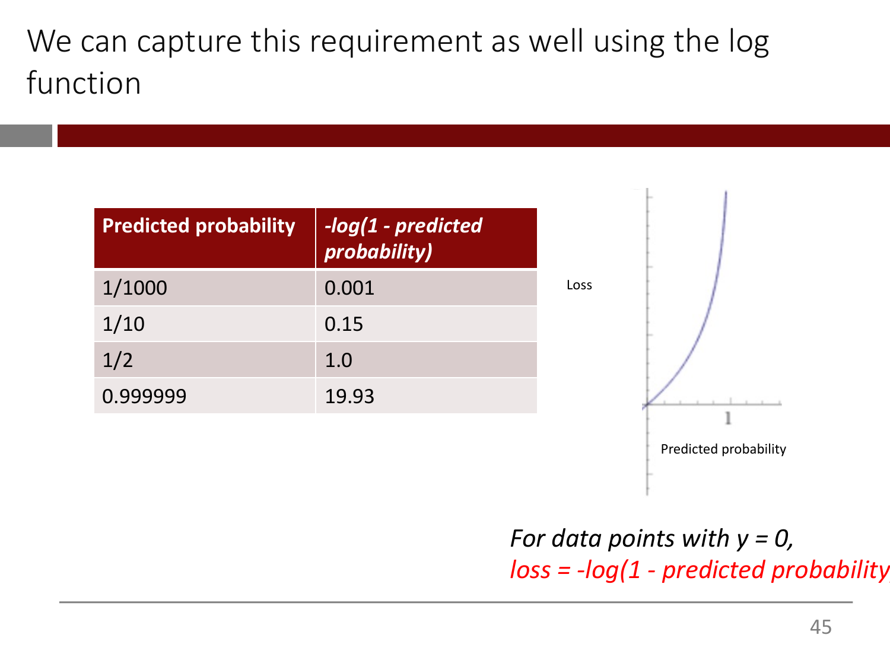
*Visual: wrong-side probability par loss तेज़ी se badhta hai.*

#### Case 2: true label `y = 0`

Agar patient ko disease nahi hai, to high predicted probability ko punish karna chahiye.

Loss:

`-log(1 - p)`

#### Combined binary cross-entropy

Lecture ne dono ko combine karke formula diya:

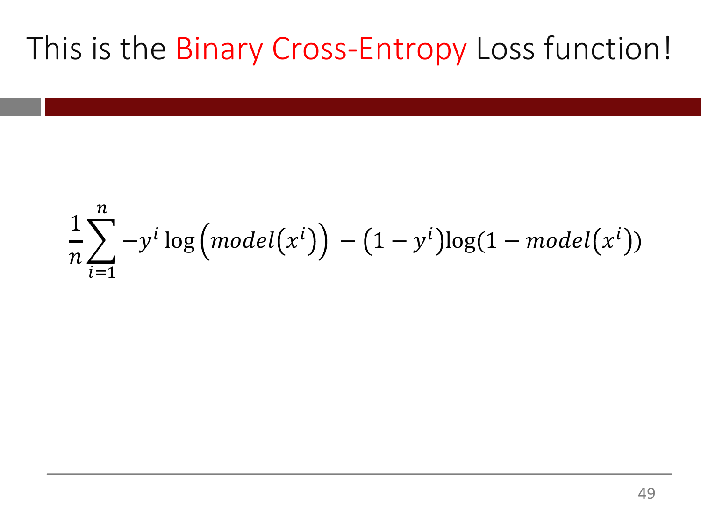
*Visual: final averaged BCE loss formula.*

`BCE = (1/n) * Σ [ -y_i log(p_i) - (1 - y_i) log(1 - p_i) ]`

### 2.8 Deep Dive: BCE itna useful kyu hai

Binary cross-entropy ka secret ye hai ki:

- correct and confident -> very low loss
- wrong and confident -> very high loss

Example:

True label = `1`

- predict `0.95` -> achha
- predict `0.60` -> okay but uncertain
- predict `0.01` -> dangerous, huge loss

Business intuition:

Agar doctor-facing system confidently galat probability de raha hai, to usse strong penalty milni chahiye. BCE exactly yehi karta hai.

Memory trick:

`Confident wrong = cross-entropy angry`

### 2.9 Gradient Descent ka intuition

Loss function mil gaya. Ab minimize kaise karein?

Lecture ne single-variable function se intuition build kiya.

Idea:

- derivative batata hai slope
- slope positive ho to right jane se loss badega
- slope negative ho to right jane se loss ghatega

So update rule:

- positive slope -> w thoda kam karo
- negative slope -> w thoda badhao

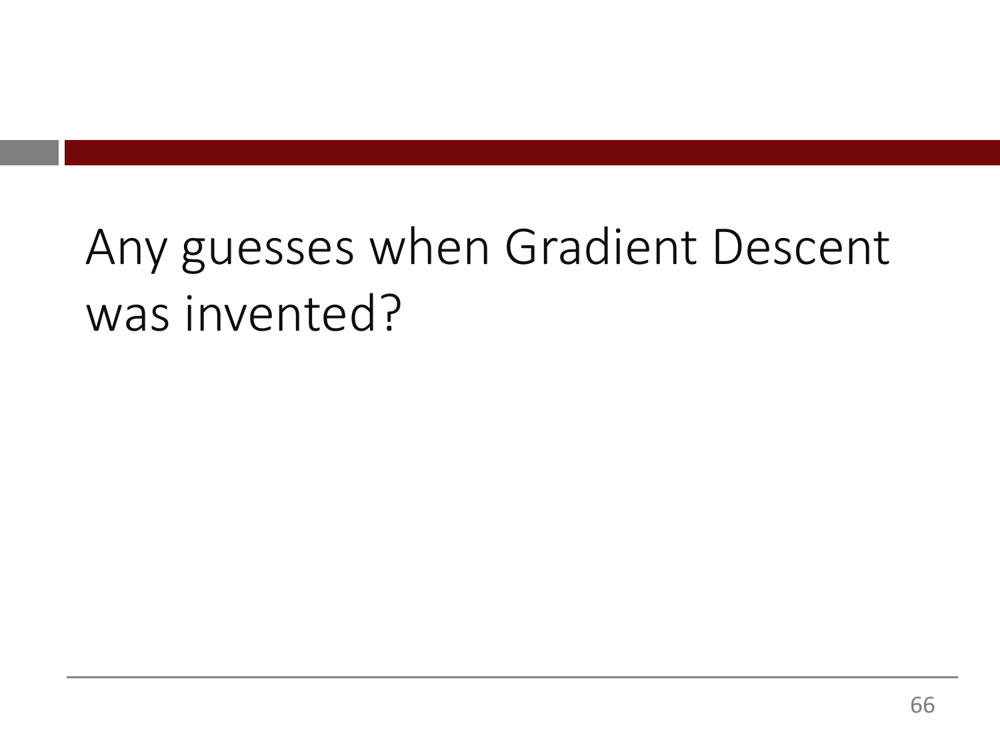
*Visual: derivative sign ke basis par parameter update.*

Compact form:

`w <- w - alpha * dg(w)/dw`

jahan:

- `alpha` = learning rate

### 2.10 Learning Rate kya karta hai

Learning rate decide karta hai step size.

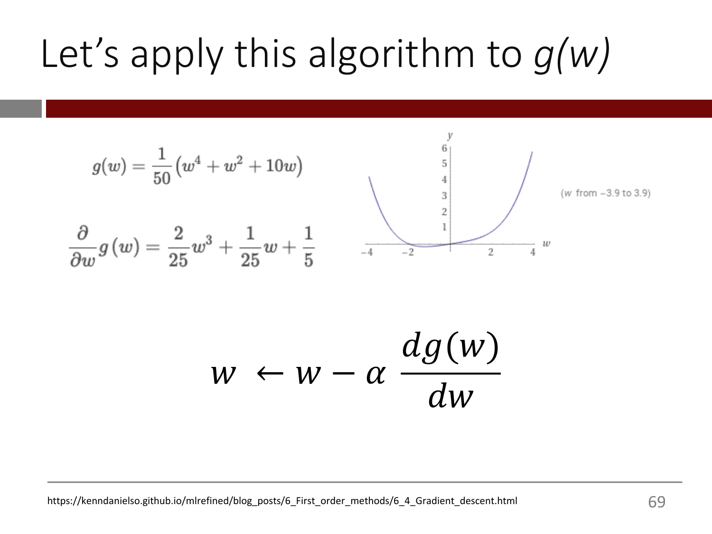
*Visual: alpha learning rate hota hai, jo parameter update ki speed control karta hai.*

Agar `alpha`:

- bahut chhota hai -> learning slow
- bahut bada hai -> update unstable, overshoot ho sakta hai

Example intuition:

Mountain se niche उतरना hai:

- tiny steps -> safe but slow
- giant jumps -> gir sakte ho, minimum cross kar doge

### 2.11 Multi-variable function aur gradient

Neural networks me ek parameter nahi hota. Hundreds, thousands, ya millions hote hain.

Isliye derivative ki jagah gradient use hota hai:

`∇g(w)`

Ye vector hota hai:

- har coordinate batata hai us parameter ko increase karne par loss ka local effect

Update:

`w <- w - alpha * ∇g(w)`

Lecture ne 2D example se samjhaya.

### 2.12 Local minima ke baare me practical note

Lecture ne note diya:

GD kabhi-kabhi local minimum ya saddle point ke paas ruk sakta hai, but practice me deep learning phir bhi kaafi achha kaam karta hai.

Important practical reason:

- huge parameter space
- SGD noise
- modern initialization
- Adam jaise optimizers

Ye sab optimization ko workable bana dete hain.

### 2.13 Loss function of neural net me variables kaun hote hain

Heart disease network ka BCE loss dekhte hue lecture ne very important clarification di:

- `x` aur `y` data hain
- optimization variables weights and biases hain

Example:

`w1, w2, ..., w497`

Gradient descent inhi parameters par chalta hai.

### 2.14 Backpropagation kya karta hai

Backprop ka short answer:

`It efficiently computes the gradient of the loss with respect to all trainable parameters.`

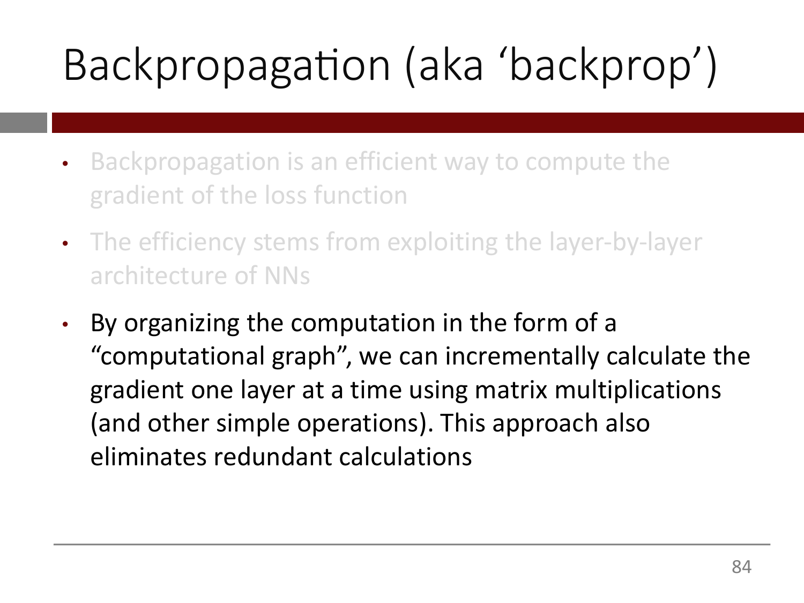
*Visual: backprop computational graph ke through layer by layer gradient nikalta hai.*

Direct brute force way imagine karo:

- har weight ke respect me full derivative manually nikalo
- repeated expressions baar-baar compute honge

Ye inefficient hai.

Backprop smartly:

- forward pass values save karta hai
- computational graph use karta hai
- chain rule apply karta hai
- repeated work reuse karta hai

Memory trick:

`Forward pass predicts`

`Backward pass assigns blame`

### 2.15 Deep Dive: Backprop ko chain rule se samjho

Lecture ka separate backprop PDF thoda symbolic aur computational-graph focused hai. Yahan usse clearer form me likhte hain.

Suppose simple model:

`a1 = w1*x1`

`a2 = w2*x2`

`y_hat = b + a1 + a2`

`Loss = (y_hat - y)^2`

Backprop me hum puchte hain:

- agar `w1` thoda change karun to loss kitna badlega?
- agar `b` thoda change karun to loss kitna badlega?

Computational graph ki wajah se hum local derivatives ko multiply kar sakte hain.

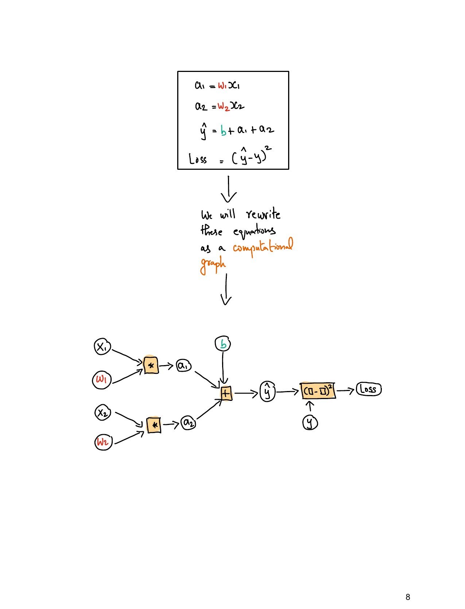
*Visual: small network ko computational graph me tod kar derivative flow dikhaya gaya hai.*

For `w1`:

`dLoss/dw1 = dLoss/dy_hat * dy_hat/da1 * da1/dw1`

Yaani:

1. output error ka impact nikaalo
2. wo hidden intermediate tak kaise pahunchta hai dekho
3. phir us intermediate ka weight par dependence lo

Simple substitutions:

- `dLoss/dy_hat = 2*(y_hat - y)`
- `dy_hat/da1 = 1`
- `da1/dw1 = x1`

So:

`dLoss/dw1 = 2*(y_hat - y)*x1`

Isi logic ko large network me repeat karte hain, bas:

- more nodes
- matrix multiplications
- layer-wise reuse

### 2.16 Backprop with hidden layers

Ab actual neural network me:

- pehle output layer ka gradient nikalta hai
- phir hidden layer tak error propagate hota hai
- phir har hidden neuron ke incoming weights update direction milti hai

Important ReLU note:

- if hidden pre-activation negative tha aur ReLU output zero ban gaya
- to us route ka local derivative often zero ho sakta hai
- means kuch weights ko us step me signal nahi milega

Isi liye forward values store karna zaroori hai.

### 2.17 Backprop + GPUs kyu powerful combo hai

Lecture ne emphasize kiya:

- backprop computation matrix operations me express ho sakta hai
- GPUs matrix multiplications me extremely fast hote hain

Result:

- complex deep nets practically trainable ho gaye

Iske bina modern deep learning scale difficult hota.

### 2.18 SGD: full data ke bajay minibatches

Full gradient descent expensive ho sakta hai, especially jab dataset huge ho.

Solution:

- har iteration me poora dataset use mat karo
- random minibatch lo
- us minibatch se approximate gradient nikaalo

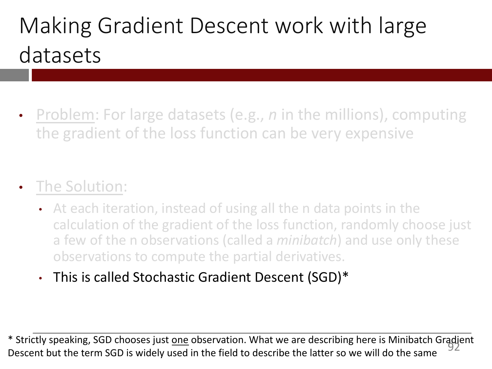
*Visual: large dataset ke liye minibatches use karna practical solution hai.*

Strictly speaking:

- pure SGD = one sample
- practice me log minibatch gradient descent ko bhi SGD bol dete hain

### 2.19 Adam optimizer

Lecture ne bola SGD ke bahut flavors hote hain, aur default practical choice `Adam` hoti hai.

Adam ko beginner-friendly way me aise samjho:

- learning rate ko intelligently adapt karta hai
- past gradient information ka use karta hai
- raw vanilla GD se usually zyada stable hota hai

Tumhe abhi Adam ka exact math yaad karna जरूरी nahi, but practical rule yaad rakho:

`Adam is a strong default optimizer.`

### 2.20 Overall training flow

Lecture ka full checklist basically ye hai:

1. network architecture choose karo
2. output layer match karo target type se
3. loss function match karo output type se
4. optimizer choose karo
5. regularization strategy socho
6. training run karo

### 2.21 Common Mistakes

- Sochna ki training architecture choose karna hota hai. Nahi, training weights seekhna hota hai.
- Binary output ke saath softmax ya wrong loss choose kar lena.
- BCE formula ko yaad rakhna but intuition na samajhna.
- Gradient aur parameter ko confuse karna.
- Sochna backprop aur gradient descent same cheez hain.

Clarification:

- `Backprop` gradient efficiently compute karta hai
- `Gradient descent / Adam` gradient use karke parameters update karta hai

### 2.22 Memory Tricks

- `Loss tells how bad`
- `Gradient tells which way`
- `Learning rate tells how far`
- `Backprop = backward blame assignment`
- `SGD = full class nahi, chhota batch`

### 2.23 Recall Questions

1. Heart disease model me 29 inputs kaise bane?
2. 497 parameters ka count kaise aaya?
3. Binary classification ke liye sigmoid output kyu?
4. BCE wrong confident predictions ko zyada punish kyu karta hai?
5. Gradient descent ka update rule kya hai?
6. Learning rate bahut bada ho to kya issue ho sakta hai?
7. Gradient aur derivative me kya relation hai?
8. Backprop aur gradient descent me difference kya hai?
9. Minibatch SGD full GD se practical kyun hai?
10. Adam ko strong default kyun maana jata hai?

### Short Answer Key

1. Original 13 variables me categorical columns ko one-hot encode karne ke baad total 29 input features bane.
2. `29*16 + 16 + 16*1 + 1 = 497`, yani inter-layer weights plus receiving-layer biases.
3. Sigmoid output ko `0` aur `1` ke beech probability me map karta hai, jo yes/no target ke liye natural hai.
4. BCE confident galat predictions par bahut bada penalty deta hai, isliye wrong certainty ko strongly punish karta hai.
5. Update rule hai `w <- w - alpha * grad`.
6. Learning rate bahut bada ho to optimization overshoot, oscillate, ya diverge kar sakti hai.
7. Derivative ek variable ke respect me slope batata hai; gradient sab partial derivatives ka vector hota hai.
8. Backprop gradients efficiently compute karta hai; gradient descent ya Adam un gradients se weights update karte hain.
9. Minibatch SGD compute aur memory me cheaper hota hai, aur large datasets par frequent practical updates deta hai.
10. Adam adaptive learning rates aur past-gradient information use karta hai, isliye usually stable aur strong default hota hai.

---

## Lecture 3A: Keras-TensorFlow and Structured Data Training

### Lecture Snapshot

Lecture 3A theory ko code se connect karti hai:

- gradient descent vs SGD in training loop
- epoch, batch, iteration difference
- overfitting and regularization
- TensorFlow aur Keras ka role
- heart disease notebook ka full workflow

### 3.1 Overall Training Flow

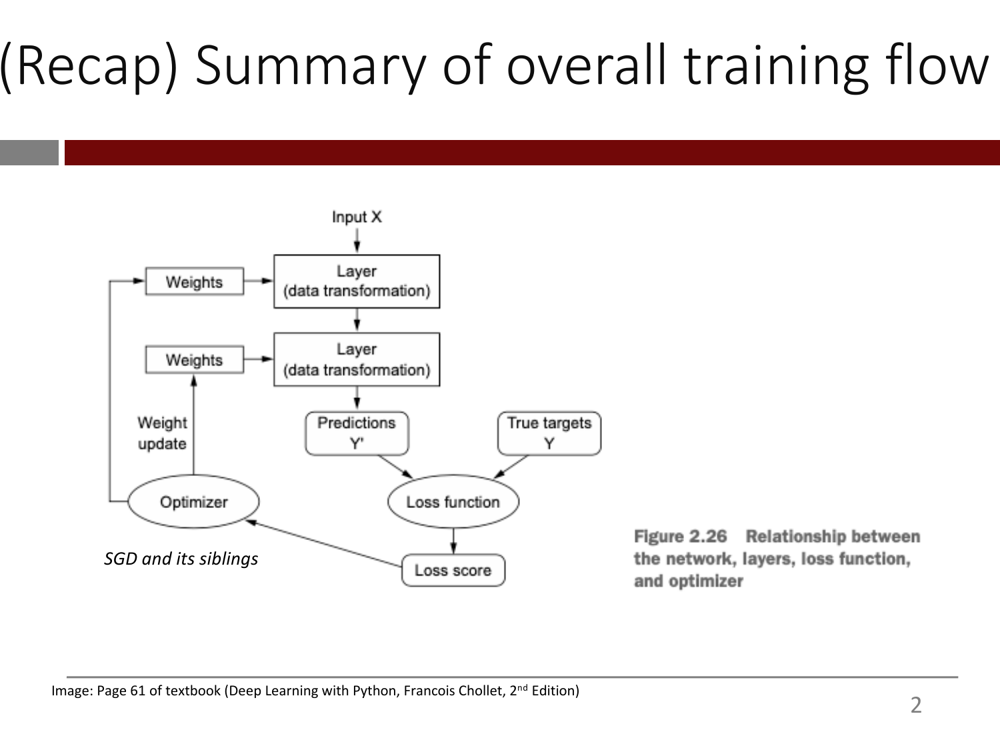
*Visual: training loop ka high-level diagram.*

Training ko operationally aise socho:

1. data input do
2. model prediction banata hai
3. loss compute hota hai
4. gradients nikalte hain
5. optimizer weights update karta hai
6. repeat

### 3.2 Gradient Descent vs Stochastic Gradient Descent

Lecture ne clean distinction diya:

- `Gradient Descent`: har update me full training set use hota hai
- `SGD / minibatch SGD`: har update me sirf chhota batch use hota hai

Practical deep learning almost hamesha minibatches use karti hai.

### 3.3 Epoch, Batch, Iteration

Ye teen terms beginners ko confuse karte hain. Is lecture ne explicitly separate kiya.

#### Epoch

`One full pass through the training set`

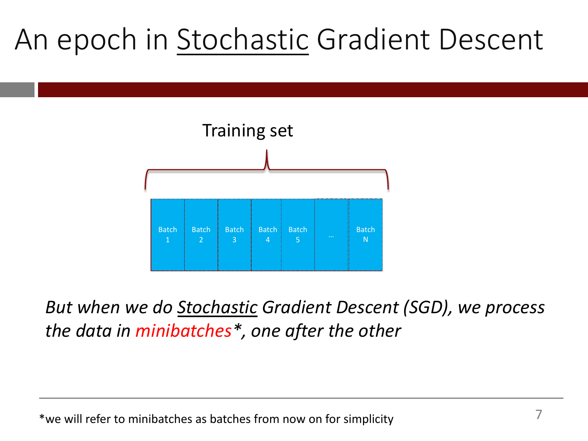
*Visual: SGD me data batches me process hota hai.*

#### Batch

Training set ka chhota chunk.

#### Iteration

Ek parameter update step. Usually har batch ke baad one iteration.

Example with heart disease model:

- training size = `194`
- batch size = `32`
- number of batches per epoch = `ceil(194 / 32) = 7`

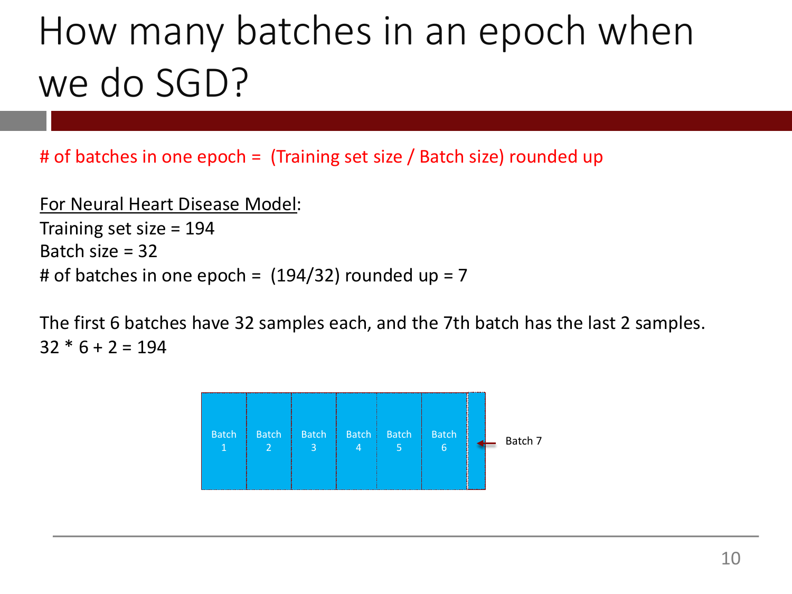
*Visual: 194 training points aur batch size 32 se 7 batches bante hain.*

Deep memory trick:

- `Epoch = poori kitab ek baar`
- `Batch = kuch pages ek saath`
- `Iteration = ek update`

### 3.4 Deep Dive: Batch count ka intuition

Suppose `194` samples aur batch `32`.

Then:

- first 6 batches = `32` samples each = `192`
- last batch = `2` samples

So one epoch me 7 updates honge if optimizer har batch ke baad update karta hai.

### 3.5 Underfitting vs Overfitting

Lecture ne classic training-vs-validation error curve remind karaya.

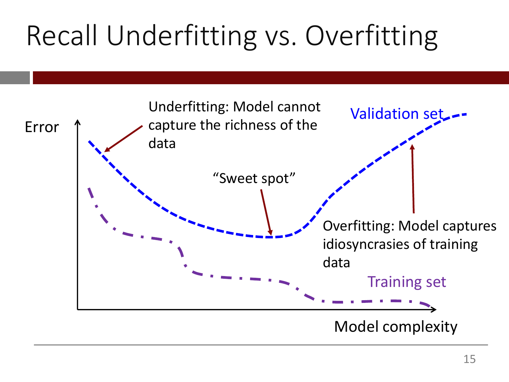
*Visual: underfitting, sweet spot, aur overfitting ka conceptual curve.*

#### Underfitting

Model too simple:

- training bhi poor
- validation bhi poor

#### Overfitting

Model training data ke quirks ya noise tak memorize kar leta hai:

- training loss girta rehta hai
- validation performance eventually worse hoti hai

Structured summary:

- high bias -> underfitting
- high variance -> overfitting

### 3.6 Early Stopping

Lecture ne first regularization strategy diya:

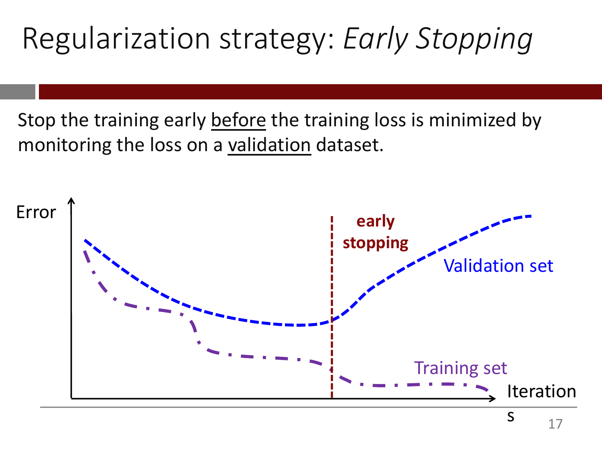
*Visual: training ko validation loss minimum ke aas-paas stop kar dena.*

Rule:

- training loss ke minimum tak blindly mat jao
- validation loss monitor karo
- jahan validation worsen hona start kare, wahan stop kar do

Intuition:

Model ko training set ka obsessive memorization karne se pehle rok do.

### 3.7 Dropout

Second regularization strategy:

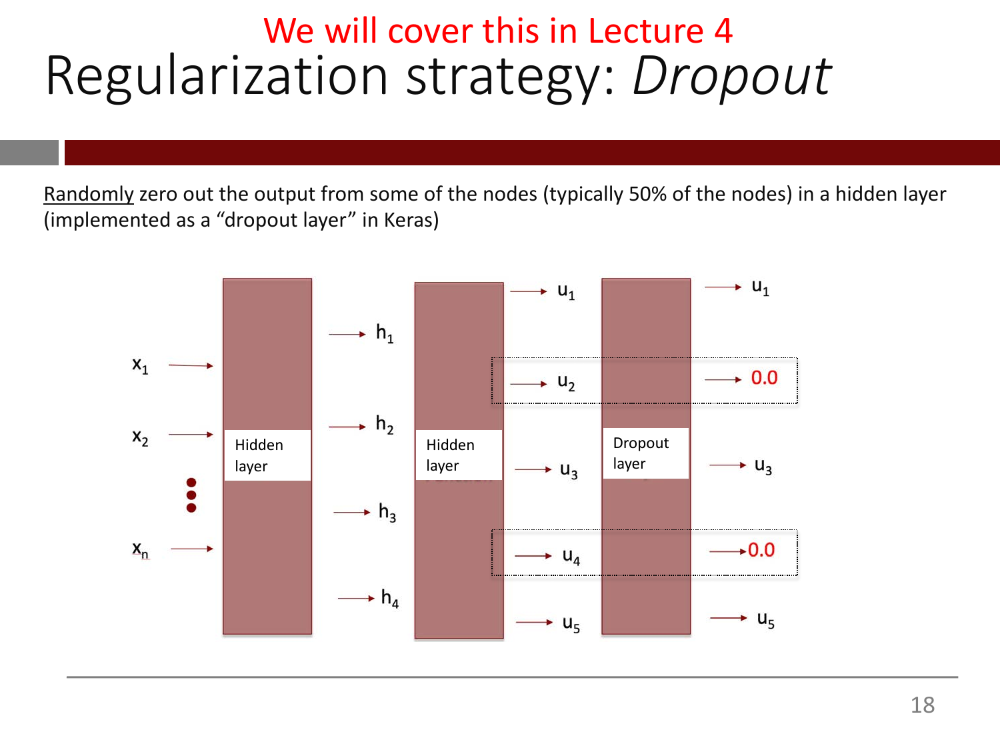
*Visual: hidden layer ke outputs ka random subset temporary drop karna.*

Dropout ka idea:

- training ke time hidden units ka kuch fraction randomly zero out karo

Benefits:

- network kisi single neuron par over-rely nahi karta
- more robust features seekhta hai

Analogy:

Office me kuch employees roz absent ho sakte hain. Team ko aisa kaam karna seekhna padega ki ek insaan gayab hone se system crash na ho.

### 3.8 Tensor kya hota hai

Lecture 3A ka tooling section tensor concept introduce karta hai.

Basic ranks:

- rank 0 = scalar
- rank 1 = vector
- rank 2 = matrix
- rank 3 = cube-like array

Examples:

- scalar: `42`
- vector: `[42, 23.4, 11.2]`
- matrix: spreadsheet
- rank 3 tensor: color image `(height, width, channels)`
- rank 4 tensor: batch of images `(batch, height, width, channels)`

Memory trick:

`Tensor = generalized n-dimensional array`

### 3.9 TensorFlow aur Keras ka role

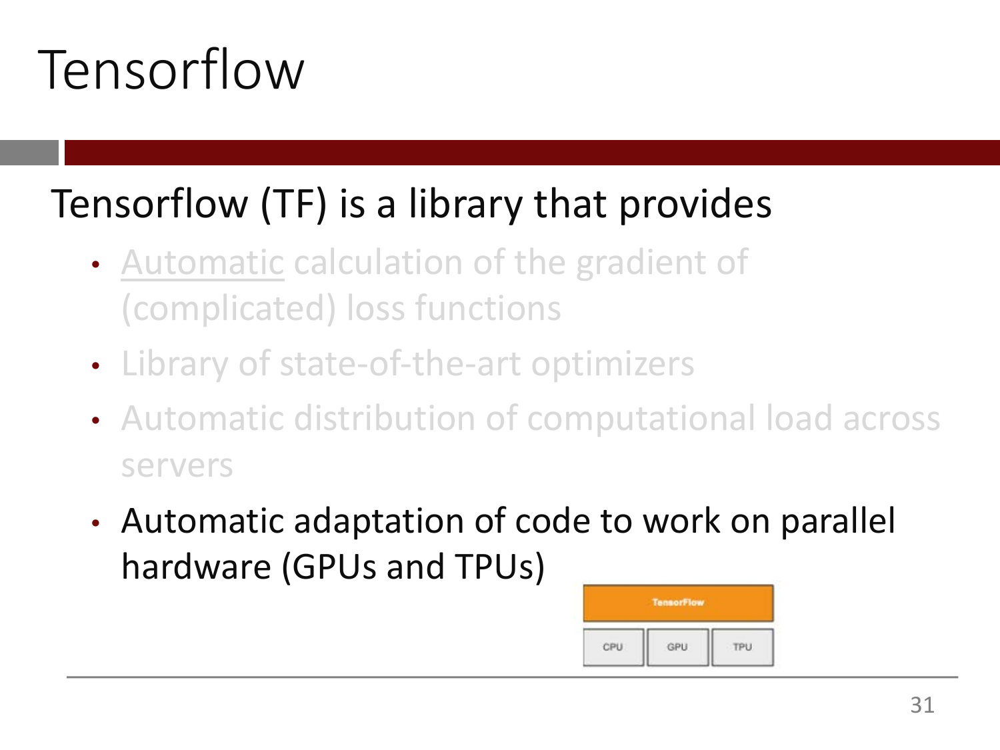
*Visual: TensorFlow gradients, optimizers, aur parallel hardware support deta hai.*

Lecture ke according TensorFlow:

- complicated loss ka gradient automatically compute kar sakta hai
- optimizers provide karta hai
- hardware adaptation me help karta hai
- GPUs/TPUs ke saath run kar sakta hai

Keras TensorFlow ke upar convenience layer ki tarah baitha hai:

- layers define karna easy
- architectures flexible
- preprocessing helpers
- training APIs like `compile`, `fit`, `evaluate`

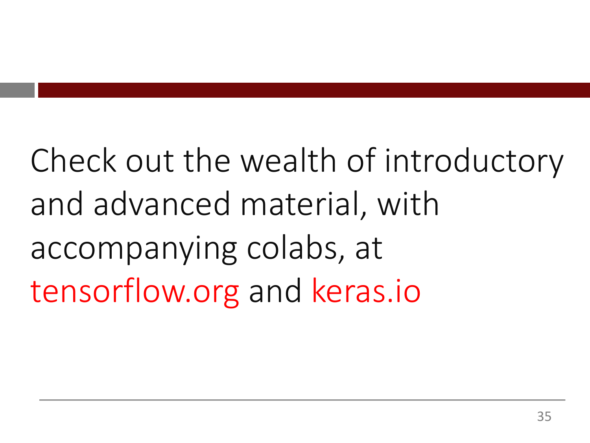
*Visual: वही heart-disease network ab Keras training checklist ke context me.*

### 3.10 Heart Disease Notebook Walkthrough

Ab actual notebook flow.

#### Dataset

- 303 patients
- 13 features + 1 target
- mix of numerical and categorical columns

Target:

- `target = 1` means heart disease
- `target = 0` means no heart disease

#### Baseline model

Notebook ne pehle important question poocha:

`Naive baseline kya hai?`

Because dataset imbalanced tha, always `0` predict karne se around `72.6% accuracy` mil jaati thi.

Lesson:

- accuracy ko blindly celebrate mat karo
- baseline se compare karo

#### Preprocessing steps

1. categorical variables ko one-hot encode karo
2. numerical variables standardize karo
3. train/test split karo
4. arrays me convert karo
5. `X` aur `y` separate karo

### 3.11 Deep Dive: Split before standardization kyu

Notebook ne explicitly poocha:

`Why should we split before normalization?`

Answer:

Because of `data leakage`.

Galat way:

- poore dataset ka mean/std nikalo
- phir split karo

Problem:

- test set ki information training pipeline me leak ho gayi

Sahi way:

1. pehle split
2. mean/std sirf training set se nikalo
3. same training statistics ko train aur test dono par apply karo

Why this matters:

Real world me future unseen data ka mean tumhe pehle se nahi pata hota.

### 3.12 Model setup in notebook

Notebook ka exact model:

```python
input = keras.Input(shape=num_columns)
h = keras.layers.Dense(16, activation="relu", name="Hidden")(input)
output = keras.layers.Dense(1, activation="sigmoid", name="Output")(h)
model = keras.Model(input, output)
```

Model summary se:

- hidden layer params = `480`
- output layer params = `17`
- total = `497`

Compile step:

```python
model.compile(
    optimizer="adam",
    loss="binary_crossentropy",
    metrics=["accuracy"]
)
```

### 3.13 Training configuration

Notebook settings:

- `epochs = 300`
- `batch_size = 32`
- `validation_split = 0.2`

Why 300 epochs?

- dataset chhota tha
- overfitting observe karna easy tha

Why validation split?

- overfitting detect karne ke liye
- early stopping reasoning ke liye

### 3.14 Training outcome

Notebook history se pattern ye dikha:

- training loss keep improving
- validation loss baad me deteriorate

Iska matlab:

- model eventually overfit kar raha tha

Final test-set evaluation notebook output:

- loss around `0.3866`
- accuracy around `0.8361`

Interpretation:

- baseline `72.6%`
- neural model `83.61%`

Yaani model baseline beat kar raha hai, but perfect nahi hai.

### 3.15 Why structured-data DL me caution chahiye

Important realism point:

Deep learning har structured dataset par automatically best nahi hota.

Small tabular datasets me:

- logistic regression
- gradient boosted trees
- random forests

often strong competitors hote hain.

Yeh notebook ka goal state-of-the-art claim karna nahi, balki end-to-end pipeline sikhana tha.

### 3.16 Training Checklist

Lecture ne practical checklist diya:

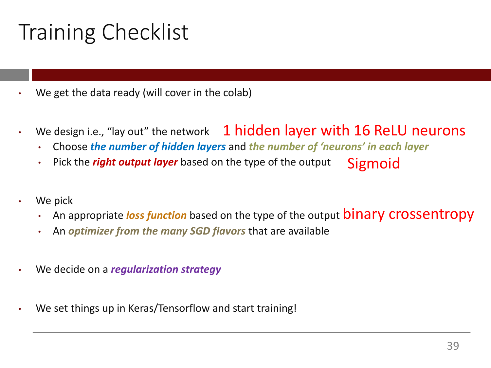
*Visual: network, loss, optimizer, regularization, aur training ko ek checklist ki tarah socho.*

Checklist:

1. data ready karo
2. architecture choose karo
3. output layer choose karo
4. matching loss choose karo
5. optimizer choose karo
6. regularization decide karo
7. training run karo

### 3.17 Common Mistakes

- Epoch, batch, iteration ko same samajhna.
- Accuracy dekh kar khush ho jana without baseline.
- Split ke pehle normalization kar dena.
- Validation split aur test set ko confuse karna.
- Training loss girne ko hi success samajhna.

### 3.18 Memory Tricks

- `Epoch = full pass`
- `Batch = mini chunk`
- `Iteration = one update`
- `Validation watches honesty`
- `Early stopping stops before memorization`

### 3.19 Recall Questions

1. Epoch, batch aur iteration me exact difference kya hai?
2. 194 samples aur batch 32 ke saath kitne batches honge?
3. Underfitting aur overfitting me training/validation behavior kaise differ karta hai?
4. Early stopping ka exact rule kya hota hai?
5. Dropout conceptually kya karta hai?
6. TensorFlow aur Keras me difference kya hai?
7. Split before standardization kyu?
8. Heart-disease notebook ka baseline accuracy kya tha?
9. Neural model ki test accuracy approx kitni thi?

### Short Answer Key

1. Epoch poore training data par ek full pass hai; batch us data ka mini chunk hai; iteration ek parameter update step hai.
2. `ceil(194/32) = 7` batches.
3. Underfitting me train aur validation dono weak rehte hain; overfitting me training improve hoti rehti hai but validation deteriorate hoti hai.
4. Early stopping ka rule hota hai: validation metric jab kuch epochs tak improve na kare to training stop kar do.
5. Dropout training ke time kuch neurons randomly off karta hai taaki model over-rely na kare aur robust features seekhe.
6. TensorFlow backend/autodiff/hardware support deta hai; Keras uske upar high-level user-friendly API hai.
7. Split before standardization data leakage avoid karne ke liye zaroori hai.
8. Baseline accuracy roughly `72.6%` thi.
9. Neural model ki test accuracy roughly `83.61%` thi.

---

## Lecture 3B: Computer Vision Basics and Fashion MNIST

### Lecture Snapshot

Lecture 3B me same neural network ideas images par apply hote hain:

- image digitally represent kaise hoti hai
- computer vision tasks kya-kya hote hain
- multi-class classification ke liye softmax
- correct loss function choice
- Fashion MNIST dense network pipeline

### 4.1 Images digitally kaise represent hoti hain

#### Grayscale image

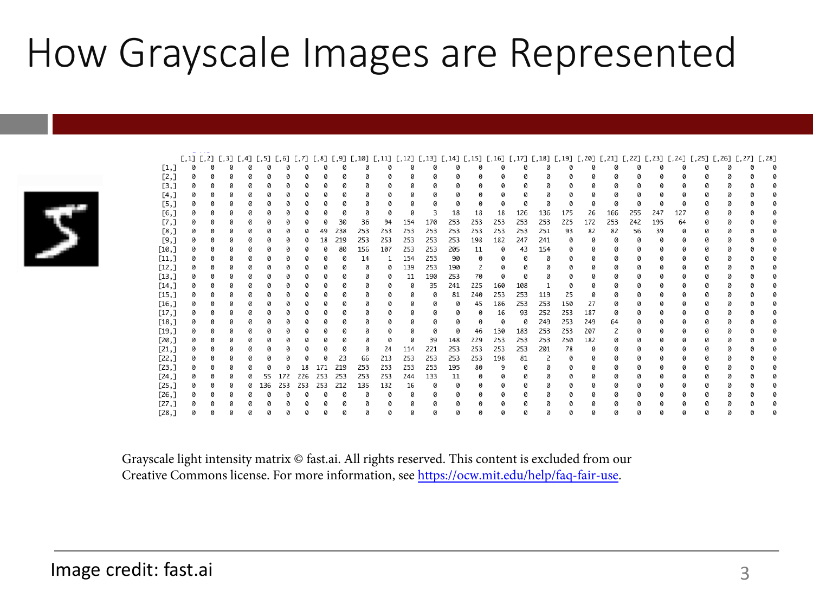
*Visual: grayscale image ek matrix hoti hai jisme har pixel intensity 0 se 255 hoti hai.*

Grayscale image:

- rectangular pixel grid
- har pixel ek number
- range usually `0 to 255`

Interpretation:

- `0` = black
- `255` = white
- beech ke numbers = gray shades

Example:

Ek `28 x 28` grayscale image basically `28 x 28` matrix hai.

#### Color image

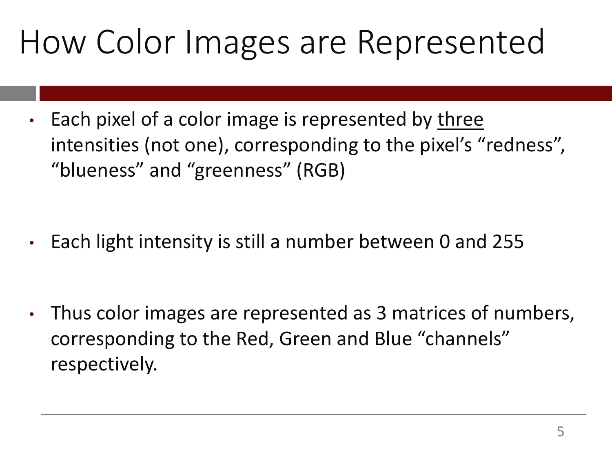
*Visual: color image teen channels se represent hoti hai: red, green, blue.*

Color image me har pixel ke liye teen values hoti hain:

- red
- green
- blue

So color image = `3 matrices`

Typical shape:

- `(height, width, 3)`

Memory trick:

- grayscale = `1 channel`
- RGB = `3 channels`

### 4.2 Computer Vision ke main tasks

Lecture ne several tasks distinguish kiye.

#### Image Classification

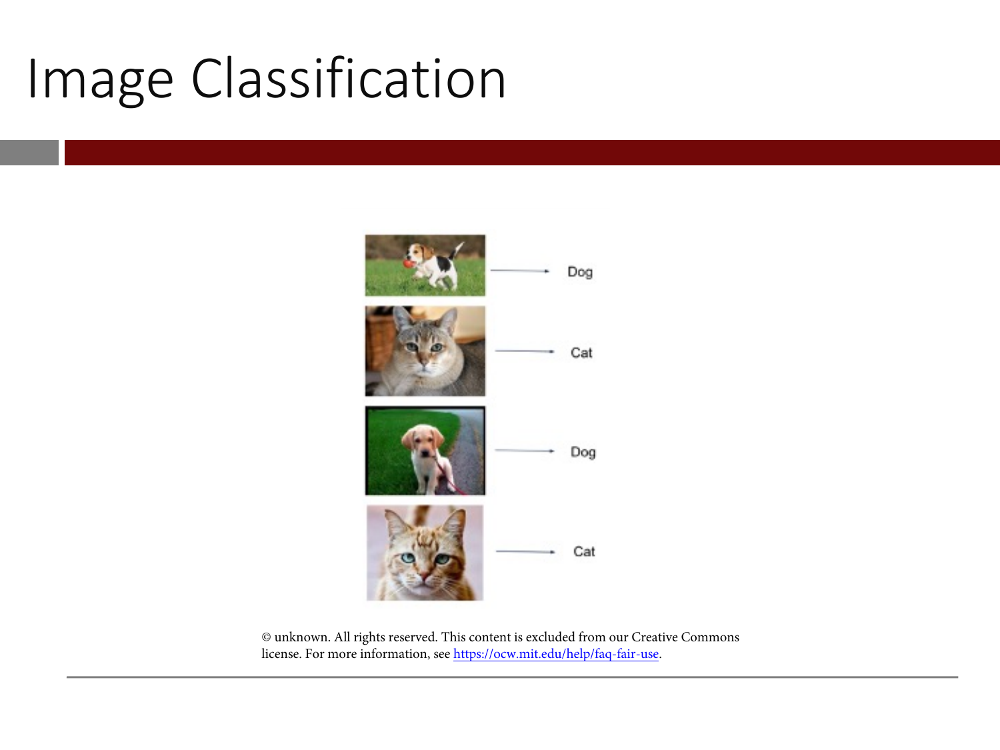
*Visual: whole image ko ek label assign karna.*

Goal:

- poori image ko ek class dena

Example:

- image -> `dog`
- image -> `cat`

#### Classification + Localization

- image me object kya hai
- aur roughly kaha hai

#### Object Detection

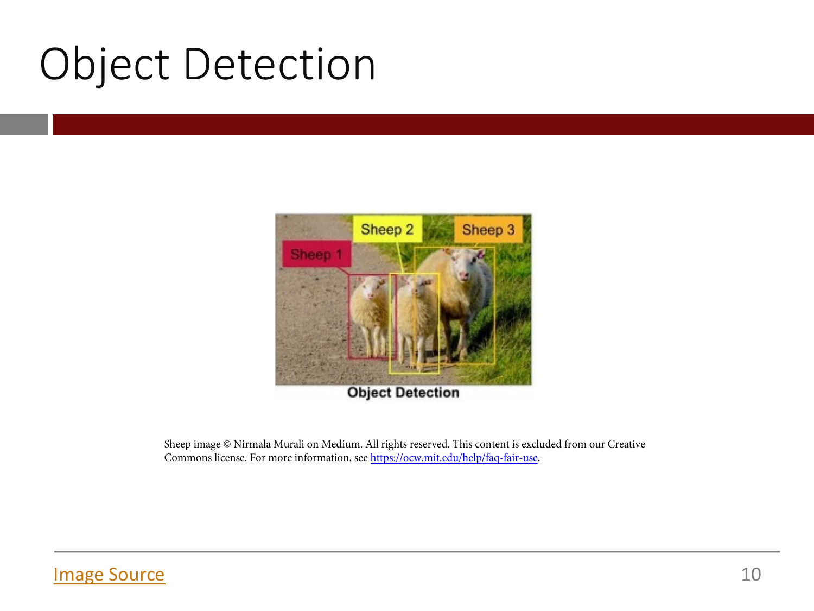
*Visual: multiple objects ko identify karke bounding boxes dena.*

Goal:

- multiple objects detect karo
- har object ka bounding box do

#### Semantic Segmentation

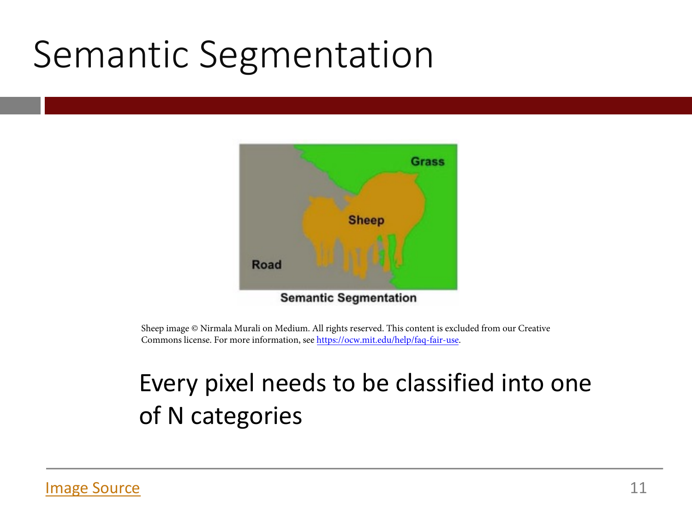
*Visual: har pixel ko class assign karna.*

Goal:

- har pixel ko category assign karna

Example:

- ye pixels sheep
- ye sky
- ye grass

#### Instance Segmentation

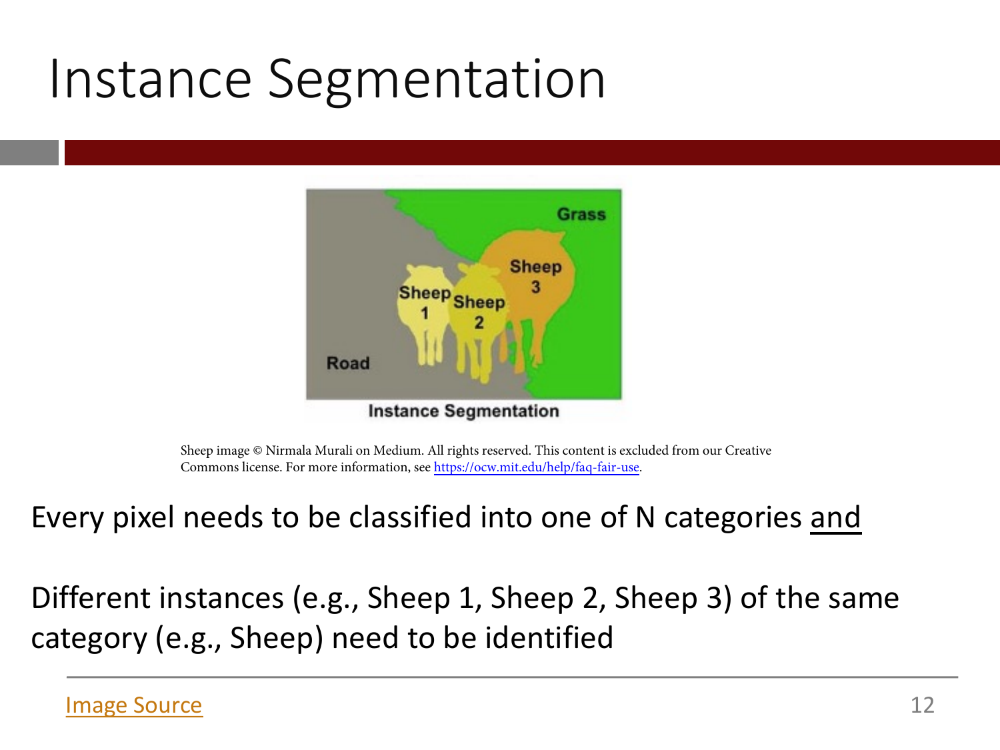
*Visual: same class ke multiple objects ko alag instances ki tarah identify karna.*

Goal:

- har pixel ka class bhi
- aur same category ke different objects ko separate bhi

Example:

- Sheep 1
- Sheep 2
- Sheep 3

Memory trick:

- `classification = what`
- `localization = where`
- `detection = what + where for many`
- `semantic segmentation = pixel class`
- `instance segmentation = pixel class + object identity`

### 4.3 Fashion MNIST as motivating dataset

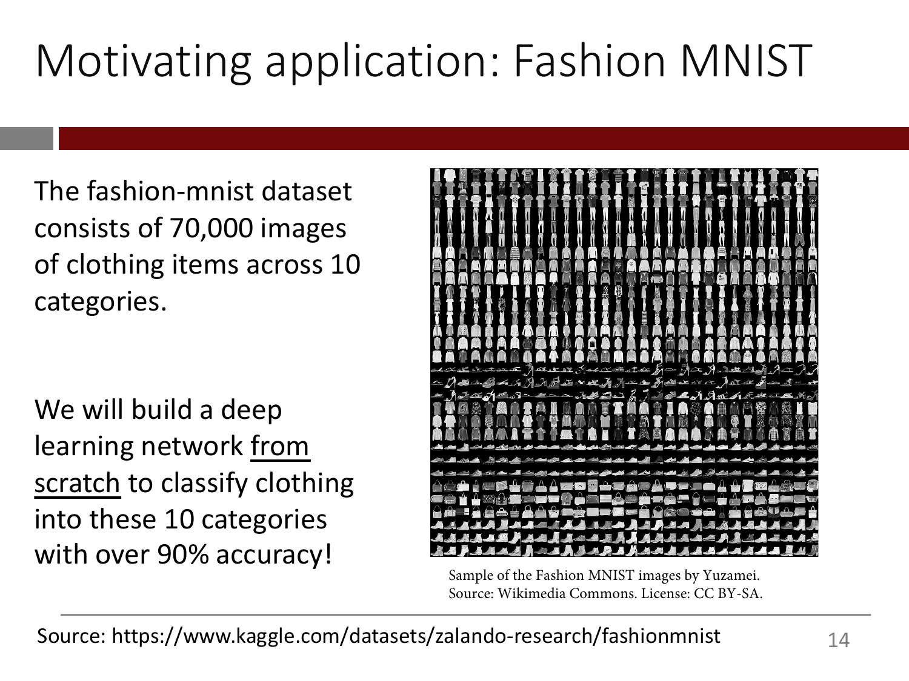
*Visual: 70,000 clothing images across 10 categories.*

Dataset facts:

- 70,000 grayscale clothing images
- 10 categories
- train = `60,000`
- test = `10,000`
- image size = `28 x 28`

Class labels:

- T-shirt/top
- Trouser
- Pullover
- Dress
- Coat
- Sandal
- Shirt
- Sneaker
- Bag
- Ankle boot

### 4.4 Multi-class classification ka challenge

Binary classification me one probability enough thi.

Yahan:

- 10 classes hain
- output ko 10 probabilities deni hain
- aur probabilities ka sum `1` hona chahiye

### 4.5 Softmax kya karta hai

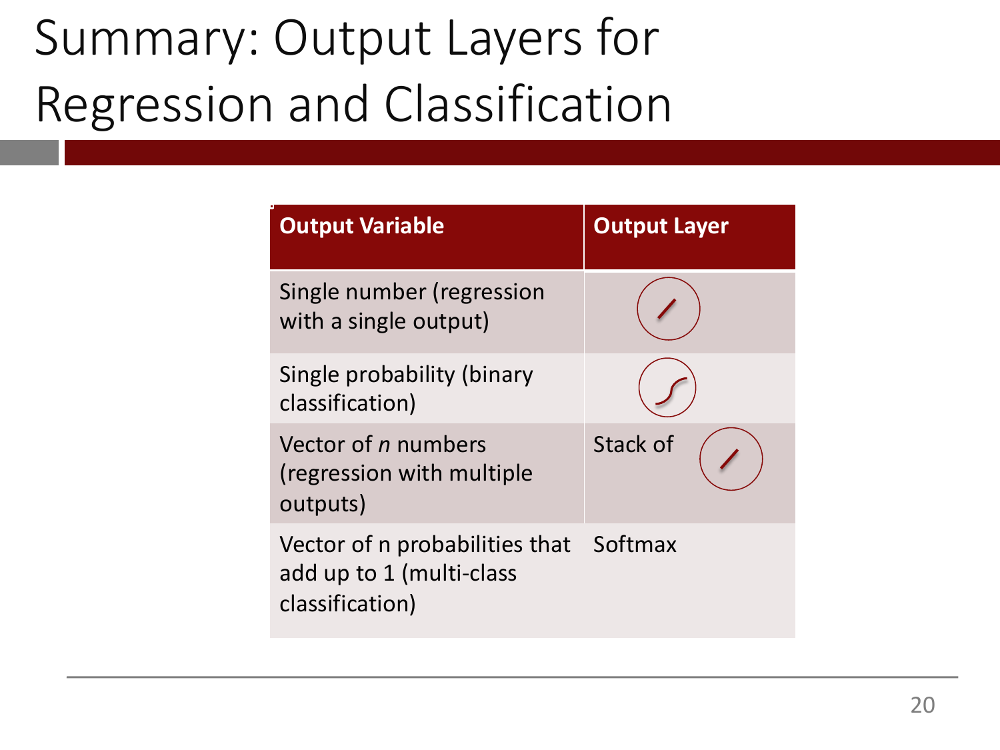
*Visual: arbitrary scores ko probabilities me convert karna.*

Softmax takes raw scores:

`z1, z2, ..., zn`

and converts them into probabilities:

`p1, p2, ..., pn`

Properties:

- each `pi` between 0 and 1
- all `pi` sum to 1

Interpretation:

- model ke internal scores ko normalized confidence distribution me badal deta hai

Example:

Raw scores:

- shirt = `2.1`
- coat = `0.2`
- sandal = `-1.0`

Softmax ke baad:

- shirt = `0.79`
- coat = `0.17`
- sandal = `0.04`

Memory trick:

`Sigmoid one probability`

`Softmax many probabilities`

### 4.6 Output layer and loss matching

Lecture ne very important summary diya:

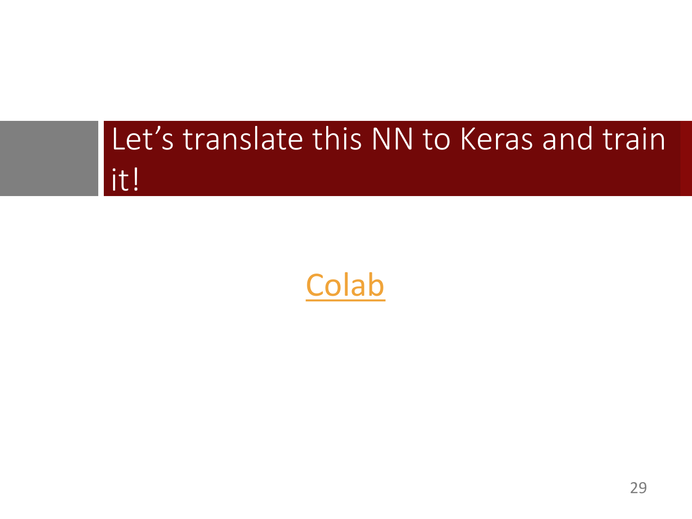
*Visual: output variable type ke hisaab se output layer aur loss function choose karo.*

Quick map:

| Problem type | Output layer | Loss |
|---|---|---|
| single numeric regression | linear | MSE |
| binary classification | sigmoid | binary cross-entropy |
| multi-output regression | stack of linear units | MSE |
| multi-class classification | softmax | categorical-family cross-entropy |

### 4.7 Deep Dive: sparse categorical vs categorical cross-entropy

Ye beginners ke liye confusing hota hai.

#### `categorical_crossentropy`

Use when labels one-hot encoded hain.

Example:

Class 3 -> `[0,0,0,1,0,0,0,0,0,0]`

#### `sparse_categorical_crossentropy`

Use when labels integer encoded hain.

Example:

Class 3 -> `3`

Fashion MNIST notebook me labels integers hain:

- `0` to `9`

Isliye notebook ne use kiya:

- `sparse_categorical_crossentropy`

Memory trick:

`Sparse = labels simple integers`

`Categorical = labels one-hot vectors`

### 4.8 Fashion MNIST Notebook Walkthrough

Notebook ka workflow:

1. dataset load karo
2. first labels aur images inspect karo
3. normalize pixel values by dividing by `255.0`
4. network define karo
5. compile with softmax-compatible loss
6. fit model
7. validation curves inspect karo
8. test-set evaluation karo

#### Normalization

Input values `0..255` range me the. Notebook ne:

```python
x_train = x_train / 255.0
x_test = x_test / 255.0
```

Yaani ab pixel range `0..1` ho gayi.

Why helpful:

- optimization easier
- gradient behavior more stable
- features comparable range me aate hain

### 4.9 Dense network architecture for Fashion MNIST

Notebook model:

```python
input = keras.Input(shape=(28,28))
h = keras.layers.Flatten()(input)
h = keras.layers.Dense(256, activation="relu", name="Hidden")(h)
output = keras.layers.Dense(10, activation="softmax", name="Output")(h)
model = keras.Model(input, output)
```

Interpretation:

- input: `28 x 28` grayscale matrix
- flatten: matrix ko `784`-length vector me badlo
- hidden layer: 256 ReLU units
- output: 10-way softmax

Parameter count:

- first dense layer = `784*256 + 256 = 200,960`
- output layer = `256*10 + 10 = 2,570`
- total = `203,530`

### 4.10 Flatten layer ka meaning

Flatten koi learning layer nahi hai.

Iska kaam sirf shape convert karna hai:

- from `28 x 28`
- to `784`

Analogy:

Ek image ko notebook page ki 2D grid se ek lambi list me unwrap kar diya.

### 4.11 Deep Dive: Flatten ki limitation

Yeh lecture basic dense model sikha rahi hai, but practical limitation yaad rakhni chahiye:

- flatten spatial structure ko ignore karta hai
- neighboring pixels ke local relation ka special treatment nahi hota

Isi wajah se advanced vision me CNNs use hote hain:

- local filters
- translation-friendly patterns
- fewer parameters

Dense image model useful hai learning ke liye, but state-of-the-art architecture nahi.

### 4.12 Compile and fit

Notebook compile:

```python
model.compile(
    loss="sparse_categorical_crossentropy",
    optimizer="adam",
    metrics=["accuracy"]
)
```

Training setup:

- `batch_size = 64`
- `epochs = 20`
- `validation_split = 0.2`

Training logs me:

- accuracy steadily improve hui
- validation accuracy around high 88% / low 89% tak gayi
- baad me mild overfitting signs aaye

### 4.13 Test performance

Notebook output ke according test-set evaluation roughly:

- loss = `0.3604`
- accuracy = `0.8845`

Yaani:

- about `88.45%` test accuracy

Lecture slide ne `90%+` target motivational way me mention kiya tha, notebook ka first simple dense model uske close aata hai but exact run/test split par dependent रहेगा.

### 4.14 Why this example important hai

Fashion MNIST notebook ne teen key ideas solidify kiye:

1. image bhi bas numbers hi hoti hai
2. multi-class problems ko softmax chahiye
3. preprocessing + architecture + loss matching ek saath important hain

### 4.15 Common Mistakes

- Sochna grayscale image me RGB channels hote hain.
- Softmax aur sigmoid ko interchangeable samajhna.
- Sparse categorical aur categorical cross-entropy confuse karna.
- Flatten ko learning layer samajhna.
- Image classification aur object detection ko same samajhna.

### 4.16 Memory Tricks

- `Grayscale = one channel`
- `RGB = three channels`
- `Softmax = class probabilities that sum to 1`
- `Sparse labels = integer labels`
- `Flatten unwraps, CNN preserves locality`

### 4.17 Recall Questions

1. Grayscale aur RGB image representation me kya difference hai?
2. Image classification aur object detection me difference kya hai?
3. Semantic segmentation aur instance segmentation me difference kya hai?
4. Fashion MNIST me kitni classes hain?
5. Softmax ka exact role kya hai?
6. `sparse_categorical_crossentropy` kab use karte hain?
7. Flatten layer kya karti hai?
8. Dense image model CNN se conceptually weaker kyu hai?
9. Notebook ki test accuracy roughly kitni thi?

### Short Answer Key

1. Grayscale image ek single intensity channel hoti hai; RGB image me red, green, blue ke teen channels hote hain.
2. Image classification poori image ko ek label deta hai; object detection multiple objects ke labels plus bounding boxes deta hai.
3. Semantic segmentation har pixel ko class deta hai; instance segmentation same class ke alag objects ko bhi separate karta hai.
4. Fashion MNIST me `10` classes hain.
5. Softmax raw scores ko probability distribution me convert karta hai jiska sum `1` hota hai.
6. `sparse_categorical_crossentropy` tab use karte hain jab labels one-hot nahi, integer encoded hon.
7. Flatten `28 x 28` jaise matrix ko `784`-length vector me convert karti hai.
8. Dense model spatial locality ignore karta hai aur zyada parameters leta hai; CNN local patterns aur parameter sharing naturally handle karta hai.
9. Notebook ki test accuracy roughly `88.45%` thi.

---

## Lecture 4: CNNs and Transfer Learning

### Lecture Snapshot

Lecture 4 ka core message:

- image data ko flatten karke dense network me daalna natural approach nahi hai
- CNN local patterns ko directly learn karta hai
- pooling size reduce karti hai aur features ko robust banati hai
- deeper CNNs low-level se high-level features banate hain
- transfer learning small datasets par huge advantage de sakta hai

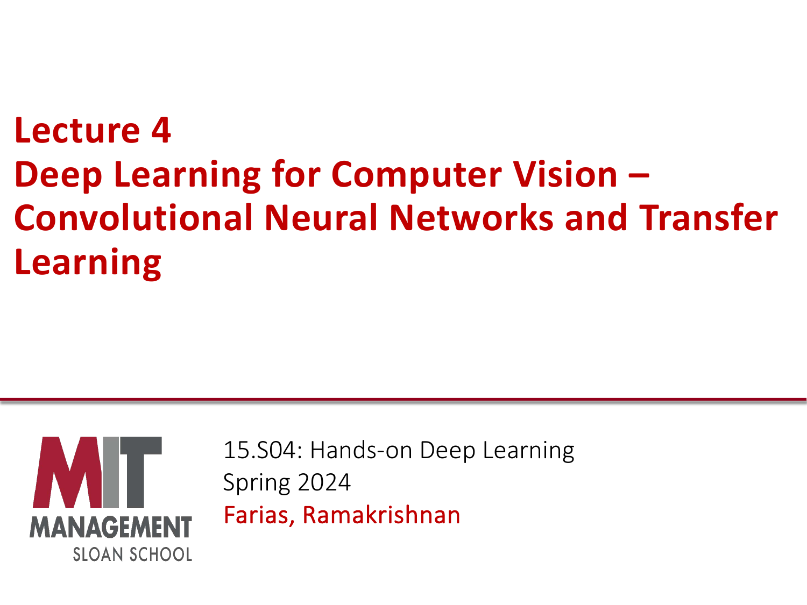
*Visual: lecture ka focus pure vision pipeline ko dense nets se CNNs aur transfer learning tak le jana hai.*

### Big Picture

Lecture 3B me humne dekha tha ki image ko flatten karke softmax classifier ban sakta hai. Lecture 4 batati hai ki practical vision systems aise nahi banaye jaate, kyunki:

- parameters explode kar jaate hain
- spatial structure toot jaati hai
- ek corner me jo pattern seekha, woh dusre corner me automatically reuse nahi hota

CNN ka whole point hai:

- local neighborhood dekhna
- same filter ko poori image par reuse karna
- gradually simple features ko combine karke complex object understanding banana

### CNN kyu chahiye

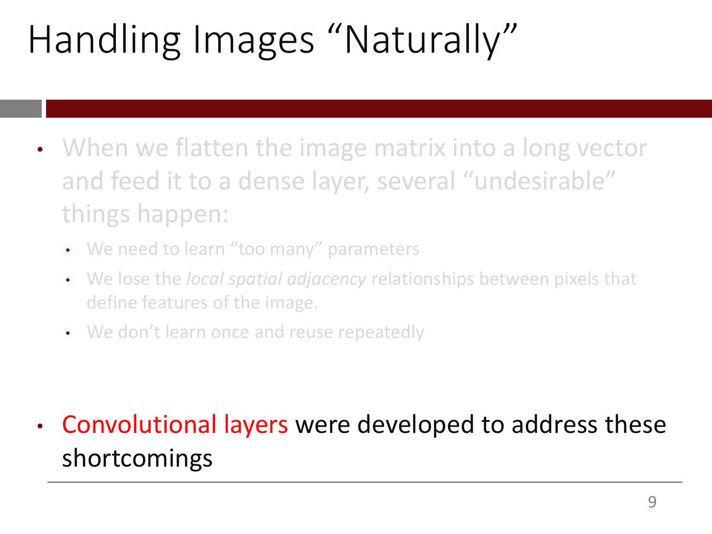
*Visual: flatten karne se 2D image ki adjacency information destroy ho jati hai.*

Lecture ne strong intuition diya:

- image ko `long vector` banana mathematically possible hai
- but useful nahi hai

Do core problems:

1. Parameter explosion  
   Agar high-resolution image ko dense layer me doge, to weights bahut zyada ho jayenge. Lecture me phone-sized image example ka intuition ye tha ki first dense layer hi billions of parameters le sakti hai.

2. Spatial blindness  
   Agar ear aur eye pixels image me paas paas hain, flattening ke baad unka neighborhood relation special tarike se preserve nahi hota.

Memory trick:

`Flatten sees numbers, CNN sees neighborhoods`

### Convolution ka intuition

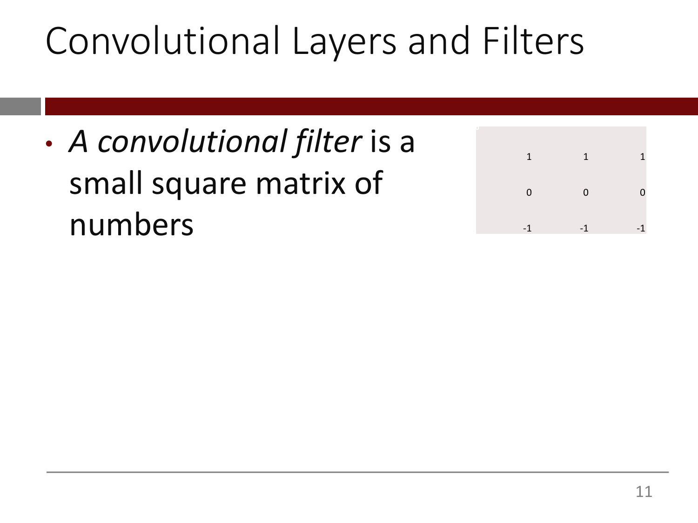
*Visual: chhota filter image ke upar slide karke feature map banata hai.*

Convolutional filter:

- ek small matrix hota hai, for example `3 x 3`
- iske numbers trainable hote hain
- filter image ke har location par apply hota hai

Output:

- `feature map`

Meaning:

- agar filter vertical line detect karna seekh gaya, to jahaan vertical-like pattern hoga wahan high activation aayega

Important idea:

- same filter poori image par reuse hota hai
- isliye parameter count dense layer se kaafi kam hota hai
- aur feature location-agnostic ho jata hai

Example:

- filter 1: vertical edge
- filter 2: horizontal edge
- filter 3: diagonal texture

Later layers इन basic maps ko combine karke:

- corners
- circles
- shoe-like shapes
- faces
- object parts

seekh sakti hain.

### Pooling layers kya karti hain

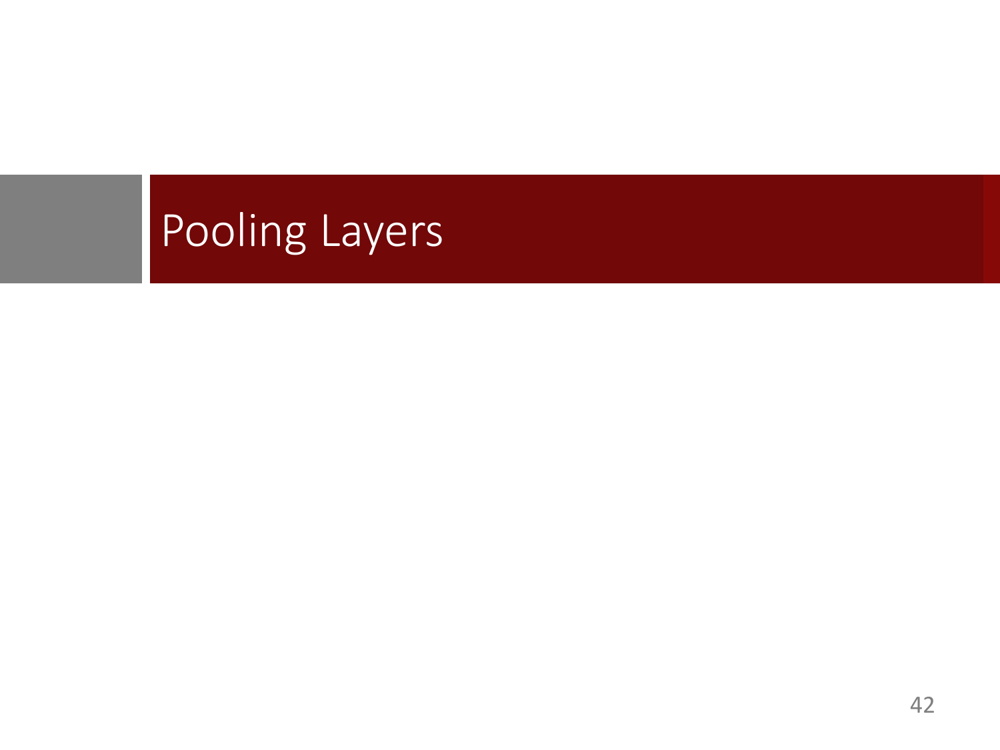
*Visual: pooling feature map ko smaller representation me compress karti hai.*

Pooling ka main role:

- height/width reduce karna
- computation kam karna
- feature presence ko thoda translation-robust banana

Common forms:

- `MaxPooling`
- `AveragePooling`

Max pooling intuition:


*Visual: feature agar pooling window ke kahin bhi strong hai, max pooling usse preserve kar leti hai.*

`2 x 2` window me agar ek jagah feature strong hai, max pooling us signal ko rakh leti hai. Lecture ne isse `OR-like detector` ki tarah explain kiya.

Memory trick:

`Conv asks what pattern is here`

`Pool asks is this pattern present nearby`

### Basic CNN architecture

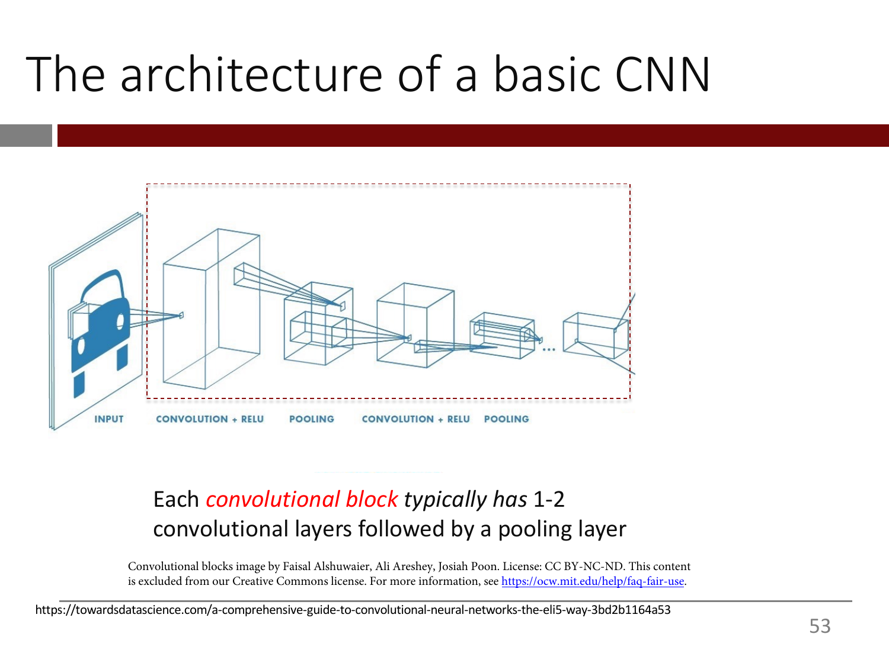
*Visual: conv blocks se spatial size kam hota hai aur feature depth badhti hai.*

Typical CNN flow:

1. input image
2. `Conv -> ReLU`
3. `Conv -> ReLU`
4. `Pool`
5. repeat
6. `Flatten` ya global pooling
7. dense/output layer

As depth increases:

- `height` and `width` often decrease
- number of channels/features often increase

Interpretation:

- early layers: edges/textures
- middle layers: motifs/parts
- deep layers: object concepts

### Notebook 4A: Fashion MNIST CNN

Notebook flow:

- image values normalized to `0..1`
- shape converted to `(28, 28, 1)`
- two convolutional blocks banaye gaye
- `Flatten -> Dense(256, relu) -> Dense(10, softmax)` head use hua

Representative model idea:

```python
Conv2D(32, (2, 2), activation="relu")
MaxPool2D()
Conv2D(32, (2, 2), activation="relu")
MaxPool2D()
Flatten()
Dense(256, activation="relu")
Dense(10, activation="softmax")
```

Compile:

- loss: `sparse_categorical_crossentropy`
- optimizer: `adam`
- metric: `accuracy`

Result:

- test accuracy roughly `0.9058`

Takeaway:

- same Fashion MNIST task par CNN ne dense baseline se better representation learning di

### Transfer Learning kya hota hai

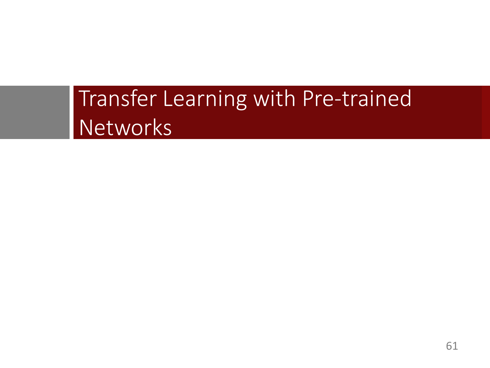
*Visual: pehle se trained image network ke learned features ko reuse karna.*

Transfer learning ka logic:

- large dataset par train hua model already useful visual hierarchy seekh chuka hota hai
- small new dataset par zero se sab kuch seekhne ki zarurat nahi

Lecture ne do research trends combine kiye:

1. domain-specific architectures exist  
   Images ke liye CNNs natural hain.

2. pretrained models available hain  
   Example: ImageNet-trained networks.

### ImageNet aur ResNet intuition

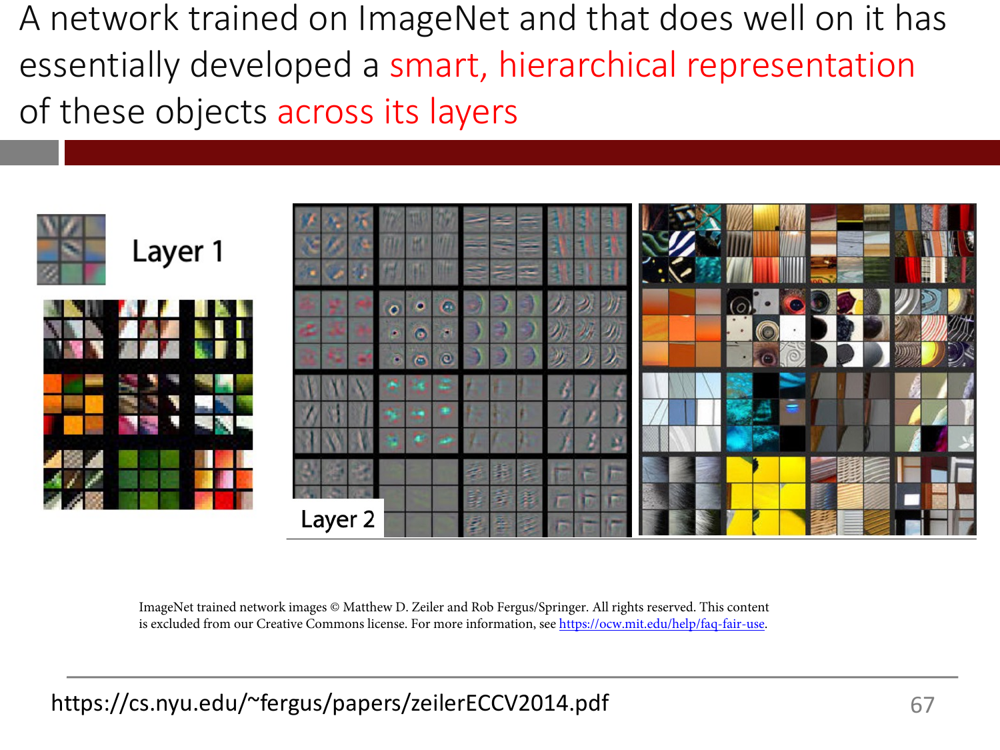
*Visual: large-scale pretraining network ko smart hierarchical visual features sikha deta hai.*

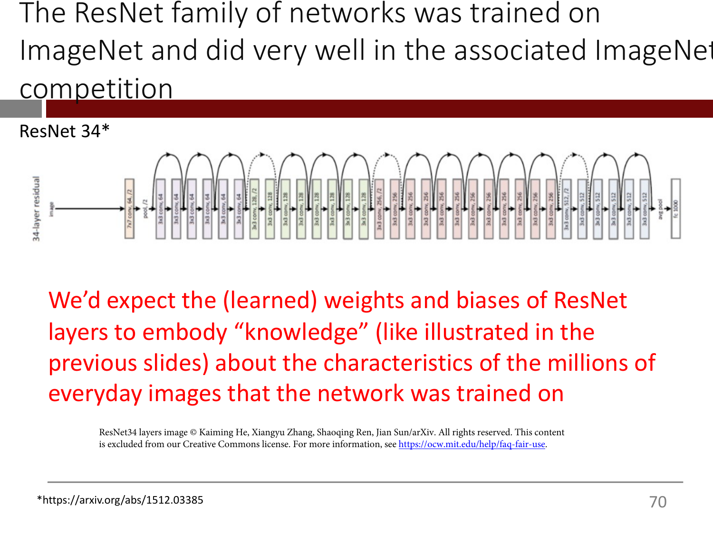
*Visual: pretrained ResNet ko as-is nahi, customized head ke saath reuse karna hota hai.*

ImageNet:

- millions of images
- 1000 categories

Aise dataset par trained model:

- edges se lekar object parts aur category-level concepts tak useful features learn kar leta hai

ResNet ko directly use nahi kar sakte if your task differs, because:

- original output head 1000 classes ke liye trained hota hai
- tumhara problem maybe sirf `2 classes` ka ho

So usual flow:

1. pretrained base lo
2. original classification head hatao
3. naya small head add karo
4. base freeze ya partially unfreeze karke train karo

### Notebook 4B: Handbags vs Shoes

Notebook ne small custom dataset par teen important lessons diye:

- tiny dataset par scratch CNN jaldi overfit karta hai
- data augmentation thodi help kar sakti hai
- transfer learning disproportionate benefit deta hai

Observed notebook story:

- basic CNN test accuracy around `0.8684`
- transfer learning with headless `ResNet50` ne tiny dataset par dramatic jump diya
- final reported test accuracy `1.0000` tak gayi on that small test set

Important caveat:

Tiny dataset par `100%` accuracy ka matlab universal perfection nahi hota. Iska matlab zyadatar ye hai ki pretrained features task ke liye already kaafi informative the.

### Deep Dive: CNN dense net se fundamentally better kyu hai

Dense net image ke liye three cheezein miss karta hai:

- locality
- parameter sharing
- translational reuse

CNN in teenon ko directly encode karta hai.

Analogy:

- Dense net = har pixel pair ke liye alag connection map bana raha hai
- CNN = ek smart stencil bana kar poori image par use kar raha hai

### Common Mistakes

- Sochna CNN ka main benefit bas accuracy hai; actually inductive bias bhi main benefit hai.
- Sochna pooling ka matlab information destroy karna; pooling useful compression bhi hai.
- Pretrained model ko directly use karna without changing last layer.
- Tiny dataset par training-from-scratch ko fair baseline samajhna.

### Memory Tricks

- `Conv = same detector, every location`
- `Pool = keep strongest evidence`
- `CNN = local + shared + reusable`
- `Transfer learning = borrow visual brain`

### Recall Questions

1. Dense image model me parameter explosion kyu hota hai?
2. Convolutional filter exactly kya produce karta hai?
3. Max pooling ko OR-like detector kyu bol sakte hain?
4. CNN me later layers early layers se kaise different features seekhte hain?
5. Transfer learning small dataset par especially useful kyu hota hai?
6. ResNet ko as-is use kyu nahi kar sakte?
7. Fashion MNIST CNN notebook ki test accuracy roughly kitni thi?
8. Handbags/shoes notebook me pretrained model ka benefit kya tha?

### Short Answer Key

1. High-dimensional image ko dense layer se connect karne par `input_size * hidden_size` bahut huge ho jata hai.
2. Convolutional filter feature map produce karta hai jo dikhata hai pattern kaha activate ho raha hai.
3. Max pooling local window me strongest feature evidence ko preserve karti hai, isliye OR-like detector lagti hai.
4. Early CNN layers edges/textures seekhti hain; deeper layers parts aur object-level concepts seekhti hain.
5. Pretrained model large dataset se useful visual features pehle hi seekh chuka hota hai, isliye small dataset par data need kam ho jati hai.
6. ResNet ka original head ImageNet ke 1000 classes ke liye hota hai, isliye new task ke liye uska output head replace karna padta hai.
7. Fashion MNIST CNN notebook ki test accuracy roughly `0.9058` ya `90.58%` thi.
8. Pretrained model ne tiny handbags/shoes dataset par strong feature reuse diya aur performance ko roughly `0.8684` se `1.0000` tak push kiya.

---

## Lecture 5: Text Vectorization and Bag-of-Words

### Lecture Snapshot

Lecture 5 ka mission:

- text ko DNN-friendly numbers me convert karna
- STIE pipeline samajhna
- one-hot aur multi-hot intuition build karna
- bag-of-words ka power aur limitation samajhna

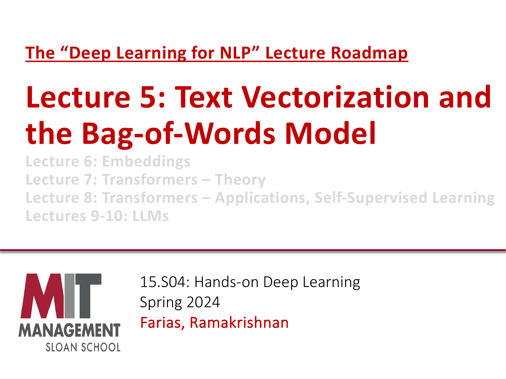
*Visual: NLP track ka first real technical step text ko vectors me badalna hai.*

### Big Picture

Image me raw pixel values hote hain. Text me raw strings hoti hain. DNN direct string process nahi karta. Pehla kaam:

- text standardize karo
- token banao
- tokens ko indices do
- indices ko vectors me encode karo

Lecture ne is flow ko compact naam diya:

`STIE = Standardize -> Tokenize -> Index -> Encode`

### NLP progress arc

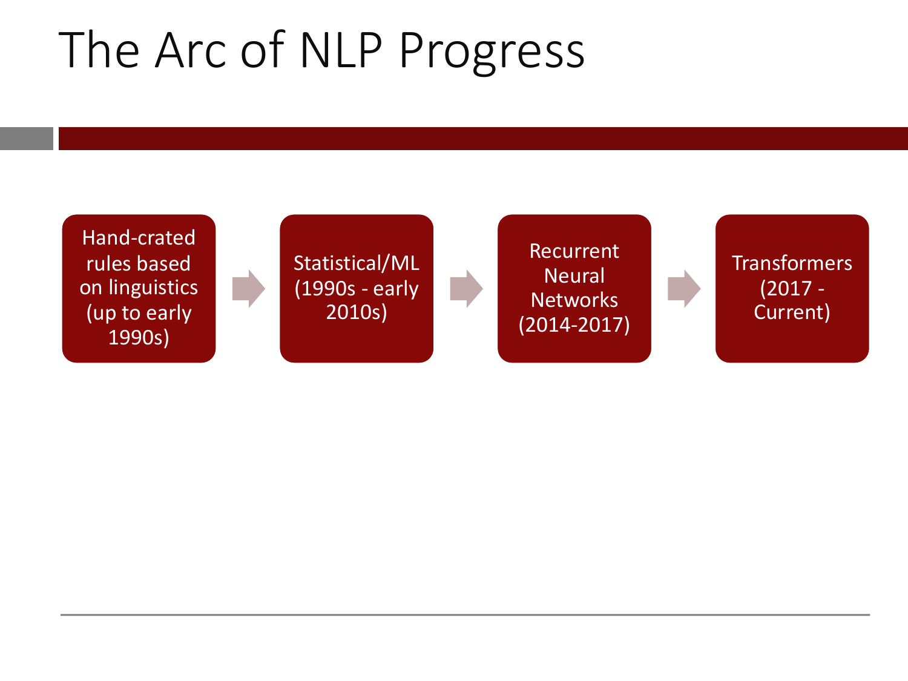
*Visual: rules se statistical ML, phir neural nets aur transformers tak evolution.*

Lecture ne show kiya ki NLP historically gaya:

- hand-crafted linguistic rules
- statistical features
- neural representation learning
- transformers and foundation models

Isse ek important exam-level point milta hai:

`DL in NLP started with better representations before it became large generative models`

### STIE pipeline

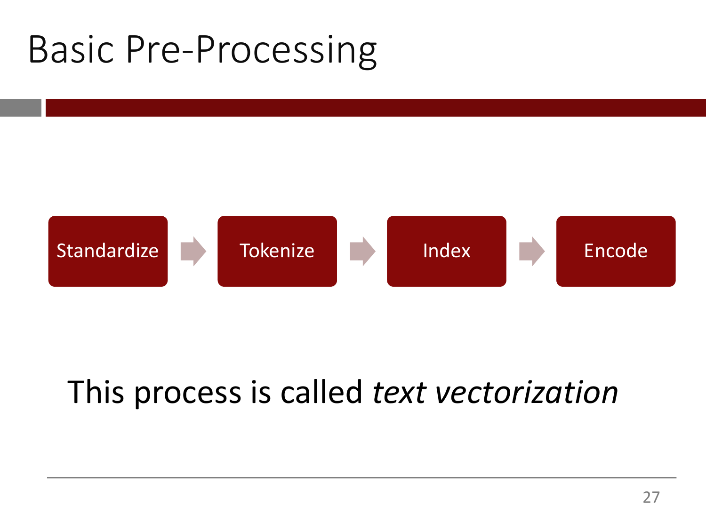
*Visual: raw sentence ko model-ready representation me convert karne ke four steps.*

#### Standardize

- lowercase karna
- punctuation strip karna
- kabhi-kabhi extra spaces clean karna

#### Tokenize

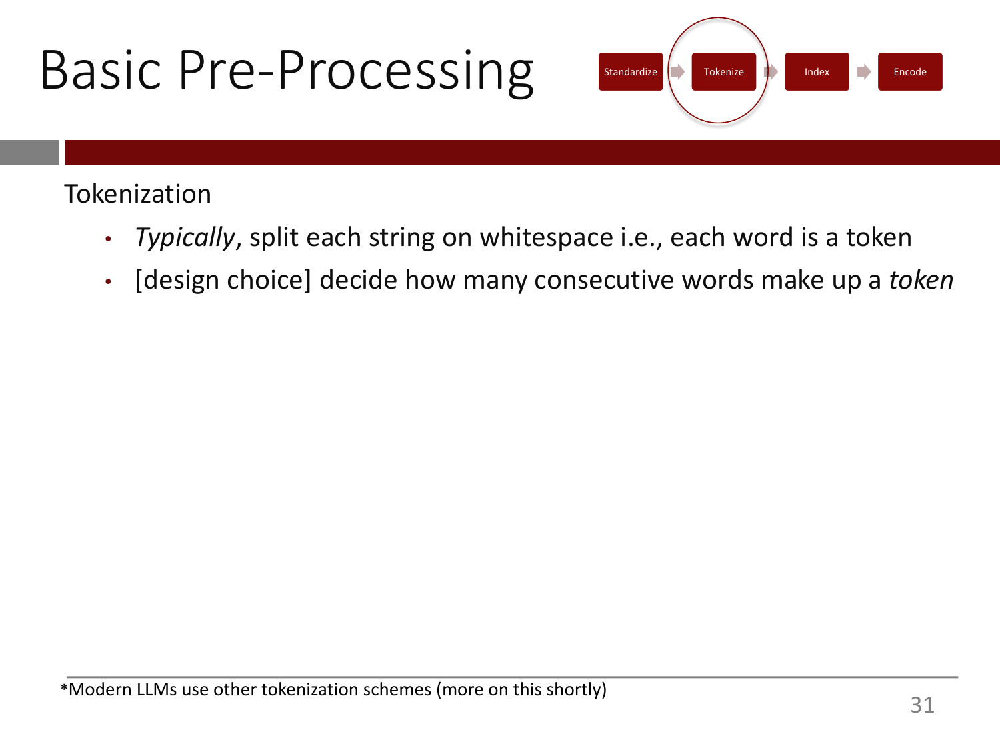
*Visual: sentence ko word-like pieces me todna.*

Sentence:

`The cat sat on the mat`

tokens ban sakte hain:

- `the`
- `cat`
- `sat`
- `on`
- `the`
- `mat`

#### Index

Vocabulary me har distinct token ko unique integer milta hai.

Example:

- `the -> 1`
- `cat -> 2`
- `sat -> 3`

#### Encode

Ab integers ko vectors me represent karte hain.

Lecture 5 ka simplest encoding:

- one-hot / multi-hot / count vector

### One-hot aur bag-of-words intuition

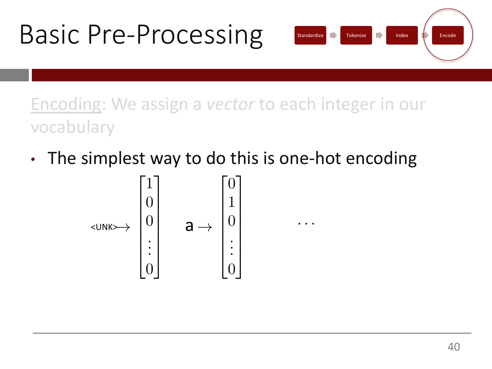
*Visual: har vocabulary item ke liye ek dedicated position hoti hai.*

One-hot idea:

- vocabulary size `V` ho to word vector length bhi `V`
- sirf ek position `1`, baaki `0`

Sentence-level bag-of-words ke do common variants:

- `multi-hot`: word present hai ya nahi
- `count vector`: word kitni baar aaya

Example:

Sentence A: `cat sat cat`

- multi-hot me `cat` aur `sat` present honge
- count vector me `cat = 2`, `sat = 1`

### Bag-of-words approach

Bag-of-words basically order bhool kar aggregate karta hai.

Interpretation:

- sentence ko unordered token bag treat karo
- word presence/count se classifier build karo

Ye surprisingly strong baseline hota hai for:

- spam detection
- topic classification
- genre detection
- review sentiment

### Bag-of-words ki limitations

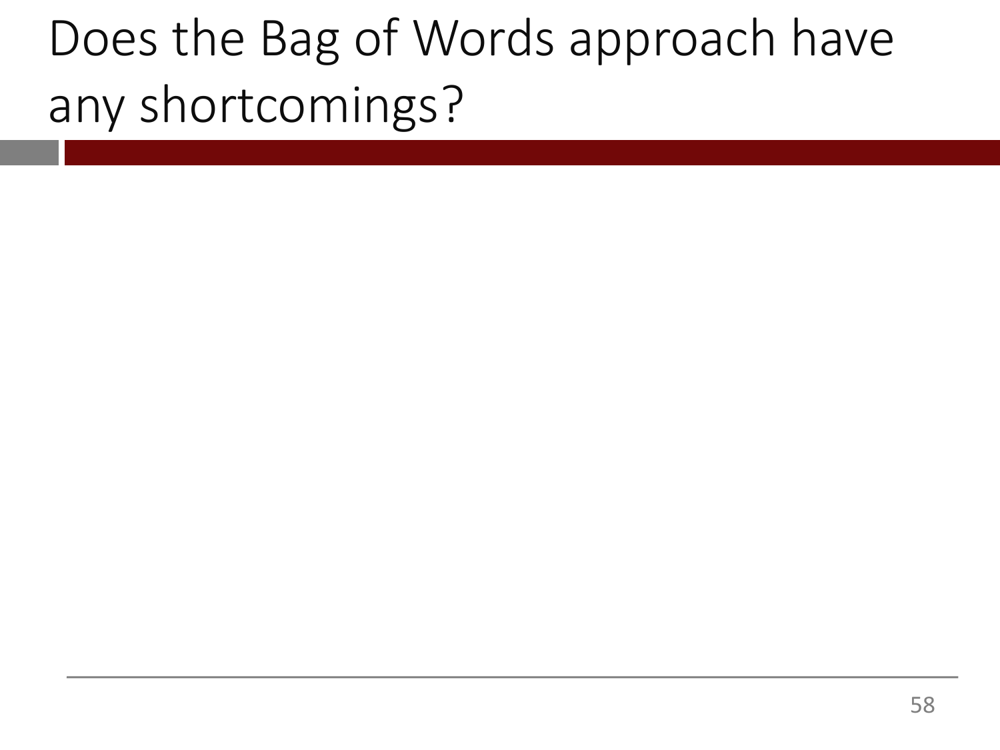
*Visual: simple bag-of-words order ko lose karta hai.*

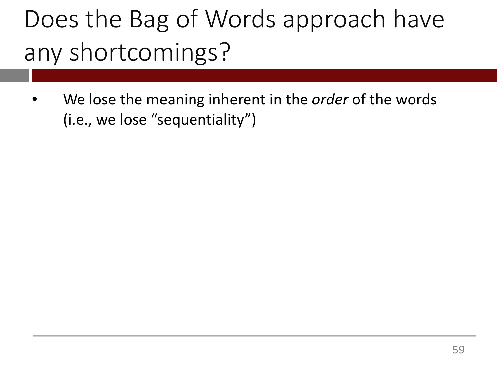
*Visual: same words different order me different meaning de sakte hain.*

Main problems:

- word order lost
- syntax lost
- negation brittle ho sakta hai
- vector size vocabulary ke saath grow karta hai

Example:

- `dog bites man`
- `man bites dog`

Bag-of-words dono ko almost same dekh sakta hai if tokens same hain.

Memory trick:

`Bag-of-words remembers ingredients, not recipe`

### Notebook: Music Genre Classification

Notebook setup:

- roughly `90K` song lyrics examples
- target = music genre
- `TextVectorization(output_mode="multi_hot")`

Baseline model:

- majority-class dummy baseline around `58%`
- simple bag-of-words network test accuracy around `0.7203`

Then notebook ne bigrams add kiye:

- `ngrams=2`
- `max_tokens=20000`
- still `multi_hot` output

Result:

- just `3` epochs me test accuracy around `0.7509`

Interpretation:

- order ko completely solve nahi kiya gaya
- but adjacent word pairs add karke context ka thoda signal mil gaya

### Deep Dive: bigrams help kyu karte hain

Unigram bag-of-words me:

- `not`
- `good`

alag treat hote hain.

Bigram feature add karne se:

- `not good`

ek distinct unit ban sakta hai. Isliye local context thoda capture hota hai.

But limitation still hai:

- long-range dependencies nahi milti
- sentence structure deep level par represent nahi hota

### Common Mistakes

- Sochna tokenization har jagah whitespace split hi hoti hai.
- One-hot aur bag-of-words ko same cheez samajhna.
- Multi-hot aur count vector ka difference ignore karna.
- Achhi bag-of-words accuracy dekh kar assume karna ki model meaning samajh gaya.

### Memory Tricks

- `STIE = string se tensor tak ka bridge`
- `One-hot = one word`
- `Multi-hot = sentence me kaun-kaun aya`
- `Count vector = kitni baar aya`
- `Bag-of-words = order gayab`

### Recall Questions

1. STIE ke 4 steps kya hain?
2. Standardization aur tokenization me difference kya hai?
3. One-hot aur multi-hot me kya difference hai?
4. Bag-of-words kis tarah ka information lose karta hai?
5. `dog bites man` vs `man bites dog` example bag-of-words ki weakness kaise dikhata hai?
6. Music-genre notebook ka simple bag-of-words baseline roughly kitna tha?
7. Bigrams add karne se result kyu improve hua?

### Short Answer Key

1. STIE = Standardize, Tokenize, Index, Encode.
2. Standardization text ko clean/normalize karti hai; tokenization text ko pieces ya tokens me todti hai.
3. One-hot ek single token ki identity vector hai; multi-hot sentence/document level par batata hai kaunse tokens present hain.
4. Bag-of-words order, syntax, aur long-range context lose karta hai.
5. Dono sentences same words rakhte hain but meaning order se change hota hai; bag-of-words order ko ignore karke unhe similar treat kar sakta hai.
6. Simple bag-of-words model ki test accuracy roughly `0.7203` ya `72.03%` thi.
7. Bigrams local phrase context capture karte hain, jaise `not good`, isliye representation richer ho jati hai.

---

## Lecture 6: Embeddings

### Lecture Snapshot

Lecture 6 ka core move:

- sparse vectors se dense semantic vectors par shift
- related words ko nearby place karna
- pretrained vs train-from-scratch embeddings compare karna

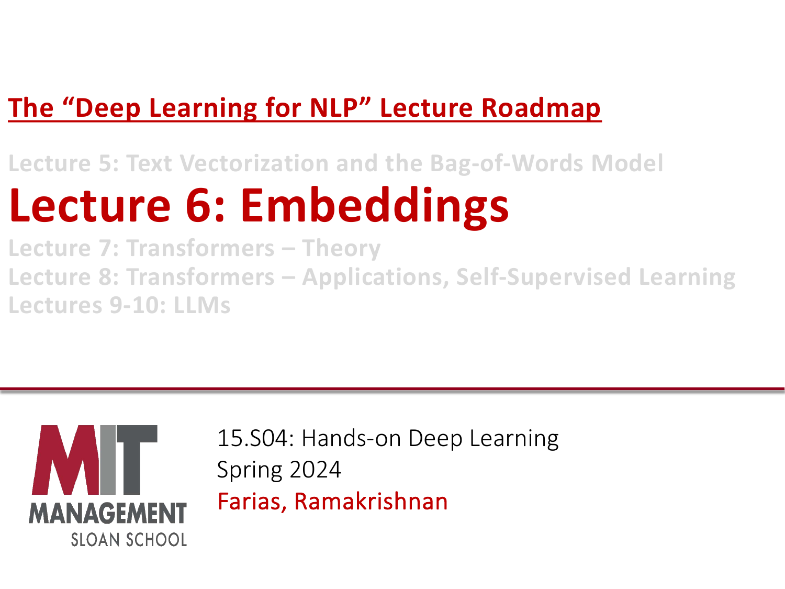
*Visual: bag-of-words ke baad agla step semantic geometry build karna hai.*

### One-hot problem dubara

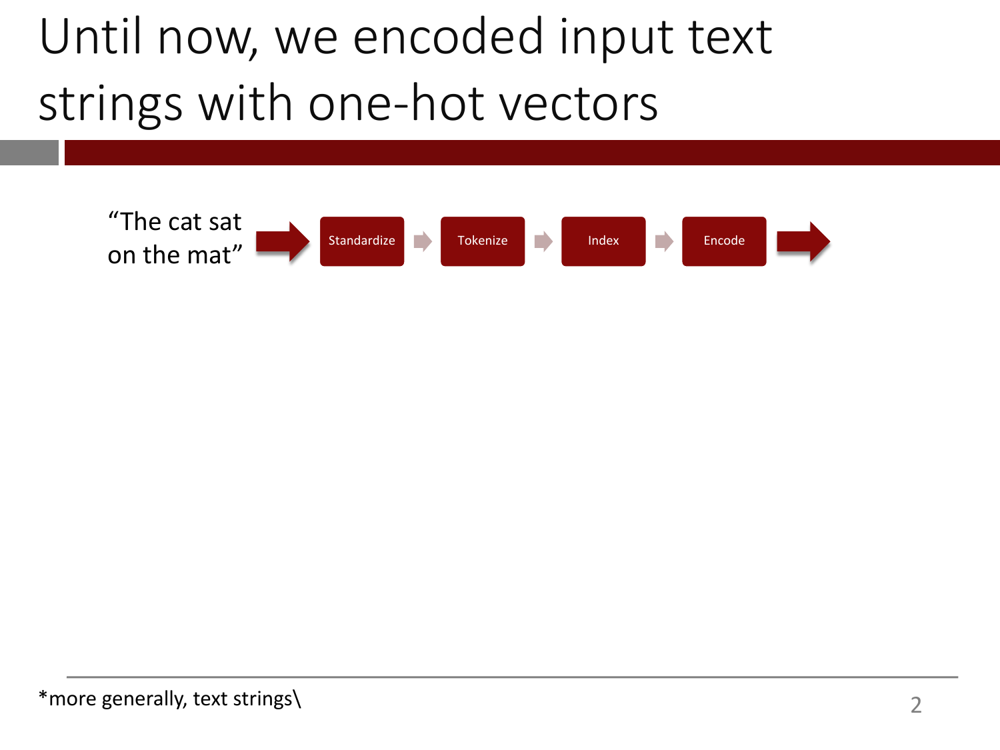
*Visual: one-hot vectors large hote hain aur semantic similarity express nahi karte.*

One-hot me do big issues:

- vector dimension huge hoti hai
- `cat` aur `dog` utne hi distant lagte hain jitne `cat` aur `banana`

Yaani:

- no notion of similarity
- no shared statistical strength

### Embedding intuition

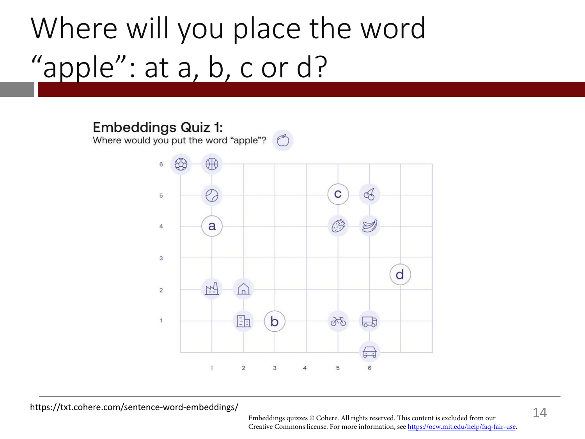
*Visual: word embedding ka idea hai ki similar usage wale words similar region me jayein.*

Embedding ek dense vector hota hai, for example:

- 50-d
- 100-d
- 300-d

Goal:

- similar meaning/context वाले words close aayen
- unrelated words far rahen

Example intuition:

- `king`, `queen`, `prince`
- `dog`, `cat`, `horse`
- `bank` context ke hisaab se alag neighborhoods me ja sakta hai

### Distributional hypothesis

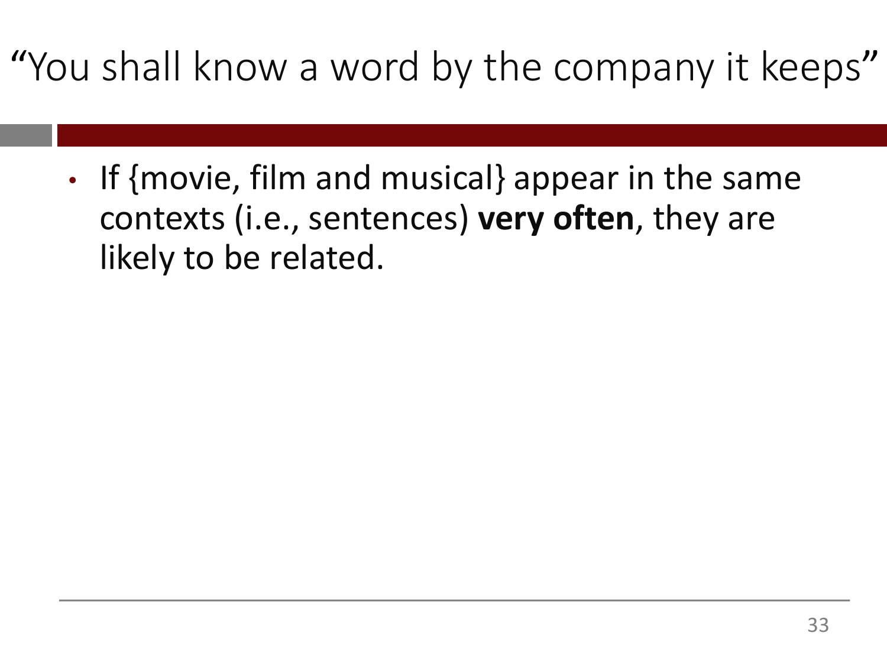
*Visual: surrounding context se meaning infer karne ka classic NLP principle.*

Core line:

`A word is known by the company it keeps`

Meaning:

- jo words similar contexts me aate hain, unka meaning often related hota hai

Ye idea embeddings ke peeche philosophical base hai.

### GloVe ka intuition

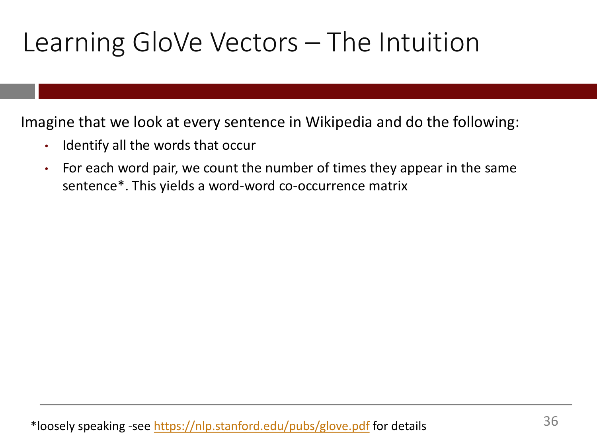
*Visual: co-occurrence counts se dense vectors learn kiye ja sakte hain.*

GloVe ka rough intuition:

- huge corpus lo
- dekho kaunse words kin words ke aas paas aate hain
- aise vectors seekho jo co-occurrence statistics ko explain kar sakein

Result:

- geometric space me semantic relations emerge kar sakte hain

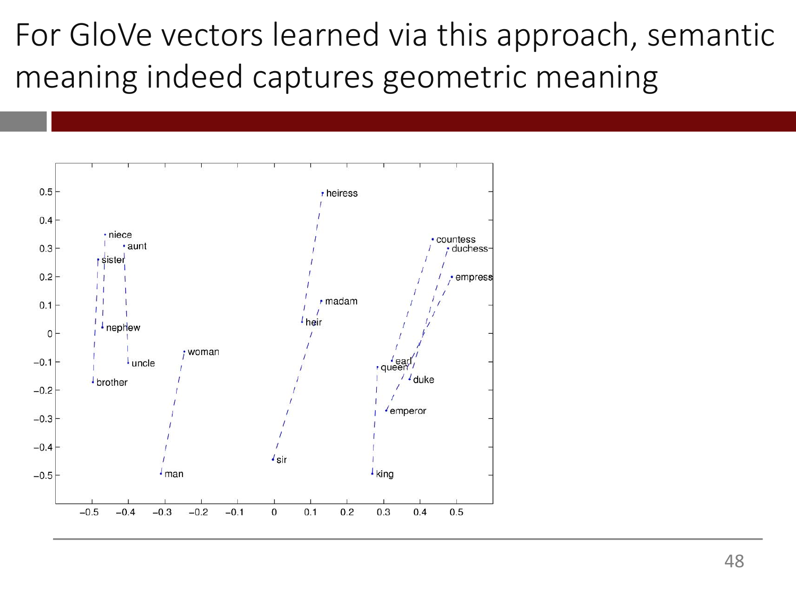
*Visual: embeddings me arithmetic-like relations emerge ho sakti hain.*

Classic intuition:

`brother - man + woman ≈ sister`

Important caution:

- ye every word pair ke liye exact algebraic truth nahi hota
- but semantic structure ke existence ka strong hint hai

### Keras me embeddings ka workflow

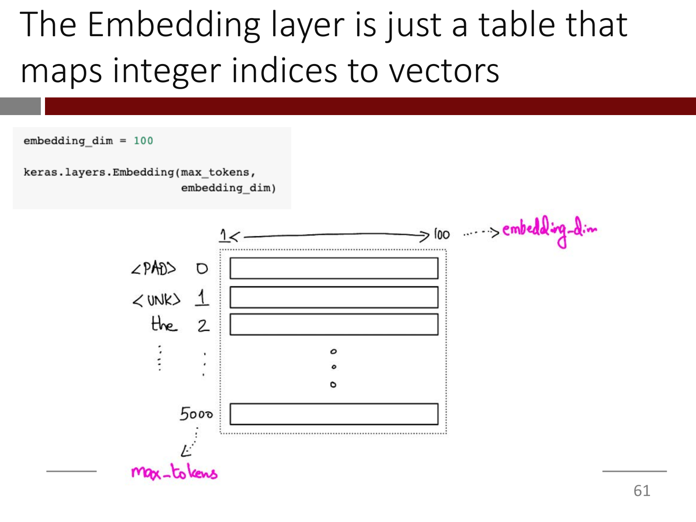
*Visual: embedding layer integer index ko dense vector me map karti hai.*

Lecture ka practical Keras pipeline:

1. text ko standardize/tokenize/index karo
2. encode stage par one-hot na banao
3. directly integer sequences lo
4. `Embedding` layer se each integer ko vector me map karo

Embedding layer literally ek trainable lookup table hai.

Sequence input:

- `[5, 10, 2, 2, 8]`

becomes:

- 5 vectors ki sequence

### Fixed-length vector kaise banega

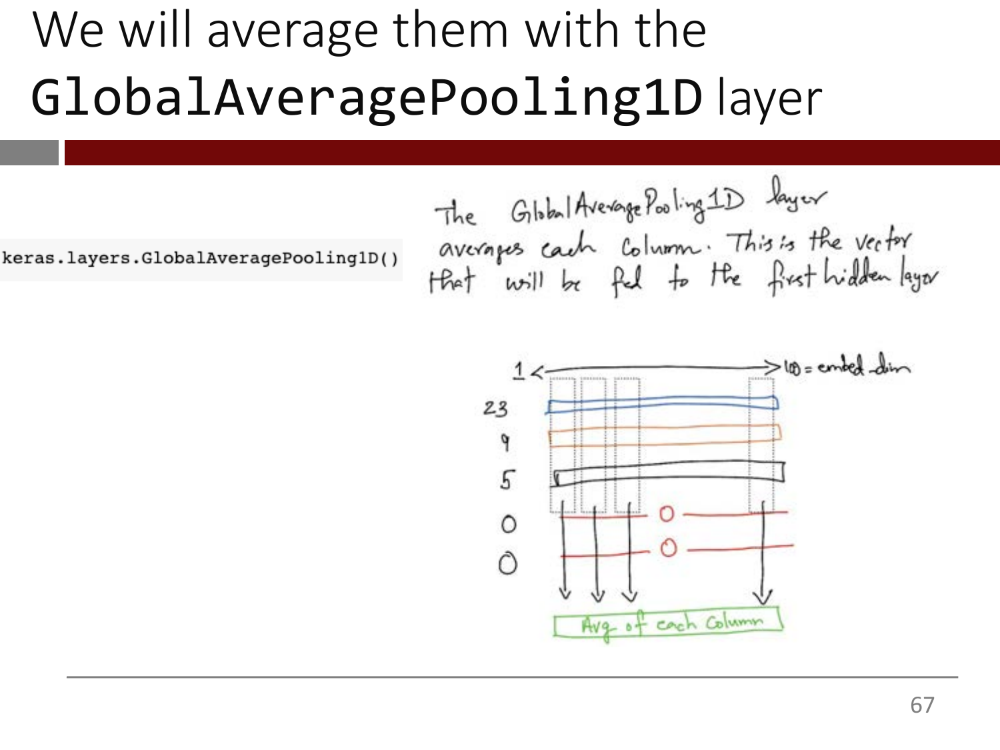
*Visual: token embeddings ko average karke sentence-level vector banaya ja sakta hai.*

Classifier ko end me fixed-size vector chahiye hota hai. Options:

- flatten
- sum
- average
- RNN/Transformer ke through context build

Lecture 6 ka chosen simple method:

- `GlobalAveragePooling1D`

Yaani:

- sentence ke saare token embeddings ka average le lo

Memory trick:

`Embedding gives word vectors`

`Pooling gives sentence summary`

### Notebook: Word Embeddings comparison

Notebook ne three strategies compare ki:

1. pretrained GloVe embeddings, frozen
2. pretrained GloVe embeddings, fine-tuned
3. embeddings learned from scratch

Common architecture theme:

- indexed token sequences
- `Embedding`
- `GlobalAveragePooling1D`
- dense classifier

Observed results:

- pretrained frozen: test accuracy around `0.6320`
- pretrained fine-tuned: around `0.6882`
- learned from scratch: around `0.7137`

### Deep Dive: pretrained always best kyu nahi hota

Ye important conceptual point hai.

Pretrained embeddings useful hote hain when:

- dataset small ho
- domain generic ho
- task close ho pretraining language se

But agar:

- data enough ho
- task/domain very specific ho

to scratch embeddings ya fine-tuned embeddings better kar sakte hain.

Analogy:

- pretrained embedding = general dictionary knowledge
- task-specific learned embedding = current exam ke liye focused prep

### Common Mistakes

- Sochna embedding bas compressed one-hot hai; actually semantic geometry bhi seekh sakti hai.
- Frozen aur trainable embeddings ka difference ignore karna.
- Sequence of embeddings aur single sentence embedding ko same samajhna.
- Semantic arithmetic ko magic truth samajhna.

### Memory Tricks

- `One-hot = identity only`
- `Embedding = identity + similarity`
- `GloVe = co-occurrence se meaning`
- `Pooling = word vectors se sentence vector`

### Recall Questions

1. One-hot vectors semantic similarity kyu capture nahi karte?
2. Embedding ka main objective kya hota hai?
3. Distributional hypothesis kya kehti hai?
4. `Embedding` layer practical terms me kya hoti hai?
5. `GlobalAveragePooling1D` ka role kya hai?
6. Frozen GloVe aur fine-tuned GloVe me difference kya hai?
7. Notebook me scratch-learned embeddings kyu better nikli hongi?

### Short Answer Key

1. One-hot vectors sparse hote hain aur do words ke beech meaning-based closeness encode nahi karte.
2. Embedding ka goal related words ko nearby dense vectors me place karna hai.
3. Distributional hypothesis kehti hai ki word ka meaning uske surrounding context se samjha ja sakta hai.
4. `Embedding` layer ek lookup table hai jo token IDs ko dense vectors me map karti hai.
5. `GlobalAveragePooling1D` token embeddings ko average karke fixed-length sentence vector banati hai.
6. Frozen GloVe me pretrained vectors update nahi hote; fine-tuned GloVe me task training ke dauran vectors adjust hote hain.
7. Likely dataset/task specific signal kaafi tha, isliye model ne scratch se zyada suitable task-specific embeddings seekh li.

---

## Lecture 7: Transformers I

### Lecture Snapshot

Lecture 7 ka goal:

- transformer ki need motivate karna
- word-to-slot classification jaise sequence labeling problem par apply karna
- context, order, aur same-length output ki requirement samjhana

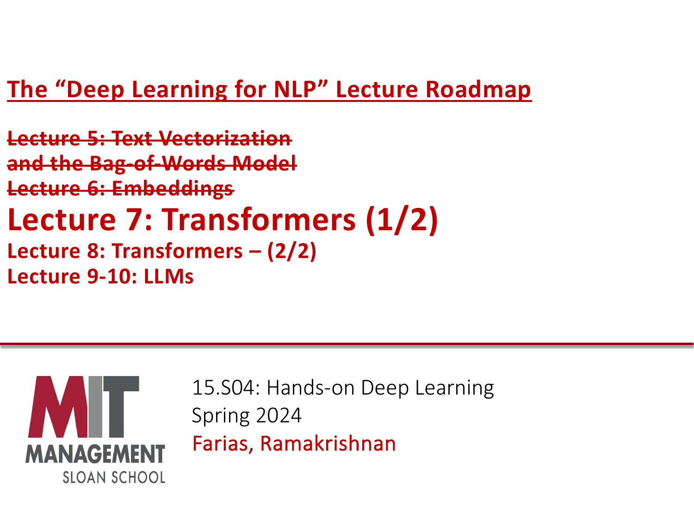
*Visual: transformer ko pehle abstract nahi, practical slot-filling task se introduce kiya gaya hai.*

### Motivating use-case: search / ATIS

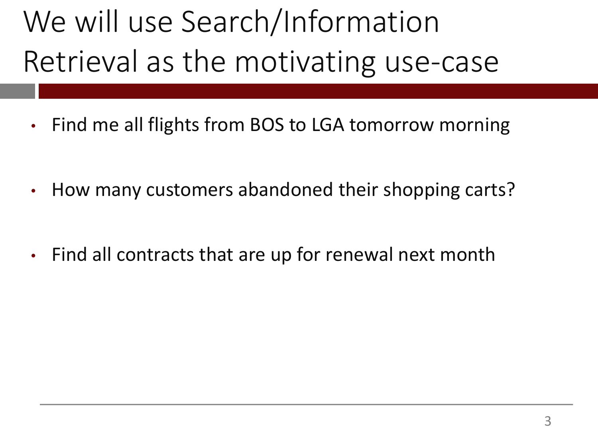
*Visual: natural-language query ko structured slots me todna.*

Input query:

`I want to fly from Boston to Denver tomorrow morning`

System ko intent aur entities nikalni hain:

- from-city
- to-city
- date
- time

Ye production NLP me common hai:

- search
- customer support
- virtual assistants
- enterprise query systems

### Slot filling kya hota hai

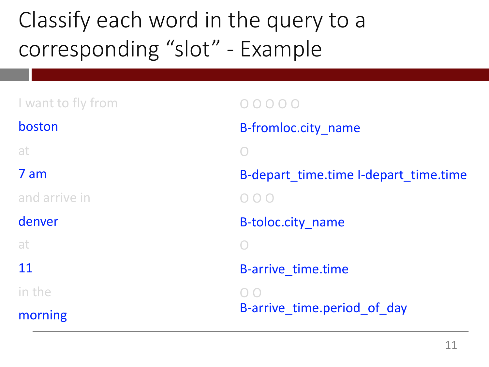
*Visual: har input word ko ek slot label assign kiya jata hai.*

Problem type:

- input sentence ke har token ke liye output label chahiye
- output length input ke equal honi chahiye

Example:

- `Boston` -> `B-fromloc.city_name`
- `Denver` -> `B-toloc.city_name`

Ye simple sentence classification se harder hai, kyunki:

- हर token classify karna hota hai
- context ke bina सही label mushkil hota hai

### Hume architecture se kya chahiye

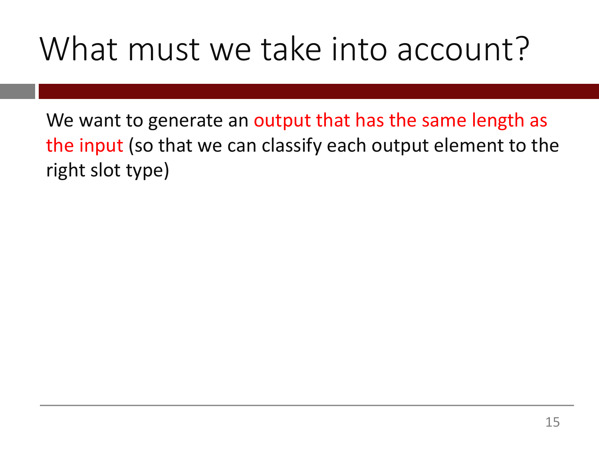
*Visual: same-length outputs, context sensitivity, aur order-awareness teen essential needs hain.*

Lecture ne three must-have requirements list ki:

1. surrounding context use ho
2. word order capture ho
3. output same length ka ho

Yahi transformer encoder ko motivate karta hai.

### Transformer architecture intuition

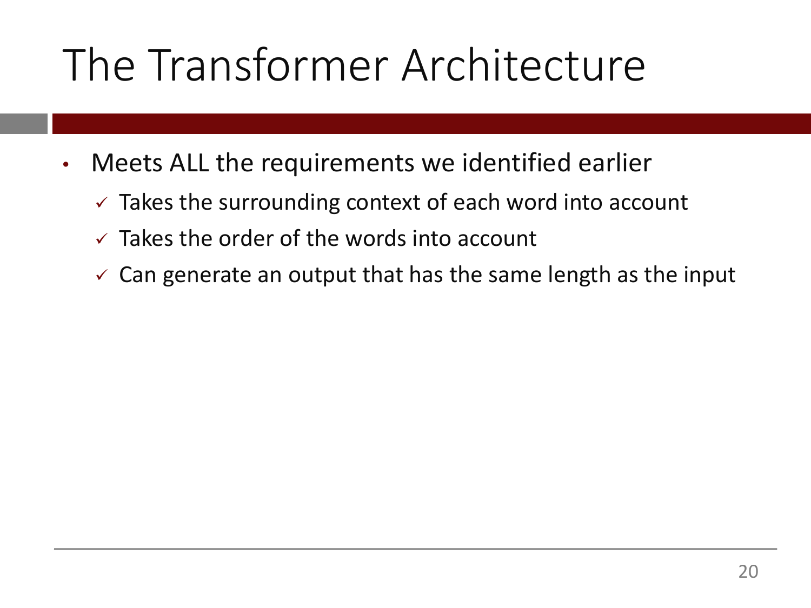
*Visual: transformer context aur order dono ko model karne ke liye designed hai.*

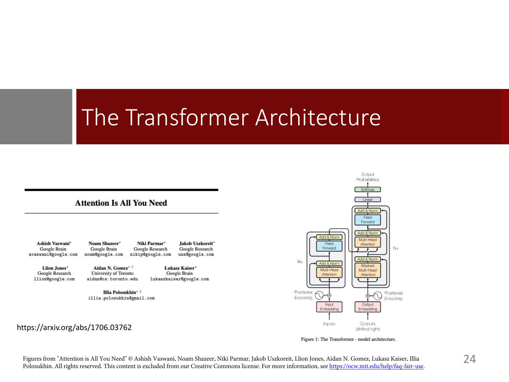
*Visual: attention-based architecture ne sequential bottleneck ko replace kiya.*

Basic idea:

- har word apne aas-paas ke relevant words ko attend kar sakta hai
- position information separately inject ki jati hai
- contextual embeddings ban jate hain

So final representation of word `bank` may depend on:

- nearby tokens
- sentence position
- task-specific learned relations

### Attention intuition

Self-attention ask karta hai:

- current word ko context samajhne ke liye kin dusre words ko dekhna chahiye?

Example:

Sentence:

`the train slowly left the station`

Word `left` ko classify ya understand karne ke liye `train` aur `station` useful हो सकते hain.

Transformer manually fixed window use nahi karta. Wo learned weights se decide karta hai ki kin words par focus karna hai.

### Multi-head idea ka preview

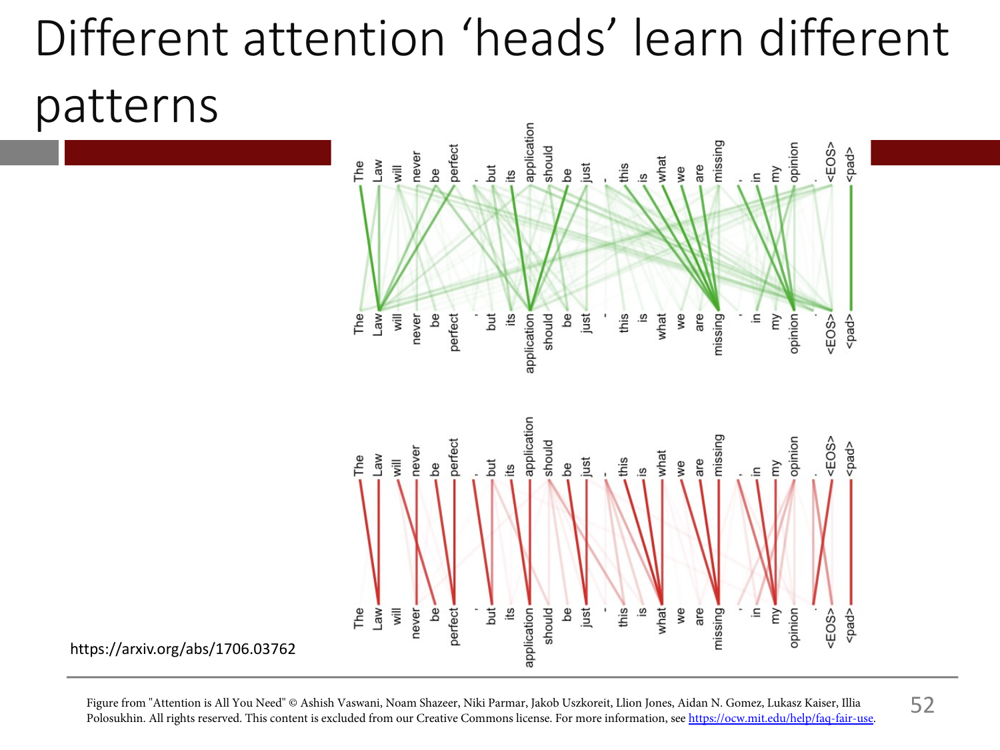
*Visual: alag attention heads alag relationships learn kar sakte hain.*

Ek head:

- subject-verb relation dekh sakta hai

Doosra:

- location words ya dates par focus kar sakta hai

Ye lecture 8 ke liye setup hai.

### Transformer encoder summary

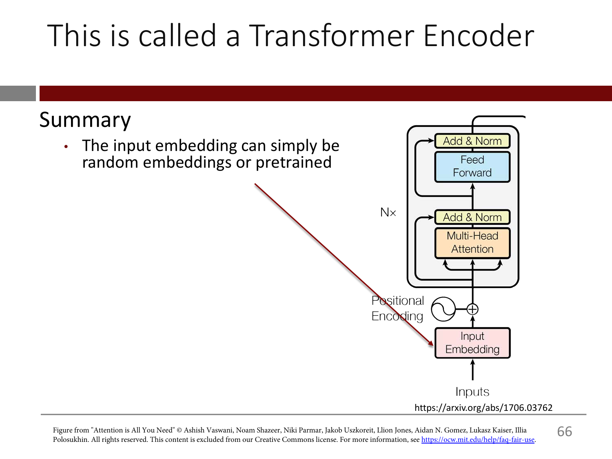
*Visual: input embeddings + position + attention + feedforward se contextual outputs milte hain.*

Output:

- same number of tokens
- but each token now context-aware vector ban chuka hota hai

### Notebook: ATIS slot filling

Notebook workflow:

- ATIS dataset load
- input tokenization
- output slot vocabulary bhi build
- custom `TokenAndPositionEmbedding`
- custom `TransformerEncoder`
- final per-token softmax layer

Compile theme:

- optimizer `adam`
- metric `sparse_categorical_accuracy`

Reported results:

- training accuracy above `99%`
- test overall accuracy around `0.9864`
- custom slot-only accuracy around `0.913`

Important lesson:

Overall accuracy high hone ke baad bhi slot-level business usefulness alag question hai. Agar key entity गलत nikle, system practically fail ho sakta hai.

### Deep Dive: same-length output kyu important hai

Slot filling me sentence-level label nahi chahiye. Har token ko tag chahiye.

So:

- input length = output length

If input me `10` words hain, output me bhi `10` slot labels hone chahiye. Transformer encoder naturally ye allow karta hai because it returns contextual vector for each position.

### Common Mistakes

- Transformer ko sirf text-generation model samajhna.
- Sequence classification aur token classification ko same samajhna.
- High overall accuracy ko perfect business performance samajhna.
- Position information ko optional samajhna.

### Memory Tricks

- `Slot filling = one label per word`
- `Transformer = context + order + same length`
- `Attention = kis word ko kitna dekhna hai`
- `Heads = multiple relation detectors`

### Recall Questions

1. ATIS-style slot filling problem me output structure kaisa hota hai?
2. Transformer se pehle lecture ne kaunse three requirements identify kiye?
3. Self-attention simple terms me kya karta hai?
4. Positional information kyu needed hai?
5. Multi-head attention ka intuition kya hai?
6. ATIS notebook me overall test accuracy aur slot-only accuracy me kya difference tha?
7. Business setting me slot-only accuracy kyu more meaningful ho sakti hai?

### Short Answer Key

1. Output same-length token-label sequence hota hai, yani har input word ke liye ek slot label.
2. Context use ho, order preserve ho, aur output input ke same length ka ho.
3. Self-attention har token ko relevant dusre tokens se learned weighted information lene deta hai.
4. Positional information ke bina model ko token order ka reliable signal nahi milta.
5. Multi-head attention ka intuition hai ki alag heads alag relation patterns parallel me seekhte hain.
6. Overall test accuracy roughly `98.64%` thi, jabki slot-only accuracy roughly `91.3%` thi.
7. Real applications me ek important entity galat nikalna overall accuracy ke high hone ke baad bhi system ko practically fail kar sakta hai.

---

## Lecture 8: Transformers II and Hugging Face Pipelines

### Lecture Snapshot

Lecture 8 transformer encoder ko complete karti hai:

- self-attention ko trainable banaya jata hai
- multi-head attention ka full intuition milta hai
- residual connection aur layer normalization ka role clear hota hai
- pre-trained transformer models ko direct use karne ka path dikhaya jata hai

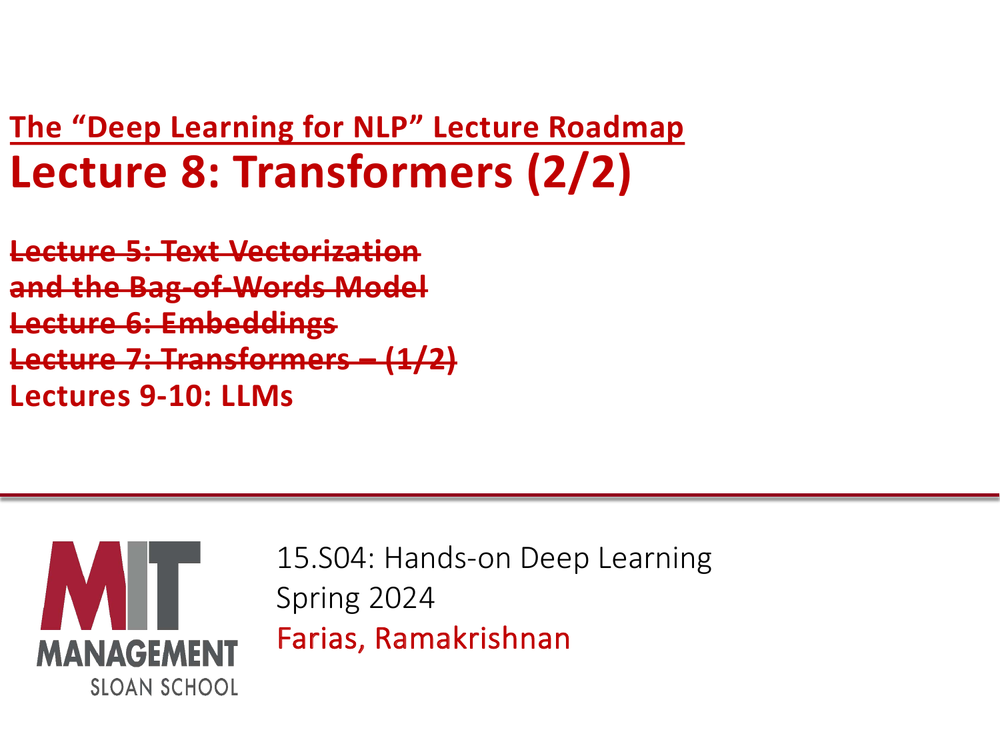
*Visual: transformer series ka second half implementation-relevant tweaks cover karta hai.*

### Review: positional embeddings

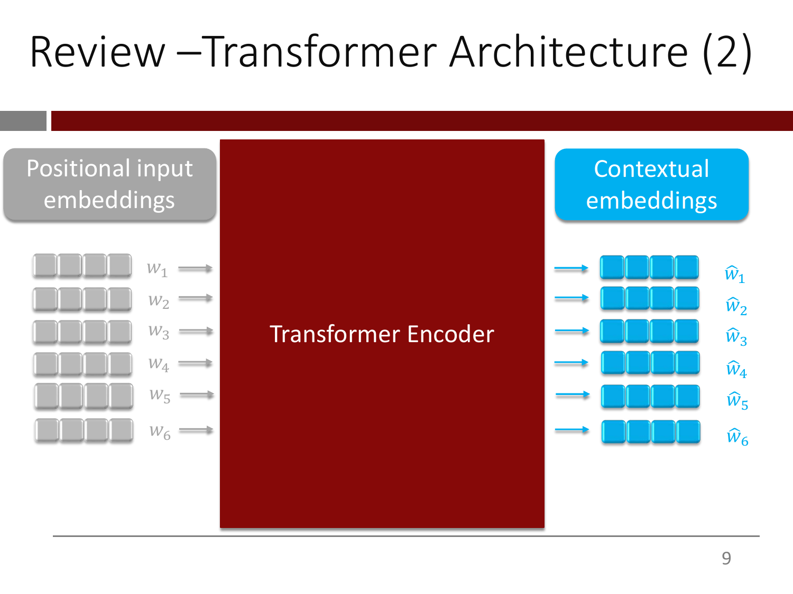
*Visual: token embedding me position information add ki jati hai taaki order preserve ho.*

Self-attention alone set-like behave kar sakta hai. Agar order inject na karo to:

- `dog bites man`
- `man bites dog`

representation dangerously similar ho sakti hai.

So transformer input usually:

`token embedding + positional embedding`

### Attention ko tunable kaise banate hain

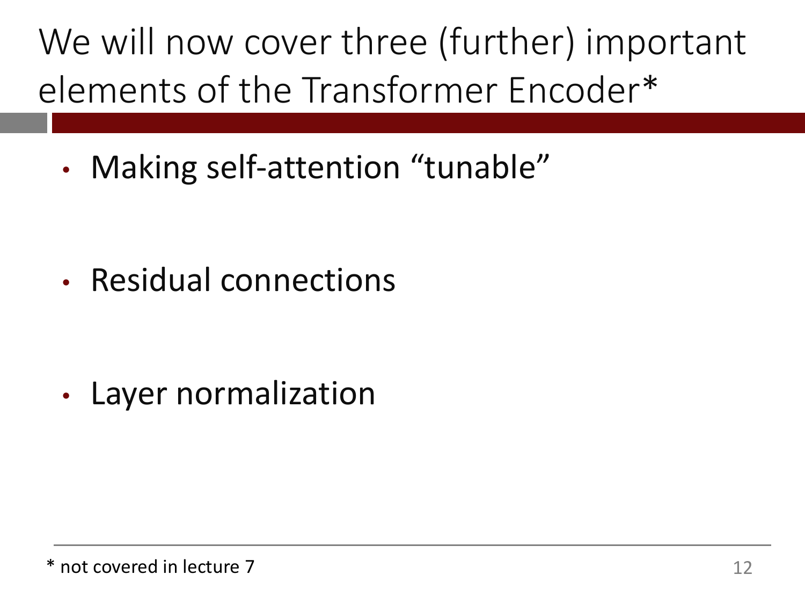
*Visual: Q, K, V projections, multi-head attention, residuals, aur layer norm core building blocks hain.*

Real transformer me raw embeddings directly compare nahi karte. Pehle learned linear projections se three spaces bante hain:

- `Q` = Query
- `K` = Key
- `V` = Value

Intuition:

- Query asks: mujhe kis tarah ki information chahiye?
- Key says: mere paas kis type ka signal hai?
- Value says: meri actual content information kya hai?

Then similarity between `Q` and `K` decides attention weight, aur weighted sum of `V` output banata hai.

### Multi-head attention

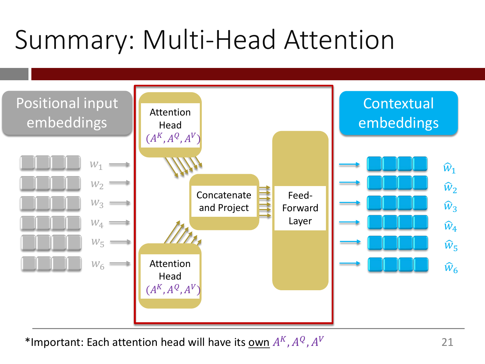
*Visual: multiple attention heads parallel me alag-alag patterns seekhte hain.*

Single attention pattern enough nahi hota. Different heads learn kar sakte hain:

- syntax
- entity relations
- long-range dependencies
- local phrase patterns

Memory trick:

`One head = one viewpoint`

`Multi-head = committee of viewpoints`

### Residual connections

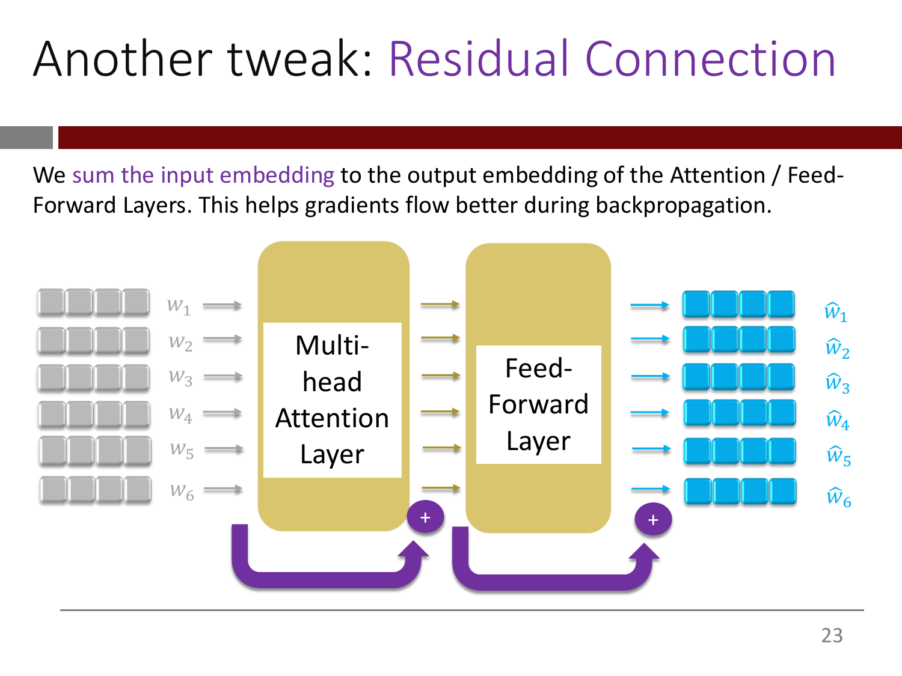
*Visual: input ko output ke saath add karke optimization easier banayi jati hai.*

Residual connection ka role:

- gradients ko flow karne me help
- deeper stacks ko stable banana
- useful old information ko preserve karna

Simple intuition:

- layer ko sab kuch from scratch rewrite nahi karna
- bas helpful adjustment learn karna hai

### Layer normalization

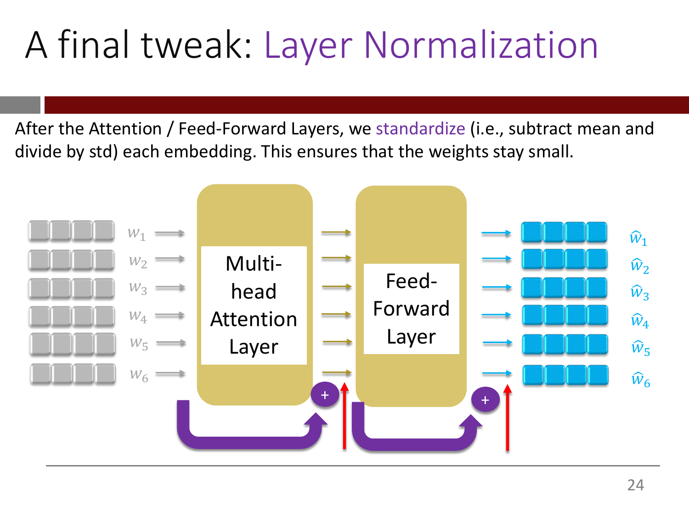
*Visual: har token embedding ko internal scale-shift stability ke saath normalize kiya jata hai.*

Layer norm:

- each embedding ke features ko standardize karta hai
- training ko stable banata hai
- deep transformers me optimization easier karta hai

Residual + layer norm combo modern deep architectures me repeatedly dikhta hai.

### Transformer stack ka bigger picture

Lecture ka practical message:

- input embeddings + positions
- attention block
- feed-forward block
- residual connections
- layer norm
- repeat many times

Yahi stack BERT-like aur many other transformer models ka core बनता hai.

### Hugging Face notebook: pretrained models without fine-tuning

Notebook ne dikhaya ki every transformer project zero se train karna zaroori nahi.

Tasks demonstrated:

- text classification
- named entity recognition
- question answering
- summarization
- text generation

Idea:

- Hugging Face pipeline or pretrained model load karo
- task-ready inference immediately mil sakta hai

Ye practical engineering point important hai:

`research understanding alag cheez hai, production leverage alag`

### BERT-family and broad applicability

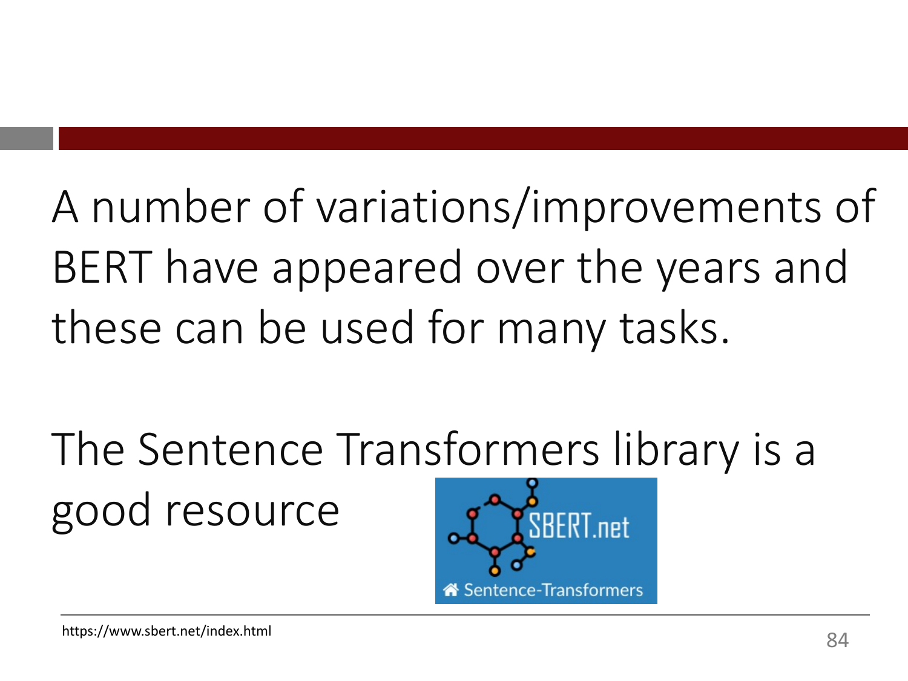
*Visual: pretrained transformer encoders multiple downstream tasks me reuse ho sakte hain.*

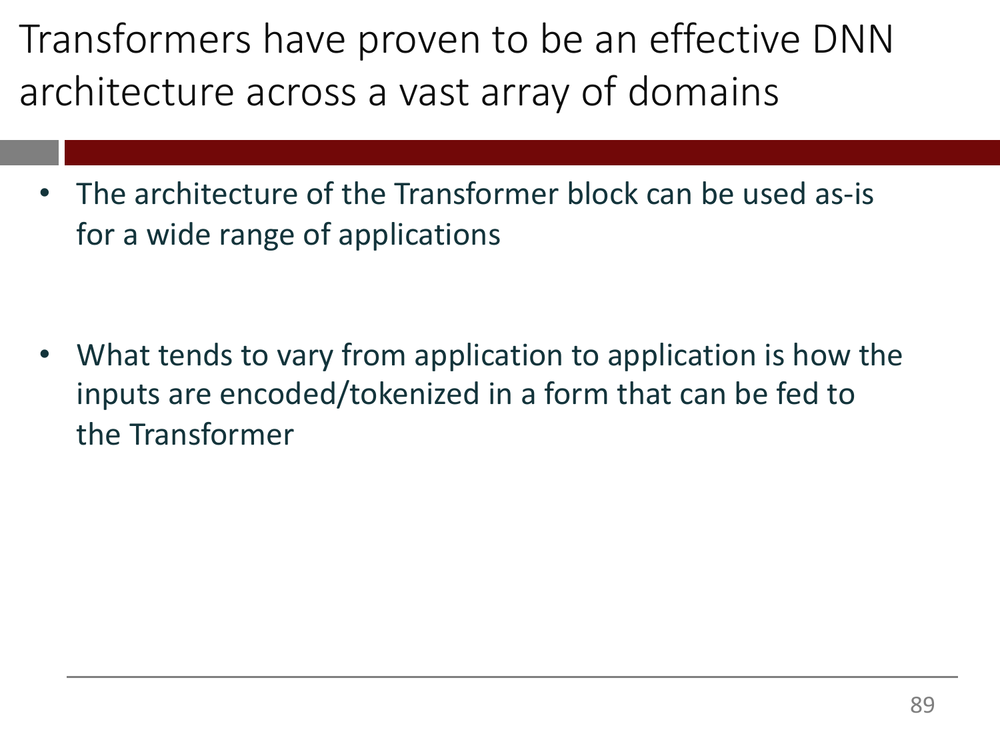
*Visual: transformer sirf NLP tak limited architecture nahi hai.*

Lecture ka meta-point:

- transformers versatile architecture ban chuke hain
- NLP se search, recommendation, multimodal systems tak spread ho chuke hain

### Common Mistakes

- Q, K, V ko three different datasets samajhna.
- Residual connection ko optional cosmetic tweak samajhna.
- Layer norm ko batch norm jaisa exactly same assume karna.
- Pretrained pipeline use karne ko conceptual understanding ka replacement samajhna.

### Memory Tricks

- `Q asks`
- `K advertises`
- `V carries content`
- `Residual = keep old path alive`
- `Layer norm = stabilize internal scale`

### Recall Questions

1. Positional embedding kyu needed hai?
2. Q, K, V ka rough role kya hai?
3. Multi-head attention single-head se better kyu ho sakta hai?
4. Residual connection training me kya help karti hai?
5. Layer normalization ka broad purpose kya hai?
6. Hugging Face notebook me kaun-kaunse NLP tasks shown the?

### Short Answer Key

1. Positional embedding order information inject karti hai, jo self-attention alone se naturally nahi milta.
2. Query poochta hai kya chahiye, Key batata hai mere paas kya signal hai, Value actual content information carry karta hai.
3. Multi-head attention alag-alag subspaces aur relation types ko parallel me model kar sakti hai.
4. Residual connection gradients ko flow karne aur old useful signal ko preserve karne me help karti hai.
5. Layer normalization internal scale ko stabilize karke deep training ko easier banati hai.
6. Notebook me text classification, NER, question answering, summarization, aur text generation shown the.

---

## Lecture 9: Large Language Models I

### Lecture Snapshot

Lecture 9 transformer encoder se autoregressive LLM tak jump karti hai:

- next-word prediction framing
- causal masking
- transformer decoder intuition
- GPT family intro
- decoding and tokenization basics

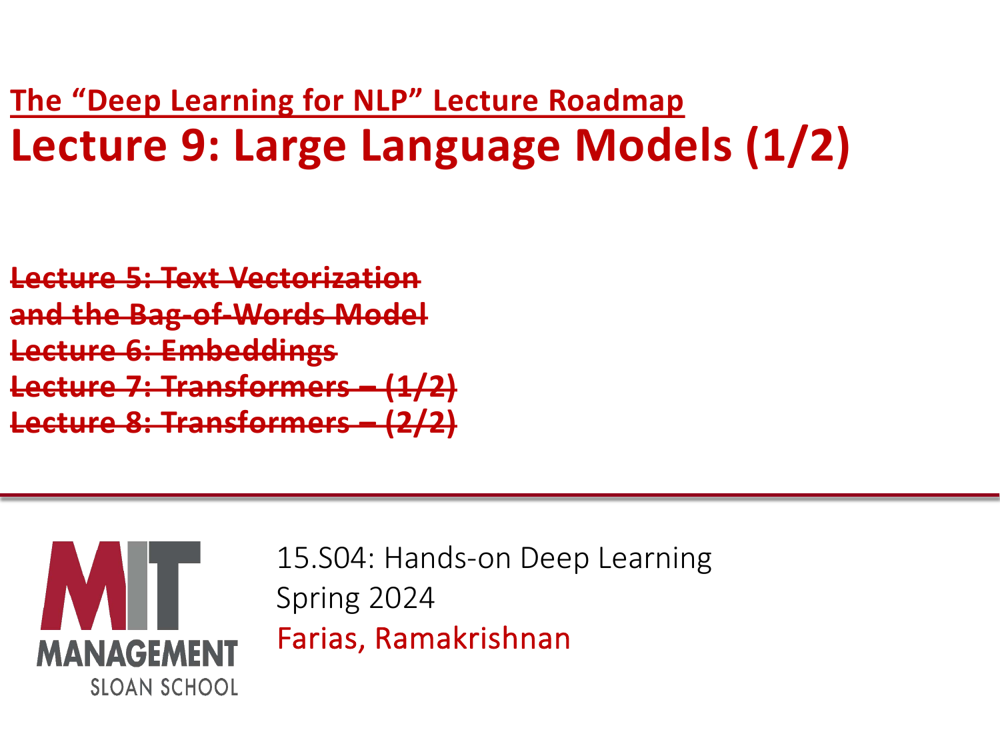
*Visual: LLM story ka first half next-token prediction se start hota hai.*

### Next-word prediction ka challenge

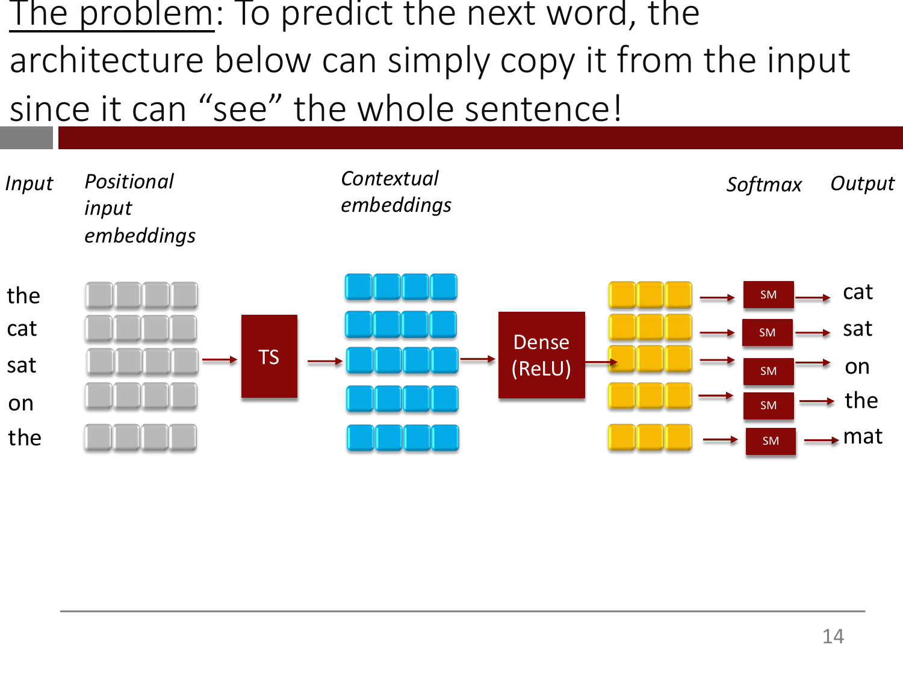
*Visual: agar model future word dekh lega to next-word prediction cheating ho jayegi.*

Agar input me sentence already complete dikha diya aur self-attention sab words dekh sakti hai, to:

- target next word ko copy karna easy ho jayega

This is label leakage.

So autoregressive training ke liye rule chahiye:

- current position future tokens ko attend na kare

### Causal / masked self-attention

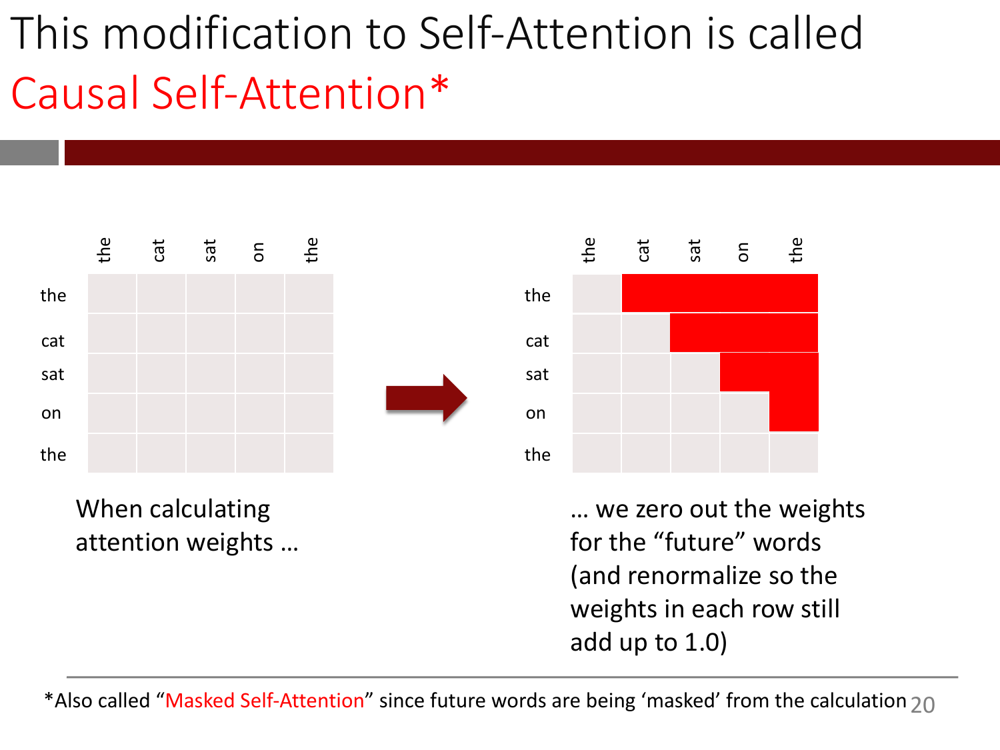
*Visual: future positions ko mask karke model ko sirf past context diya jata hai.*

Masking ka idea:

- future-word attention weights zero karo
- baaki weights renormalize karo

Ab prediction of word at position `t` depends only on:

- positions `<= t-1`

Memory trick:

`Bidirectional = full sentence samjho`

`Causal = future band, agla word bolo`

### Encoder-decoder vs decoder-only intuition

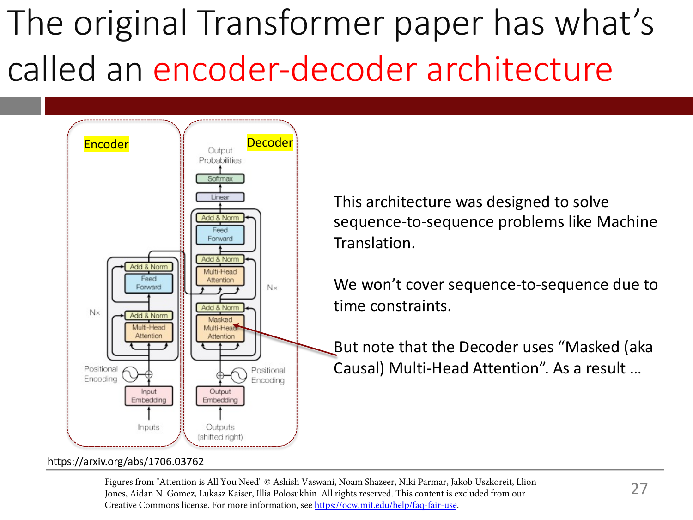
*Visual: original transformer me encoder aur decoder dono the.*

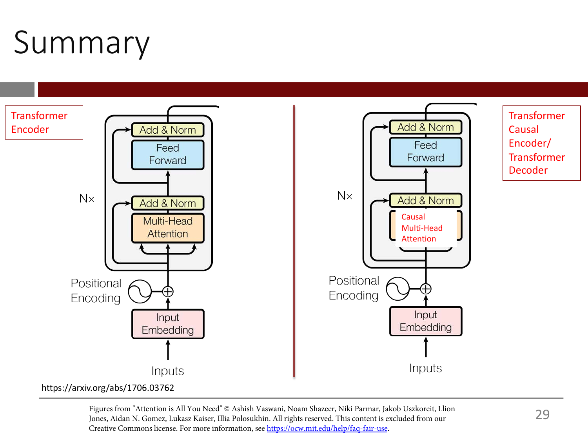
*Visual: masked self-attention wala stack practical LLM decoder ban jata hai.*

Lecture ne clarify kiya:

- original transformer paper had encoder-decoder setup
- GPT-style LLM practical sense me decoder-only / causal transformer stack use karta hai

Terminology warning:

- lecture material me `transformer causal encoder` aur `transformer decoder` language dono mil sakti hai
- main idea same hai: future-masked next-token predictor

### GPT family

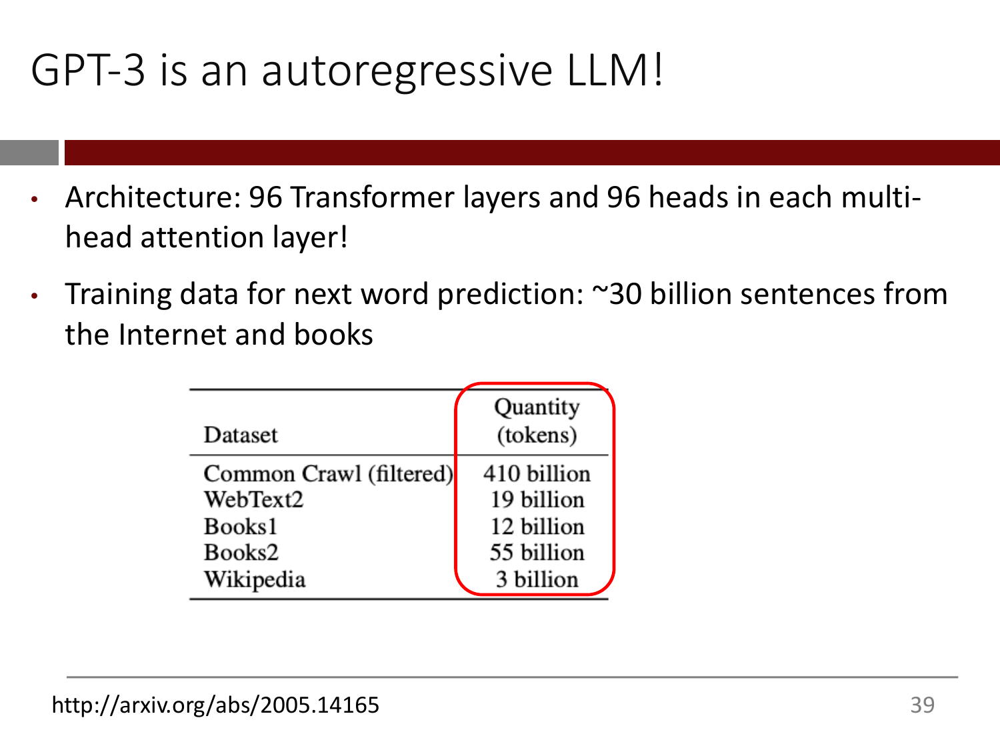
*Visual: GPT-3 ka scale aur autoregressive nature highlight kiya gaya hai.*

Lecture ke according GPT-3:

- autoregressive LLM hai
- `96` transformer layers
- `96` attention heads per layer

Training data scale:

- internet + books scale par tens of billions of sentences

Use cases:

- text generation
- summarization
- code generation
- QA
- chat-style interaction

### Decoding strategies

Autoregressive model next-token distribution nikalta hai. Output ka flavor sampling strategy se change hota hai.

Main options:

- greedy decoding
- random sampling
- top-k
- top-p / nucleus sampling
- temperature scaling

Interpretation:

- greedy = safest, but repetitive ho sakta hai
- temperature up = more randomness
- top-k = only best `k` candidates
- top-p = smallest token set whose probability mass reaches threshold `p`

### BPE tokenization

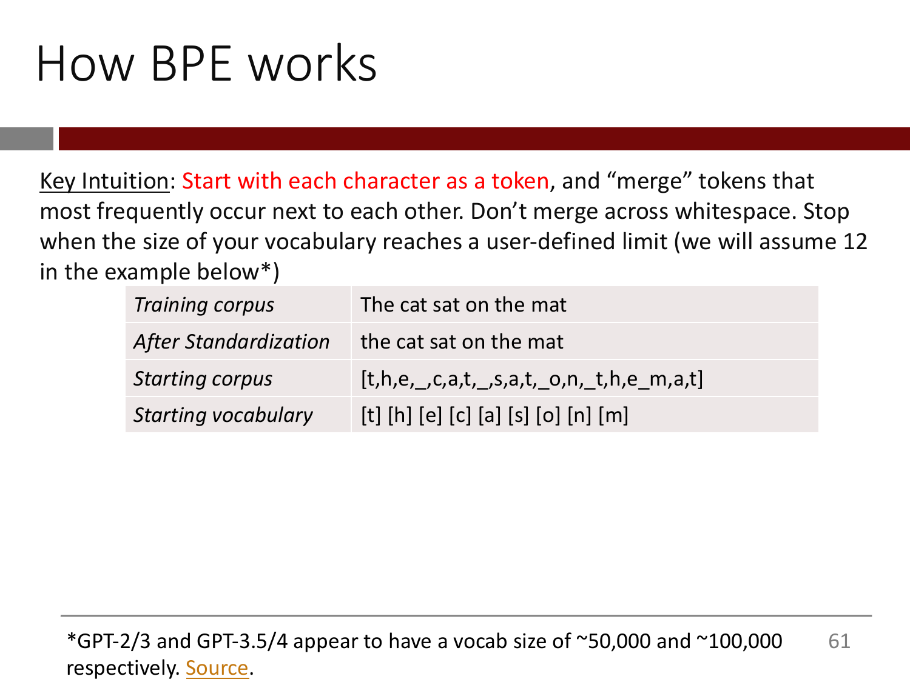
*Visual: characters se start karke frequent pairs merge karte hue useful subword tokens bante hain.*

BPE ka intuition:

- pure character-level too fine hota hai
- full-word vocabulary too huge hoti hai

So middle ground:

1. characters se start karo
2. frequent adjacent pairs merge karo
3. repeated merges se subword vocabulary build karo

Benefit:

- rare words ko bhi manageable pieces me break kiya ja sakta hai
- vocabulary explosion control hota hai

### Deep Dive: LLM actually kya learn karta hai

Important conceptual point:

LLM explicitly truth database memorize karne ke liye train nahi hota.

Primary objective:

- `next token prediction`

From this objective, it learns:

- syntax
- facts ka partial statistical trace
- style
- discourse patterns
- reasoning-like behavior ka some emergent structure

But objective aur downstream expectation identical nahi hote. Isi se hallucination issue bhi aata hai.

### Common Mistakes

- Sochna GPT direct word-level prediction karta hai; actually tokens predict karta hai.
- Greedy decoding ko always best output samajhna.
- Decoder-only ko encoder-decoder ke saath mix kar dena.
- Next-token training ko trivial autocomplete samajhna.

### Memory Tricks

- `Causal mask = future wall`
- `GPT = token-by-token generator`
- `BPE = subword compromise`
- `Decoding = probability se final text tak ka policy choice`

### Recall Questions

1. Next-word prediction me plain self-attention cheating kyu kar sakti hai?
2. Causal mask kya block karta hai?
3. GPT-style architecture original transformer se kaise different hai?
4. Greedy aur top-p decoding me conceptual difference kya hai?
5. BPE full-word tokenization se better compromise kyu hai?
6. LLM ka base training objective kya hota hai?

### Short Answer Key

1. Plain self-attention future tokens dekh sakti hai, to model target next word ko effectively copy kar sakta hai.
2. Causal mask future positions par attention ko block karta hai.
3. GPT-style model decoder-only causal transformer hota hai jo next-token generation ke liye built hota hai, unlike full bidirectional encoder-style visibility.
4. Greedy decoding har step par highest-probability token leti hai; top-p decoding probable token set se sampling karke more diverse output deti hai.
5. BPE subword pieces use karke rare words handle karta hai aur full-word vocabulary explosion se bachta hai.
6. LLM ka base objective next-token prediction hota hai.

---

## Lecture 10: Large Language Models II and RAG

### Lecture Snapshot

Lecture 10 ka focus:

- GPT-3 se InstructGPT / GPT-3.5 transition
- supervised fine-tuning
- reward modeling
- RLHF intuition
- practical notebook side par retrieval-augmented generation

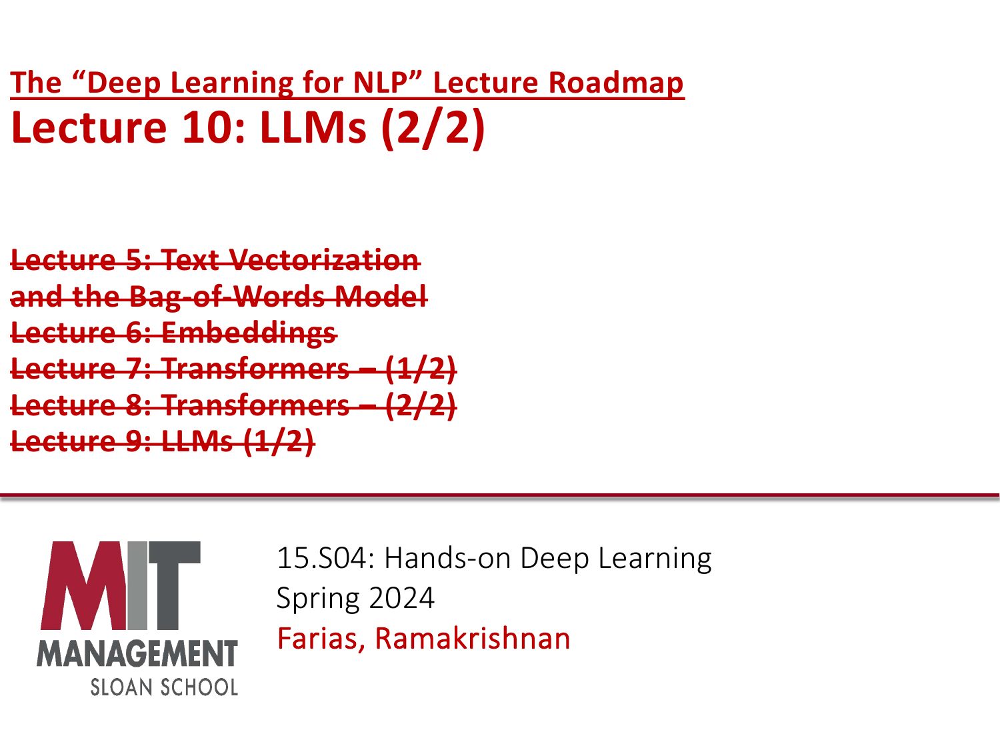
*Visual: LLM ko sirf fluent nahi, useful aur instruction-following banana goal hai.*

### GPT-3 ki limitation

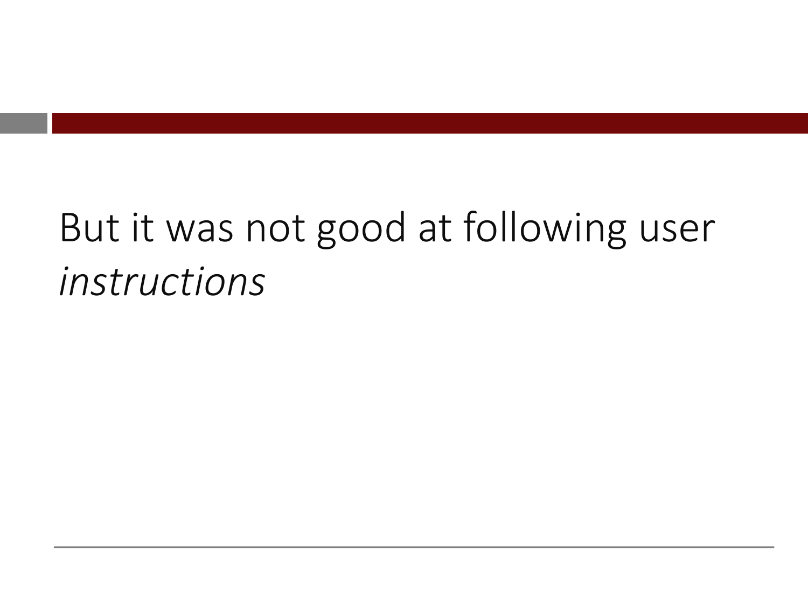
*Visual: raw completion model achha text likh sakta hai but direct instruction reliably follow nahi karta.*

GPT-3 strong completions generate karta tha, but problem:

- user instruction ka format aur intent reliably follow nahi karta

Reason:

- pretraining objective next-token prediction tha
- explicit instruction-answer behavior par direct alignment nahi hui thi

### Instruction tuning overview

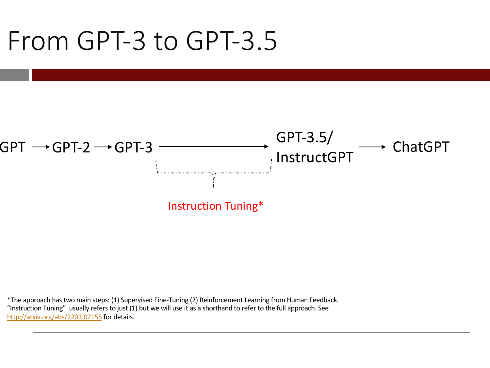
*Visual: base generative model ko instruction-following assistant me convert karne ka roadmap.*

Lecture ne three-stage alignment-style story di:

1. supervised fine-tuning
2. reward model training
3. reward-guided further optimization

### Step 1: Supervised Fine-Tuning

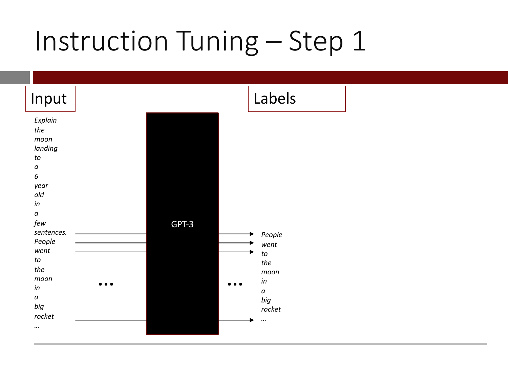
*Visual: humans high-quality instruction-answer pairs likhkar model ko direct behavior sikhate hain.*

MIT slide numbers ke according:

- roughly `12,500` high-quality instruction-answer examples

Goal:

- model ko directly sikhana ki clear instruction ka desired response kya hota hai

Effect:

- instruction-following dramatically improves

### Step 2: Reward model

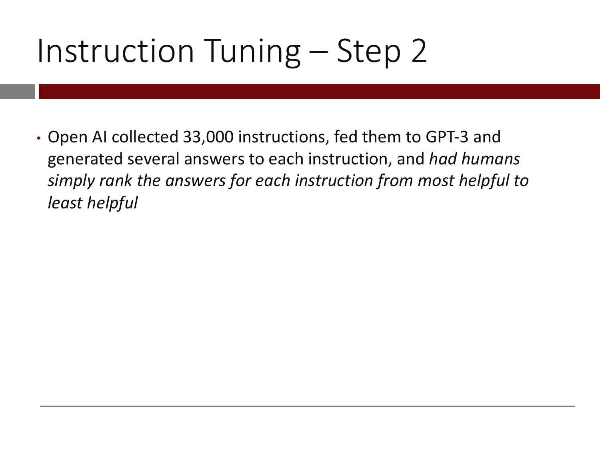
*Visual: humans multiple generated answers ko rank karte hain.*

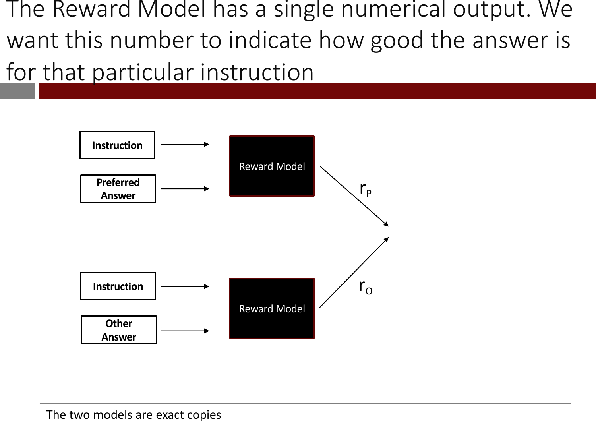
*Visual: reward model instruction-answer pair ko scalar quality score deta hai.*

Instead of always writing perfect answers, humans easier task karte hain:

- multiple answers me se better answer choose karo

OpenAI-style numbers cited in lecture:

- about `33,000` instructions
- generated candidate answers
- human preference rankings

Reward model learns:

- `instruction + answer -> scalar rating`

Loss intuition:

- preferred answer ko higher score milna chahiye than rejected answer

### Step 3: RLHF style nudging

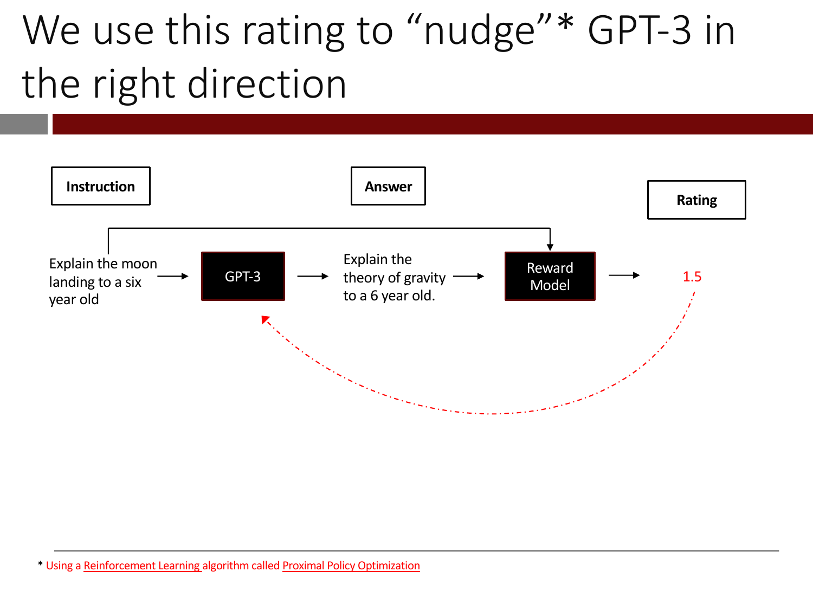
*Visual: reward signal use karke language model ko preferred behavior ki taraf push kiya jata hai.*

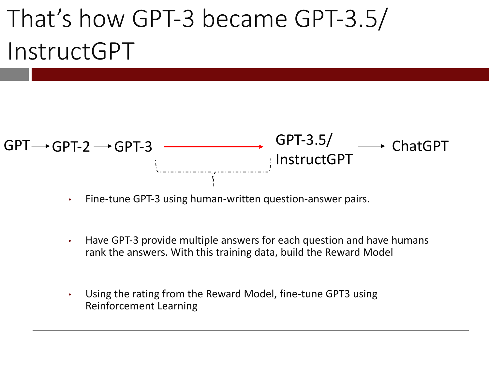
*Visual: SFT + preference optimization se assistant-like behavior emerge hota hai.*

Reward model se milne wala score use karke model ko repeatedly nudge kiya jata hai. Lecture ne broad RLHF framing di:

- answer generate karo
- reward model score do
- model weights update karo so preferred behavior more likely ho

Yahi rough path:

- GPT-3 -> InstructGPT / GPT-3.5

### Deep Dive: pretraining vs alignment

Pretraining model ko banata hai:

- fluent
- broad-knowledge-ish
- next-token competent

Alignment / instruction tuning model ko banata hai:

- helpful
- format-following
- safer
- more preference-consistent

Memory trick:

`Pretraining teaches language`

`Alignment teaches behavior`

### Notebook: Retrieval-Augmented Generation

Lecture PDF alignment par tha, but notebook extremely practical RAG flow cover karta hai.

Notebook ingredients:

- chat model: `gpt-3.5-turbo`
- embeddings model: `text-embedding-ada-002`
- custom corpus: Winter Olympics Wikipedia chunks

RAG flow:

1. documents ko chunks me split karo
2. har chunk ki embedding precompute karo
3. user query embed karo
4. cosine similarity se relevant chunks retrieve karo
5. prompt me context add karke LLM ko bhejo

Purpose:

- hallucination reduce karna
- model ko task-specific fresh context dena
- private knowledge base connect karna

### Prompt engineering vs RAG vs fine-tuning

Practical ladder:

- prompt engineering: cheapest
- RAG: new knowledge inject karne ke liye strong
- fine-tuning: behavior/style/domain specialization ke liye

If problem hai:

- `model facts bhool raha hai` -> RAG often better
- `model bolne ka style / output format wrong hai` -> fine-tuning may help more

### Common Mistakes

- Sochna instruction tuning model ko new factual world knowledge de deta hai.
- Reward model ko final chat model samajhna.
- RAG ko sirf long prompt samajhna; retrieval step central hai.
- Fine-tuning aur RAG ko interchangeable treat karna.

### Memory Tricks

- `SFT = show good answers`
- `Reward model = rank good vs bad`
- `RLHF = reward ke hisaab se behavior push`
- `RAG = retrieve before generate`

### Recall Questions

1. GPT-3 ki core limitation kya thi before instruction tuning?
2. SFT me kya data hota hai?
3. Reward model ka input-output structure kya hota hai?
4. RLHF broad terms me kya achieve karta hai?
5. RAG pipeline ke main steps kya hain?
6. New factual context ke liye RAG fine-tuning se zyada suitable kab hota hai?

### Short Answer Key

1. GPT-3 fluent completions de sakta tha but user instructions ko reliably follow nahi karta tha.
2. SFT me human-written high-quality instruction-answer pairs hote hain.
3. Reward model ka input instruction-answer pair hota hai aur output scalar quality score hota hai.
4. RLHF broad terms me model ko human-preferred, helpful responses ki taraf nudge karta hai.
5. Docs chunk karo, chunk embeddings banao, query embed karo, similarity se retrieve karo, phir retrieved context prompt me add karke LLM ko bhejo.
6. Jab problem fresh external ya private factual knowledge inject karna ho, tab RAG fine-tuning se zyada suitable hota hai.

---

## Lecture 10.5: Fine-Tuning and LoRA

### Lecture Snapshot

Lecture 10.5 ka objective:

- full fine-tuning ka cost samajhna
- memory bottlenecks identify karna
- LoRA ke low-rank trick se cheap adaptation samajhna

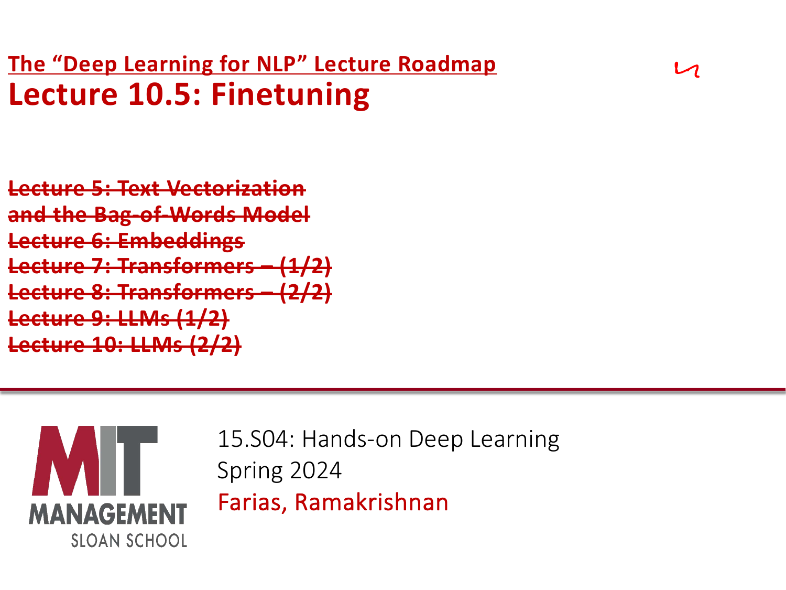
*Visual: prompt engineering, few-shot, RAG, aur fine-tuning ke beech ka decision space.*

### Fine-tuning actually kya hai

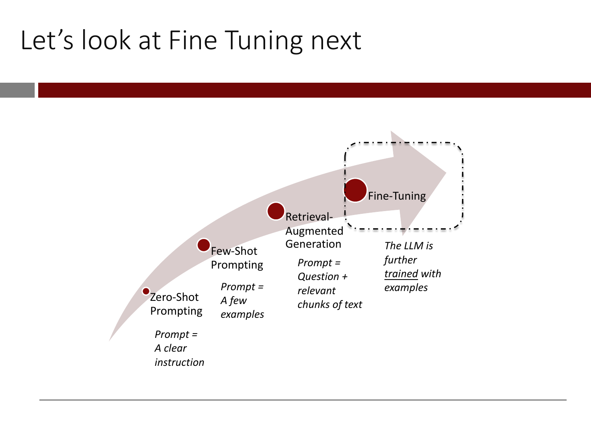
*Visual: prompting se aage badhkar model weights update karne ka option.*

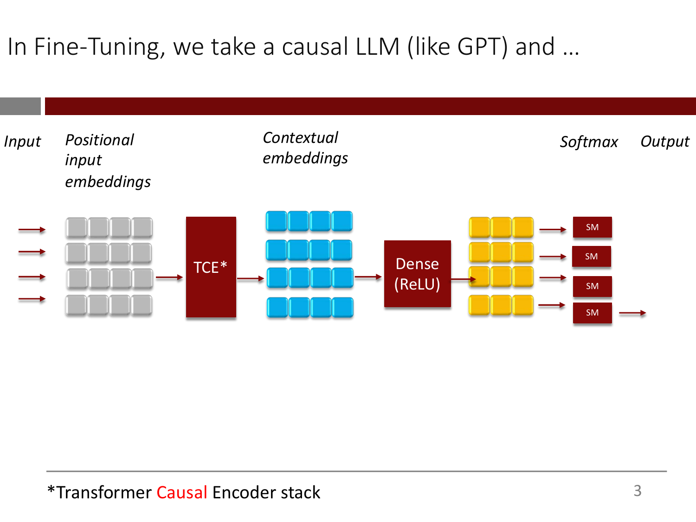
*Visual: base causal LLM ko domain-specific examples par further train kiya jata hai.*

Fine-tuning means:

- base pretrained model lo
- domain/task-specific input-output examples par further train karo
- some or all weights update karo

Use cases:

- domain tone
- task-specific formatting
- narrower instruction following
- niche terminology adaptation

### Full fine-tuning expensive kyu hai

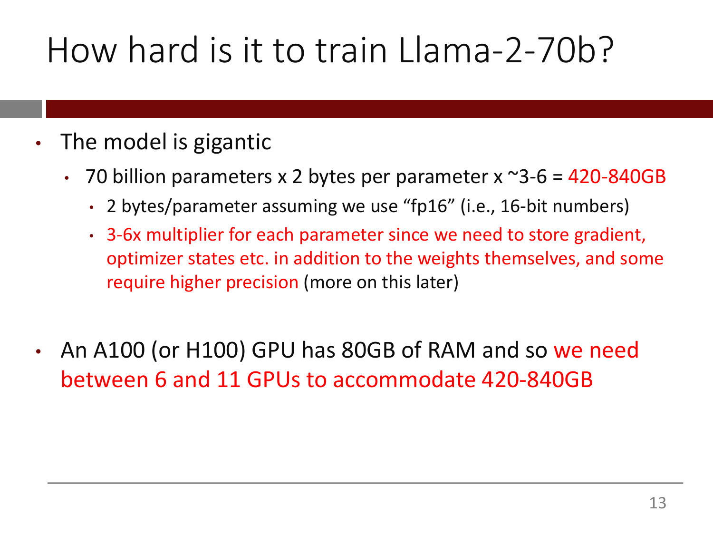
*Visual: 70B-scale model ka compute and memory cost massive hota hai.*

Lecture ke rough scale numbers:

- `70B` parameters
- `2` bytes per parameter at low precision
- overall memory need optimizer + gradients ke saath several hundred GB

Message simple hai:

- biggest models ko full fine-tune karna ordinary hardware par practical nahi

### Memory consumers

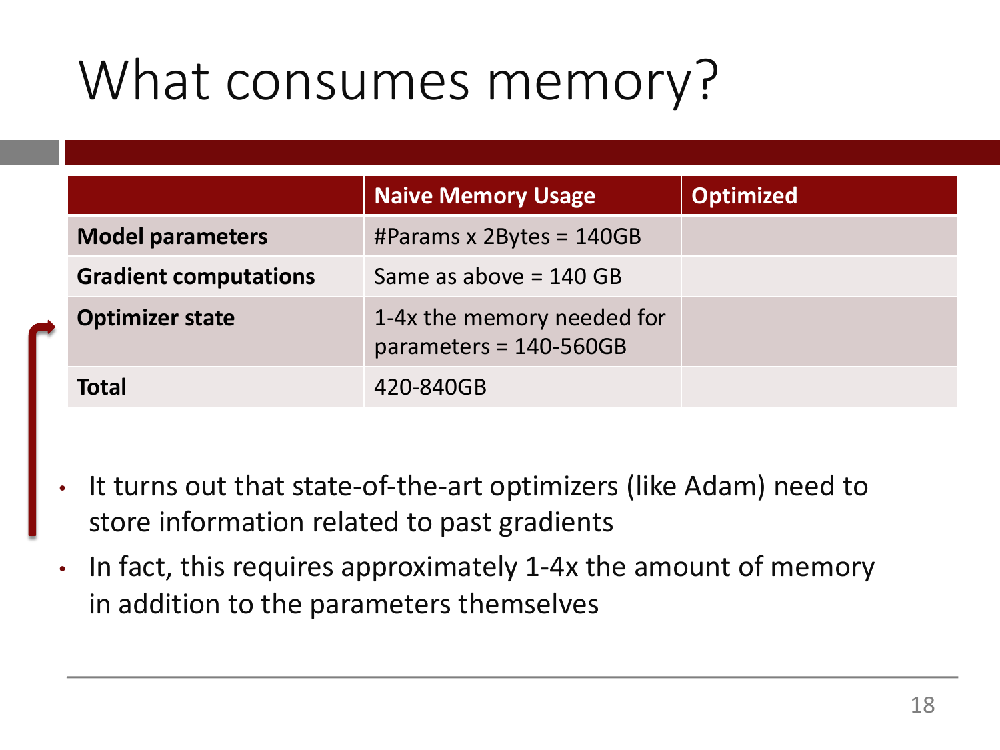
*Visual: model params ke alawa gradients aur optimizer state bhi huge cost lete hain.*

Main memory consumers:

- model parameters
- gradients
- optimizer states

Yahi reason hai ki sirf parameter count dekhna enough nahi hota.

### LoRA ka core idea

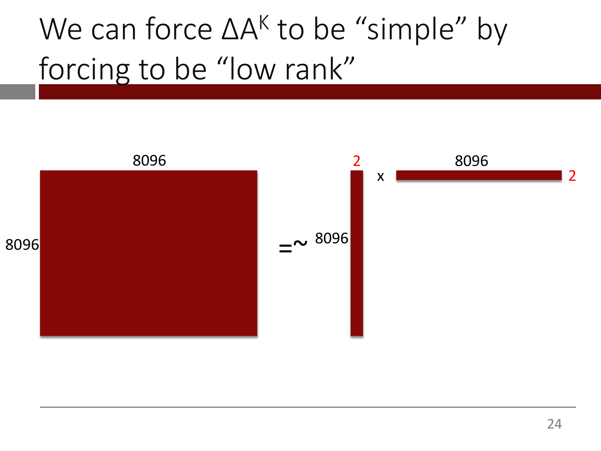
*Visual: full update matrix ko low-rank factorization me approximate karna.*

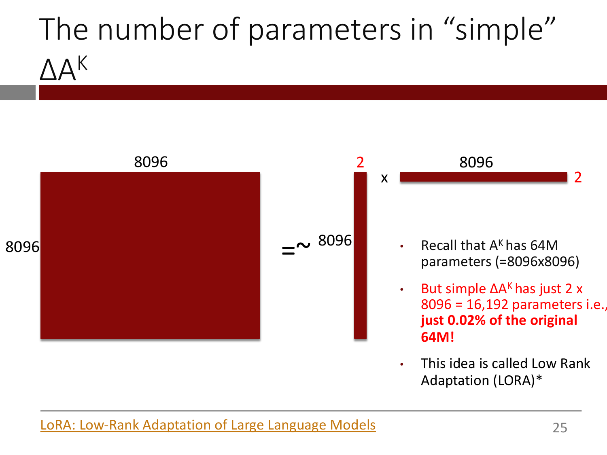
*Visual: full matrix update se compared low-rank adaptation dramatically fewer trainable params use karti hai.*

Instead of learning full update `ΔW`, LoRA says:

- assume useful update low-rank ho sakta hai
- `ΔW = B A`
- where rank `r` small hota hai

So:

- base weight freeze
- sirf tiny trainable low-rank adapters learn

Ye especially attention matrices (`Q`, `K`, `V`) par useful hai.

### LoRA optimization flow

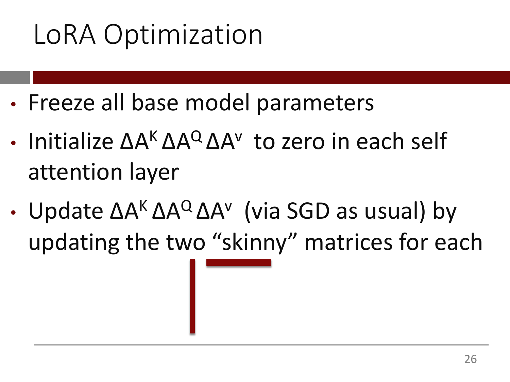
*Visual: base model frozen rahta hai, sirf adapter weights learn hote hain.*

Benefits:

- far fewer trainable params
- gradient/optimizer memory drastically lower
- large model adaptation accessible ho jati hai

Memory trick:

`Full fine-tune = move whole mountain`

`LoRA = attach small steering wheels`

### Notebook: LoRA fine-tuning

Notebook story:

- Gemma-like causal model flow
- pre-finetune inference examples
- LoRA setup
- post-finetune outputs compare

Prompts included examples like:

- Europe trip planning
- Explain photosynthesis to a 6-year-old

Practical lesson:

- full model rewrite ki zarurat nahi
- lightweight adapters task behavior shift kar sakte hain

### Deep Dive: RAG vs fine-tuning vs LoRA

If need is:

- new factual knowledge -> RAG often first choice
- better output style / domain behavior -> fine-tuning/LoRA stronger choice
- low budget adaptation -> LoRA attractive

### Common Mistakes

- Sochna LoRA model ko zero cost par train kar deta hai.
- LoRA ko quantization ke same samajhna.
- Fine-tuning ko factual memory injection ka default answer samajhna.
- Frozen base model ka meaning samjhe bina adapter concept use karna.

### Memory Tricks

- `Fine-tuning = update behavior`
- `Memory cost = params + grads + optimizer`
- `LoRA = low-rank adapters`
- `Freeze big, train small`

### Recall Questions

1. Full fine-tuning expensive kyu hoti hai?
2. Training memory me kaunse three big components hote hain?
3. LoRA ka main mathematical intuition kya hai?
4. Attention matrices LoRA ke common target kyu hote hain?
5. RAG aur LoRA me decision kaise loge?

### Short Answer Key

1. Full fine-tuning me giant model ke bahut saare parameters, gradients, aur optimizer states handle karne padte hain.
2. Teen big components hain model parameters, gradients, aur optimizer state.
3. LoRA ka intuition hai full update matrix ki jagah low-rank update `BA` learn karo.
4. Attention matrices bade aur behaviorally important hote hain, isliye unhe adapt karke model behavior ko cheaply shift kiya ja sakta hai.
5. Fresh facts chahiye to RAG choose karo; style, formatting, ya domain behavior adaptation chahiye to LoRA useful hai.

---

## Lecture 11: Diffusion Models for Image Generation

### Lecture Snapshot

Lecture 11 ka main arc:

- image generation from noise
- denoising training setup
- U-Net architecture
- CLIP-based text conditioning
- Stable Diffusion style systems

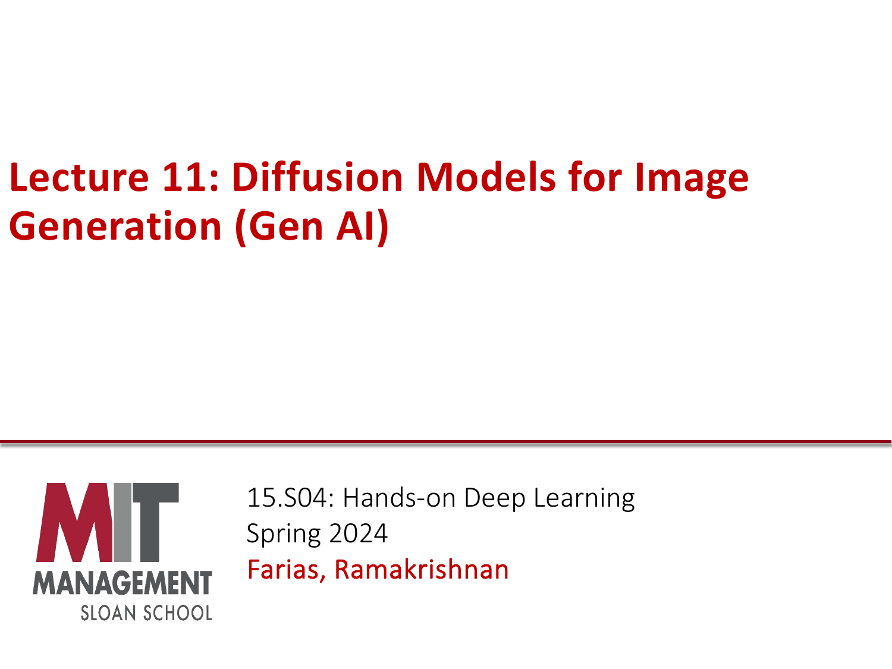
*Visual: generative image models ko diffusion framing se introduce kiya gaya hai.*

### Motivation: direct generation hard hai

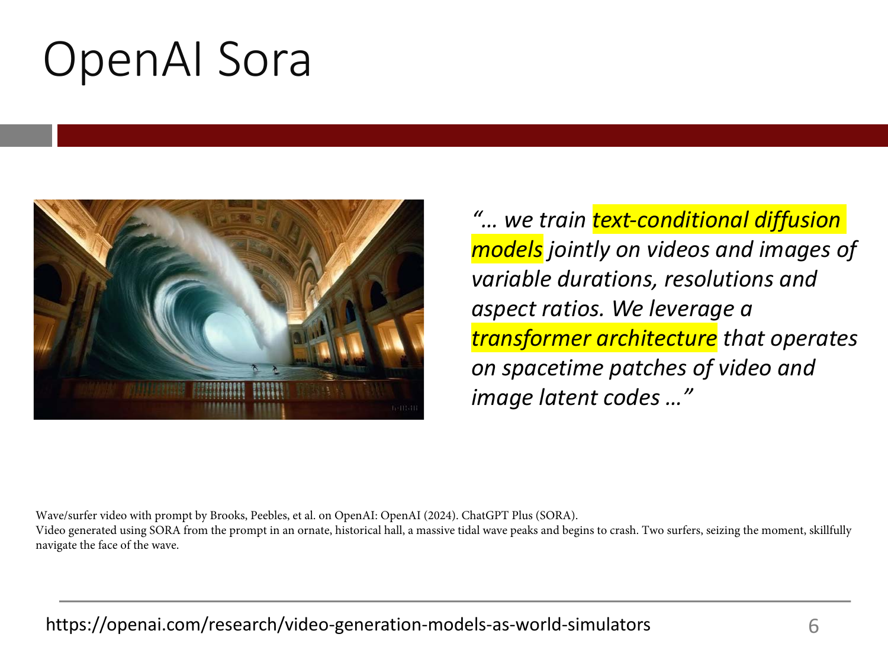
*Visual: text-to-image se text-to-video tak diffusion family ka broader context.*

Raw text se directly high-quality image generate karna difficult hai. Lecture ne smarter framing di:

- pure image create karna hard
- but image me noise add karna easy hai
- maybe reverse problem solve karna easier ho

### Noise se training pairs banana

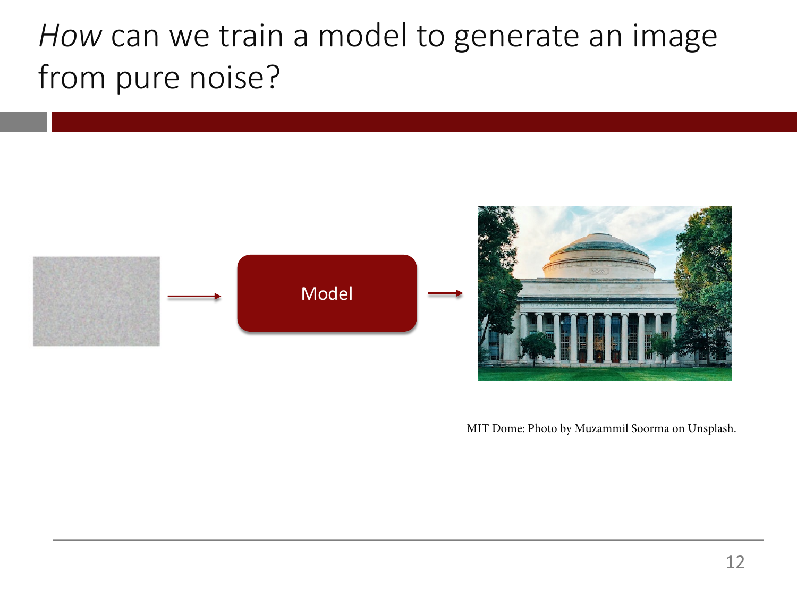
*Visual: pure noise se target image tak jana direct nahi, staged denoising se possible banta hai.*

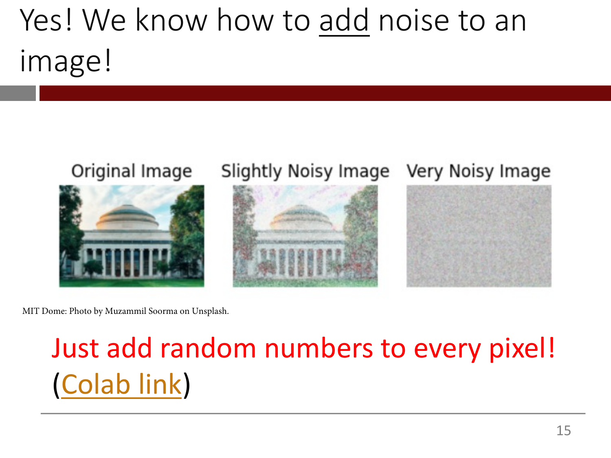
*Visual: original image se noisy version banana straightforward process hai.*

Training idea:

1. clean image lo
2. usme thoda random noise add karo
3. noisy image aur less-noisy target pair banao
4. denoising DNN train karo

Inference:

- pure noise se start
- repeatedly denoise
- final image emerge hoti hai

### Repeated denoising process

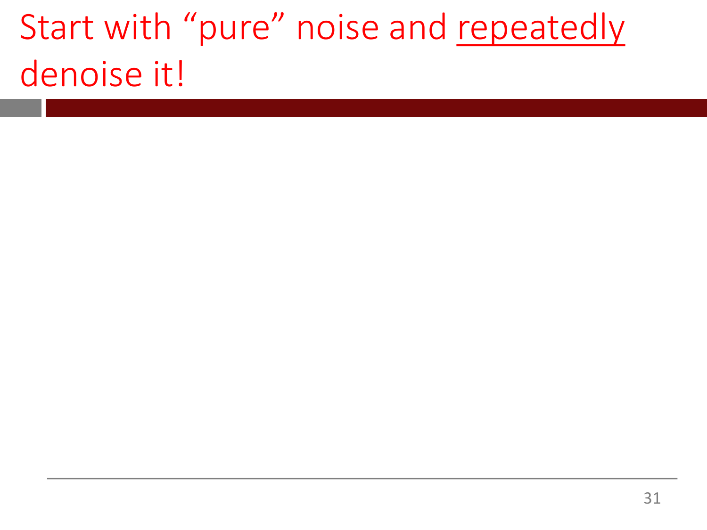
*Visual: one-step denoiser ko many times apply karke final image recover ki jati hai.*

This is the heart of diffusion intuition:

- ek giant one-shot generator ki jagah
- many small corrective denoising steps

Memory trick:

`Generate = start messy, clean gradually`

### Better target: noise predict karo

Lecture ka important improvement:

- model se directly clean image predict karwana zaroori nahi
- instead model noise component `epsilon` predict kare
- phir usse subtract karke cleaner image mil sakti hai

Ye optimization aur stability dono ke liye helpful hota hai.

### U-Net architecture

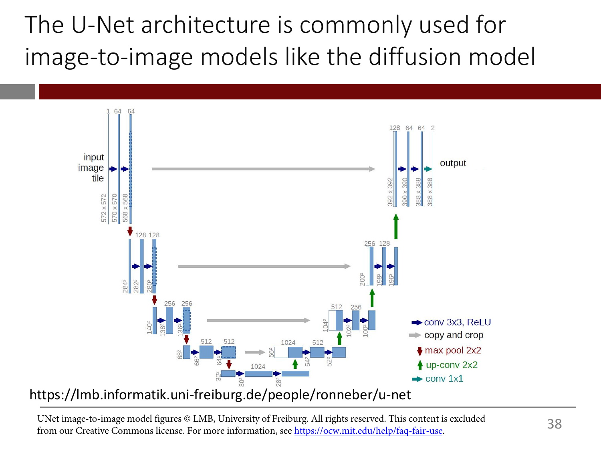
*Visual: left side compress karti hai, right side reconstruct karti hai, skip connections detail preserve karte hain.*

U-Net structure:

- left side: conv + pooling
- right side: upsampling / transpose conv
- skip connections: matching resolution features ko later stage tak le jana

Why useful:

- coarse global structure bhi milti hai
- fine local detail bhi preserve hoti hai

### Prompt ko image generation me kaise inject karte hain

Goal:

- prompt `a red cat on a sofa`
- generated image us prompt ke semantic meaning se aligned ho

Need:

- text and images ko shared concept space me map karna

### CLIP intuition

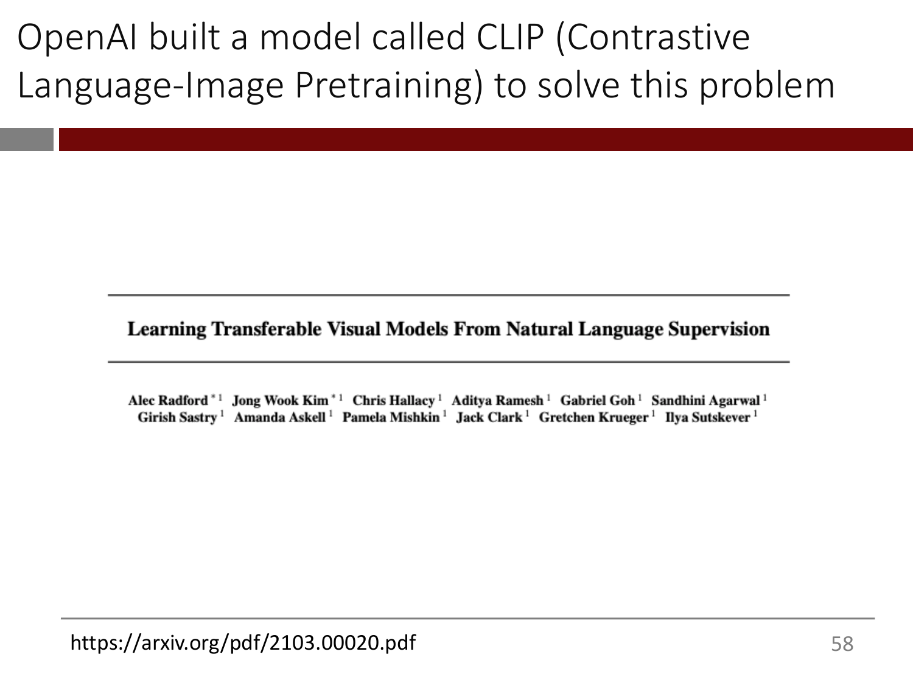
*Visual: text encoder aur image encoder ko same semantic space me align kiya jata hai.*

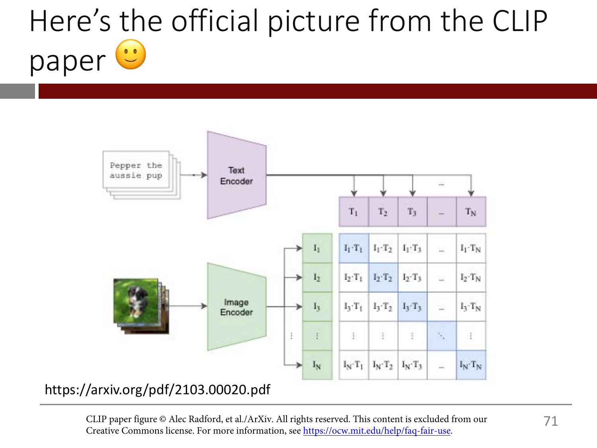
*Visual: matching image-caption pairs ko close aur mismatched pairs ko far push kiya jata hai.*

CLIP setup:

- text encoder
- image encoder
- both produce embeddings

Training objective:

- matching image-caption pair close
- mismatched pair far

By doing this on huge dataset:

- prompt embedding meaningful semantic controller ban jata hai

### Diffusion + CLIP conditioning

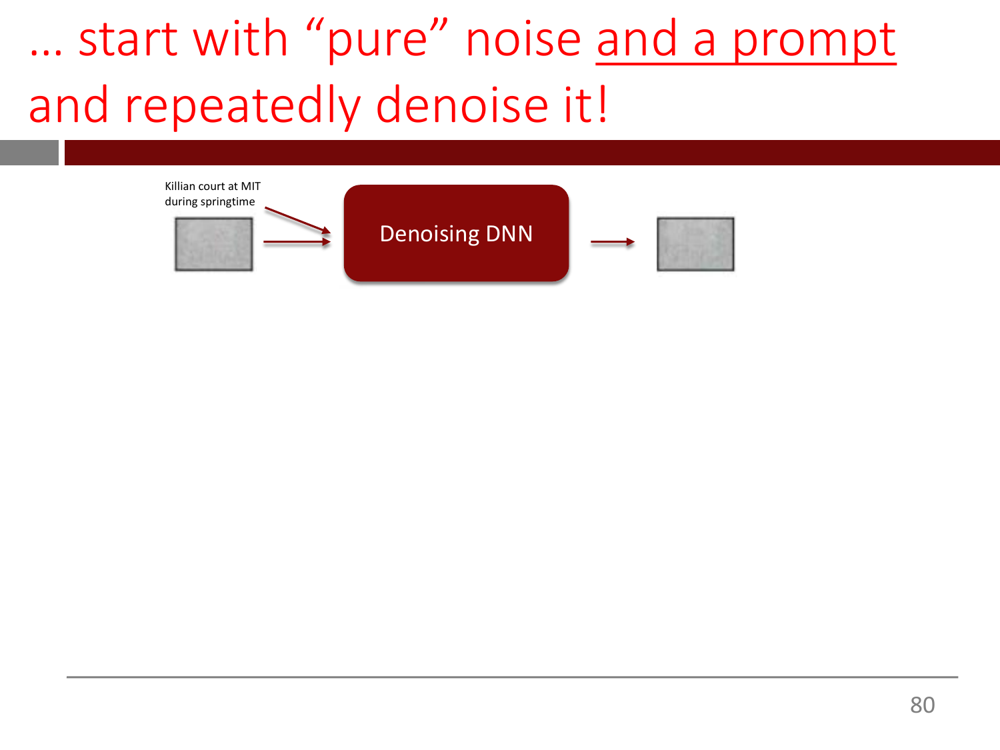
*Visual: pure noise ke saath prompt embedding dekar denoising trajectory guide ki jati hai.*

Lecture ka key composition:

- diffusion model image ko clean karta hai
- CLIP-like text embedding us cleaning ko prompt direction me steer karti hai

So denoiser input effectively includes:

- current noisy image
- text prompt embedding

### Stable Diffusion intuition

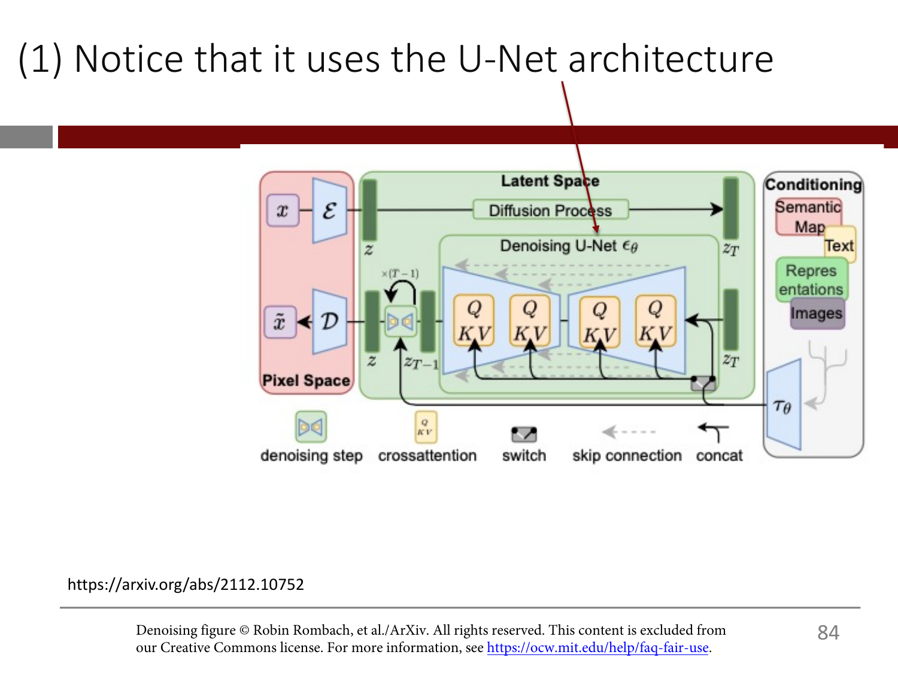
*Visual: U-Net, attention-based conditioning, aur latent-space diffusion ka practical combo.*

Lecture ne three practical points mention kiye:

- U-Net architecture use hoti hai
- text embedding attention path ke through inject hoti hai
- diffusion often latent space me run ki jati hai for speed

### Notebooks: Stable Diffusion, CV Hub, noisy images

Notebook coverage:

- `StableDiffusionPipeline` with `from_pretrained`
- negative prompts ka usage
- Hugging Face Hub se pretrained CV models
- image classification / detection / segmentation demos
- noisy-images notebook se diffusion intuition ko visual form me dekhna

Engineering takeaway:

- diffusion theory samajhna alag hai
- ready-made diffusion/CV pipelines leverage karna alag practical skill hai

### Common Mistakes

- Sochna diffusion ek step me image generate karta hai.
- Noise-addition aur denoising direction ko confuse karna.
- CLIP ko image generator samajhna; wo primary generator nahi, semantic alignment tool hai.
- U-Net skip connections ke role ko ignore karna.

### Memory Tricks

- `Forward process = noise add`
- `Reverse process = noise remove`
- `Diffusion = many denoise steps`
- `CLIP = prompt ko semantic direction dena`
- `U-Net = compress + rebuild + skip`

### Recall Questions

1. Diffusion model ka core intuition kya hai?
2. Direct generation se reverse denoising easier kyu ho sakta hai?
3. U-Net architecture me left aur right half ka role kya hai?
4. CLIP kya learn karta hai?
5. Prompt-conditioned diffusion me text embedding ka role kya hai?
6. Stable Diffusion pixel-space ke bajay latent-space use karke kya benefit leta hai?

### Short Answer Key

1. Diffusion ka core intuition hai noise add karna easy hai, to generation ko reverse denoising problem ki tarah solve karo.
2. Pure one-shot image synthesis se better hai many small denoising steps learn karna, kyunki noisy-to-less-noisy mapping easier hoti hai.
3. U-Net ka left half compress aur feature extract karta hai; right half upsample aur reconstruct karta hai; skip connections detail preserve karti hain.
4. CLIP text aur image embeddings ko shared semantic space me align karna seekhta hai.
5. Text embedding denoising process ko prompt ke semantic direction me guide karti hai.
6. Latent-space diffusion speed aur memory efficiency improve karta hai kyunki compressed representation par kaam hota hai.

---

## Course-Wide Quick Revision

### One-line Lecture Recall

| Lecture | Core idea | Fast recall line |
|---|---|---|
| Lecture 1 | neural network intuition | `logistic regression + hidden layers + activations` |
| Lecture 2 | training | `loss -> gradient -> backprop -> update` |
| Lecture 3A | structured-data pipeline | `preprocess -> compile -> fit -> validate` |
| Lecture 3B | vision basics | `pixels -> flatten -> softmax -> classify` |
| Lecture 4 | CNNs | `local filters + pooling + feature hierarchy` |
| Lecture 5 | text vectorization | `STIE + bag-of-words baseline` |
| Lecture 6 | embeddings | `word identity se semantic geometry tak` |
| Lecture 7 | transformers I | `context + order + same-length outputs` |
| Lecture 8 | transformers II | `QKV + multi-head + residual + layer norm` |
| Lecture 9 | LLMs I | `causal mask + next-token prediction + BPE` |
| Lecture 10 | LLMs II | `SFT + reward model + RLHF + RAG` |
| Lecture 10.5 | efficient adaptation | `full fine-tune mehenga, LoRA sasta` |
| Lecture 11 | diffusion | `noise add karo, phir denoise karke generate karo` |

### Most Important Comparisons

| Topic | Option A | Option B | Key point |
|---|---|---|---|
| learning paradigm | hand-written rules | learn from examples | ML wins on generalization |
| data type | structured | unstructured | DL especially shines on unstructured |
| output activation | sigmoid | softmax | binary vs multi-class |
| optimizer style | full GD | minibatch SGD | minibatch practical hai |
| stopping rule | train till max epochs | early stopping | validation-driven stop better |
| label encoding | integer labels | one-hot labels | sparse vs categorical cross-entropy |
| vision model | dense on flattened image | CNN | CNN locality preserve karta hai |
| text baseline | bag-of-words | embeddings | sparse counts vs dense meaning |
| transformer mode | bidirectional attention | causal attention | understanding vs generation |
| LLM upgrade | pretraining | alignment | language skill vs assistant behavior |
| LLM knowledge fix | fine-tuning | RAG | behavior/style vs fresh context |
| adaptation style | full fine-tuning | LoRA | all weights vs tiny adapters |
| image generation | GAN-like one shot | diffusion | repeated denoising approach |

### Course Mental Ladder

`raw data -> representation -> prediction -> loss -> gradient -> parameter update -> better model -> pretrained foundation -> alignment/adaptation -> useful application`

### Super-short Memory Hooks

- `DL = learn representations`
- `Training = reduce loss`
- `Backprop = efficient gradient engine`
- `Validation = lie detector for overfitting`
- `Softmax = many-class probability normalizer`
- `CNN = local patterns reused everywhere`
- `Embeddings = nearby vectors mean related words`
- `Transformer = attention decides context`
- `Causal mask = no peeking ahead`
- `RAG = retrieve before answer`
- `LoRA = freeze big, train small`
- `Diffusion = start noisy, clean gradually`

---

## Formula Sheet

### Sigmoid

`sigmoid(x) = 1 / (1 + e^-x)`

Use:

- binary classification output

### ReLU

`ReLU(x) = max(0, x)`

Use:

- hidden layers

### Binary Cross-Entropy

`BCE = (1/n) * Σ [ -y_i log(p_i) - (1 - y_i) log(1 - p_i) ]`

Use:

- binary classification

### Mean Squared Error

`MSE = (1/n) * Σ (y_i - y_hat_i)^2`

Use:

- regression

### Softmax

For class score `z_i`:

`p_i = exp(z_i) / Σ_j exp(z_j)`

Use:

- multi-class classification

### Self-Attention

`Attention(Q, K, V) = softmax(QK^T / sqrt(d_k)) V`

Use:

- context-dependent token mixing in transformers

### Cosine Similarity

`cos_sim(a, b) = (a · b) / (||a|| ||b||)`

Use:

- embedding retrieval
- RAG chunk ranking
- CLIP-style semantic comparison

### LoRA Update

`W_new = W + BA`

Where:

- `W` frozen base weight
- `B` and `A` small trainable matrices
- rank of `BA` is low

Use:

- parameter-efficient fine-tuning

### Gradient Descent Update

`w <- w - alpha * grad`

Where:

- `alpha` = learning rate

### Number of Batches per Epoch

`num_batches = ceil(training_size / batch_size)`

### Parameter Count for Dense Layer

If previous layer has `m` units and current layer has `n` units:

`params = m*n + n`

Reason:

- `m*n` weights
- `n` biases

---

## Final Revision Questions

1. Neural network ko logistic regression se conceptually kaise derive kar sakte ho?
2. Deep Learning ne unstructured data problem me exactly kya automate kiya?
3. Hidden layer ka output kaunsi type ki information capture kar sakta hai?
4. Activation functions kyu essential hain?
5. Binary cross-entropy aur MSE me kab kya choose karoge?
6. Gradient descent aur backprop ka relation kya hai?
7. Learning rate tuning practical kyun hoti hai?
8. Overfitting detect karne ka cleanest signal kya hota hai?
9. Train/validation/test ka role kya hai?
10. Heart disease notebook me one-hot encoding aur standardization kyu chahiye thi?
11. Fashion MNIST model me flatten kyu use hua?
12. Softmax aur sparse categorical cross-entropy ek natural pair kyun hain?
13. CNN dense model se image tasks me conceptually stronger kyu hota hai?
14. Transfer learning small datasets me especially effective kyu hota hai?
15. STIE ke four steps kya hain, aur NLP pipelines me kaunse stage par vocabulary banti hai?
16. Bag-of-words aur bigrams me conceptual difference kya hai?
17. Embeddings one-hot ki kaunsi do badi problems solve karte hain?
18. `GlobalAveragePooling1D` sentence classification me kya kaam karti hai?
19. Slot filling problem simple sentence classification se kaise different hai?
20. Transformer me position information inject karna kyu zaroori hai?
21. Q, K, V ka rough intuitive role kya hai?
22. Residual connection aur layer norm deep transformers ko kaise stabilize karte hain?
23. Causal masking bina next-token prediction me cheating kaise ho sakti hai?
24. BPE tokenization full-word vocabulary se better practical compromise kyu hai?
25. Pretraining aur alignment me kya difference hai?
26. Reward model kis cheez ko learn karta hai?
27. RAG hallucination reduction me kaise help karta hai?
28. Fine-tuning aur RAG me decision ka main criterion kya hona chahiye?
29. Full fine-tuning me memory cost kin components se aati hai?
30. LoRA ka low-rank idea parameter count ko kaise reduce karta hai?
31. Diffusion model ka forward aur reverse process kya hota hai?
32. U-Net architecture diffusion models ke liye natural fit kyu hai?
33. CLIP text aur image ko same semantic space me kaise laata hai?
34. Stable Diffusion latent-space use karke kya practical benefit leta hai?

## Final Revision Answer Key

1. Neural network ko logistic regression plus hidden layers plus nonlinear activations ki tarah derive kar sakte ho.
2. Deep Learning ne manual feature engineering ya representation design ko largely automate kiya.
3. Hidden layer patterns, combinations, aur intermediate abstract features capture kar sakti hai.
4. Activations nonlinearity laati hain; bina unke depth useful expressive power nahi deti.
5. MSE regression ke liye aur binary cross-entropy binary classification ke liye natural choice hoti hai.
6. Backprop gradients compute karta hai; gradient descent un gradients se weights update karta hai.
7. Learning rate tuning practical hai kyunki bahut small rate slow hota hai aur bahut large rate unstable hota hai.
8. Overfitting ka cleanest signal usually validation performance ka worsen hona hai while training still improves.
9. Train learning ke liye, validation tuning/early stopping ke liye, aur test final unbiased evaluation ke liye hota hai.
10. One-hot encoding categorical columns ko numeric banata hai aur standardization numerical scales ko comparable banati hai.
11. Flatten image matrix ko dense layer ke liye vector me convert karta hai.
12. Softmax multi-class probabilities deta hai aur sparse categorical cross-entropy integer class labels par kaam karti hai.
13. CNN locality preserve karta hai, parameter sharing use karta hai, aur image patterns ko reusable way me seekhta hai.
14. Transfer learning useful hai kyunki pretrained network already strong generic visual features learn kar chuka hota hai.
15. STIE = Standardize, Tokenize, Index, Encode; vocabulary indexing stage ke around build hoti hai after standardization/tokenization on training data.
16. Bag-of-words token presence/count dekhta hai; bigrams adjacent token-pair context bhi add karte hain.
17. Embeddings sparse identity-only representation aur semantic similarity ki kami dono solve karti hain.
18. `GlobalAveragePooling1D` token embeddings ko average karke fixed-size sentence representation banati hai.
19. Slot filling me har token ke liye label chahiye, isliye output same length ka token-wise label sequence hota hai.
20. Position information isliye chahiye kyunki self-attention alone token order ko reliably encode nahi karti.
21. Q asks, K advertises, aur V content carry karta hai.
22. Residual gradient flow aur signal preservation me help karta hai; layer norm activation scale stabilize karti hai.
23. Bina causal mask model future token dekh kar target next word copy kar sakta hai.
24. BPE rare words handle karta hai aur vocabulary ko manageable size me rakhta hai by using subwords.
25. Pretraining language/statistical structure sikhata hai; alignment desired assistant-like behavior sikhata hai.
26. Reward model human preference ke hisab se answer quality ka scalar score learn karta hai.
27. RAG relevant external context retrieve karke prompt me inject karta hai, jisse hallucination pressure kam hota hai.
28. Decision criterion ye hai: fresh knowledge chahiye ya behavior/style adaptation; pehle case me RAG, dusre me fine-tuning.
29. Full fine-tuning memory cost parameters, gradients, aur optimizer states se aati hai.
30. LoRA full delta ki jagah low-rank update learn karke trainable parameters drastically reduce karta hai.
31. Forward process me noise add hota hai; reverse process me model step-by-step denoise karta hai.
32. U-Net natural fit hai kyunki wo coarse-to-fine reconstruction ke saath fine details ko skip connections se preserve kar sakta hai.
33. CLIP matching text-image pairs ko close aur mismatched pairs ko far karke shared semantic space banata hai.
34. Latent-space use karne se generation faster aur more memory-efficient ho jati hai.

## Lecture-Wise External Links

### Common MIT OCW Links

- `https://ocw.mit.edu`
- `https://ocw.mit.edu/help/faq-fair-use`
- `https://ocw.mit.edu/terms`

### Lecture 1 Links

- `https://arxiv.org/pdf/1512.03385.pdf`
- `https://dwfritz.com/smart-cosmetic-defect-detection-increases-productivity/`
- `https://en.wikipedia.org/wiki/Artificial_neural_network`
- `https://google-research.github.io/seanet/musiclm/examples/`
- `https://huggingface.co/spaces/nielsr/comparing-captioning-models`
- `https://magazine.sebastianraschka.com/p/ai-and-open-source-in-2023`
- `https://mpost.io/best-100-stable-diffusion-prompts-the-most-beautiful-ai-text-to-image-prompts/`
- `https://spectrum.ieee.org/dartmouth-ai-workshop`
- `https://twitter.com/petergyang/status/1707169696049668472`
- `https://www.swarovskioptik.com/us/en/hunting/products/binoculars/ax-visio`

### Lecture 2 Links

- `https://arxiv.org/pdf/1712.09913.pdf`
- `https://en.wikipedia.org/wiki/Augustin-Louis_Cauchy`
- `https://kenndanielso.github.io/mlrefined/blog_posts/6_First_order_methods/6_4_Gradient_descent.html`

### Lecture 3A Links

- common MIT OCW links only

### Lecture 3B Links

- `https://www.kaggle.com/datasets/zalando-research/fashionmnist`

### Lecture 4 Links

- `https://arxiv.org/abs/1512.03385`
- `https://cs.nyu.edu/~fergus/papers/zeilerECCV2014.pdf`
- `https://cs231n.github.io/convolutional-networks/#conv`
- `https://huggingface.co/models`
- `https://pytorch.org/hub/`
- `https://setosa.io/ev/image-kernels/`
- `https://towardsdatascience.com/a-comprehensive-guide-to-convolutional-neural-networks-the-eli5-way-3bd2b1164a53`
- `https://www.amazon.com/Hands-Machine-Learning-Scikit-Learn-TensorFlow/dp/1492032646`
- `https://www.kaggle.com/datasets/zalando-research/fashionmnist`
- `https://www.slideshare.net/xavigiro/image-classification-on-imagenet-d1l4-2017-upc-deep-learningfor-computer-vision/`
- `https://www.tensorflow.org/hub`

### Lecture 5 Links

- `https://huggingface.co/spaces/lmsys/chatbot-arena-leaderboard`
- `https://www.anthropic.com/index/introducing-claude`
- `https://www.salesforce.com/news/press-releases/2023/03/07/einstein-generative-ai/`

### Lecture 6 Links

- `https://nlp.stanford.edu/pubs/glove.pdf`
- `https://txt.cohere.com/sentence-word-embeddings/`

### Lecture 7 Links

- `https://aclanthology.org/H90-1021/`
- `https://arxiv.org/abs/1706.03762`
- `https://blog.google/products/search/search-language-understanding-bert/`

### Lecture 8 Links

- `http://arxiv.org/abs/2002.05709`
- `http://arxiv.org/abs/2012.06678`
- `https://arxiv.org/abs/1512.03385`
- `https://arxiv.org/abs/1706.03762`
- `https://arxiv.org/pdf/1706.03762.pdf`
- `https://arxiv.org/pdf/1810.04805.pdf`
- `https://arxiv.org/pdf/2010.11929.pdf`
- `https://cs.nyu.edu/~fergus/papers/zeilerECCV2014.pdf`
- `https://huggingface.co/models`
- `https://jalammar.github.io/illustrated-bert/`
- `https://keras.io/api/layers/normalization_layers/layer_normalization/`
- `https://www.sbert.net/index.html`

### Lecture 9 Links

- `http://arxiv.org/abs/2005.14165`
- `https://arxiv.org/abs/1706.03762`
- `https://jaykmody.com/blog/gpt-from-scratch/`
- `https://observablehq.com/@simonw/gpt-tokenizer`
- `https://platform.openai.com/playground?mode=complete`
- `https://www.borealisai.com/research-blogs/tutorial6-neural-natural-language-generation-decoding-algorithms/`
- `https://www.youtube.com/watch?v=kCc8FmEb1nY`

### Lecture 10 Links

- `http://arxiv.org/abs/2005.14165`
- `http://arxiv.org/abs/2009.01325`
- `http://arxiv.org/abs/2203.02155`
- `http://arxiv.org/abs/2205.11916`
- `https://arxiv.org/abs/2401.14423`
- `https://arxiv.org/pdf/2309.03409.pdf`
- `https://llama.meta.com/llama2`
- `https://magazine.sebastianraschka.com/p/finetuning-large-language-models`
- `https://openai.com/blog/ChatGPT/`
- `https://openai.com/blog/instruction-following/`
- `https://twitter.com/benjedwards/status/1644032568772161545?s=20`
- `https://twitter.com/karpathy/status/1655994367033884672?s=20`
- `https://twitter.com/quasimondo/status/1284509525500989445`
- `https://www.linkedin.com/feed/update/urn:li:activity:7150937271251136514/`
- `https://www.technologyreview.com/2023/02/08/1068068/ChatGPT-is-everywhere-heres-where-it-came-from/`
- `https://www.wayfair.com/furniture/pdp/latitude-run-alori-task-chair-w005270016.html`

### Lecture 10.5 Links

- `https://llama.meta.com/llama2`
- `https://twitter.com/karpathy/status/1655994367033884672?s=20`

### Lecture 11 Links

- `https://arxiv.org/abs/2006.11239`
- `https://arxiv.org/abs/2112.10752`
- `https://arxiv.org/pdf/1503.03585.pdf`
- `https://arxiv.org/pdf/2103.00020.pdf`
- `https://en.wikipedia.org/wiki/Rotunda_%28architecture%29`
- `https://huggingface.co/docs/diffusers/index`
- `https://lexica.art/`
- `https://lmb.informatik.uni-freiburg.de/people/ronneber/u-net`
- `https://mspoweruser.com/best-midjourney-prompts/`
- `https://openai.com/research/video-generation-models-as-world-simulators`
- `https://openai.com/sora`
- `https://www.nytimes.com/2023/01/09/science/artificial-intelligence-proteins.html`
