# Chapter 1 - Introduction to Vectors

Visual gallery: [`01-introduction-to-vectors.md`](../visuals/01-introduction-to-vectors.md)

Chapter 1 ka role foundation banana hai. Yahan se linear algebra ka language start hota hai.

Big idea:
- vector ko component list ki tarah socho
- vectors ko add kar sakte ho
- scalar se multiply kar sakte ho
- in dono se **linear combinations** bante hain
- linear combinations hi baad me column space, span, subspace, basis sab kuch banayenge

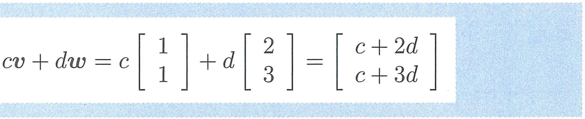
*Linear combination `cv + dw` — yahi hai linear algebra ka core idea. Coefficients c aur d choose karo, combinations milti hai.*

## 1.1 Vectors and Linear Combinations

Is section ka real point hai: vectors ko sirf arrows mat samjho, unhe combinations ke building blocks samjho.

Key ideas:

- vector 2D me ho sakta hai `(v1, v2)`, 3D me `(v1, v2, v3)`, aur higher dimension me bhi
- `v + w` component-wise hota hai: `(v1+w1, v2+w2)`
- `cv` bhi component-wise hota hai: `(cv1, cv2)`
- `cv + dw` is called a linear combination

**Char special combinations jo Strang explicitly likhte hain:**

- `1v + 1w` = sum
- `1v - 1w` = difference
- `0v + 0w` = zero vector **(note: zero vector ≠ number zero — ek column vector hai jisme sab components zero hain)**
- `cv + 0w` = scalar multiple, gives a line through v

**Geometric picture:**

- ek vector = origin se ek point tak arrow
- vector addition = **parallelogram rule**: v aur w do sides hain, v+w diagonal hoti hai
- scalar multiplication = same direction, different length
- negative scalar = opposite direction (flip + scale)

**Worked Example 1.1A (Strang ka important example):**

v = (1,1,0) aur w = (0,1,1) — kaunsa space fill karte hain?

```
cv + dw = c(1,1,0) + d(0,1,1) = (c, c+d, d)
```

All combinations: c aur d vary karo → yeh ek **plane** fill karta hai 3D me.

Normal to this plane: n = (1,-1,1).

Check: v·n = 1-1+0 = 0 ✓, w·n = 0-1+1 = 0 ✓. So n is perpendicular to both v and w.

Any vector in the plane: cv+dw. n is NOT in this plane (n is perpendicular to it).

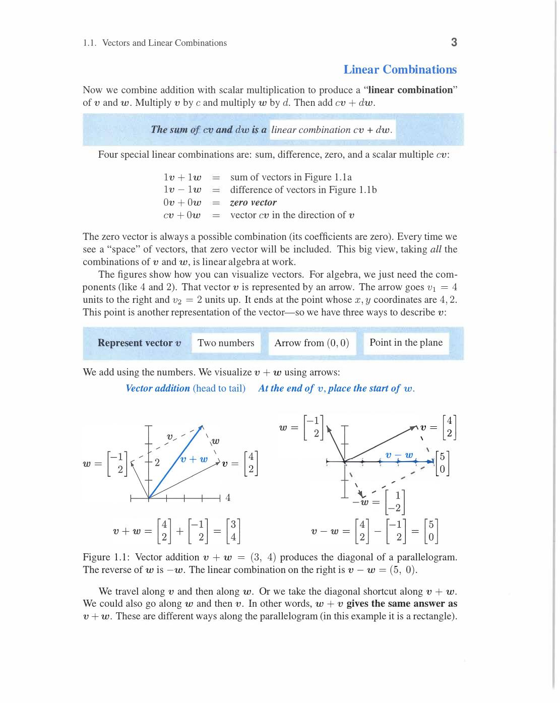
*Worked Ex 1.1A: v=(1,1,0) aur w=(0,1,1) se bana plane 3D me. Normal vector n=(1,-1,1) dono se perpendicular hai — v·n=0 aur w·n=0. cv+dw combinations plane fill karte hain, n plane me nahi hai.*

**Worked Example 1.1B (half-lines and parallel lines):**

All multiples cv of v = (1,2): gives a LINE through origin in direction (1,2).

- c > 0: half-line going one way
- c < 0: half-line going opposite way
- c = 0: origin (zero vector)

Two parallel lines: v = (1,2) and w = (3,6) — note w = 3v! So cv + dw = (c+3d)v — all combinations are still on the same line through origin.

**Worked Example 1.1C (solving cv + dw = b):**

v = (1,0), w = (0,1), b = (3,5). Find c,d such that cv+dw = b.

```
c(1,0) + d(0,1) = (c, d) = (3,5)   →   c = 3, d = 5
```

Easy because v,w are standard basis vectors. Any b = (b₁,b₂) in R² works.

**Why this matters:**

- do vectors ke combinations line ya plane fill kar sakte hain
- teen independent vectors 3D space fill karte hain
- actual question: given vectors se kaunsa space generate hota hai?

Important mental models:

- `cv` gives all points on the line through `v`
- `cv + dw` gives a plane if `v` and `w` are not on the same line
- `cu + dv + ew` 3D space fill karta hai agar teen vectors independent ho
- agar vectors dependent hue to generated space smaller ho sakta hai

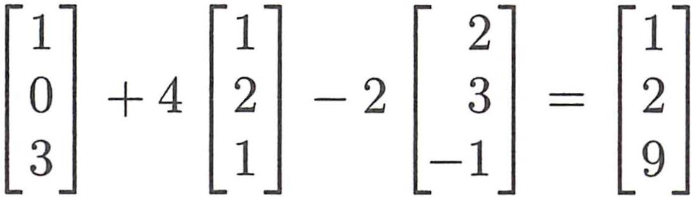
*Figure 1.3: Ek vector se line banti hai (`cu`), do vectors se plane (`cu + dv`), teen independent vectors se poora 3D space bhar jaata hai (`cu + dv + ew`). Agar dependent hain to space collapse ho jaati hai.*

Higher-dimensional point:

- linear algebra ka power yahi hai ki same rules 2D, 3D, and nD sab jagah work karte hain
- even if you cannot draw 10D, the algebra and logic same rehta hai

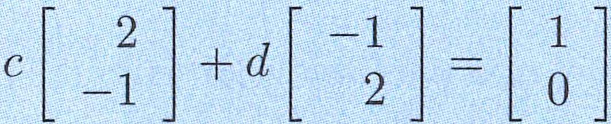
*Worked Examples 1.1B/1.1C: Half-lines, parallel lines, aur `cv + dw = b` ko equations ki tarah solve karna.*

Review of Key Ideas (Section 1.1):

1. Linear combination cv + dw: c aur d all real numbers ke saath
2. Geometric: parallelogram rule for addition, stretching/flipping for scalar multiply
3. One vector → line, two independent vectors → plane, three independent → 3D space
4. cv + dw = b solvable tabhi jab b span{v,w} me ho

## 1.2 Lengths and Dot Products

Yeh section geometry ko precise banata hai.

Main question:
- do vectors ka angle kaise measure karein?
- vector ki length kaise nikalein?
- perpendicular ka exact algebraic condition kya hai?

**Dot product definition:**

```
v · w = v₁w₁ + v₂w₂ + ... + vₙwₙ
```

Important meanings of dot product:

- zero dot product means perpendicular vectors
- `v · v` gives length squared
- dot product angle information deta hai

**Length:**

```
‖v‖ = √(v · v) = √(v₁² + v₂² + ... + vₙ²)
```

**Unit vector:** ki length 1 hoti hai.

```
u = v / ‖v‖    ← normalize v: direction same, length = 1
```

**Angle formula:**

```
cos θ = (v · w) / (‖v‖ · ‖w‖)
```

This formula do important cheezein batata hai:

- dot positive → angle < 90° (acute)
- dot zero → angle = 90° (right angle, perpendicular)
- dot negative → angle > 90° (obtuse)

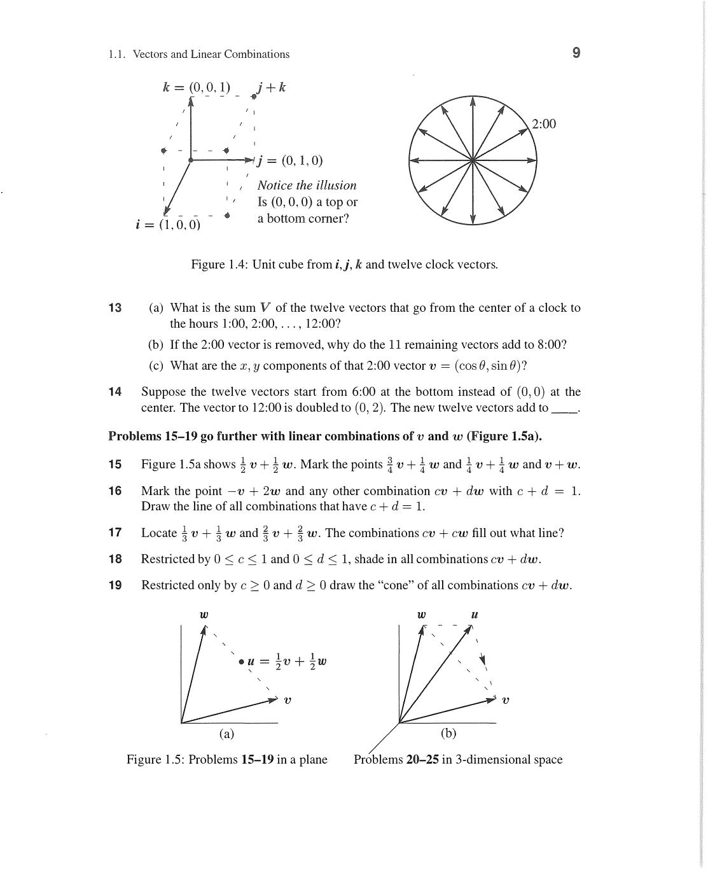
*Figure 1.5: cos θ = (v·w)/(‖v‖‖w‖). Dot product positive → acute angle, zero → 90°, negative → obtuse. Unit circle par: cos θ directly readable. Yahi formula geometry ko algebra se connect karta hai.*

**Concrete angle example:**

v = (1,0), w = (1,1). 

```
v·w = 1, ‖v‖ = 1, ‖w‖ = √2

cos θ = 1/(1·√2) = 1/√2   →   θ = 45°
```

Another: v = (3,4), w = (4,-3).

```
v·w = 12-12 = 0   →   θ = 90° (perpendicular!)

‖v‖ = 5, ‖w‖ = 5. Both length 5, perpendicular.
```

**Physical intuition examples (Strang ke):**

- **See-saw example**: w = (weight of person 1, weight of person 2), v = (distance from center, negative distance). Balance condition: v·w = 0 means zero net torque — perpendicularity = balance!
- **Economics example**: q = (quantity of goods 1, quantity of goods 2), p = (prices). Income = q·p = dot product — linear algebra directly equals money!

**Pythagoras se perpendicularity ka proof:**

Claim: v ⊥ w ↔ v·w = 0.

Proof using Pythagorean theorem:

```
‖v - w‖² = ‖v‖² + ‖w‖²    (Pythagoras: right angle between v and w)

Expand left side:
‖v - w‖² = (v-w)·(v-w) = v·v - 2(v·w) + w·w = ‖v‖² - 2(v·w) + ‖w‖²

Equate: ‖v‖² - 2(v·w) + ‖w‖² = ‖v‖² + ‖w‖²

→ -2(v·w) = 0   →   v·w = 0   ✓
```

So perpendicular ↔ dot product = 0. Algebraic condition for geometric idea!

**Important inequalities:**

**Schwarz inequality (Cauchy-Schwarz):**

```
|v·w| ≤ ‖v‖ · ‖w‖
```

Proof: Let f(t) = ‖v - tw‖² ≥ 0 for all real t.

f(t) = ‖v‖² - 2t(v·w) + t²‖w‖² ≥ 0. Discriminant ≤ 0: 4(v·w)² - 4‖v‖²‖w‖² ≤ 0. ✓

Equality iff v and w parallel (v = cw).

Schwarz lets us define angle via cosine: |cosθ| ≤ 1 guaranteed since |v·w|/(‖v‖‖w‖) ≤ 1.

**Triangle inequality:**

```
‖v + w‖ ≤ ‖v‖ + ‖w‖
```

Proof: ‖v+w‖² = (v+w)·(v+w) = ‖v‖² + 2(v·w) + ‖w‖² ≤ ‖v‖² + 2‖v‖‖w‖ + ‖w‖² = (‖v‖+‖w‖)². Take √. ✓

Geometric meaning: two sides of triangle ≥ third side (straight line is shortest path).

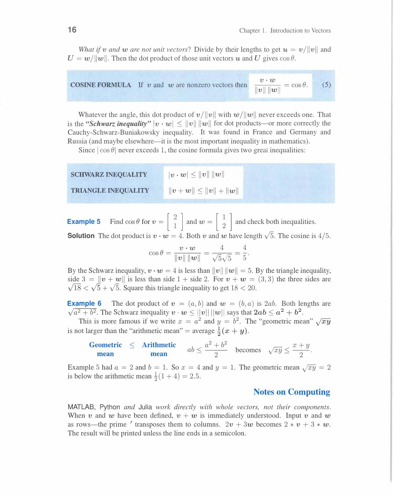
*Cauchy-Schwarz: |v·w| ≤ ‖v‖‖w‖ — dot product kabhi length product se zyada nahi hota. Triangle inequality: ‖v+w‖ ≤ ‖v‖+‖w‖ — direct path ≤ sum of two sides. Equality Schwarz me: v=cw (parallel vectors). Yahi inequalities geometry ka algebraic foundation hain.*

**Geometric mean ≤ Arithmetic mean (from Schwarz):**

```
√(xy) ≤ (x+y)/2   for x,y ≥ 0
```

Proof: Set v = (√x, √y), w = (√y, √x).

v·w = √(xy)+√(yx) = 2√(xy). ‖v‖‖w‖ = √(x+y)·√(x+y) = x+y.

Schwarz: 2√(xy) ≤ x+y → √(xy) ≤ (x+y)/2. ✓

Why this section matters:

- orthogonality baad me least squares, projections, Fourier series, positive definite matrices, and statistics tak jayegi
- yahi section geometry aur algebra ko connect karta hai

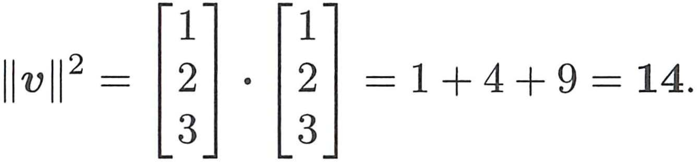
*Figure 1.6: `||v|| = √(v·v)` — length Pythagoras theorem se aata hai. 2D me `√(v₁²+v₂²)`, 3D me `√(v₁²+v₂²+v₃²)`.*

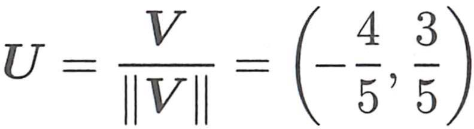
*Figures 1.8/1.9: Unit vector `u = v/||v||`. Perpendicular vectors ka dot product zero hota hai. `u·U = cos θ` angle deta hai.*

Review of Key Ideas (Section 1.2):

1. v·w = Σvᵢwᵢ. ‖v‖ = √(v·v). cosθ = v·w/(‖v‖‖w‖)
2. v ⊥ w ↔ v·w = 0 (proof via Pythagoras)
3. Schwarz: |v·w| ≤ ‖v‖‖w‖. Triangle: ‖v+w‖ ≤ ‖v‖+‖w‖
4. Unit vector u = v/‖v‖. Length 1, same direction

## 1.3 Matrices

Ab vectors se move karke book matrices aur equations tak aati hai.

Core objects:

- matrix A
- unknown vector x
- output vector b
- equation `Ax = b`

**Main idea:**

`Ax` is a linear combination of the columns of A.

Coefficients x₁, x₂, ..., xₙ batate hain kitna har column lena hai.

```
Ax = x₁(col 1) + x₂(col 2) + ... + xₙ(col n)   ← column form
```

Also: (Ax)ᵢ = (row i of A) · x = Σⱼ aᵢⱼxⱼ   ← row form (dot product)

**Difference matrix example (Strang ka key example):**

```
A = [ 1  0  0 ]    x = [1]     Ax = [1-0, 4-1, 9-4]ᵀ = [1, 3, 5]ᵀ
    [-1  1  0 ]        [4]
    [ 0 -1  1 ]        [9]
```

Input x = (1, 4, 9) = perfect squares (0²=0 not included, but 1², 2², 3²).

Output Ax = (1, 3, 5) = odd numbers — differences of consecutive squares!

Sum matrix = inverse of difference matrix:

```
A⁻¹ = [1  0  0]
      [1  1  0]
      [1  1  1]

A⁻¹(1,3,5)ᵀ = (1, 1+3, 1+3+5)ᵀ = (1, 4, 9)ᵀ   ← summing undoes differencing ✓
```

**Calculus connection:** Differences ↔ derivatives, sums ↔ integrals — same idea in discrete form. Matrix A is discrete derivative, A⁻¹ is discrete integral.

**Two pictures start here:**

Row picture:
- har row of A ek linear equation banati hai
- each row gives one hyperplane in n-dimensional space
- solution = intersection of all hyperplanes

Column picture:
- b as a combination of columns of A with coefficients x₁,...,xₙ
- question: can b be reached by combining the columns?

Both pictures same system ka different viewpoint! Same x satisfies both.

**Cyclic difference matrix (singular example):**

```
C = [ 1  0 -1]    rows: each row sums to 0!
    [-1  1  0]
    [ 0 -1  1]

C(1,1,1)ᵀ = (0,0,0)ᵀ   ← constant vector in null space!
```

C is singular — three rows are dependent (last row = -(sum of first two)).

det(C) = 0. Cx = b has no solution unless b₁+b₂+b₃ = 0.

**Key insight on invertibility:**

- A invertible ↔ columns independent ↔ Ax=0 has only x=0 solution
- A singular ↔ columns dependent ↔ Ax=0 has nonzero solutions

**Preview of the whole course:**

- Ch 2: elimination will solve Ax = b efficiently
- Ch 3: nullspace explains when Ax=0 has nonzero solutions
- Ch 3: column space explains when Ax=b has a solution
- Ch 4: orthogonality finds best approximate solution when exact one doesn't exist
- Ch 5-6: determinants and eigenvalues = deep properties of A

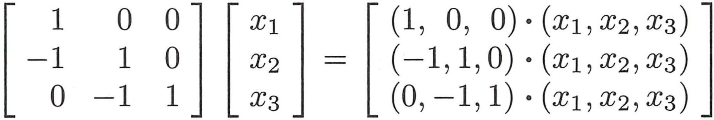
*Ax ko do taraf se dekho: row picture (har row ka dot product x ke saath) ya column picture (columns ki linear combination). Dono same answer dete hain. Difference matrix ka example (1,4,9)→(1,3,5) odd numbers nikalti hai.*

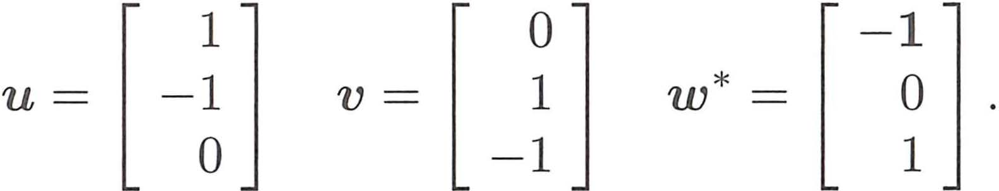
*Figure 1.10: Cyclic matrix C ke columns ek plane mein hain — dependent hain. `Cx = 0` ke infinitely many solutions hain. Invertible nahi hai. Independent vs dependent columns ka yahi fark hai.*

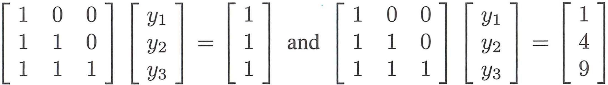
*Problem Set 1.3: In problems se Ax = b, invertible vs singular matrix, aur column dependence ka solid practice hota hai.*

Review of Key Ideas (Section 1.3):

1. Ax = x₁(col 1)+...+xₙ(col n) — column combination form
2. (Ax)ᵢ = (row i)·x — row form (dot products)
3. Row picture: n hyperplanes, solution = intersection. Column picture: b = combination of cols
4. Invertible A ↔ independent columns ↔ unique solution. Singular ↔ dependent ↔ no unique solution

---
