# Chapter 2 - Solving Linear Equations

Visual gallery: [`02-solving-linear-equations.md`](../visuals/02-solving-linear-equations.md)

Chapter 2 ka center hai `Ax = b` ko systematically solve karna.

Big idea:
- random guessing se solution nahi niklega
- elimination gives a process
- matrices allow us to write that process cleanly
- factorization `A = LU` same elimination ko compact form me store karta hai

## 2.1 Vectors and Linear Equations

Yahan row picture aur column picture formally aate hain.

Row picture:

- har equation ek line ya plane banati hai
- solution un sab ka intersection hota hai

Column picture:

- `Ax = b` means columns of `A` ka combination `b` banana

Why both pictures matter:

- row picture tells geometry of equations
- column picture tells span and solvability
- dono same system ka different viewpoint hain

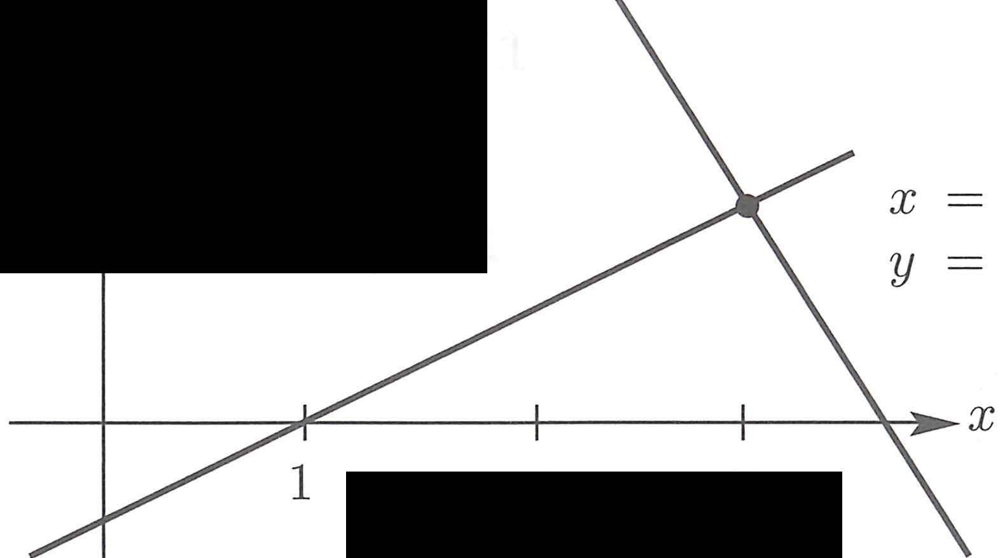
*Figure 2.1/2.2: Row picture me do lines ka intersection solution hai. Column picture me columns ki combination `b` banati hai. Same system, alag viewpoint.*

Key insight:

- linear algebra ka heart rows aur columns ke beech ka relation hai
- same matrix numbers, but different meaning

## 2.2 The Idea of Elimination

Elimination ka goal hai complicated system ko easier system me convert karna without changing solutions.

Method:

- lower rows se upper rows ka multiple subtract karo
- zeros create karo
- matrix ko triangular form me lao

Once upper triangular matrix aa jaaye:

- bottom row se start karke back substitution karo

Concrete worked example (2×2):

```
Before:  x - 2y = 1      After:   x - 2y = 1     (multiply eq1 by 3)
         3x + 2y = 11              8y = 8          (subtract 3×eq1 from eq2)
```
- New second equation 8y=8 instantly gives y=1, then x=3. Solution (3,1).
- **First pivot = 1** (coefficient of x in eq1)
- **First multiplier ℓ = 3** (coefficient of x in eq2, divided by pivot)

Key definitions:

- **Pivot** = first nonzero in the row that does the elimination
- **Multiplier** = (entry to eliminate) / (pivot) = ℓ

**Zero is never allowed as a pivot!** Agar pivot zero aa jaaye to row exchange karo.

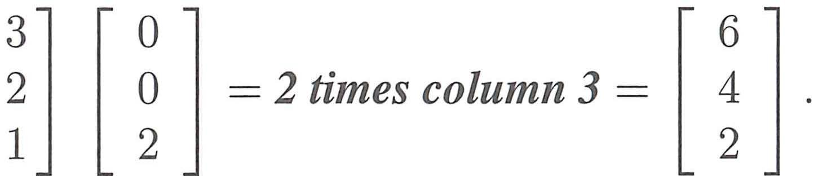
*Figure 2.5: Elimination ke baad second line horizontal ho jaati hai. Pivot = 1, multiplier = 3. `8y = 8` gives y=1. Yahi elimination ka core mechanism hai.*

Breakdown of elimination — teen failure cases:

**Example 1 — Permanent failure (no solution):**
```
x - 2y = 1           x - 2y = 1
3x - 6y = 11    →    0y = 8      ← no second pivot, no solution!
```
Row picture: parallel lines (same slope, different intercept). Column picture: columns (1,3) and (-2,-6) same direction → can't reach (1,11).

**Example 2 — Permanent failure (infinitely many):**
```
x - 2y = 1           x - 2y = 1
3x - 6y = 3     →    0y = 0      ← every y works! y is "free"
```
Row picture: same line. Column picture: b=(1,3) lies on line of columns → infinitely many combinations work.

**Example 3 — Temporary failure (zero in pivot position → row exchange fixes it):**
```
0x + 2y = 4    Exchange rows:    3x - 2y = 5    (two good pivots: 3 and 2)
3x - 2y = 5                      2y = 4
```
Solution (3,2). This is **nonsingular** — temporary failure, not permanent.

**Success rule**: n equations need n pivots. But we may have to exchange rows.

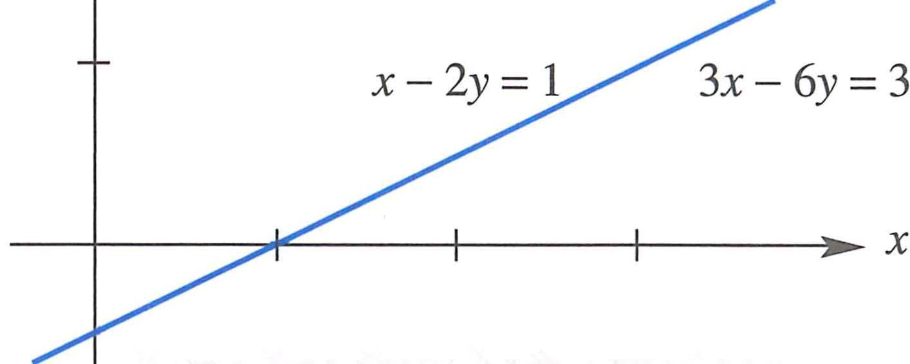
*Figure 2.7: Jab pivot zero ho jaye — `0y = 8` means no solution (permanent), `0y = 0` means infinitely many (permanent). Row exchange = temporary fix. Breakdown ke teen cases.*

Full 3×3 worked example:

```
2x + 4y - 2z = 2    ← equation 1
4x + 9y - 3z = 8    ← equation 2
-2x - 3y + 7z = 10  ← equation 3
```
- Step 1: Subtract 2×(eq1) from eq2 → `y + z = 4` (pivot = 2, multiplier = 2)
- Step 2: Subtract -1×(eq1) from eq3 → `y + 5z = 12` (multiplier = -1)
- Step 3: Subtract 1×(eq2_new) from eq3_new → `4z = 8` (pivot = 1, multiplier = 1)
- Pivots: 2, 1, 4 along diagonal of upper triangular U
- Back substitution: z=2, y=2, x=-1

Column form check: `(-1)[2;4;-2] + 2[4;9;-3] + 2[-2;-3;7] = [2;8;10]` ✓

Review of Key Ideas (Section 2.2):

1. Linear system (Ax = b) becomes upper triangular (Ux = c) after elimination
2. Subtract ℓᵢⱼ times equation j from equation i to make (i,j) entry zero
3. Multiplier ℓᵢⱼ = (entry to eliminate in row i) / (pivot in row j). Pivots cannot be zero!
4. When zero is in pivot position, exchange rows if there is a nonzero below it
5. Upper triangular Ux = c is solved by back substitution (starting at bottom)
6. When breakdown is permanent, Ax = b has no solution or infinitely many

Why elimination is powerful:

- real scientific computing me yeh central algorithm hai
- same basic idea huge systems me bhi use hoti hai
- Worked Examples 2.2A/B/C: band matrices, triangular matrix pivots, success vs failure

## 2.3 Elimination Using Matrices

Ab elimination ko matrix multiplication ke language me likha jata hai.

`Ax = b` notation:

- matrix A ke entries: `aᵢⱼ = A(i,j)` = row i, column j
- (Ax)ᵢ = (row i)·x = Σⱼ aᵢⱼxⱼ — sigma notation
- Column form: Ax = x₁(col 1) + x₂(col 2) + ... + xₙ(col n)

Elimination matrix:

- ek special matrix `E` that performs a row operation when left-multiplied with `A`
- `EA` means row operation applied to `A`
- Start with identity matrix I, change one zero to `-ℓ`:

```
E₂₁ = [ 1  0  0 ]   ← subtracts ℓ=2 times row 1 from row 2
      [-2  1  0 ]
      [ 0  0  1 ]
```
- E₂₁ applied to the 3×3 example: creates zero in (2,1) position
- E₃₁ similarly creates zero in (3,1) position with multiplier -ℓ in (3,1) slot

Row exchange matrix (permutation):

```
P₂₃ = [ 1  0  0 ]   ← exchanges rows 2 and 3 of any matrix
      [ 0  0  1 ]
      [ 0  1  0 ]
```
- `P₂₃` = identity matrix with rows i and j reversed
- `P₁₃ = [0,0,1; 0,1,0; 1,0,0]` exchanges rows 1 and 3

This is very important:

- row operations random actions nahi hain
- they are themselves matrix multiplications

Benefits:

- elimination structured ho jata hai
- factorization later easy hoti hai
- matrix product rules deeply relevant ban jate hain

Augmented matrix:

- `[A b]` me right side bhi saath move karti hai
- elimination both `A` and `b` par same row operations apply karta hai
- E acts row-by-row on [A b] together: `[EA  Eb]`

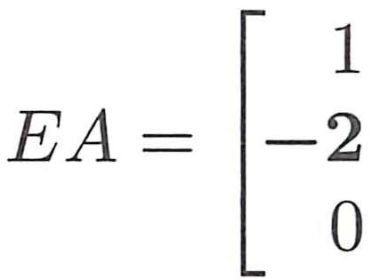
*`EA` = row operation applied to `A`. Associative law holds: `(AB)C = A(BC)`. Commutative generally fails: `AB ≠ BA`. E acts on rows (left multiply). Yahi matrix algebra ka core rule hai.*

Review of Key Ideas (Section 2.3):

1. Ax = x₁(col 1) + ... + xₙ(col n). Also (Ax)ᵢ = Σⱼ aᵢⱼxⱼ
2. Identity matrix I, elimination matrix Eᵢⱼ using ℓᵢⱼ, exchange matrix Pᵢⱼ
3. Multiplying Ax=b by E₂₁ subtracts ℓ₂₁ times eq1 from eq2. Entry -ℓ₂₁ is in (2,1) of E₂₁
4. For augmented matrix [A b], that elimination step gives [E₂₁A  E₂₁b]
5. When A multiplies any matrix B, it multiplies each column of B separately

Worked Examples 2.3A/B/C: explicit E₂₁/P₃₂ construction, augmented matrix walkthrough, columns of A times rows of B

## 2.4 Rules for Matrix Operations

Is section me matrix algebra ke core rules diye gaye hain.

Dimension rule for multiplication:

- A is m×n, B is n×p → AB is m×p
- **A ke columns = B ke rows** hone chahiye multiply karne ke liye

Four ways to multiply AB (Strang explicitly lists sab):

1. **Dot product way** (entry by entry): (AB)ᵢⱼ = (row i of A) · (column j of B) — standard method
2. **A times each column of B**: AB = [Ab₁  Ab₂  ...  Abₚ] — AB ke columns = A times B ke columns
3. **Each row of A times B**: row i of AB = (row i of A) times B
4. **Columns of A times rows of B** (outer product sum): AB = Σₖ (col k of A)(row k of B) — most unusual, but gives full AB as sum of rank-1 matrices

Inner vs outer product:

- Row times column (1×n · n×1) = scalar = **inner/dot product**
- Column times row (n×1 · 1×n) = full n×n matrix = **outer product**

Laws of matrix operations:

```
Addition:
  A + B = B + A              (commutative)
  c(A + B) = cA + cB         (distributive)
  A + (B + C) = (A + B) + C  (associative)

Multiplication:
  AB ≠ BA generally           (commutative law FAILS)
  A(B + C) = AB + AC          (distributive from left)
  (A + B)C = AC + BC          (distributive from right)
  A(BC) = (AB)C               (associative — parentheses not needed)
```

Matrix powers: `Aᵖ = AAA...A` (p factors), `(Aᵖ)(Aᵍ) = Aᵖ⁺ᵍ`, `A⁰ = I`

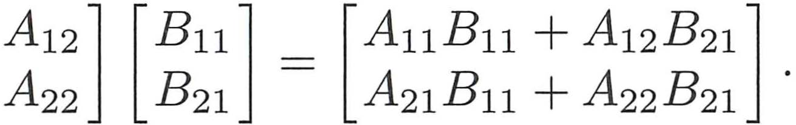
*Block multiplication: bade matrix ko blocks me tod ke multiply kar sakte ho, jaise numbers. Formula: [A₁₁,A₁₂; A₂₁,A₂₂][B₁;B₂] = [A₁₁B₁+A₁₂B₂; A₂₁B₁+A₂₂B₂]. Scientific computing me yeh structure bahut use hoti hai.*

Block matrices and Schur complement:

- large matrix ko 2×2 block matrix ki tarah treat kar sakte ho
- block elimination: [I,0; -CA⁻¹,I][A,B; C,D] = [A,B; 0,D-CA⁻¹B]
- **Schur complement** = `D - CA⁻¹B` — yahi 2×2 case me `d - cb/a` hota hai

Key example from worked examples (adjacency matrix):

- Graph ke adjacency matrix S me `sᵢⱼ = 1` if edge connects nodes i and j
- `(S²)ᵢⱼ` = number of walks of length 2 between nodes i and j
- `(Sᴺ)ᵢⱼ` counts N-step paths — matrix powers count paths on graphs

Non-commutativity is a huge point:

- matrix order matters
- transformations ka order matters

Review of Key Ideas (Section 2.4):

1. (i,j) entry of AB = (row i of A)·(column j of B)
2. m×n times n×p uses mnp separate multiplications
3. A times BC = AB times C (surprisingly important associativity)
4. AB = sum of n matrices: (col j of A)(row j of B) — columns times rows
5. Block multiplication allowed when block shapes match (columns of A = rows of B blockwise)
6. Block elimination produces Schur complement D - CA⁻¹B

Worked Examples 2.4A/B: adjacency matrix S and S² counting walks, commutativity conditions

## 2.5 Inverse Matrices

**Core idea:** A⁻¹ is the matrix that undoes A's effect.

```
A⁻¹A = I   and   AA⁻¹ = I    (both must hold for square A)
```

If inverse exists: Ax = b → x = A⁻¹b.

**Invertibility conditions (all equivalent for square n×n matrix A):**

1. det(A) ≠ 0
2. Rank = n (full rank)
3. Columns are independent (Ax = 0 has only x = 0)
4. Rows are independent
5. n pivots appear in elimination (no zero pivots)
6. A⁻¹ exists

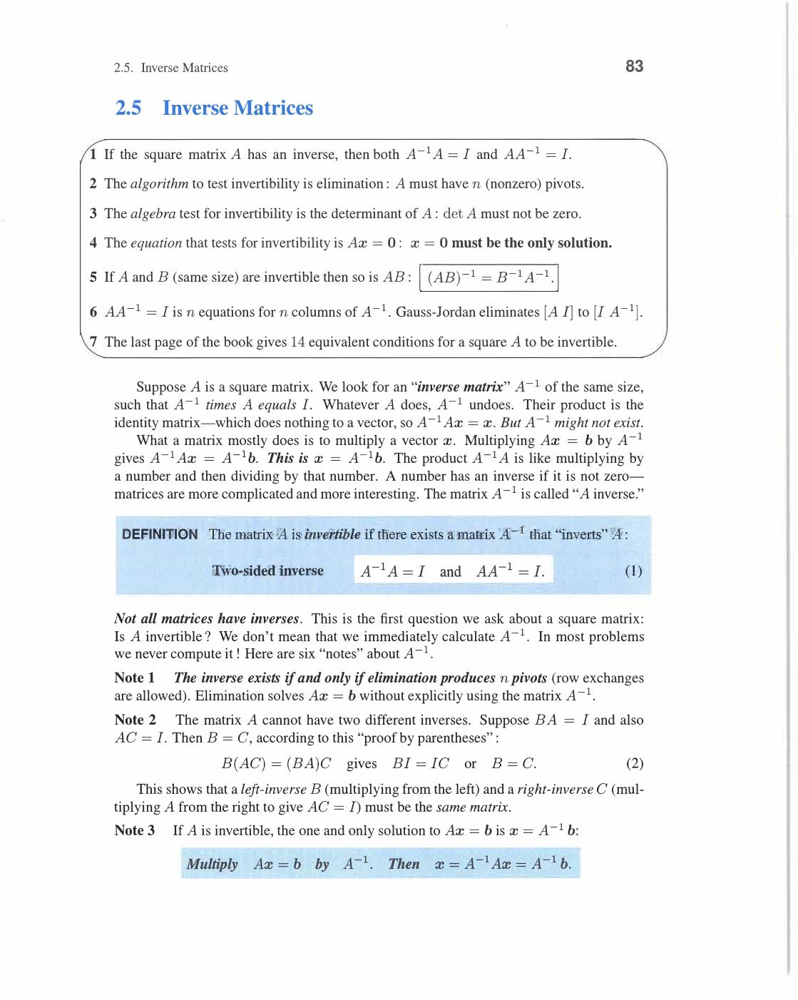
*Invertible matrix: n pivots, det≠0, independent columns, unique solution. Singular matrix: missing pivot, det=0, dependent columns, Ax=0 has nonzero solutions. Yeh six conditions sab equivalent hain — ek satisfy karo, sab satisfy hoti hain.*

**Important warnings:**

- every matrix invertible nahi hoti (singular matrices ka inverse nahi hota)
- practical computation me A⁻¹ explicitly nikalna often best method nahi (elimination is faster!)
- inverse mainly useful for theory, not large-scale computation

**Product rule for inverses:**

```
(AB)⁻¹ = B⁻¹A⁻¹    ← reverse order! (socks-shoes analogy: take off shoes before socks)
```

Proof: (AB)(B⁻¹A⁻¹) = A(BB⁻¹)A⁻¹ = AIA⁻¹ = AA⁻¹ = I. ✓

**2×2 inverse formula:**

```
A = [a  b]    A⁻¹ = (1/(ad-bc)) [ d  -b]
    [c  d]                        [-c   a]
```

Condition: ad-bc ≠ 0 (determinant ≠ 0).

Example: A = [2,1;5,3]. det = 6-5 = 1. A⁻¹ = [3,-1;-5,2].

Check: A·A⁻¹ = [2·3+1·(-5), 2·(-1)+1·2; 5·3+3·(-5), 5·(-1)+3·2] = [1,0;0,1] = I. ✓

**Gauss-Jordan method (find A⁻¹ by elimination):**

Start with augmented matrix [A | I]. Row-reduce left side to I. Right side becomes A⁻¹.

```
A = [2  1]    [A | I] = [2  1 | 1  0]
    [5  3]               [5  3 | 0  1]

Step 1: subtract (5/2)×row1 from row2:
  → [2  1 | 1    0]
    [0  1/2 | -5/2  1]

Step 2: multiply row2 by 2:
  → [2  1 | 1    0]
    [0  1 | -5   2]

Step 3 (Gauss → Jordan: eliminate above pivot too): subtract row2 from row1:
  → [2  0 | 6   -2]
    [0  1 | -5   2]

Step 4: divide row1 by 2:
  → [1  0 | 3   -1]    → A⁻¹ = [ 3  -1]
    [0  1 | -5   2]              [-5   2]
```

Check: 2(3)+1(-5) = 1, 2(-1)+1(2) = 0, etc. ✓

**Why Gauss-Jordan works:** We're solving AX = I for X = A⁻¹. Augmented matrix handles all n right-hand sides simultaneously.

Review of Key Ideas (Section 2.5):

1. A⁻¹A = AA⁻¹ = I. Exists ↔ A invertible ↔ det(A) ≠ 0 ↔ independent columns
2. 2×2: A⁻¹ = (1/(ad-bc))[d,-b;-c,a]
3. (AB)⁻¹ = B⁻¹A⁻¹ (reverse order)
4. Gauss-Jordan: [A|I] → row reduce → [I|A⁻¹]

![Gauss-Jordan method — [A I] → [I A⁻¹] full computation (book p.87)](../assets/strang/02-solving-linear-equations/page-097-img-002.jpg)
*Gauss-Jordan: augmented matrix `[A | I]` pe elimination karo jab tak left side `I` na ban jaye. Right side automatically `A⁻¹` ban jaati hai. Step-by-step example: [2,1;5,3] → A⁻¹ = [3,-1;-5,2] using three elimination steps.*

## 2.6 Elimination = Factorization: A = LU

**Core insight:** Elimination ko matrix factorization ke roop me store karo: A = LU.

```
L = lower triangular (multipliers stored below diagonal, 1s on diagonal)
U = upper triangular (result of elimination = upper triangular form)
```

**Why store multipliers in L?**

During elimination, when we subtract ℓ×(row j) from row i, ℓ goes into L at position (i,j).

Key fact: if no row swaps needed, then **A = LU exactly**.

**Concrete 3×3 example:**

```
A = [ 2   1   1]
    [ 4   3   3]
    [ 8   7   9]
```

Step 1: Eliminate column 1.

Multipliers: ℓ₂₁ = 4/2 = 2, ℓ₃₁ = 8/2 = 4.

```
Row 2 → Row 2 - 2·Row 1: [0, 1, 1]
Row 3 → Row 3 - 4·Row 1: [0, 3, 5]
```

Step 2: Eliminate column 2.

Multiplier: ℓ₃₂ = 3/1 = 3.

```
Row 3 → Row 3 - 3·Row 2: [0, 0, 2]
```

Upper triangular:

```
U = [2  1  1]     Pivots: 2, 1, 2
    [0  1  1]
    [0  0  2]
```

Lower triangular (multipliers fill in, 1s on diagonal):

```
L = [1  0  0]
    [2  1  0]
    [4  3  1]
```

**Verify A = LU:**

```
LU = [1,0,0;2,1,0;4,3,1] · [2,1,1;0,1,1;0,0,2]

Row 1: 1·(2,1,1) = (2,1,1) ✓
Row 2: 2·(2,1,1) + 1·(0,1,1) = (4,2,2)+(0,1,1) = (4,3,3) ✓
Row 3: 4·(2,1,1) + 3·(0,1,1) + 1·(0,0,2) = (8,4,4)+(0,3,3)+(0,0,2) = (8,7,9) ✓
```

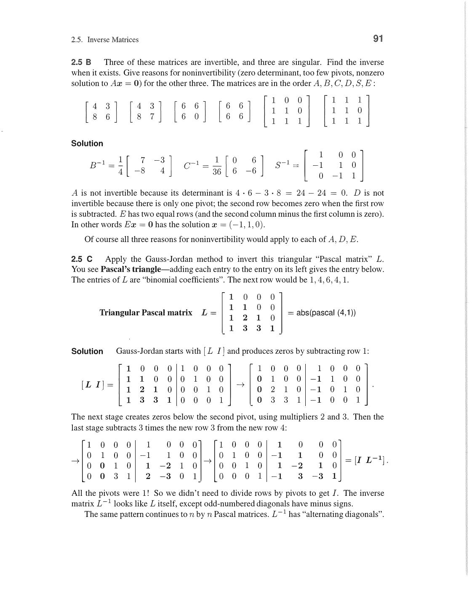
*LU factorization: L ke below-diagonal entries = elimination multipliers (ℓ₂₁=2, ℓ₃₁=4, ℓ₃₂=3), diagonal = 1s. U ke diagonal = pivots (2,1,2). A = LU verify karne se original matrix wapas milti hai. Elimination history ko L me store karna hi A=LU ka essence hai.*

**Solving Ax = b using A = LU:**

Two triangular systems — both O(n²):

```
Step 1: Ly = b    (forward substitution — top to bottom)
Step 2: Ux = y   (back substitution — bottom to top)
```

Example: Solve Ax = (1, 3, 7)ᵀ.

Forward: Ly = b:

```
y₁ = 1
2y₁ + y₂ = 3   →   y₂ = 3-2 = 1
4y₁ + 3y₂ + y₃ = 7   →   y₃ = 7-4-3 = 0
```

y = (1, 1, 0).

Backward: Ux = y:

```
2x₃ = 0    →    x₃ = 0
x₂ + x₃ = 1   →   x₂ = 1
2x₁ + x₂ + x₃ = 1   →   x₁ = 0
```

x = (0, 1, 0). Check: A(0,1,0)ᵀ = (1,3,7)ᵀ ✓

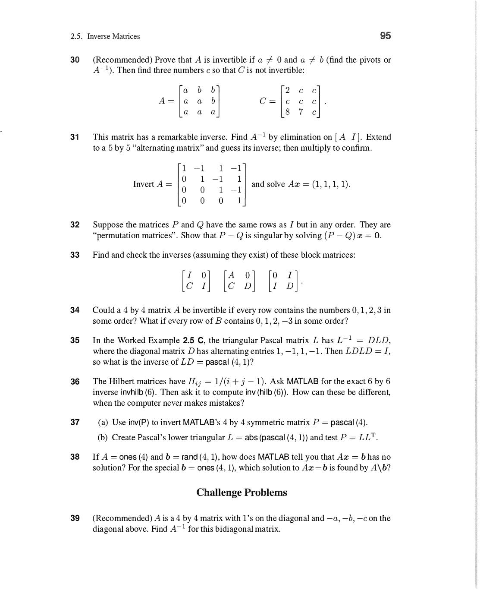
*LU solve: Step 1 — Ly=b forward substitution (top se bottom, y₁=1, y₂=1, y₃=0). Step 2 — Ux=y back substitution (bottom se top, x₃=0, x₂=1, x₁=0). Dono steps O(n²) — yahi LU ka speed advantage hai.*

**Cost analysis:**

- LU factorization: **O(n³/3)** multiplications — done once per matrix
- Each Ly=b solve: O(n²) — fast!
- Each Ux=y solve: O(n²) — fast!

**Power**: If same A but different b values (say, 1000 different b's): compute LU once (O(n³)), then solve each b in O(n²). Much faster than n separate eliminations!

**PA = LU (with row swaps):**

If row swaps needed (zero or small pivots): Permutation matrix P records the swaps.

```
PA = LU    ← elimination with partial pivoting
```

Solve: PAx = Pb → L(Ux) = Pb → Ly = Pb, then Ux = y.

Review of Key Ideas (Section 2.6):

1. A = LU: L stores multipliers below diagonal (with 1s), U is upper triangular with pivots
2. Ly = b (forward) then Ux = y (backward): two O(n²) solves after O(n³/3) factorization
3. Big advantage: reuse LU for many right-hand sides b (only one O(n³) factorization)
4. With row swaps: PA = LU; L still has |ℓᵢⱼ| ≤ 1

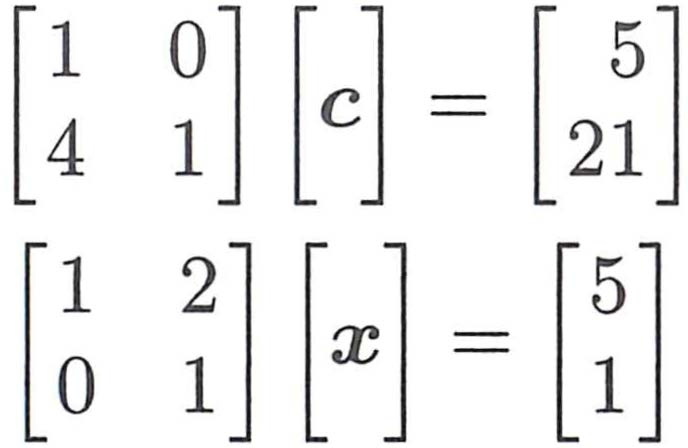
*LU factorization ka solve process: `Lc = b` forward substitution, phir `Ux = c` back substitution. `n³/3` operations lagte hain elimination me — yahi real computation cost hai. Multiple b ke liye: factorize once, solve each time in O(n²).*

## 2.7 Transposes and Permutations

**Transpose:**

```
(Aᵀ)ᵢⱼ = Aⱼᵢ    ← rows become columns, columns become rows
```

For m×n matrix A: Aᵀ is n×m.

**Rules for transpose:**

```
(A + B)ᵀ = Aᵀ + Bᵀ          (transpose distributes over addition)
(cA)ᵀ = cAᵀ                   (scalar comes out)
(AB)ᵀ = BᵀAᵀ                  (reverse order! same as inverse)
(Aᵀ)ᵀ = A                     (transpose twice = original)
(A⁻¹)ᵀ = (Aᵀ)⁻¹              (inverse and transpose commute)
```

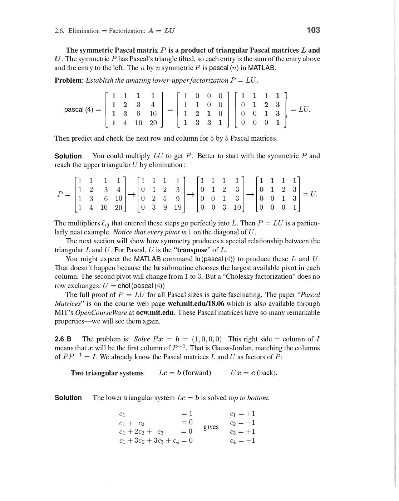
*Transpose ke five rules: (A+B)ᵀ=Aᵀ+Bᵀ, (cA)ᵀ=cAᵀ, (AB)ᵀ=BᵀAᵀ (reverse order!), (Aᵀ)ᵀ=A, (A⁻¹)ᵀ=(Aᵀ)⁻¹. Key: product transpose reverses order — same as (AB)⁻¹=B⁻¹A⁻¹. Socks-shoes analogy: reverse order se undo karo.*

**Why (AB)ᵀ = BᵀAᵀ?**

Proof: [(AB)ᵀ]ᵢⱼ = [AB]ⱼᵢ = (row j of A)·(col i of B) = (col j of Aᵀ)·(row i of Bᵀ) = [BᵀAᵀ]ᵢⱼ. ✓

**Symmetric matrices (A = Aᵀ):**

Aᵢⱼ = Aⱼᵢ for all i,j. Example:

```
S = [1  2  3]    S = Sᵀ ← symmetric!
    [2  5  6]
    [3  6  9]
```

Key fact: **AᵀA is always symmetric** (whatever A is):

```
(AᵀA)ᵀ = Aᵀ(Aᵀ)ᵀ = AᵀA   ✓
```

This is why AᵀA appears everywhere in least squares — symmetry makes it well-behaved.

**LDLᵀ factorization (for symmetric matrices):**

If A = LU and A = Aᵀ: can factor as **A = LDLᵀ**

where L lower triangular with 1s on diagonal, D diagonal with pivots.

```
A = LDLᵀ = L · D · Lᵀ
```

Saves half the work vs LU (no separate U needed — Lᵀ serves as upper triangular).

Example: S = [2,1;1,2]:

```
L = [1    0]    D = [2    0]
    [1/2  1]        [0  3/2]

LDLᵀ = [1,0;1/2,1][2,0;0,3/2][1,1/2;0,1] = [2,1;1,2] = S ✓
```

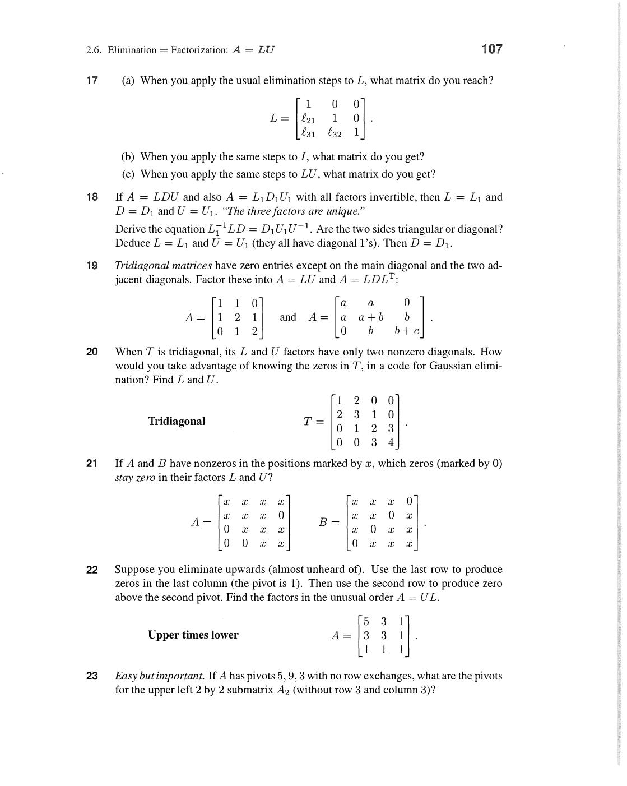
*Symmetric matrix S = Sᵀ: entries sᵢⱼ = sⱼᵢ (mirror about diagonal). LDLᵀ factorization: L lower triangular (1s diagonal), D diagonal (pivots). Half the work of LU! S=[2,1;1,2]: L=[1,0;½,1], D=[2,0;0,3/2], Lᵀ=[1,½;0,1]. AᵀA is always symmetric — yahi least squares me central role deta hai.*

**Permutation matrices:**

P = identity with rows in different order. Exactly one 1 in each row and column.

```
P₂₃ = [1 0 0]    ← swaps rows 2 and 3 when left-multiplying
      [0 0 1]
      [0 1 0]
```

Key properties:

```
PᵀP = I   ← P is orthogonal: P⁻¹ = Pᵀ
det(P) = ±1   (+ for even permutation, - for odd)
```

For n = 3: there are 3! = 6 permutation matrices.

**PA = LU (full pivoting story):**

Every invertible matrix A can be factored as:

```
PA = LU    (P = permutation from partial pivoting)
```

L has |ℓᵢⱼ| ≤ 1 (partial pivoting guarantees this).

Equivalently: A = P⁻¹LU = PᵀLU.

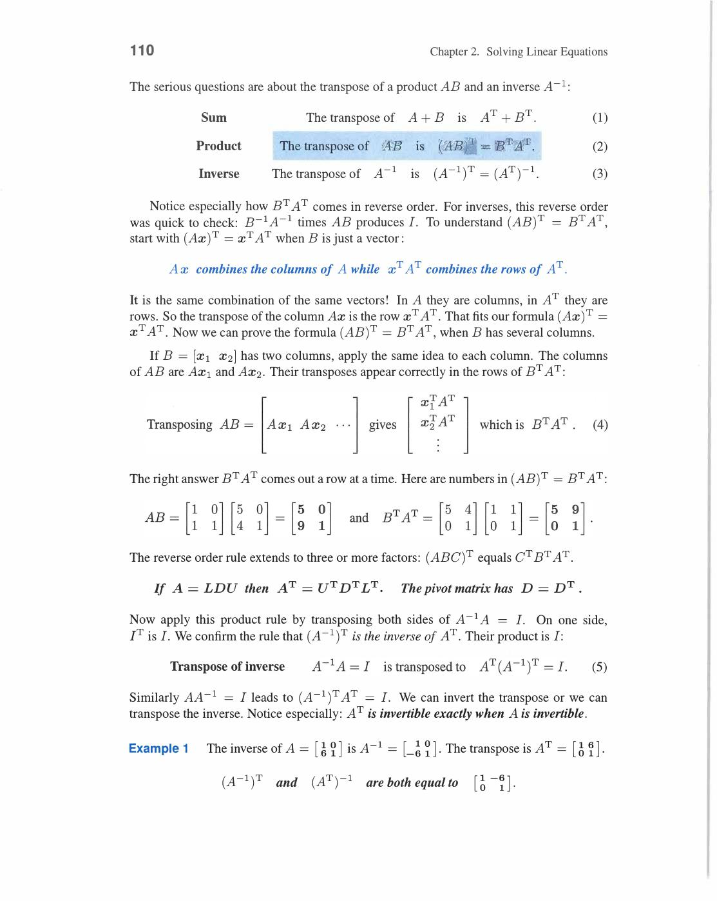
*Permutation matrix P: identity ke rows reordered. Pᵀ = P⁻¹ (orthogonal). PA = LU: P row swaps record karta hai jo elimination ke dauran hue. Solve: PAx=Pb → L(Ux)=Pb → Ly=Pb phir Ux=y. n=3: 6 permutation matrices (3! = 6). Partial pivoting guarantees |ℓᵢⱼ| ≤ 1.*

**Connection of transposes to everything:**

- Symmetric: A = Aᵀ → real eigenvalues (Ch 6)
- AᵀA → positive semidefinite (Ch 6), normal equations in least squares (Ch 4)
- Aᵀ in SVD: A = UΣVᵀ uses transpose of V (Ch 7)
- Left nullspace = N(Aᵀ): the "other" nullspace (Ch 3)

Review of Key Ideas (Section 2.7):

1. Aᵀᵢⱼ = Aⱼᵢ. Rules: (AB)ᵀ = BᵀAᵀ, (A⁻¹)ᵀ = (Aᵀ)⁻¹
2. Symmetric: A = Aᵀ. AᵀA always symmetric (key for least squares)
3. LDLᵀ for symmetric matrices: D = pivots on diagonal, uses symmetry
4. Permutation P: Pᵀ = P⁻¹. PA = LU is the complete factorization

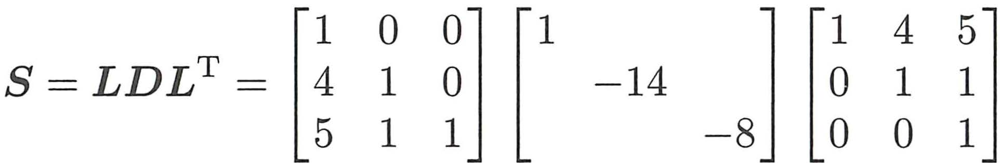
*Worked Examples 2.7A/B: `PSPᵀ` symmetric hoti hai jab `S` symmetric ho. Proof: (PSPᵀ)ᵀ = (Pᵀ)ᵀSᵀPᵀ = PSᵀPᵀ = PSPᵀ. `LDLᵀ` factorization symmetric matrices ke liye efficient form hai — `L` lower triangular, `D` diagonal with pivots. Half the work of full LU.*

Review note:

- Chapter 2 basically computation ka engine build karta hai — LU factorization, pivoting, inverse, transposes sab tools hain for Chapter 3+ ke theory ke liye.

---
