# Chapter 3 - Vector Spaces and Subspaces

Visual gallery: [`03-vector-spaces-and-subspaces.md`](../visuals/03-vector-spaces-and-subspaces.md)

Ab book calculation se theory ki taraf move karti hai.

Main question:

- matrix ke saath naturally kaun se spaces aate hain?
- solution set ki structure kya hoti hai?
- basis aur dimension ka exact meaning kya hai?

## 3.1 Spaces of Vectors

Vector space ka idea:

- vectors ka aisa collection jo addition aur scalar multiplication ke under closed ho

Eight rules/axioms of a vector space (sab satisfy karne chahiye):

1. x + y = y + x (commutative)
2. x + (y + z) = (x + y) + z (associative)
3. Unique zero vector: x + 0 = x
4. Each x has unique -x such that x + (-x) = 0
5. 1·x = x
6. (c₁c₂)x = c₁(c₂x)
7. c(x + y) = cx + cy
8. (c₁ + c₂)x = c₁x + c₂x

Vector spaces ke examples (sirf Rⁿ nahi):

- **Matrix space M**: 2×2 matrices ek 4-dimensional vector space banti hain
- **Function space F**: f(x) = x² aur g(x) = 5x bhi "vectors" hain — functions add ho sakte hain, scalar multiply ho sakte hain
- **Z**: sirf zero vector — smallest possible vector space

Subspace:

- vector space ke andar smaller space
- **must contain zero vector**
- addition aur scalar multiplication ke under closed hona chahiye
- formally: if x and y in subspace, then cx + dy bhi in subspace

Examples:

- line through origin (R³ me)
- plane through origin (R³ me)
- all solutions of Ax = 0 (homogeneous system)
- column space of a matrix C(A)

Important point:

- every line or plane subspace nahi hota — **origin se nahi guzar rahi? Not a subspace**
- x + y = (1,2) + (0,0) me koi fixed shift ho to closed nahi — check by adding two vectors

Column space C(A):

- all combinations of columns of A
- yahi space hai jahan Ax = b ka solution hota hai agar b isme hai
- Adding extra column b expands column space — unless b already in it

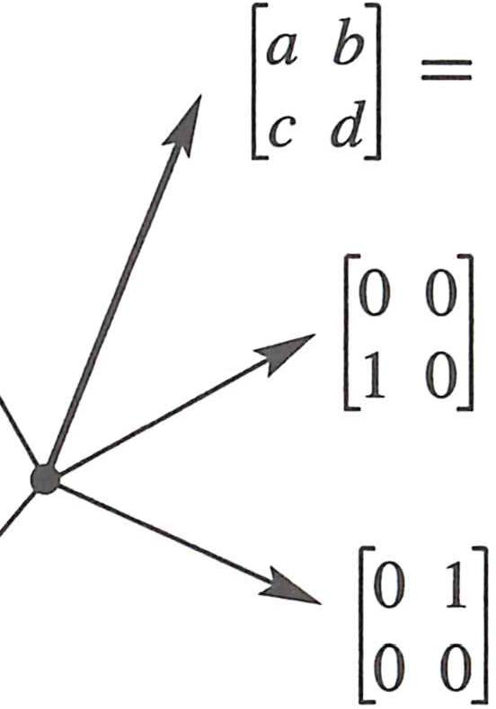
*Figure 3.1: Matrix space M (4-dimensional, 2×2 matrices) aur Z (sirf zero vector). Subspace always origin contain karta hai — Z is the smallest possible vector space. Functions bhi vectors ki tarah behave karte hain — same 8 rules.*

## 3.2 The Nullspace of A: Solving Ax = 0 and Rx = 0

Nullspace:

- all vectors `x` such that `Ax = 0`
- N(A) is a subspace of **Rⁿ** (n = number of columns)
- C(A) is a subspace of **Rᵐ** (m = number of rows)

Why this space matters:

- homogeneous equation ka full solution isi me hota hai
- matrix singular hai ya nahi, nullspace se samajh aata hai

Example 1 (Strang ka): A = [1,2; 3,6] (singular!)

```
x₁ + 2x₂ = 0      →     x₁ + 2x₂ = 0
3x₁ + 6x₂ = 0           0 = 0
```
One equation, one free variable x₂. Set x₂ = 1 → x₁ = -2.
**Special solution s = (-2, 1)**. Nullspace = all multiples of s = a line.

Example 2: [1 2 3]x = 0 → two free variables y and z.

- Set (y,z) = (1,0): s₁ = (-2, 1, 0)
- Set (y,z) = (0,1): s₂ = (-3, 0, 1)
- Nullspace = plane (all combinations c₁s₁ + c₂s₂) — perpendicular to (1,2,3)

Key insight: **Every free column is a combination of earlier pivot columns.** Special solutions tell us exactly those combinations (with signs reversed).

Pivot vs Free variables:

- **Pivot variable**: has a pivot in its column → determined by back/forward substitution
- **Free variable**: no pivot in its column → set to 1 (or 0 for others) to get special solutions
- One special solution per free variable

Rank:

- **Rank r = number of pivots** = number of nonzero rows of R
- n - r = number of free variables = dimension of nullspace

**If n > m (more columns than rows): always at least one free variable → Ax=0 has nonzero solutions**

Reduced Row Echelon Form R = rref(A):

Two extra steps beyond upper triangular U:
1. **Produce zeros above pivots** — use pivot rows to eliminate upward
2. **Produce ones in pivots** — divide each pivot row by its pivot

Result: I in pivot rows/columns, F (free entries) in free columns.

```
R = [I  F]   Special solutions: s = [-F]  (take -F from R, put 1 in free positions)
    [0  0]                           [ I ]
```

Elimination: The Big Picture (from book p.149):

Elimination asks two fundamental questions as it moves column by column:
- **Q1**: Is this column a combination of previous columns? → If no pivot, it IS a combination
- **Q2**: Is this row a combination of previous rows? → If no pivot in row, it becomes zero row

R reveals three fundamental subspace bases:
- **Column space** → pivot columns of A
- **Row space** → nonzero rows of R
- **Nullspace** → special solutions to Rx = 0

Elimination connection:

- `A` aur row-reduced `R` ka same nullspace hota hai
- because elimination reversible row operations use karta hai

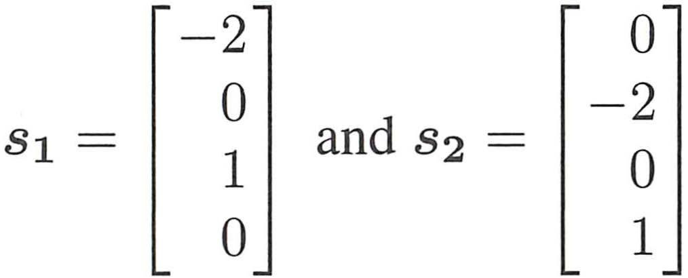
*Reduced echelon matrix R: pivot columns me I hai, free columns me F. s1 aur s2 special solutions hain — free variable 1 rakho baaki 0, phir solve karo pivot variables. Yahi nullspace ka basis hai. 4×7 matrix me 3 pivots → 4 free variables → 4 special solutions.*

Main meaning:

- nullspace tells dependence among columns
- if nonzero vector nullspace me hai, columns dependent hain

Review of Key Ideas (Section 3.2):

1. N(A) is a subspace of Rⁿ. Contains all solutions to Ax = 0
2. Elimination on A produces row reduced R with pivot/free columns. N(A) = N(U) = N(R)
3. Every free column leads to a special solution. That free variable is 1, others are 0
4. Rank r of A = number of pivots. All pivots are 1's in R = rref(A)
5. Complete solution to Ax = 0 is combination of the n-r special solutions
6. A always has a free column if n > m, giving nonzero solution to Ax = 0

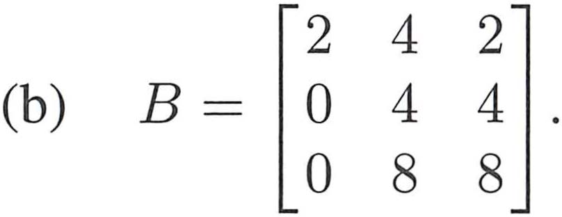
*3.2C: Matrix A ka rank `c` ke value par depend karta hai. `c ≠ 4` → rank 2, one free variable, special solution (-2,1,0). `c = 4` → rank 1, two special solutions (-1,0,1) aur (-2,1,0). Parameter change karo, nullspace change hoti hai.*

## 3.3 The Complete Solution to Ax = b

This section bahut central hai.

Complete solution structure:

- one particular solution `xp` (free variables = 0, solve for pivots)
- plus every homogeneous solution `xn` (any nullspace vector)

So:

- `x = xp + xn`

How to find particular solution xp:

- augmented matrix [A b] pe elimination karo → [R d]
- **free variables = 0 set karo**, pivot variables from d solve karo
- Consistency check: zero rows of R must have zeros in d!

Consistency condition:

- Ax = b is solvable ↔ b is in column space of A
- [R d] me zero row → d ki corresponding entry bhi zero honi chahiye
- Otherwise: no solution (same as 0y = 8 in 2×2 case)

Four cases based on rank r, m (rows), n (cols):

| Case | Condition | Solutions |
|------|-----------|-----------|
| Invertible | r = m = n | Exactly 1 |
| Full row rank | r = m < n | ∞ (free variables exist) |
| Full column rank | r = n < m | 0 or 1 (consistent or not) |
| Rank deficient | r < m, r < n | 0 or ∞ |

Full column rank (r = n): nullspace = {0 only}, no free variables, columns independent

Full row rank (r = m): every b works (Ax = b always solvable), but ∞ solutions if n > m

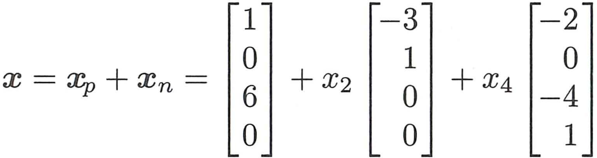
*Complete solution structure: `x = xp + x2*s1 + x4*s2`. Free variables x2 aur x4 arbitrary hain. Particular solution + nullspace = poora solution set. Figure 3.3: ek line of solutions shifted off origin.*

Interpretation:

- `Axp = b`
- `Axn = 0`
- therefore `A(xp + xn) = b`

This is the cleanest way to understand:

- why solutions may be many
- nullspace ka role
- consistency ka structure

If no solution exists:

- then `b` column space me nahi hai — zero row of R has nonzero in d

Review of Key Ideas (Section 3.3):

1. Complete solution: x = xp + xn (particular + nullspace)
2. Elimination on [A b] leads to [R d]. Ax = b ↔ Rx = d
3. Solvable only when all zero rows of R have zeros in d
4. One particular xp: set free variables = 0, solve from d
5. Full column rank r = n: nullspace = Z (zero only), 0 or 1 solution
6. Full row rank r = m: always solvable (b always in C(A))
7. Four cases: r=m=n (1 sol), r=m<n (∞), r=n<m (0 or 1), r<m,n (0 or ∞)

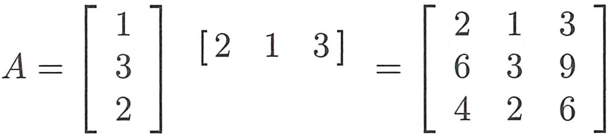
*3.3C: Augmented matrix `[A b]` eliminate karo, particular solution `xp` aur special solutions `s1, s2` nikalo. Complete solution = `xp + c1*s1 + c2*s2`. Pivot variables from `d`, free variables choose karo. Zero row check — consistency.*

## 3.4 Independence, Basis and Dimension

**Linear independence:** Vectors v₁,...,vₙ are linearly independent if:

```
c₁v₁ + c₂v₂ + ... + cₙvₙ = 0   →   c₁ = c₂ = ... = cₙ = 0   (only trivial combination = 0)
```

**Linear dependence:** There exists nonzero combination that gives zero. Equivalently, one vector is a linear combination of the others.

**How to test independence:**

Put vectors as columns of matrix A. Reduce to row echelon form.

- If every column has a pivot → independent
- If some column has no pivot → dependent (that column = combination of earlier pivot columns)

**Concrete example:**

Are v₁ = (1,2,3), v₂ = (2,4,6), v₃ = (1,0,1) independent?

```
A = [1  2  1]    Row reduce:   [1  2  1]
    [2  4  0]                  [0  0 -2]
    [3  6  1]                  [0  0 -2]

→  [1  2  1]
   [0  0 -2]    ← only 2 pivots (rank 2), column 2 has no pivot → DEPENDENT
   [0  0  0]
```

v₂ = 2v₁ (second column = 2 × first column). So yes, v₁ and v₂ are dependent.

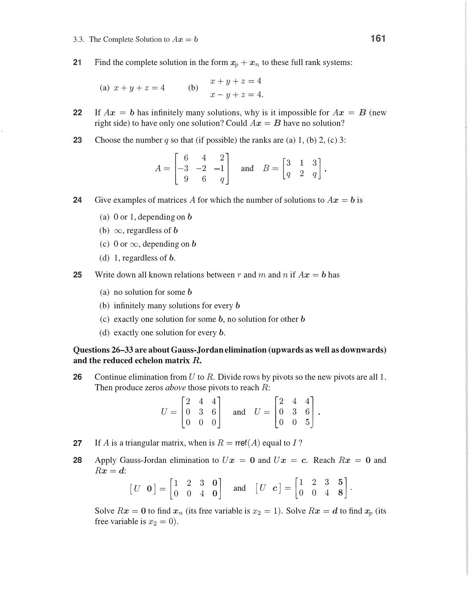
*Independence test: vectors ko matrix A ke columns me dalo, row reduce karo. Pivots ki count = rank = independent vectors ka count. Agar kisi column me pivot nahi → wo column earlier pivot columns ka combination hai → DEPENDENT. Example: [v₁,v₂,v₃] → rank 2 means ek vector dependent hai.*

After removing v₂: v₁ = (1,2,3) and v₃ = (1,0,1) — are these independent?

Matrix [v₁, v₃] = [1,1;2,0;3,1] → two pivots → INDEPENDENT.

**Basis:** A set of vectors is a basis for a space V if:

1. They are linearly independent
2. They span V (every vector in V = some combination of basis vectors)

A basis is the "minimal spanning set" or "maximal independent set."

**Concrete example of a basis:**

Standard basis for R³: e₁ = (1,0,0), e₂ = (0,1,0), e₃ = (0,0,1).

- Independent: [e₁,e₂,e₃] = I → rank 3 ✓
- Span R³: any (a,b,c) = ae₁ + be₂ + ce₃ ✓

Another basis for R³: v₁=(1,1,0), v₂=(1,0,1), v₃=(0,1,1).

```
det[v₁,v₂,v₃] = det[1,1,0;1,0,1;0,1,1] = 1(0-1)-1(1-0)+0 = -1-1 = -2 ≠ 0
```

det ≠ 0 → columns independent → span R³ → valid basis! ✓

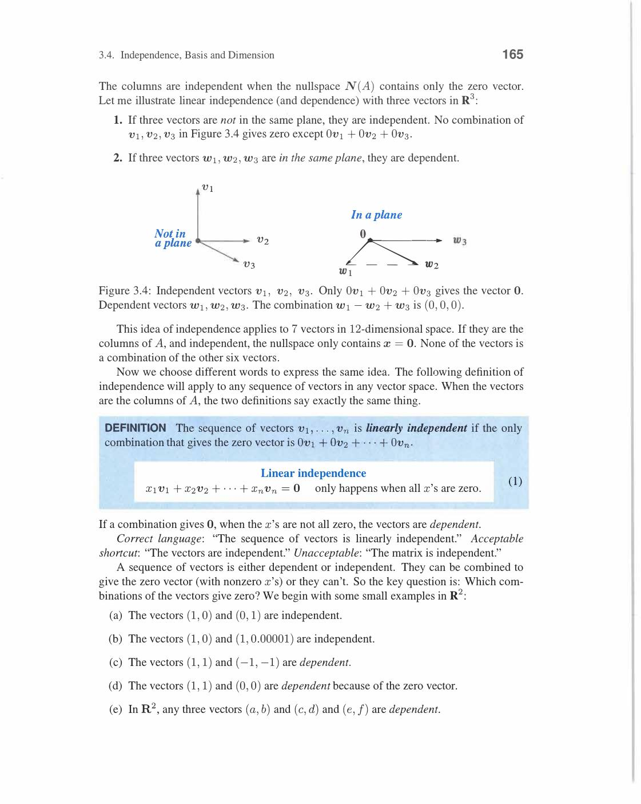
*Basis ke do conditions: (1) vectors span the space — every v = combination of basis. (2) vectors independent — no basis vector = combination of others. Standard basis R³: e₁,e₂,e₃. Alt basis: any 3 independent vectors in R³. Dimension = number of basis vectors (always same for same space).*

**Dimension:** Number of vectors in any basis. Well-defined because:

**Key theorem:** Any two bases of the same space have the same number of vectors.

Proof idea: If one basis has m vectors and another has n, then m ≤ n and n ≤ m (by exchange argument) → m = n.

**Examples of dimensions:**

- R^n: dimension n
- Zero space {0}: dimension 0
- Line through origin: dimension 1
- Plane through origin: dimension 2
- All polynomials of degree ≤ 3: dimension 4 (basis: {1, x, x², x³})

**Basis for Column Space:**

The **pivot columns** of A form a basis for C(A).

Example: A = [1,2,3;4,5,6;7,8,9].

Row reduce: R = [1,0,-1;0,1,2;0,0,0]. Pivots in columns 1,2. So columns 1,2 of **A** (not R!) form basis for C(A).

C(A) basis = {(1,4,7), (2,5,8)}. Dimension = 2 = rank.

**Basis for Nullspace:**

The special solutions form a basis for N(A).

From section 3.2: n - r special solutions, each one per free variable.

**Coordinates in a basis:**

Once basis {b₁,...,bₖ} chosen for space V: every v ∈ V has unique representation:

```
v = c₁b₁ + c₂b₂ + ... + cₖbₖ    ← coordinates (c₁,...,cₖ) w.r.t. this basis
```

Different basis → different coordinates for same vector. This idea leads to Chapter 8's matrix-of-a-transformation.

Review of Key Ideas (Section 3.4):

1. Independent: only trivial zero combination. Test: put in matrix, check for pivots
2. Basis: independent + spanning. Dimension = number of basis vectors
3. Pivot columns of A = basis for C(A). Special solutions = basis for N(A)
4. Any two bases of same space have same number of vectors → dimension well-defined

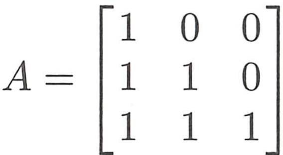
*Example 7: Invertible matrix A ke columns → basis for R³ (det ≠ 0 means all columns independent, they span R³). Singular matrix B ke columns → dependent, not a basis (one column = combination of others). Key rule: pivot columns of A (not R!) are always a basis for C(A).*

## 3.5 Dimensions of the Four Subspaces

For any m×n matrix A with rank r, there are exactly four fundamental subspaces:

**Summary table:**

| Subspace | Space | Basis | Dimension |
|---|---|---|---|
| Column space C(A) | Rᵐ | Pivot columns of A | r |
| Row space C(Aᵀ) | Rⁿ | Nonzero rows of R | r |
| Nullspace N(A) | Rⁿ | Special solutions | n - r |
| Left nullspace N(Aᵀ) | Rᵐ | From Aᵀ elimination | m - r |

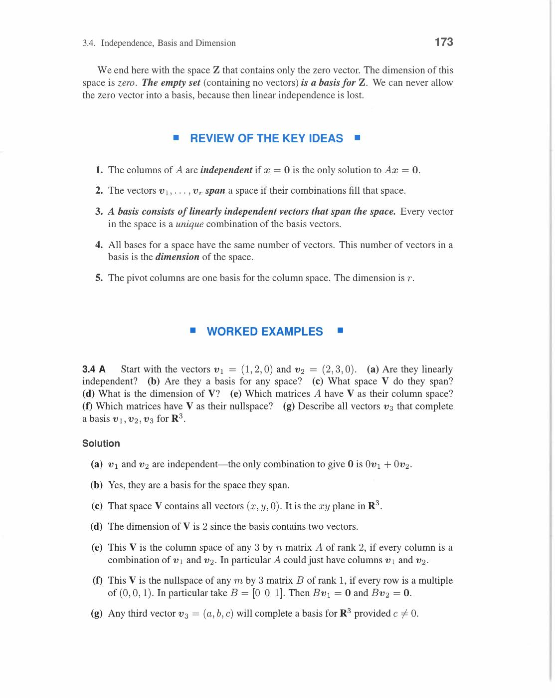
*Char fundamental subspaces: C(A) dim r in Rᵐ, C(Aᵀ) dim r in Rⁿ, N(A) dim n-r in Rⁿ, N(Aᵀ) dim m-r in Rᵐ. Rⁿ = row space ⊕ nullspace. Rᵐ = column space ⊕ left nullspace. A maps row space → column space (bijection), nullspace → zero.*

**Rank-Nullity Theorem:**

```
dim(C(A)) + dim(N(A)) = r + (n-r) = n = number of columns
dim(C(Aᵀ)) + dim(N(Aᵀ)) = r + (m-r) = m = number of rows
```

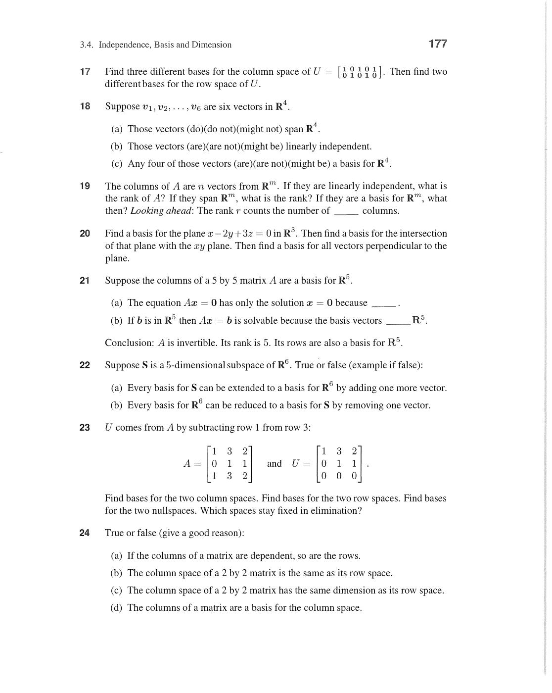
*Rank-Nullity: dim C(A) + dim N(A) = r + (n-r) = n. Yeh dimension identity har matrix ke liye hold karta hai. Iska matlab: r pivot columns + (n-r) free columns = n total columns. Rⁿ me: row space (dim r) + nullspace (dim n-r) = complete split. Invertible matrix: r=n, nullspace={0}.*

**Concrete example — find all four subspaces:**

```
A = [1  2  3  1]
    [2  4  7  2]
    [3  6  10 3]
```

Row reduce to R:

```
R₂ → R₂ - 2R₁: [0, 0, 1, 0]
R₃ → R₃ - 3R₁: [0, 0, 1, 0]
R₃ → R₃ - R₂:  [0, 0, 0, 0]

R = [1  2  3  1]     rank r = 2
    [0  0  1  0]     pivot columns: 1 and 3
    [0  0  0  0]     free columns: 2 and 4
```

**C(A):** pivot columns of A = columns 1 and 3.

```
C(A) basis = {(1,2,3), (3,7,10)}    dim = 2
```

**N(A):** two free variables x₂ and x₄. Special solutions:

Set (x₂,x₄) = (1,0): from R, x₃ = 0, x₁ = -2. s₁ = (-2,1,0,0).

Set (x₂,x₄) = (0,1): from R, x₃ = 0, x₁ = -1. s₂ = (-1,0,0,1).

```
N(A) basis = {(-2,1,0,0), (-1,0,0,1)}    dim = 2 = n-r = 4-2 ✓
```

**C(Aᵀ) = Row space:** nonzero rows of R.

```
Row space basis = {(1,2,3,1), (0,0,1,0)}    dim = 2 ✓
```

**N(Aᵀ) = Left nullspace:** solve Aᵀy = 0. Equivalently, find y s.t. yᵀA = 0ᵀ.

From row reduction with augmented identity:

Row 3 of R = 0 came from: R₃_orig - 2R₂_orig + 0·R₁_orig. So y = (-3,0,1)?

Check: (-3,0,1)·A = (-3(row1) + 0 + row3) = (-3+3,...) = (0,0,0,0). 

More precisely: y = (−3, 0, 1)ᵀ from the row operations [tracking via augmented matrix].

```
N(Aᵀ) basis = one vector    dim = 1 = m-r = 3-2 ✓
```

**Key insight from dimensions:**

```
n = r + (n-r)   →   (row space dim) + (nullspace dim) = n   ← input space splits!
m = r + (m-r)   →   (col space dim) + (left null dim) = m   ← output space splits!
```

A maps:
- row space → column space (invertibly — r-dimensional both sides)
- nullspace → zero (n-r dimensional → 0)

This is the Big Picture of linear algebra!

**Rank inequalities:**

```
rank(AB) ≤ rank(A)    (multiplying can only reduce rank)
rank(AB) ≤ rank(B)
rank(AᵀA) = rank(A)  ← important! (same row space and null space)
```

Multiplying by invertible matrix doesn't change rank:

```
If C invertible: rank(CA) = rank(A) = rank(AC)
```

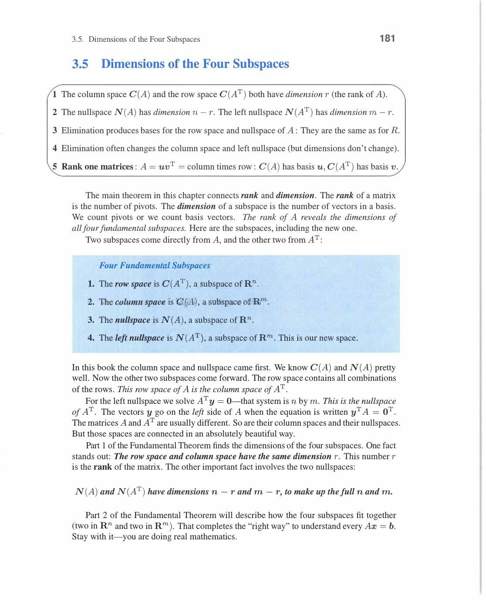
*rank(AB) ≤ min(rank A, rank B). Proof: C(AB) ⊆ C(A) → rank(AB) ≤ rank(A). N(B) ⊆ N(AB) → rank(AB) ≤ rank(B). rank(AᵀA) = rank(A) (important! same row space aur nullspace). Invertible matrix se multiply karne par rank change nahi hota.*

Review of Key Ideas (Section 3.5):

1. Four subspaces: C(A) dim r, C(Aᵀ) dim r, N(A) dim n-r, N(Aᵀ) dim m-r
2. Rank-nullity: r + (n-r) = n; and r + (m-r) = m
3. A maps row space → column space (bijection), nullspace → {0}
4. rank(AᵀA) = rank(A); rank(AB) ≤ min(rank(A), rank(B))

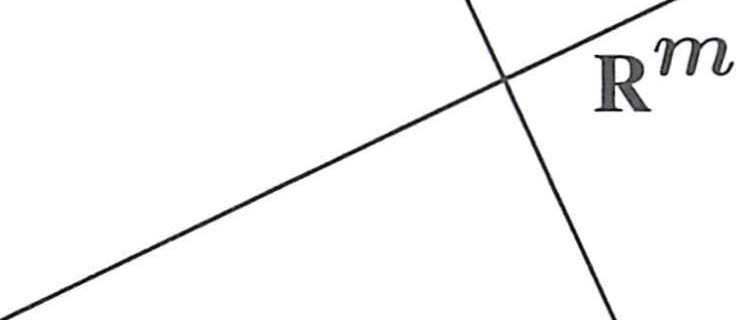
*Figure 3.5: Rn me row space (dim r) + nullspace (dim n-r). Rm me column space (dim r) + left nullspace (dim m-r). A maps row space → column space bijectively, nullspace → zero. Row space aur nullspace perpendicular hain (orthogonal complements — Ch 4). Yahi Fundamental Theorem of Linear Algebra Part 1 hai.*

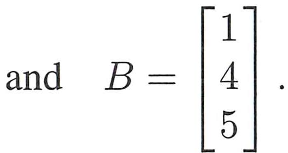
*3.5B: rank(AB) ≤ rank(A) aur rank(AB) ≤ rank(B). Proof: C(AB) ⊆ C(A) (columns of AB = A times columns of B). Invertible matrix se multiply karne par rank change nahi hota. Example: AB ka rank in [0, min(rank A, rank B)].*

---
