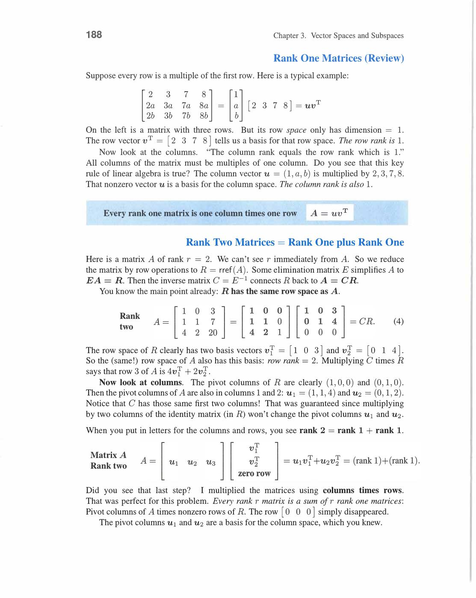
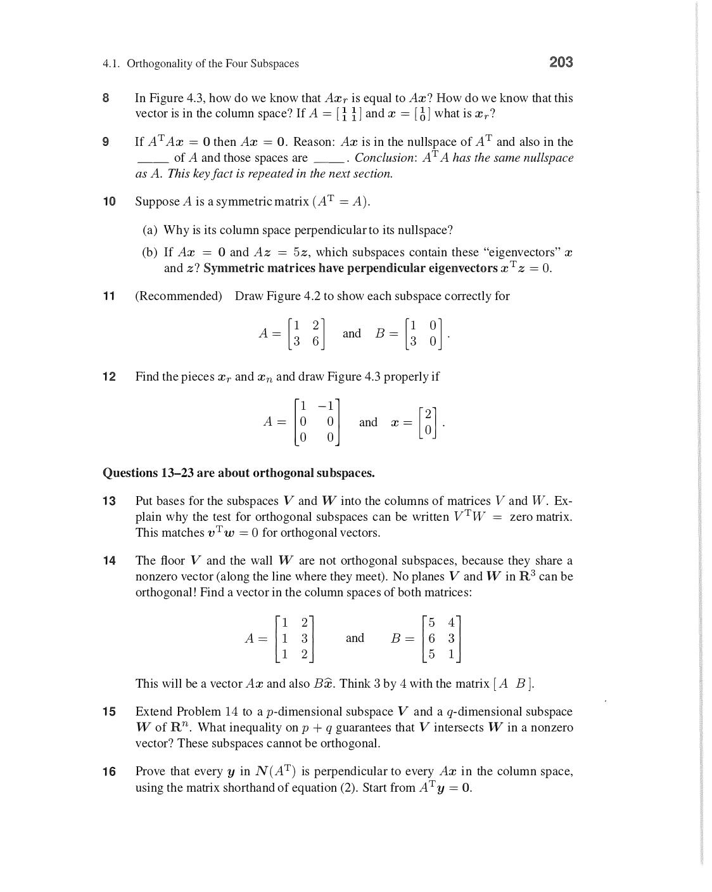
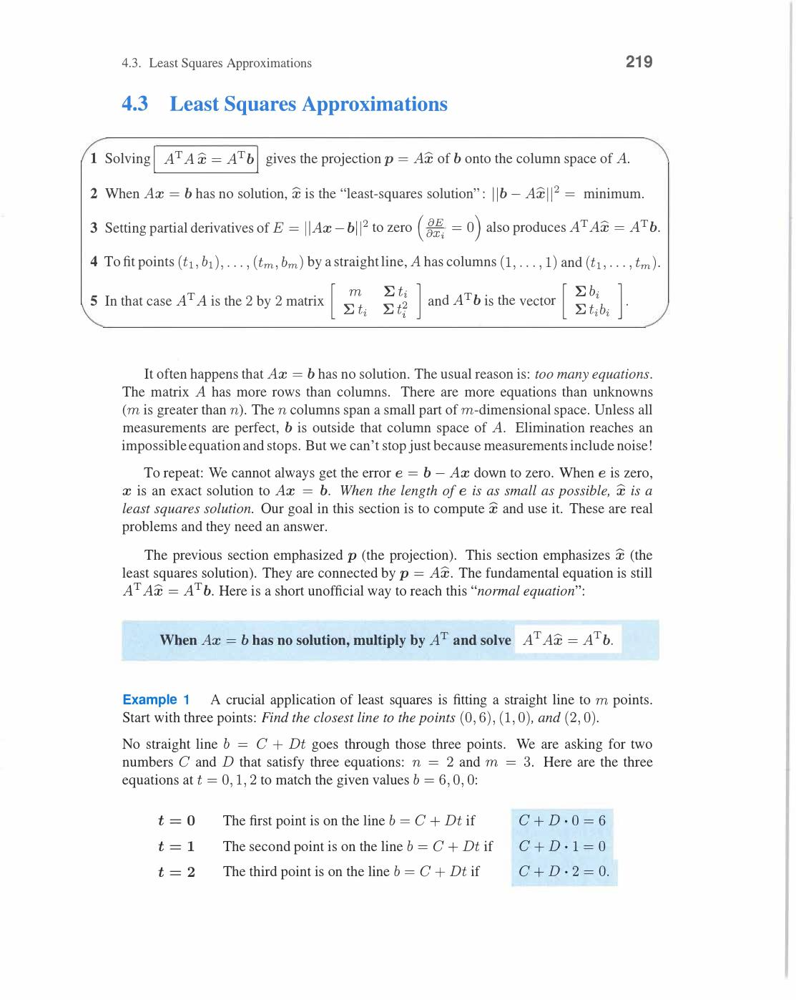
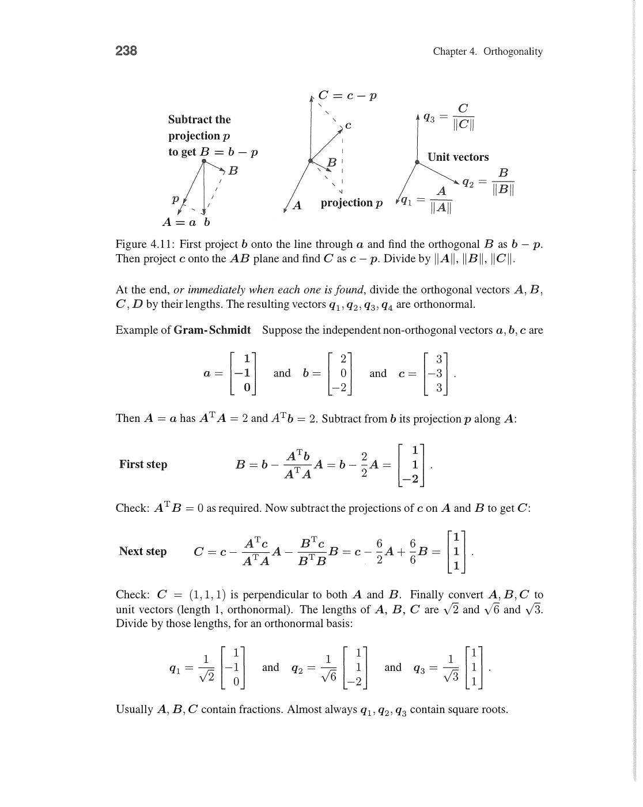

# Chapter 4 - Orthogonality

Visual gallery: [`04-orthogonality.md`](../visuals/04-orthogonality.md)

Chapter 4 dot product ideas ko full linear algebra level tak le jata hai.

Main topics:

- orthogonal subspaces
- projections
- least squares
- orthonormal bases

## 4.1 Orthogonality of the Four Subspaces

Orthogonal vectors definition: v·w = 0. Then ‖v‖² + ‖w‖² = ‖v+w‖² = ‖v-w‖² (Pythagoras!).

Physical intuition examples (Strang's):

- **Example 1**: Floor of your room (extended to infinity) = subspace V. Line where two walls meet = subspace W. They ARE orthogonal — every floor vector ⊥ every wall-line vector.
- **Example 2**: Two walls LOOK perpendicular but are NOT orthogonal subspaces — the meeting line is in BOTH walls. Any vector in two orthogonal subspaces must be zero (it's perpendicular to itself: v·v = 0 → v = 0).

Big theorem:

- **Row space ⊥ Nullspace**: Every x in N(A) satisfies Ax = 0 → each row of A has dot product 0 with x → x ⊥ every row → x ⊥ whole row space
- **Column space ⊥ Left nullspace**: Apply same argument to Aᵀ

Proof (matrix shorthand): For any x in nullspace: `xᵀ(Aᵀy) = (Ax)ᵀy = 0ᵀy = 0` — so nullspace ⊥ row space.

Example 3 (Strang): A = [1,3,4; 5,2,7], x = (1,1,-1) in nullspace:
- Row 1 · x = 1+3-4 = 0 ✓
- Row 2 · x = 5+2-7 = 0 ✓

**Fundamental Theorem of Linear Algebra, Part 2:**

- N(A) is the **orthogonal complement** of the row space C(Aᵀ) in Rⁿ
- N(Aᵀ) is the **orthogonal complement** of the column space C(A) in Rᵐ

Orthogonal complement V⊥: contains every vector perpendicular to V. Dimensions of V and V⊥ add to n.

Every x splits uniquely: `x = x_row + x_null`

- x_row in row space, x_null in nullspace
- These are perpendicular pieces
- Example: A = [1,2; 3,6], x = (4,3) → x_row = (2,4), x_null = (2,-1)


*V⊥ (V-perp): V ke saath perpendicular saare vectors ka set. dim(V) + dim(V⊥) = n. N(A) aur C(Aᵀ) orthogonal complements hain Rⁿ me. N(Aᵀ) aur C(A) orthogonal complements hain Rᵐ me. Har vector x = x_row + x_null: perpendicular split.*

Key fact: **Any n independent vectors in Rⁿ span Rⁿ. Any n spanning vectors are independent.**

Fredholm's Alternative:

- Exactly one has a solution: **Ax = b** OR **Aᵀy = 0 with yᵀb = 1**
- If b ∉ C(A), find y in N(Aᵀ) with yᵀb ≠ 0 → scales to yᵀb = 1

This explains why the four subspaces naturally pair up.


*Figure 4.1: Plane V aur line W orthogonal hain — har vector V me W ke kisi bhi vector se perpendicular hai. Two planes in R³ orthogonal nahi ho saktin (dimensions 2+2 > 3). Orthogonal complement = largest orthogonal subspace.*

Review of Key Ideas (Section 4.1):

1. V and W orthogonal if every v·w = 0. Orthogonal complements: W = all vectors ⊥ V
2. Dimensions of V and V⊥ add to n. N(A) dim + row space dim = n
3. N(A) and C(Aᵀ) are orthogonal complements (dimensions n-r and r). N(Aᵀ) and C(A) similarly
4. Any n independent vectors in Rⁿ span Rⁿ. Any n spanning vectors are independent


*Figure 4.3: A maps x = xr + xn: row space component xr goes to column space (Axr = Ax), nullspace component xn goes to zero. Every b in column space comes from exactly one xr. Figure 4.4: Row space = plane, nullspace = orthogonal line for a specific A.*

## 4.2 Projections

Opening intuition: b = (2,3,4) ka projection onto z-axis = (0,0,4). Projection onto xy-plane = (2,3,0).

```
P₁ (onto z-axis)  = [0 0 0]    P₂ (onto xy-plane) = [1 0 0]
                    [0 0 0]                           [0 1 0]
                    [0 0 1]                           [0 0 0]
```
**P₁ + P₂ = I** — projections onto orthogonal complements sum to identity!
**p₁ + p₂ = b** — every vector = its two pieces.

Projection onto a line (key derivation):

Line through origin in direction **a**. Find nearest point p = x̂·a to given b.

Key: error **e = b - p = b - x̂a** must be ⊥ to **a**.

```
aᵀ(b - x̂a) = 0
aᵀb - x̂(aᵀa) = 0
x̂ = aᵀb / aᵀa
p = x̂·a = (aᵀb / aᵀa) a
```

Example 1 (Strang): Project b = (1,1,1) onto a = (1,2,2).

- aᵀb = 1+2+2 = 5, aᵀa = 1+4+4 = 9
- x̂ = 5/9
- p = (5/9)(1,2,2) = (5/9, 10/9, 10/9)
- e = b - p = (4/9, -1/9, -1/9) — check: eᵀa = 4/9 - 2/9 - 2/9 = 0 ✓

Projection matrix P (onto line):

```
P = aaᵀ / aᵀa      (column times row, divided by scalar)
```
P is rank 1 — projects everything onto the line.

Example 2: a = (1,2,2) → P = (1/9)[1,2,2; 2,4,4; 2,4,4].

Key properties of projection matrix P:

- **P² = P** (projecting twice = once — idempotent)
- **Pᵀ = P** (symmetric)
- **I - P** projects onto the perpendicular complement
- Special: Pa = a (a projects to itself), if b ⊥ a then Pb = 0

Review of Key Ideas (Section 4.2a — Projection onto a line):

1. Projection of b onto line through a: p = (aᵀb/aᵀa)a
2. Error e = b - p is perpendicular to a: aᵀe = 0 (key condition)
3. Projection matrix P = aaᵀ/aᵀa (rank 1, symmetric, idempotent P²=P)
4. I - P projects onto complement of a


*Figure 4.6: b ka projection p = x̂a line a par. Dashed error line e = b - p perpendicular to a. x̂ = aᵀb/aᵀa. Right side: p = Ax̂ = A(AᵀA)⁻¹Aᵀb onto column space S. Yahi two-step projection hai — line → subspace.*

Projection onto a subspace (general derivation):

n independent vectors a₁,...,aₙ in Rᵐ (columns of A). Find p = Ax̂ closest to b.

Error b - Ax̂ must be ⊥ all aᵢ:

```
a₁ᵀ(b - Ax̂) = 0
a₂ᵀ(b - Ax̂) = 0    →  Aᵀ(b - Ax̂) = 0
...
```

**Normal equations: AᵀAx̂ = Aᵀb**


*Normal equations: error e = b - Ax̂ ⊥ column space. Aᵀ(b-Ax̂) = 0 → AᵀAx̂ = Aᵀb. Geometric: p = Ax̂ is nearest point in C(A) to b. e perpendicular to every column of A — yahi orthogonality condition hai jo normal equations deti hain.*

Solve: x̂ = (AᵀA)⁻¹Aᵀb (when A has independent columns, AᵀA is invertible)

Three key formulas:

```
x̂ = (AᵀA)⁻¹Aᵀb      ← coefficients
p  = Ax̂              ← projection vector
P  = A(AᵀA)⁻¹Aᵀ      ← projection matrix
```

**AᵀA is invertible ↔ A has independent columns ↔ N(AᵀA) = N(A) = {0}**

Review of Key Ideas (Section 4.2b — Projection onto subspace):

1. Normal equations: AᵀAx̂ = Aᵀb (error b-Ax̂ ⊥ every column of A)
2. Three formulas: x̂ = (AᵀA)⁻¹Aᵀb, p = Ax̂, P = A(AᵀA)⁻¹Aᵀ
3. P² = P (idempotent) and Pᵀ = P (symmetric) — always true for projection matrices
4. AᵀA invertible ↔ A has independent columns ↔ Ax=0 has only x=0


*Projection onto column space ke teen formulas: x̂ = (AᵀA)⁻¹Aᵀb (coefficients), p = Ax̂ (projection vector), P = A(AᵀA)⁻¹Aᵀ (projection matrix). P symmetric hai aur P² = P. Yahi formulas least squares ka base hain. AᵀA invertible tabhi jab A ke columns independent hon.*

## 4.3 Least Squares Approximations

When `Ax = b` unsolvable ho (more equations than unknowns, overdetermined):

- exact solution nahi milta (b not in column space)
- then best approximate solution choose karo

Least squares means:

- minimize `||Ax - b||²` = sum of squared errors

Normal equations (same as projection formula):

- `AᵀAx̂ = Aᵀb`

Geometric meaning:

- `Ax̂` is projection of `b` onto column space of `A`
- error vector e = b - Ax̂ is orthogonal to column space

Best fit line example (Strang's key application):

Fit line b = C + Dt through points (t,b) = (0,6), (1,0), (2,0) [no exact fit]:

```
A = [1  0]    b = [6]    Solve AᵀAx̂ = Aᵀb
    [1  1]        [0]
    [1  2]        [0]
```

AᵀA = [3, 3; 3, 5], Aᵀb = [6, 0]

Solving: C = 5, D = -3. Best line: b = 5 - 3t.

Errors: e₁ = 6-5=1, e₂ = 0-2=-2, e₃ = 0-(-1)=1. Error vector ⊥ columns of A (check!).


*Least squares line b = C + Dt: A = [1,t₁;1,t₂;...], solve AᵀAx̂=Aᵀb. Geometric picture: projected point Ax̂ is closest point in C(A) to b. Error e = b-Ax̂ perpendicular to column space — yahi "least squares" ka meaning hai. Errors minimize ‖e‖².*

Another example — fit to points (0,0), (1,8), (2,8), (3,20):

- b = (0,8,8,20), A has column of 1's and column of t values
- Normal equations give best line

Review of Key Ideas (Section 4.3a — Least squares setup):

1. Least squares: minimize ‖Ax-b‖². Best x̂ satisfies AᵀAx̂ = Aᵀb
2. Geometric: Ax̂ = projection of b onto C(A). Error e = b-Ax̂ ⊥ C(A)
3. Line fitting: A = [1,t₁;1,t₂;...], unknowns = (C,D) = intercept + slope
4. Error vector e has Σeᵢ = 0 and Σtᵢeᵢ = 0 (perpendicular to both columns of A)


*Normal equations AᵀAx̂ = Aᵀb least squares ka core hain. QᵀQ = I orthonormal columns ka definition. Line fitting: A = [1,t₁; 1,t₂; ...] me [1] aur [t] columns hote hain — intercept C aur slope D solve hote hain. Jab columns orthogonal hon: x̂ᵢ = qᵢᵀb (direct dot product).*

When columns of A are orthonormal (Q instead of A):

- QᵀQ = I → normal equations become x̂ = Qᵀb (super simple!)
- Each coefficient x̂ᵢ = qᵢᵀb directly

This section extremely important hai because:

- data fitting aur regression
- statistics (least squares estimators)
- machine learning (linear regression)
- numerical optimization
- signal processing

all yahin se connect hote hain.

Review of Key Ideas (Section 4.3b — Orthonormal simplification):

1. QᵀQ = I → normal equations become x̂ = Qᵀb (no matrix inversion needed!)
2. Each coefficient x̂ᵢ = qᵢᵀb (direct dot product with each orthonormal basis vector)
3. Projection p = QQᵀb = Σ(qᵢᵀb)qᵢ (sum of projections onto each qᵢ)
4. Applications: linear regression, statistics, signal processing, ML all use this core formula


*4.3A/B: Best fit line b = (0,8,8,20) ke points ke through. A = [1,0; 1,1; 1,2; 1,3] — constant column aur time column. AᵀA solve karo → slope aur intercept. Error e = b - Ax̂ column space se perpendicular hai — yahi least squares ka geometric proof aur intuition hai.*

## 4.4 Orthonormal Bases and Gram-Schmidt

Orthonormal basis:

- vectors orthogonal bhi hon: qᵢᵀqⱼ = 0 for i ≠ j
- and each has length 1: qᵢᵀqᵢ = 1

In compact form (matrix Q with orthonormal columns): **QᵀQ = I**

Why useful:

- coordinates easy ho jate hain: x̂ᵢ = qᵢᵀb (just dot products)
- AᵀA = QᵀQ = I so no matrix to invert!
- Least squares: QᵀQ x̂ = Qᵀb → x̂ = Qᵀb

Gram-Schmidt process (convert independent vectors a, b, c to orthonormal q₁, q₂, q₃):

**Step 1**: Take first vector as is: A = a, then q₁ = A/‖A‖

**Step 2**: Subtract projection of b onto q₁:
```
B = b - (q₁ᵀb)q₁     ← remove component along q₁
q₂ = B / ‖B‖
```

**Step 3**: Subtract projections onto q₁ and q₂:
```
C = c - (q₁ᵀc)q₁ - (q₂ᵀc)q₂
q₃ = C / ‖C‖
```

Concrete example (Strang's): a = (1,0,0), b = (1,1,0), c = (1,1,1).

- q₁ = (1,0,0)
- B = (1,1,0) - 1·(1,0,0) = (0,1,0), q₂ = (0,1,0)
- C = (1,1,1) - 1·(1,0,0) - 1·(0,1,0) = (0,0,1), q₃ = (0,0,1)
- (Trivially orthonormal already in this case)


*Gram-Schmidt: q₁=a/‖a‖. B=b-(q₁ᵀb)q₁ (remove projection onto q₁), q₂=B/‖B‖. C=c-(q₁ᵀc)q₁-(q₂ᵀc)q₂ (remove projections onto q₁ aur q₂), q₃=C/‖C‖. Result: orthonormal set q₁,q₂,q₃. Same span as a,b,c. Yahi algorithm independent vectors ko orthonormal basis me convert karta hai.*

QR factorization:

- A = QR where Q has orthonormal columns, R is upper triangular
- R's entries: rᵢⱼ = qᵢᵀ(column j of A)
- R upper triangular because Gram-Schmidt processes columns left to right
- Normal equations become: Rx̂ = Qᵀb (easy upper triangular solve!)


*QR factorization: A = QR. Q has orthonormal columns (q₁,q₂,...). R upper triangular: rᵢⱼ = qᵢᵀ(col j of A). R upper triangular kyunki Gram-Schmidt left se right process karta hai — later q's not involved in earlier R entries. Least squares via QR: Rx̂ = Qᵀb (numerically stable).*

Hadamard matrix example (Strang 4.4B):

H₄ = [1,1,1,1; 1,-1,1,-1; 1,1,-1,-1; 1,-1,-1,1] — all columns orthogonal (not unit length).

- H₄ᵀH₄ = 4I (diagonal!) → to get Q, divide each column by 2
- AᵀA diagonal → projections decouple: p₁ + p₂ + p₃ + p₄ = b

**When columns are orthogonal: AᵀA is diagonal → projections can be added independently.**


*Gram-Schmidt: B = b - (q₁ᵀb)q₁ orthogonal component nikalta hai q₁ se. C = c - (q₁ᵀc)q₁ - (q₂ᵀc)q₂. Normalize karke q₁, q₂, q₃. QR: A = QR jahan R upper triangular aur entries = dot products rᵢⱼ = qᵢᵀaⱼ. Yahi numerically stable algorithm hai.*

Later connection:

- QR factorization
- Least squares via Rx̂ = Qᵀb (numerically better than normal equations)
- Fourier series (orthogonal basis of sin/cos functions)
- Numerical stability (Householder QR better than Gram-Schmidt for floating point)

Review of Key Ideas (Section 4.4):

1. Orthonormal: qᵢᵀqⱼ = δᵢⱼ. Matrix Q: QᵀQ = I (but QQᵀ = I only if Q square)
2. Gram-Schmidt: A = a; B = b-(q₁ᵀb)q₁; C = c-(q₁ᵀc)q₁-(q₂ᵀc)q₂; normalize each
3. A = QR: Q orthonormal columns, R upper triangular with rᵢⱼ = qᵢᵀ(col j of A)
4. Orthogonal columns → AᵀA diagonal → projections decouple (Fourier, wavelets, DCT)


*4.4B: Hadamard matrix H4 ke columns orthogonal hain (not unit). H4ᵀH4 = 4I diagonal! → Q = H4/2. AᵀA diagonal → projection easy: x̂ᵢ = qᵢᵀb separately, p = Σ x̂ᵢqᵢ. Yahi Fourier series ka discrete version hai — orthogonal basis par project karke add karo.*

---
