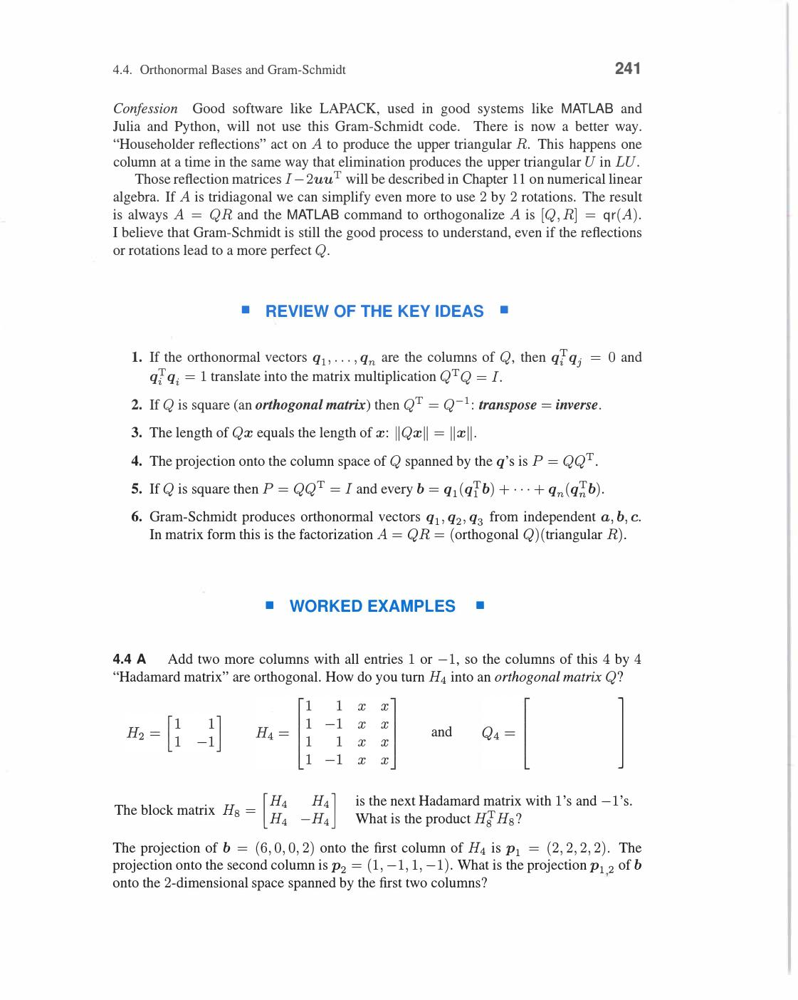
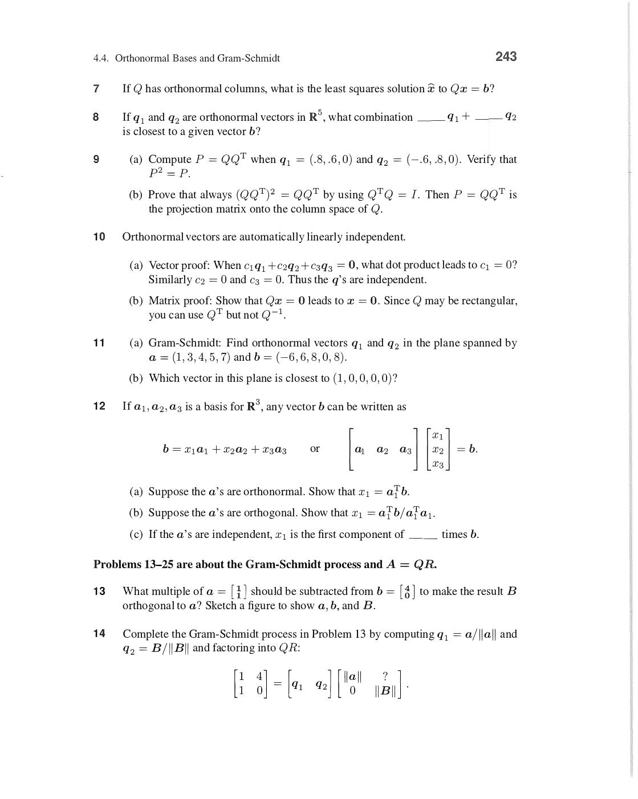
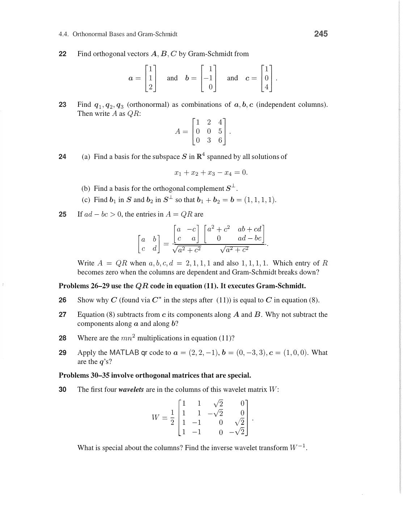
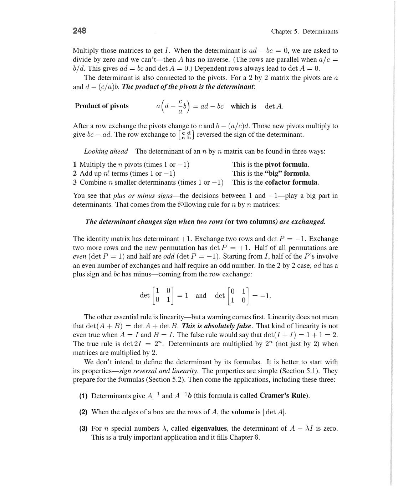
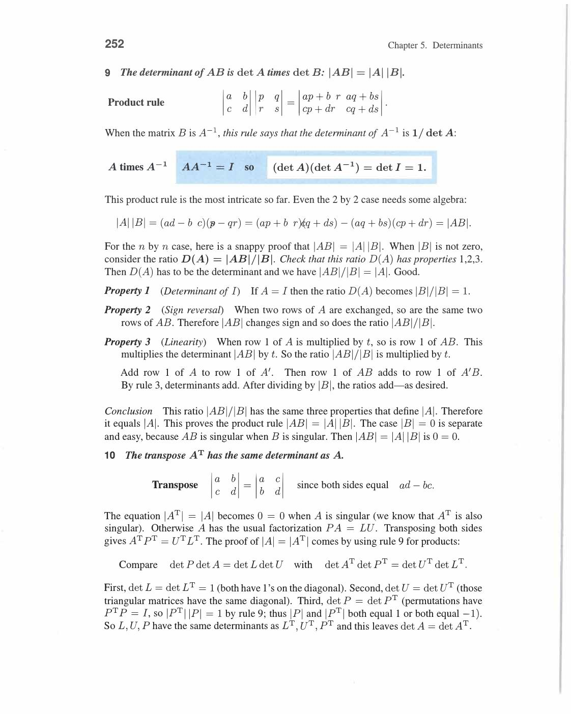
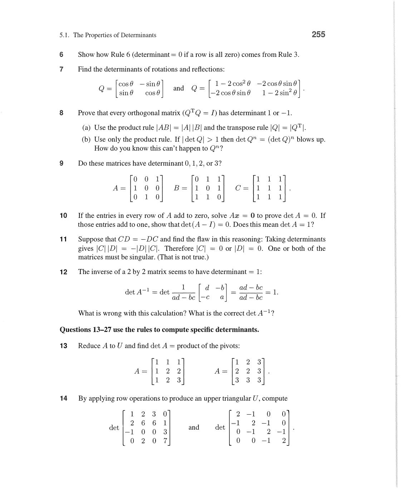
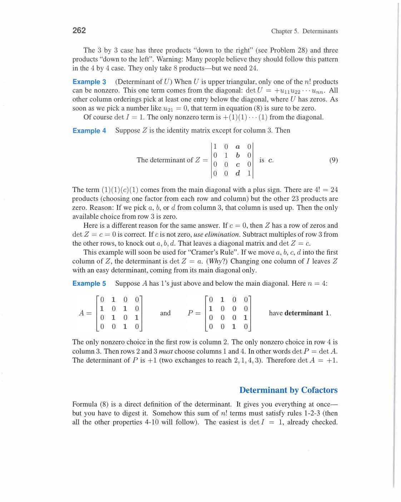
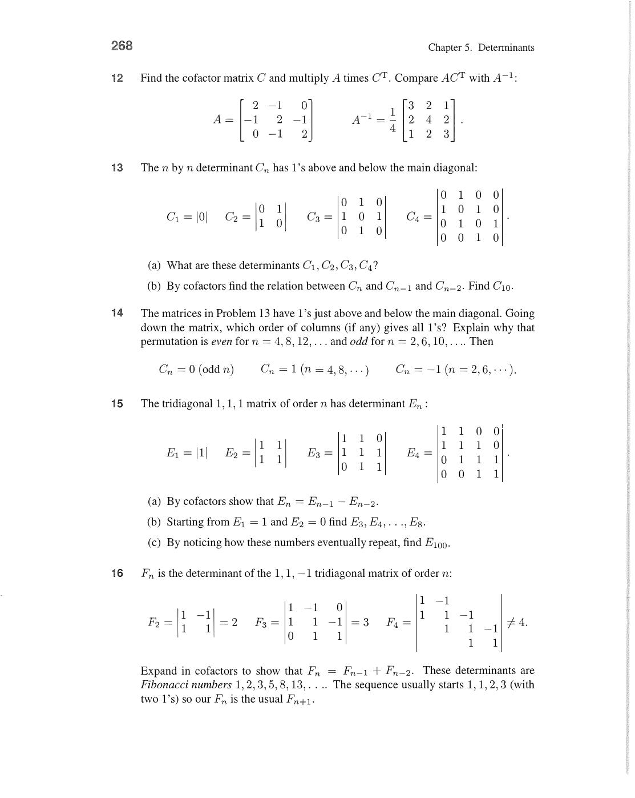

# Chapter 5 - Determinants

Visual gallery: [`05-determinants.md`](../visuals/05-determinants.md)

Determinant ek single number hai jo poori square matrix ka summary deta hai.

Main uses (Strang's 5 points):

1. **Singularity test**: det(A) = 0 ↔ A is singular
2. **Inverse formula**: A⁻¹ = Cᵀ / det(A) (cofactor matrix)
3. **Cramer's Rule**: explicit formula for Ax = b solution
4. **Volume**: |det(A)| = volume of box formed by rows/columns
5. **Pivots**: det(A) = product of pivots (with sign from row exchanges)

But Strang ka attitude clear hai:

- determinant useful hai for theory
- but elimination se pehle determinant formulas padhna best route nahi
- practical computation me always elimination use karo

2×2 case ka formula:

```
A = [a  b]    det(A) = ad - bc
    [c  d]

A⁻¹ = (1/det A) · [ d  -b]     ← det(A) ≠ 0 chahiye
                    [-c   a]
```

Example: A = [2,1;1,3] → det = 6-1 = 5 → A⁻¹ = (1/5)[3,-1;-1,2]

## 5.1 The Properties of Determinants

Strang determinant ko axioms se define karta hai — 3 properties se shuru karo, baki sab follow karte hain.

**All 10 Rules of Determinants:**

---

**Rule 1: det(I) = 1**

Identity matrix ka determinant = 1.

```
det[1 0] = 1     det[1 0 0] = 1
   [0 1]            [0 1 0]
                    [0 0 1]
```

---

**Rule 2: Row exchange → sign change**

Koi bhi do rows exchange karo: det ka sign flip ho jaata hai.

```
det[c  d] = -(ad - bc) = bc - ad
   [a  b]
```

→ **Corollary**: n row exchanges → det ka sign = (-1)ⁿ times original.

---

**Rule 3: Determinant linear hai har ek row me separately**

```
Part (a): det[ta  tb] = t · det[a  b]   ← scale ek row by t → det scales by t
             [c   d ]          [c  d]

Part (b): det[a+a'  b+b'] = det[a  b] + det[a'  b']   ← row split
             [c     d   ]      [c  d]       [c   d]
```

**Key point**: det(2A) ≠ 2·det(A)! For n×n matrix: det(2A) = 2ⁿ·det(A) (all n rows get factor).


*Rules 1-3: det(I)=1 (Rule 1). Row swap flips sign → det[c,d;a,b] = -det[a,b;c,d] (Rule 2). det linear in each row separately: scaling one row scales det, row sum splits det (Rule 3). Yeh teen rules se baaki sab 7 rules follow karte hain.*

---

**Rule 4: Equal rows → det = 0**

If any two rows are equal: det = 0.

```
det[a  b] = 0     (row 1 = row 2)
   [a  b]
```

Proof: Exchange those two rows → sign changes. But swapping equal rows → same matrix. So det = -det → det = 0. ✓

---

**Rule 5: Subtract multiple of one row from another → det unchanged**

```
det[a-ℓc   b-ℓd] = det[a  b]
   [c      d   ]      [c  d]
```

This is exactly what elimination does! So **elimination doesn't change det** (only swaps do).

Proof: det[a-ℓc, b-ℓd; c, d] = det[a,b;c,d] - ℓ·det[c,d;c,d] = det[a,b;c,d] - 0 = det[a,b;c,d]. ✓

---

**Rule 6: Row of zeros → det = 0**

If any row is all zeros: det = 0.

```
det[0  0] = 0
   [c  d]
```

Proof: Rule 3(a) with t=0. ✓


*Rules 4-6: Equal rows → det=0 (Rule 2 se: swap equal rows, sign flip, same matrix → det=-det → 0). Row subtract karo → det unchanged (Rule 3+4). Zero row → det=0 (Rule 3a with t=0). In rules se elimination determinant change nahi karta.*

---

**Rule 7: Triangular matrix → det = product of diagonal**

Upper or lower triangular matrix ke liye:

```
det[d₁  *  *] = d₁ · d₂ · d₃
   [0   d₂ *]
   [0   0  d₃]
```

Proof: Subtract multiples to clear all *, get diagonal matrix [d₁,d₂,d₃]. Rules 1+3: det = d₁·d₂·d₃.

Example: U = [2,4,-2; 0,1,2; 0,0,4] → det = 2·1·4 = 8

---

**Rule 8: Singular matrix → det = 0**

det(A) = 0 ↔ A is singular ↔ elimination produces a zero row.

```
A = [1  2]     Eliminate: [1  2] → det = 0
    [2  4]                [0  0]
```

Converse also true: det ≠ 0 ↔ A is invertible.


*Rule 7: Triangular matrix det = product of diagonal = d₁d₂...dₙ. Proof: subtract multiples to get diagonal, then Rule 3 gives product. Rule 8: Singular matrix → zero row appears in elimination → det=0. Converse: det≠0 ↔ invertible.*

---

**Rule 9: det(AB) = det(A) · det(B)**

Product rule for determinants.

```
det(AB) = det(A) · det(B)

Special cases:
  det(A²) = det(A)²
  det(A⁻¹) = 1/det(A)     (because det(A)·det(A⁻¹) = det(I) = 1)
  det(2A) for 2×2 = 4·det(A)
```

Example: A = [1,2;3,4], B = [0,1;1,0] (row swap matrix, det = -1).

det(A) = -2, det(B) = -1, det(AB) = (-2)(-1) = 2. Verify: AB = [2,1;4,3], det = 6-4 = 2. ✓

---

**Rule 10: det(Aᵀ) = det(A)**

Transpose doesn't change determinant.

```
det(Aᵀ) = det(A)
```

Proof using PA = LU: det(Aᵀ) = det(UᵀLᵀPᵀ) = det(Uᵀ)det(Lᵀ)det(Pᵀ) = det(U)det(L)det(P) = det(A). ✓

**Consequence**: All rules for rows apply equally to columns:

- det changes sign when two columns are exchanged
- det = 0 if two columns equal
- column of zeros → det = 0


*Rule 9: det(AB) = det(A)·det(B). Special: det(A⁻¹) = 1/det(A), det(A²) = det(A)². Rule 10: det(Aᵀ) = det(A) — transpose doesn't change determinant. Consequence: row rules sab column rules bhi hain. Yeh do rules sab special matrices ke determinant quickly dete hain.*

---

**Determinant = Product of Pivots:**

```
det(A) = (det P)⁻¹ · (det L) · (det U) = ±1 · 1 · (d₁ · d₂ · ... · dₙ)
       = ±d₁d₂...dₙ        (sign from number of row swaps)
```

So the entire information of determinant is in the pivots!

Three formulas to compute det:

1. **Pivot formula**: det = ±(product of pivots) — from elimination
2. **Big formula**: sum over all n! permutations — exact but slow for large n
3. **Cofactor formula**: recursive expansion by one row — important for theory


*Pivot formula: det(A) = ±d₁·d₂·...·dₙ where d₁,...,dₙ are elimination pivots. Sign = (-1)^(number of row swaps). PA=LU se: det(L)=1, det(U)=product of pivots, det(P)=±1. Kth pivot = det(Aₖ)/det(Aₖ₋₁) where Aₖ top-left k×k submatrix hai.*

**Worked Example 5.1A (Strang):**

Three matrices M₁, M₂, M₃:

```
M₁ = [1  1  0]     M₂ = [1  2  3]     M₃ = [2  -1]
     [1  1  1]           [4  5  6]           [1   3]
     [0  1  1]           [7  8  9]
```

- M₁: checkerboard of 0s and 1s. Row 1 = (1,1,0), Row 2 = (1,1,1), Row 3 = (0,1,1). Eliminate:
  Subtract row 1 from row 2: (0,0,1). Now [1,1,0; 0,0,1; 0,1,1]. Swap rows 2 and 3 (sign change):
  [1,1,0; 0,1,1; 0,0,1]. Pivots = 1,1,1. **det(M₁) = -1** (one swap).

- M₂: rows (1,2,3), (4,5,6), (7,8,9). Row 3 = 2×Row 2 - Row 1. **Singular! det(M₂) = 0**.

- M₃ = 2×[1,-1/2; 1/2, 3/2]? Direct: det = 2·3-(-1)·1 = 6+1 = 7. **det(M₃) = 7**.

Note: 2×M₃ would have det 4×7 = 28 (not 2×7!) — scalar multiplication scales det by nᵗʰ power.


*Worked Ex 5.1A: M₁ (checkerboard) → det=-1 (one swap needed). M₂ (rows 1,2,3; 4,5,6; 7,8,9) → det=0 (row 3 = 2×row2 - row1, singular!). M₃=[2,-1;1,3] → det=7. Key: n×n matrix me det scales by nᵗʰ power when you scale entire matrix — det(2A)=2ⁿ det(A).*

**Worked Example 5.1B (Strang):**

Matrix A(a) = [a,1,0; 1,a,1; 0,1,a]:

Cofactor expansion along row 1:

```
det A = a·det[a,1;1,a] - 1·det[1,1;0,a] + 0
       = a(a²-1) - (a-0)
       = a³ - a - a
       = a³ - 2a = a(a²-2)
```

Using row operations instead: subtract (1/a)×row1 from row2, then continue:

```
Pivot 1 = a
Pivot 2 = a - 1/a = (a²-1)/a  
Pivot 3 = a - 1/((a²-1)/a) = a - a/(a²-1) = (a(a²-1)-a)/(a²-1) = (a³-2a)/(a²-1)
```

det = a · (a²-1)/a · (a³-2a)/(a²-1) = a³-2a. Same answer! ✓

Review of Key Ideas (Section 5.1):

1. det changes sign for row exchange; det scales for row scaling; row subtract → no change
2. det = 0 when matrix singular (zero row, equal rows, dependent rows)
3. det(Triangular) = product of diagonal entries
4. det(AB) = det(A)·det(B), and det(Aᵀ) = det(A)


*Rules 4-6: equal rows hone par det = 0. Multiple subtract karne par det unchanged. Row of zeros hone par det = 0. Ye teen rules Rule 1-3 se directly follow hote hain — elimination ke saath sab consistent hai.*

## 5.2 Permutations and Cofactors

Determinant ka exact expansion permutations ke through likha ja sakta hai.

**Pivot Formula:**

PA = LU factorization se:

```
det(P)·det(A) = det(L)·det(U)
```

- det(L) = 1 (lower triangular, diagonal = all 1s)
- det(U) = d₁·d₂·...·dₙ (upper triangular, product of pivots)
- det(P) = +1 or -1 (even or odd number of row swaps)

So: **det(A) = ±d₁·d₂·...·dₙ**

kth pivot formula:

```
kth pivot = det(Aₖ) / det(Aₖ₋₁)
```

where Aₖ = top-left k×k submatrix of A. Very useful theoretical result.

**Big Formula (sum over all n! permutations):**

For n×n matrix:

```
det(A) = Σ (sign of σ) · a₁σ(₁) · a₂σ(₂) · ... · aₙσ(ₙ)
```

Sum over all n! permutations σ. Each term picks one entry from each row and each column. Sign = +1 for even permutations (even number of exchanges to reach identity), -1 for odd.

For 2×2:

```
det[a  b] = (+1)·ad + (-1)·bc = ad - bc
   [c  d]
```

Two permutations: identity (a,d → sign +1) and swap (b,c → sign -1).

For 3×3 (6 = 3! terms):

```
det A = +a₁₁a₂₂a₃₃ + a₁₂a₂₃a₃₁ + a₁₃a₂₁a₃₂
        - a₁₃a₂₂a₃₁ - a₁₁a₂₃a₃₂ - a₁₂a₂₁a₃₃
```

Sarrus' rule (3×3 only): diagonal products minus anti-diagonal products.


*Big formula: det(A) = Σ (sign σ) · a₁σ(1) · a₂σ(2) · ... · aₙσ(n). n! terms, ek term per permutation. Sign = +1 even permutations, -1 odd. 2×2: ad-bc (2 terms). 3×3: 6 terms (3! = 6). n=5: 120 terms — slow for large n, but exact formula.*

**Cofactor Formula:**

Cofactor Cᵢⱼ of entry (i,j):

```
Cᵢⱼ = (-1)^(i+j) · Mᵢⱼ
```

where Mᵢⱼ = determinant of (n-1)×(n-1) matrix after deleting row i and column j.

Sign pattern (checkerboard of +/-):

```
[+ - + ...]
[- + - ...]
[+ - + ...]
```

Cofactor expansion along row 1:

```
det(A) = a₁₁C₁₁ + a₁₂C₁₂ + ... + a₁ₙC₁ₙ
```

Can also expand along any row or column — same answer!


*Cofactor Cᵢⱼ = (-1)^(i+j) × Mᵢⱼ jahan Mᵢⱼ = minor (row i, col j delete karke bana (n-1)×(n-1) determinant). Sign checkerboard: +,-,+,-... upar-baiye se. Cofactor expansion along row 1: det = a₁₁C₁₁ + a₁₂C₁₂ + ... Any row ya column se expand kar sakte ho.*

**Example 1 (Row exchange, det = -8):**

```
A = [0  1  2]     Swap rows 1 and 2:
    [1  2  3]
    [2  3  4]

→   [1  2  3]     (one swap → det sign flips)
    [0  1  2]
    [2  3  4]

Eliminate: subtract 2×row1 from row3:

    [1  2  3]
    [0  1  2]
    [0 -1 -2]

Add row2 to row3:

    [1  2  3]
    [0  1  2]
    [0  0  0]     ← zero row → singular?
```

Wait — zero pivot means det = 0... Actually det(A) = 0 for this particular matrix since rows are arithmetic progression.

Better example for det = -8:

```
A = [2  1  1]
    [0  1  2]
    [0  0 -4]     (upper triangular)

det(A) = 2 · 1 · (-4) = -8
```

**Example 2 (Tridiagonal det = n+1):**

Tridiagonal matrix Tₙ with 2s on diagonal and -1s on off-diagonal:

```
T₁ = [2]           det = 2
T₂ = [2 -1]        det = 4-1 = 3
     [-1  2]
T₃ = [2  -1  0]    det = 2·3 - 1·2 = 4    (Expanding along col 1)
     [-1  2 -1]
     [0  -1  2]
T₄ → det = 5, T₅ → det = 6
```

Pattern: det(Tₙ) = n+1. Proved by cofactor expansion → det(Tₙ) = 2·det(Tₙ₋₁) - det(Tₙ₋₂).

Recurrence: d₁=2, d₂=3, dₙ = 2dₙ₋₁ - dₙ₋₂ gives d₃=4, d₄=5, ... dₙ=n+1. ✓

kth pivot of Tₙ = det(Tₖ)/det(Tₖ₋₁) = (k+1)/k. Product of pivots:

```
det(Tₙ) = (2/1) · (3/2) · (4/3) · ... · ((n+1)/n) = n+1   ← telescoping product ✓
```

**Worked Example 5.2A (Hessenberg/Fibonacci):**

Matrix Hₙ (almost triangular, subdiagonal entries = -1):

```
H₂ = [1  1]     det = 1+1 = 2
     [-1  1]
H₃ = [1  1  0]
     [-1  1  1]
     [0 -1  1]
H₄ = [1  1  0  0]
     [-1  1  1  0]
     [0 -1  1  1]
     [0  0 -1  1]
```

Cofactor expansion along row 1 of H₄:

```
det(H₄) = 1·det(H₃) + 1·(-1)^(1+2)·det([−1,1,0;0,−1,1;0,0,−1])
```

The second cofactor = (-1)·det of lower triangular = (-1)·(-1)³ = 1.

Actually the rule: **|H₄| = |H₃| + |H₂|** — Fibonacci recursion!

|H₁|=1, |H₂|=2, |H₃|=3, |H₄|=5, |Hₙ|=Fₙ₊₂ (Fibonacci numbers).

Review of Key Ideas (Section 5.2):

1. det(A) = ±product of pivots from elimination
2. Big formula: sum of n! terms (one from each row/column), sign from permutation
3. Cofactor Cᵢⱼ = (-1)^(i+j)·Mᵢⱼ. Expansion along any row/col gives same det
4. kth pivot = det(Aₖ)/det(Aₖ₋₁)


*Pivot formula: `(det P)(det A) = (det L)(det U)` gives `det A = ±(d1·d2·...·dn)`. Example 2: tridiagonal matrix ke pivots 2, 3/2, 4/3, ... multiply karke det milta hai. Elimination se determinant directly milta hai.*


*5.2A: Hessenberg matrix H2, H3, H4. Cofactor expansion se `|H4| = |H3| + |H2|` milta hai — Fibonacci's rule! `|Hn| = Fn+2`. Cofactors ek size chhote determinants use karte hain — yahi recursive structure hai.*


*5.2A Solution: `C12 = -|H3|`, two determinants on right give `-|H3| + |H2|` → `|H4| = |H3| + |H2|`. 5.2B: all-ones matrix ka det zero kyon? Product of all permutations. Big formula ke through pura samajhte hain.*

## 5.3 Cramer's Rule, Inverses, and Volumes

**Cramer's Rule:**

Ax = b ka solution (when A invertible):

```
xⱼ = det(Bⱼ) / det(A)
```

where Bⱼ = matrix A with column j replaced by b.

Concrete 2×2 example:

```
2x + y = 5      A = [2  1]    b = [5]
x + 3y = 10         [1  3]        [10]

det(A) = 6-1 = 5

B₁ = [5   1]    det(B₁) = 15-10 = 5    x₁ = 5/5 = 1
     [10  3]

B₂ = [2   5]    det(B₂) = 20-5 = 15   x₂ = 15/5 = 3
     [1  10]

Solution: x = 1, y = 3
```

Check: 2(1)+3=5 ✓, 1+3(3)=10 ✓

**Warning**: Cramer's Rule n×n ke liye (n+1) determinants compute karne padte hain → impractical for large n. Elimination much faster.

Theoretical importance: explicit closed-form formula milti hai.

**Inverse Formula via Cofactors:**

```
A⁻¹ = Cᵀ / det(A)

(A⁻¹)ᵢⱼ = Cⱼᵢ / det(A)    ← note: Cⱼᵢ not Cᵢⱼ (transpose!)
```

Why? Proof: ACᵀ = ?

- Diagonal entries of ACᵀ: row i of A times col i of Cᵀ = row i of A times cofactors of row i = det(A)
- Off-diagonal entries: row i of A times cofactors of row j (j≠i) = det of matrix with row j replaced by row i = 0 (equal rows!)

So ACᵀ = det(A)·I → A⁻¹ = Cᵀ/det(A). ✓

2×2 explicit:

```
A = [a  b]    C = [ d  -c]    Cᵀ = [ d  -b]    A⁻¹ = (1/(ad-bc))[ d  -b]
    [c  d]        [-b   a]          [-c   a]                       [-c   a]
```

Cofactors: C₁₁ = d (delete row 1, col 1, sign +), C₁₂ = -c, C₂₁ = -b, C₂₂ = a. ✓

**Determinant and Volume:**

|det(A)| = volume of the box (parallelepiped) formed by the row vectors of A.

2D example: rows (a₁,a₂) and (b₁,b₂).

```
Area of parallelogram = |a₁b₂ - a₂b₁| = |det(A)|
```

Example: A = [3,0; 1,2]. Rows = (3,0) and (1,2).

det(A) = 6-0 = 6. Parallelogram area = 6. (Base 3, height 2, area = 6. ✓)

3D: |det(A)| = volume of parallelepiped from 3 rows.

Orientation: det > 0 means rows form right-handed system, det < 0 means left-handed (orientation flipped).

**Jacobian in Calculus:**

When changing variables in integration: x = x(u,v), y = y(u,v):

```
dx dy = |det J| du dv

J = [∂x/∂u  ∂x/∂v]   ← Jacobian matrix
    [∂y/∂u  ∂y/∂v]
```

Determinant gives the area scaling factor for the coordinate change.

**Worked Example 5.3A:**

For singular matrix A, find a vector in nullspace using cofactors.

```
A = [1  2  3]
    [4  5  6]
    [7  8  9]
```

det(A) = 0 (middle row = average of rows 1 and 3). Cofactor matrix C:

C₁₁ = det[5,6;8,9] = 45-48 = -3
C₂₁ = -det[2,3;8,9] = -(18-24) = 6
C₃₁ = det[2,3;5,6] = 12-15 = -3

So column 1 of Cᵀ = (-3, 6, -3) ∝ (1,-2,1) → this is in nullspace of A!

Check: A(1,-2,1)ᵀ = (1-4+3, 4-10+6, 7-16+9) = (0,0,0). ✓

Review of Key Ideas (Section 5.3):

1. Cramer's Rule: xⱼ = det(Bⱼ)/det(A) — explicit but slow
2. A⁻¹ = Cᵀ/det(A). Proof: ACᵀ = det(A)·I (off-diagonal cofactors = 0 by equal row rule)
3. |det(A)| = volume of box from row vectors
4. Jacobian matrix J uses det for area/volume scaling in calculus


*Cramer's Rule: `xj = det Bj / det A` jahan Bj me jth column replace ho jaata hai b se. Exact explicit formula milta hai — lekin n+1 determinants compute karne padte hain, practical ke liye slow hai. 2×2 example: 2x+y=5, x+3y=10 → x=1, y=3.*


*Formula for A⁻¹: `(A⁻¹)ij = Cji/det A` aur `A⁻¹ = Cᵀ/det A`. Direct proof: `ACᵀ = (det A)I`. Diagonal par cofactor rule deta hai det A, off-diagonal par repeated rows se zero. Inverse = transpose of cofactor matrix divided by det.*


*Figure 5.4: Teen rows of A → 3D box ke edges. Volume = |det A|. Figure 5.3: Areas bhi determinant follow karte hain — linearity aur sign reversal. Jacobian matrix J in calculus bhi yahi karta hai — coordinate change ka area scaling factor det J hota hai. Example: A=[3,0;1,2], det=6 → parallelogram area = 6.*


*5.3A: Singular matrix ke liye cofactors nullspace dete hain — `ACᵀ = 0` means columns of Cᵀ nullspace me hain. 5.3B: Cramer's Rule se `Ax = b` solve karo aur A⁻¹ column nikalo — det Bj ratios se solution milta hai.*

---
