# Chapter 6 - Eigenvalues and Eigenvectors

Visual gallery: [`06-eigenvalues-and-eigenvectors.md`](../visuals/06-eigenvalues-and-eigenvectors.md)

Yeh chapter matrix ko dynamic behavior ke through samjhata hai.

Main equation:

- `Ax = λx`

Meaning:

- matrix A vector x ko new direction me nahi bhej rahi
- bas same line me stretch/compress kar rahi hai
- λ = scale factor (eigenvalue), x = special direction (eigenvector)

Why this matters:

- repeated matrix powers: Aᵏx = λᵏx
- differential equations: du/dt = Au solved by eigenvectors
- stability analysis
- geometry of transformations

## 6.1 Introduction to Eigenvalues

**Full Derivation:**

```
Ax = λx
(A - λI)x = 0
```

Nonzero x exists ↔ A-λI singular ↔ **det(A - λI) = 0**

This gives the **characteristic polynomial** p(λ) of degree n. Its n roots = eigenvalues.

For each λ, solve (A-λI)x = 0 → get eigenvectors.

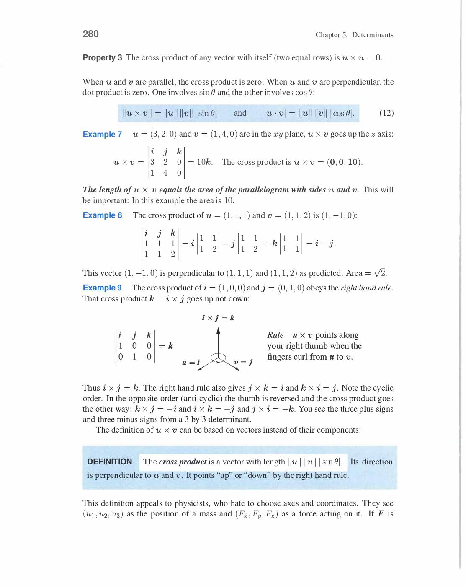
*Eigenvalue equation: Ax=λx → (A-λI)x=0 → det(A-λI)=0 characteristic polynomial. Roots of degree-n polynomial = n eigenvalues (counting multiplicity). For each λ: nullspace of (A-λI) = eigenspace. Real matrix → complex eigenvalues come in conjugate pairs.*

**Key facts before computation:**

```
Sum of eigenvalues = trace(A) = a₁₁ + a₂₂ + ... + aₙₙ
Product of eigenvalues = det(A)
```

Example check: A = [1,2; 2,1]. Trace = 2, det = 1-4 = -3.
Eigenvalues λ₁=3, λ₂=-1. Sum = 2 ✓, product = -3 ✓.

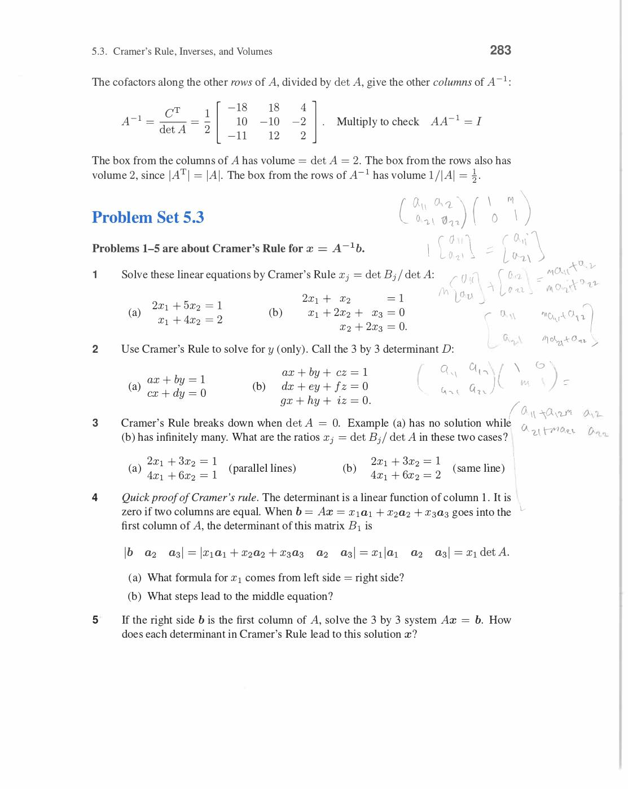
*Trace = Σλᵢ (sum of diagonal = sum of eigenvalues — always!). det = Πλᵢ (product of eigenvalues). These two identities let you quick-check eigenvalue computation. Example: A=[1,2;2,1] → trace=2=λ₁+λ₂=3+(-1)=2 ✓, det=-3=3×(-1) ✓.*

**Example 1 — Markov Matrix (Strang's key example):**

```
A = [.8  .3]
    [.2  .7]
```

det(A - λI) = det[.8-λ, .3; .2, .7-λ] = (.8-λ)(.7-λ) - (.3)(.2) = 0

= λ² - 1.5λ + .56 - .06 = λ² - 1.5λ + .5 = (λ-1)(λ-0.5) = 0

**λ₁ = 1, λ₂ = 0.5**

For λ₁ = 1: (A-I)x = [-.2, .3; .2, -.3]x = 0 → x₁ = (.6, .4) — steady state!

For λ₂ = 0.5: (A-0.5I)x = [.3, .3; .2, .2]x = 0 → x₂ = (1, -1) — decaying mode.

Powers: A¹⁰⁰x₁ = 1¹⁰⁰·x₁ = x₁ (steady!), A¹⁰⁰x₂ = (0.5)¹⁰⁰·x₂ ≈ 0 (decays to zero).

Markov property: every Markov matrix has λ = 1 (columns sum to 1).

**Example 2 — Projection Matrix:**

```
P = aaᵀ/aᵀa   (projection onto line through a)
```

Eigenvectors: a (projects to itself), anything ⊥ a (projects to zero).

Eigenvalues: **λ = 1** (for x = a), **λ = 0** (for x ⊥ a).

P² = P means λ² = λ → eigenvalues of projection can only be 0 or 1.

**Example 3 — Rotation Matrix:**

```
Q = [0  -1]   (90° rotation)
    [1   0]
```

det(Q - λI) = λ² + 1 = 0 → **λ = ±i** (complex eigenvalues!)

No real eigenvectors — rotation doesn't keep any vector in same direction. Complex eigenvalues come in conjugate pairs for real matrices.

**Example 4 — Triangular Matrix:**

For triangular matrix, eigenvalues = diagonal entries directly!

```
A = [3  1]   → eigenvalues are 3 and 4 (read from diagonal)
    [0  4]
```

det(A-λI) = (3-λ)(4-λ) = 0. ✓

**Special matrices and eigenvalue patterns:**

| Matrix type | Eigenvalue property |
|---|---|
| Symmetric Aᵀ=A | All real eigenvalues |
| Orthogonal QᵀQ=I | All |λ| = 1 |
| Markov (col sums = 1) | λ = 1 is an eigenvalue |
| Positive definite | All λ > 0 |
| Singular | λ = 0 is an eigenvalue |
| Triangular | λ = diagonal entries |

Review of Key Ideas (Section 6.1):

1. Ax = λx: A maps eigenvector to scalar multiple of itself
2. det(A-λI) = 0 gives characteristic polynomial; its roots = eigenvalues
3. Trace = Σλᵢ, det = Πλᵢ
4. Each eigenvalue λᵢ: solve (A-λᵢI)x = 0 for eigenvectors

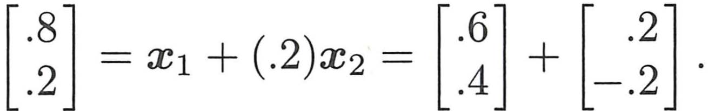
*Example 1: A = [.8 .3; .2 .7] ke liye det(A-λI)=0 gives λ=1 and λ=1/2. Eigenvectors x1=(.6,.4) aur x2=(1,-1). A¹⁰⁰ x1 = x1 (stable), A¹⁰⁰ x2 ≈ 0 (decaying mode). Yahi eigenvalue ka pehla concrete example hai.*

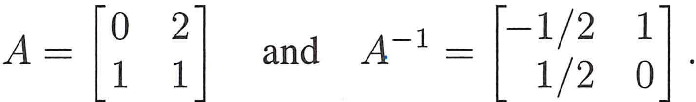
*6.1C: S symmetric 3×3, det(S-λI) = (1-λ)(−λ)(3-λ). Eigenvalues 0, 1, 3. Eigenvectors x1=(1,1,1), x2=(1,0,-1), x3=(1,-2,1) — yeh sab perpendicular hain. Symmetric matrix ka har alag eigenvalue ka eigenvector orthogonal hota hai.*

## 6.2 Diagonalizing a Matrix

**Core Idea:**

If A has n independent eigenvectors x₁, x₂, ..., xₙ (eigenvalues λ₁, ..., λₙ):

```
AX = XΛ

where X = [x₁ | x₂ | ... | xₙ]   (eigenvector matrix)
      Λ = diag(λ₁, λ₂, ..., λₙ)  (eigenvalue matrix)
```

Since eigenvectors independent → X invertible → **A = XΛX⁻¹**

**Powers of A:**

```
A² = (XΛX⁻¹)(XΛX⁻¹) = XΛ²X⁻¹
Aᵏ = XΛᵏX⁻¹

Λᵏ = diag(λ₁ᵏ, λ₂ᵏ, ..., λₙᵏ)   ← trivial! Just raise each λ to kth power
```

**Diagonalization condition:** n×n matrix A diagonalizable ↔ has n independent eigenvectors.

- Matrices with n distinct eigenvalues always diagonalizable (distinct → independent)
- Repeated eigenvalues: may or may not be diagonalizable (depends on eigenvector count)
- Non-diagonalizable = "defective matrix"

**Example (Strang):**

```
A = [2  1]
    [1  2]
```

det(A-λI) = (2-λ)² - 1 = λ² - 4λ + 3 = (λ-1)(λ-3) = 0

λ₁ = 1: (A-I) = [1,1;1,1] → x₁ = (1,-1)
λ₂ = 3: (A-3I) = [-1,1;1,-1] → x₂ = (1,1)

```
X = [1   1]    X⁻¹ = (1/2)[ 1  -1]    Λ = [1  0]
    [-1  1]                [-1   1]        [0  3]
```

Check: A = XΛX⁻¹ = [2,1;1,2]. ✓

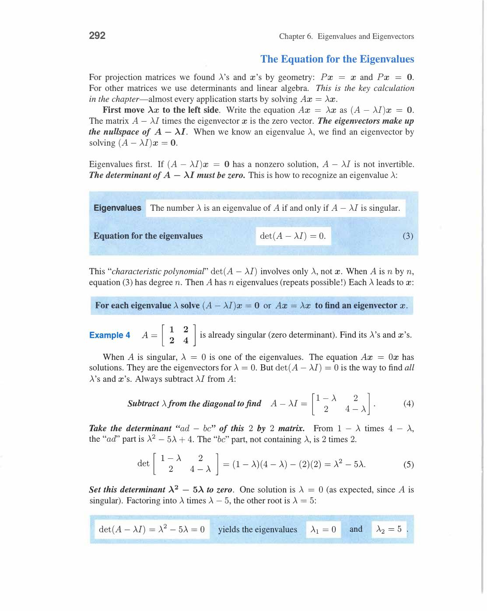
*Diagonalization A = XΛX⁻¹: X = eigenvector matrix (columns = eigenvectors), Λ = diagonal eigenvalue matrix. Works when A has n independent eigenvectors. Example: A=[2,1;1,2] → λ₁=1,λ₂=3, x₁=(1,-1), x₂=(1,1). X=[1,1;-1,1], Λ=[1,0;0,3]. XΛX⁻¹ = A ✓.*

A¹⁰ = XΛ¹⁰X⁻¹: each eigenvector scales by λ₁¹⁰=1 or λ₂¹⁰=3¹⁰=59049.

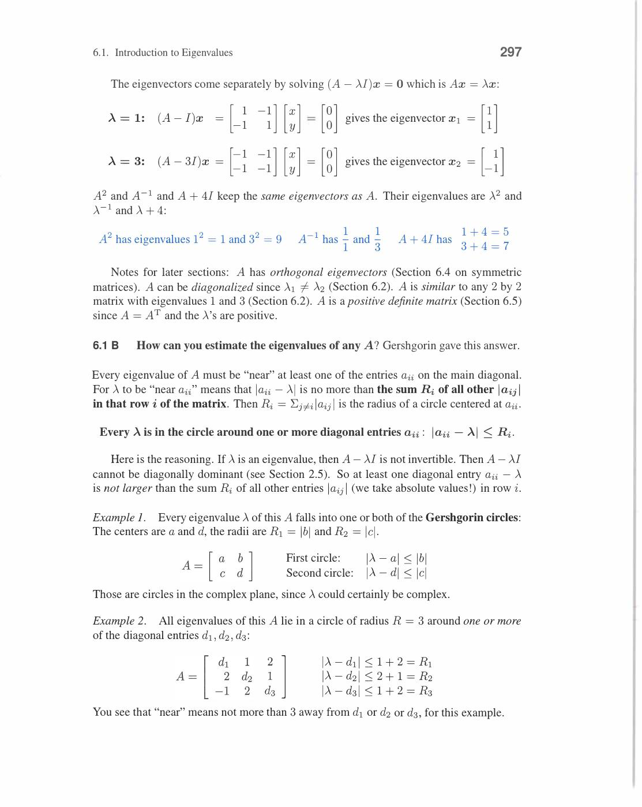
*Aᵏ = XΛᵏX⁻¹: powers easy because Λᵏ = diag(λ₁ᵏ,...,λₙᵏ). Large k: dominant eigenvector (largest |λ|) takes over. A¹⁰ = XΛ¹⁰X⁻¹ for A=[2,1;1,2]: λ₁¹⁰=1, λ₂¹⁰=59049. Power iteration basis yahi hai.*

**Fibonacci Numbers (Difference Equations):**

Fibonacci: Fₙ₊₂ = Fₙ₊₁ + Fₙ (F₀=0, F₁=1)

Pack into matrix recurrence:

```
uₙ₊₁ = Auₙ    where A = [1  1]    uₙ = [Fₙ₊₁]
                          [1  0]         [Fₙ  ]
```

det(A-λI) = λ² - λ - 1 = 0

**λ₁ = (1+√5)/2 ≈ 1.618** (golden ratio φ), **λ₂ = (1-√5)/2 ≈ -0.618**

Solution: uₙ = c₁λ₁ⁿx₁ + c₂λ₂ⁿx₂

From u₀ = (1,0), find c₁,c₂:

```
Fₙ = (λ₁ⁿ - λ₂ⁿ) / (λ₁ - λ₂) = (φⁿ - ψⁿ) / √5
```

F₁₀ = (1.618¹⁰ - (-0.618)¹⁰)/√5 ≈ 55. (Exact value: F₁₀ = 55 ✓)

Long-run behavior: Fₙ₊₁/Fₙ → λ₁ = φ = 1.618... (golden ratio!)

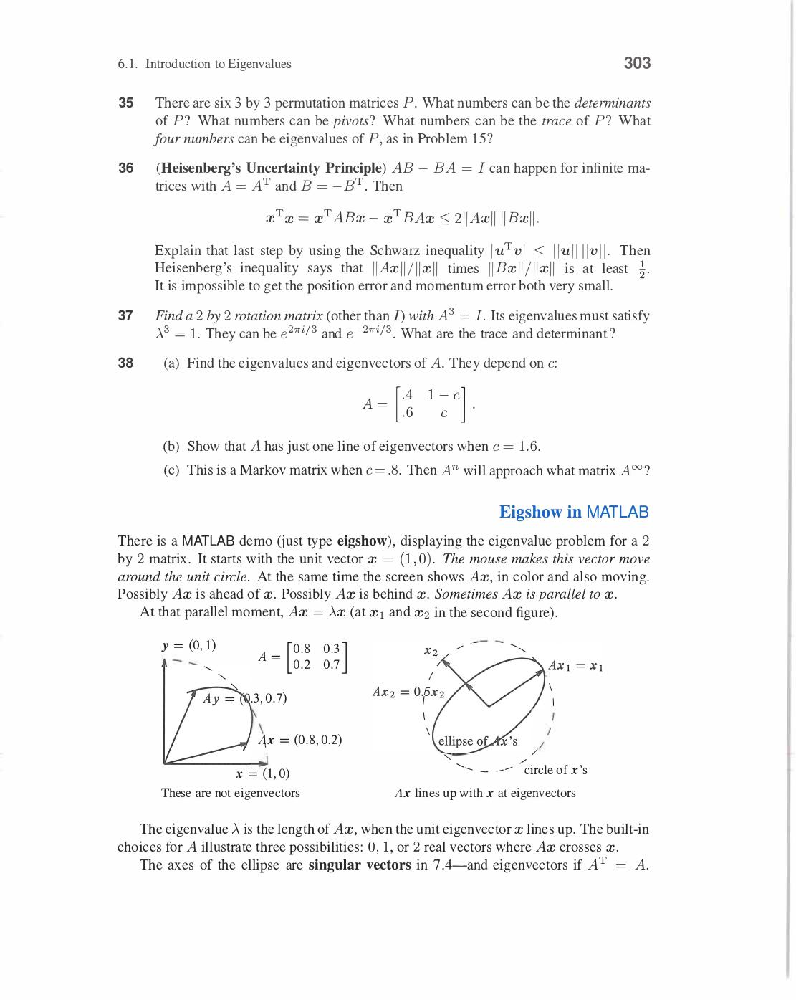
*Fibonacci matrix A=[1,1;1,0]: eigenvalues λ₁=φ=(1+√5)/2≈1.618 (golden ratio), λ₂=(1-√5)/2≈-0.618. Fₙ = (φⁿ-ψⁿ)/√5. F₁₀=55, F₂₀=6765. φ^n grows, ψ^n → 0. Fₙ₊₁/Fₙ → φ. Difference equations = eigenvalue problem!*

**Non-Diagonalizable Example:**

```
A = [2  1]    (repeated eigenvalue λ = 2)
    [0  2]
```

(A-2I) = [0,1;0,0] → only one eigenvector: x = (1,0). Defective!

Cannot diagonalize — only 1 eigenvector for 2×2 matrix.

Review of Key Ideas (Section 6.2):

1. If A has n independent eigenvectors: A = XΛX⁻¹ (diagonalization)
2. Aᵏ = XΛᵏX⁻¹ — powers easy via diagonal Λᵏ
3. Fibonacci: Fₙ = (φⁿ - ψⁿ)/√5, ratio → golden ratio φ
4. Distinct eigenvalues → always diagonalizable. Repeated may fail

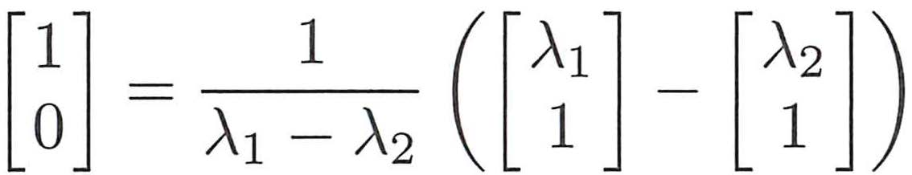
*Fibonacci matrix A=[1 1;1 0] ke eigenvalues λ1=(1+√5)/2 ≈ 1.618 (golden mean) aur λ2=(1-√5)/2 ≈ -0.618. F₁₀₀ = (λ1¹⁰⁰ - λ2¹⁰⁰)/(λ1-λ2). Diagonalization se difference equations solve ho jaate hain — powers of A follow eigenvalues.*

## 6.3 Systems of Differential Equations

**Main Problem:**

```
du/dt = Au,    u(0) = u₀   (initial condition)
```

For scalar: du/dt = au → u(t) = e^(at)u₀.

For matrix: solution involves **matrix exponential e^(At)**.

**Solution by Eigenvectors:**

If Ax = λx, try u(t) = e^(λt)x:

```
du/dt = λe^(λt)x = e^(λt)(λx) = e^(λt)(Ax) = A(e^(λt)x) = Au  ✓
```

So each eigenvector gives a **pure exponential mode** e^(λt)xᵢ.

**Complete solution** (if A has n independent eigenvectors):

```
u(t) = c₁e^(λ₁t)x₁ + c₂e^(λ₂t)x₂ + ... + cₙe^(λₙt)xₙ

At t=0: u(0) = c₁x₁ + c₂x₂ + ... + cₙxₙ = u₀
→ solve Xc = u₀ for c₁,...,cₙ
```

**Example (Strang):**

```
du/dt = Au,    A = [1   0]    eigenvalues: λ₁=1, λ₂=-1
               [0  -1]

Eigenvectors: x₁=(1,0), x₂=(0,1)

u(t) = c₁eᵗ(1,0) + c₂e⁻ᵗ(0,1)

With u(0) = (3,1): c₁=3, c₂=1

u(t) = (3eᵗ, e⁻ᵗ)
```

**Stability Conditions:**

| Eigenvalue λ | Behavior |
|---|---|
| λ < 0 (real) | e^(λt) → 0: **stable decay** |
| λ > 0 (real) | e^(λt) → ∞: **unstable growth** |
| λ = 0 | constant: **neutral** |
| λ = iω (pure imaginary) | e^(iωt) = cosωt + i sinωt: **oscillation** |
| λ = a + iω (complex) | e^(at)(cosωt + i sinωt): stable if a < 0 |

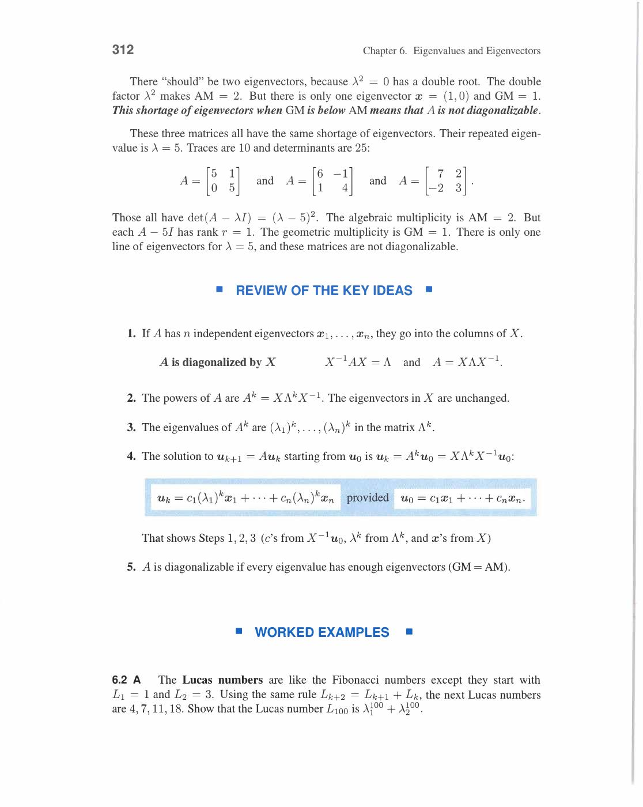
*Stability table: Re(λ)<0 → decay (stable system). Re(λ)>0 → growth (unstable). Pure imaginary → oscillation. Complex with negative real part → spiral inward (stable oscillation). For stability: ALL eigenvalues must have Re(λ) < 0.*

**For stability: all eigenvalues must have negative real part.**

**Matrix Exponential:**

```
e^(At) = I + At + (At)²/2! + ... = X e^(Λt) X⁻¹

where e^(Λt) = diag(e^(λ₁t), e^(λ₂t), ..., e^(λₙt))
```

**Oscillation Example:**

```
A = [0  -1]    eigenvalues: λ = ±i
    [1   0]

u(0) = (1,0):    u(t) = (cos t, sin t)   ← circle! no growth, no decay
```

**Numerical Stability (Forward vs Backward Euler):**

Forward Euler: uₙ₊₁ = (I + ΔtA)uₙ → eigenvalue of iteration = 1 + Δtλ.

For oscillation (λ = iω): |1 + iΔtω| = √(1 + (Δtω)²) > 1 → **spirals out** (unstable!).

Backward Euler: uₙ₊₁ = (I - ΔtA)⁻¹uₙ → eigenvalue = 1/(1 - Δtλ).

For oscillation: |1/(1 - iΔtω)| < 1 → **spirals in** (stable but not perfect circle).

Leapfrog (centered): perfect |eigenvalue| = 1 for small Δt → stays on circle.

Review of Key Ideas (Section 6.3):

1. du/dt = Au: solution = Σ cᵢe^(λᵢt)xᵢ (eigenvector modes)
2. Stability ↔ Re(λ) < 0 for all eigenvalues
3. Pure imaginary λ = ±iω → oscillation (no decay, no growth)
4. e^(At) = Xe^(Λt)X⁻¹ — matrix exponential

![Solution of du/dt=Au — pure exponential solutions u1=e^t[1,1] and u2=e^-t[1,-1] (book p.320)](../assets/strang/06-eigenvalues-and-eigenvectors/page-330-img-004.jpg)
*du/dt = Au ka solution: u1(t) = eᵗ[1,1] (growing mode, λ=1) aur u2(t) = e⁻ᵗ[1,-1] (decaying mode, λ=-1). Complete solution = Ce^t [1,1] + De^-t [1,-1]. Initial condition u(0) se C aur D nikalo.*

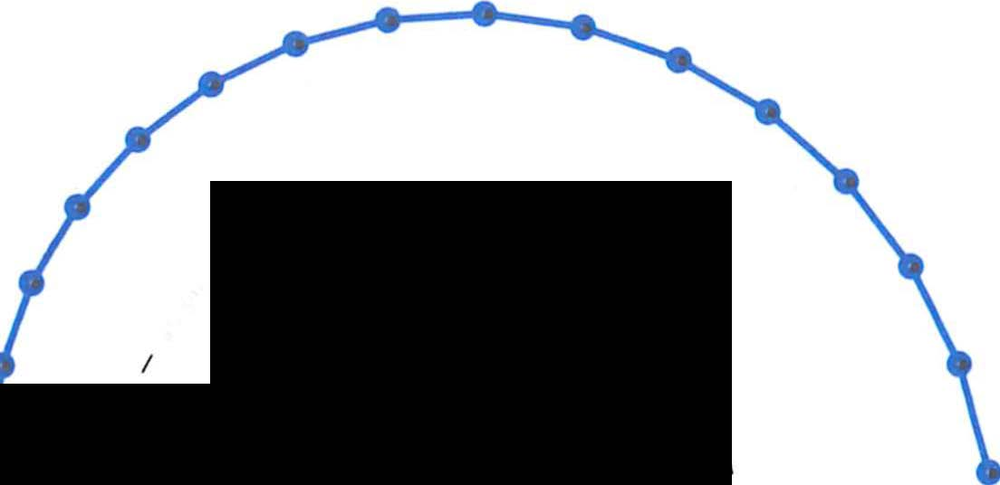
*Figure 6.3: Exact solution u=(cos t, -sin t) circle par rehta hai. Forward Euler ka λ = 1 ± iΔt → |λ| > 1 → spiral out hota hai. Backward aur centered (leapfrog) methods better stability dete hain. Eigenvalues decide karte hain ki numerical method stable hai ya nahi.*

![Stability: leapfrog matrix A=[1 1;-1 0] has |λ|=1, show A⁶=I (book p.336)](../assets/strang/06-eigenvalues-and-eigenvectors/page-346-img-001.jpg)
*Leapfrog centered method: A=[1 1;-1 0] ke eigenvalues |λ1|=|λ2|=1 exactly. A⁶ = I — exactly comes back to start. Yeh the perfect stability result: small Δt ke liye leapfrog circle par stay karta hai.*

## 6.4 Symmetric Matrices

Symmetric matrices ka class: **A = Aᵀ**

Two big theorems:

**Theorem 1**: Symmetric matrix ke sab eigenvalues real hote hain.

Proof sketch: Ax = λx → take conjugate transpose: x*ᵀAx = λ(x*ᵀx). But x*ᵀAx is real (since Aᵀ=A). And x*ᵀx = ‖x‖² > 0. So λ must be real. ✓

**Theorem 2**: Eigenvectors corresponding to distinct eigenvalues are orthogonal.

Proof: λ₁x₁ = Ax₁, λ₂x₂ = Ax₂.

```
x₂ᵀ(Ax₁) = x₂ᵀ(λ₁x₁) = λ₁(x₂ᵀx₁)
x₁ᵀ(Ax₂) = x₁ᵀ(λ₂x₂) = λ₂(x₁ᵀx₂)

But x₂ᵀ(Ax₁) = (Ax₂)ᵀx₁ = x₁ᵀ(Ax₂)   (symmetric!)

So (λ₁ - λ₂)(x₁ᵀx₂) = 0

λ₁ ≠ λ₂ → x₁ᵀx₂ = 0   ← orthogonal! ✓
```

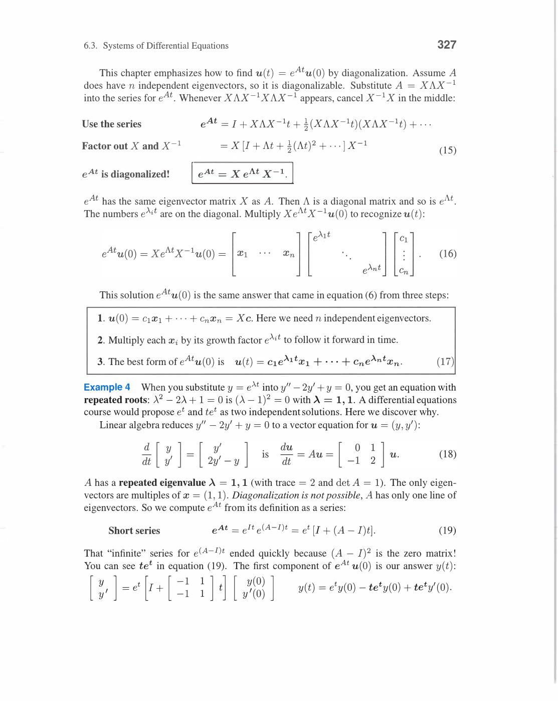
*Symmetric A=Aᵀ: Theorem 1 — sab eigenvalues real hain (proof: Ax=λx → conjugate transpose → λ real). Theorem 2 — distinct eigenvalue ka eigenvectors orthogonal hain. Proof: λ₁≠λ₂ → (λ₁-λ₂)x₁ᵀx₂=0 → perpendicular. Symmetric matrices ka yahi beauty hai.*

**Spectral Theorem (Fundamental Theorem for Symmetric Matrices):**

Every symmetric matrix A can be written:

```
A = QΛQᵀ    (orthogonal diagonalization)
```

where Q has orthonormal eigenvectors as columns (Q⁻¹ = Qᵀ).

Also written as sum of rank-1 matrices:

```
A = λ₁q₁q₁ᵀ + λ₂q₂q₂ᵀ + ... + λₙqₙqₙᵀ
```

Each λᵢqᵢqᵢᵀ = projection onto eigenvector direction, scaled by λᵢ.

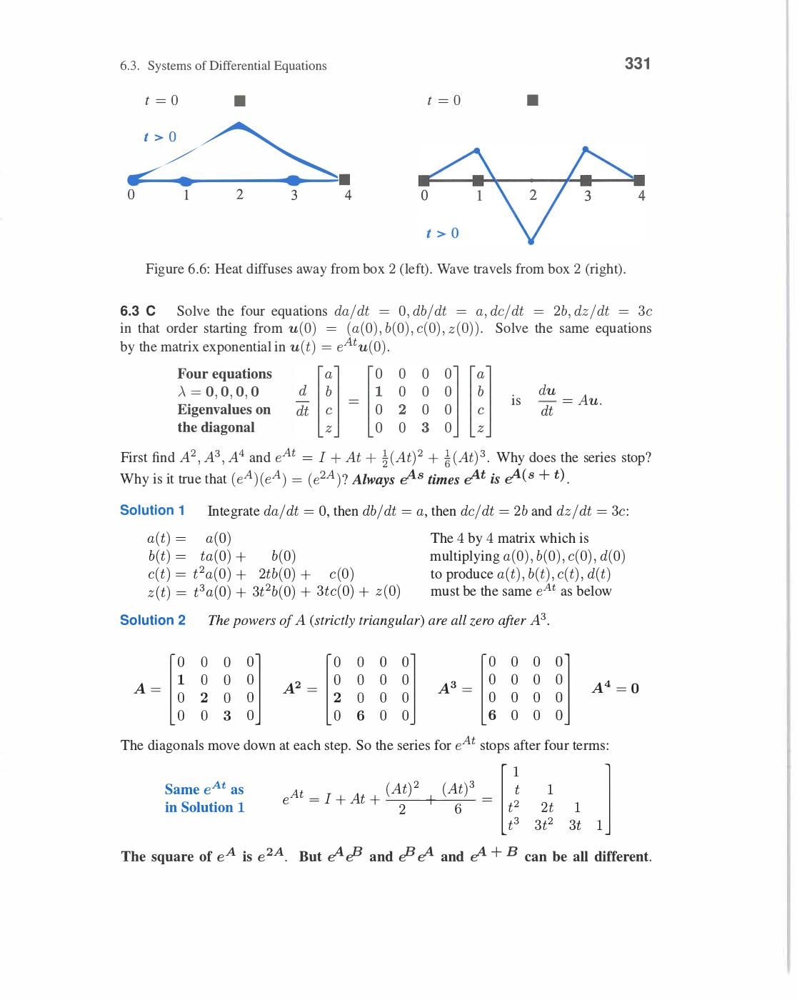
*Spectral Theorem: Symmetric A = QΛQᵀ jahan Q = orthogonal matrix (eigenvectors as columns), Λ = real diagonal (eigenvalues). Alternative form: A = λ₁q₁q₁ᵀ + λ₂q₂q₂ᵀ + ... + λₙqₙqₙᵀ (sum of rank-1 matrices!). Each qᵢqᵢᵀ = projection onto eigenvector i.*

**Concrete Example:**

```
A = [3  1]     det(A-λI) = (3-λ)² - 1 = λ² - 6λ + 8 = (λ-2)(λ-4) = 0
    [1  3]

λ₁ = 2: (A-2I) = [1,1;1,1] → x₁ = (1,-1)/√2
λ₂ = 4: (A-4I) = [-1,1;1,-1] → x₂ = (1,1)/√2

Q = (1/√2)[1   1]    Λ = [2  0]
           [-1  1]        [0  4]

Check: A = QΛQᵀ = (1/2)[1,-1;1,1][2,0;0,4][1,1;-1,1] = [3,1;1,3] ✓
```

Axes of the ellipse xᵀAx = 1: along eigenvectors, half-axes = 1/√λᵢ.

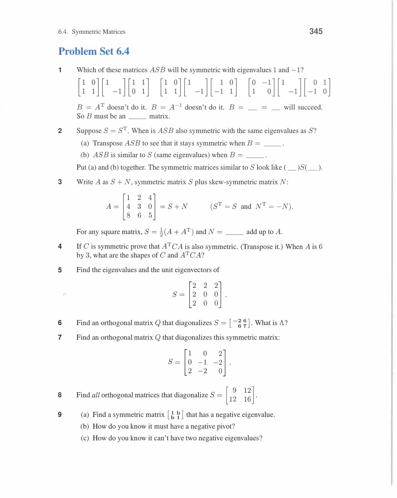
*Positive definite S ke liye: xᵀSx=1 ek ellipse hai (2D) ya ellipsoid (nD). Ellipse ke principal axes = eigenvectors q₁,q₂. Axis lengths = 1/√λ₁, 1/√λ₂. Larger λ → shorter axis. Spectral theorem A=QΛQᵀ se ye geometry seedha aata hai. PCA me ye ellipsoid data distribution ko represent karta hai.*

**Rayleigh Quotient:**

For symmetric A:

```
R(x) = xᵀAx / xᵀx

Maximum R(x) = λₘₐₓ   (at x = qₘₐₓ)
Minimum R(x) = λₘᵢₙ   (at x = qₘᵢₙ)
```

This gives a variational characterization of eigenvalues — useful in optimization.

Review of Key Ideas (Section 6.4):

1. Symmetric A: all eigenvalues real, eigenvectors orthogonal (for distinct λ)
2. A = QΛQᵀ (spectral theorem) — always possible for symmetric A
3. A = Σ λᵢqᵢqᵢᵀ — sum of rank-1 projections (every matrix has this form!)
4. Rayleigh quotient: λₘᵢₙ ≤ xᵀAx/xᵀx ≤ λₘₐₓ

## 6.5 Positive Definite Matrices

**Definition:** Symmetric A is positive definite if **xᵀAx > 0** for every nonzero x.

**Five Equivalent Tests (all must hold):**

1. **Energy**: xᵀAx > 0 for all x ≠ 0
2. **Eigenvalues**: all λᵢ > 0
3. **Pivots**: all pivots > 0 (from elimination)
4. **Leading minors**: all leading principal minors > 0 (det of top-k submatrix > 0 for k=1,...,n)
5. **Cholesky**: A = LLᵀ for some lower triangular L with positive diagonal

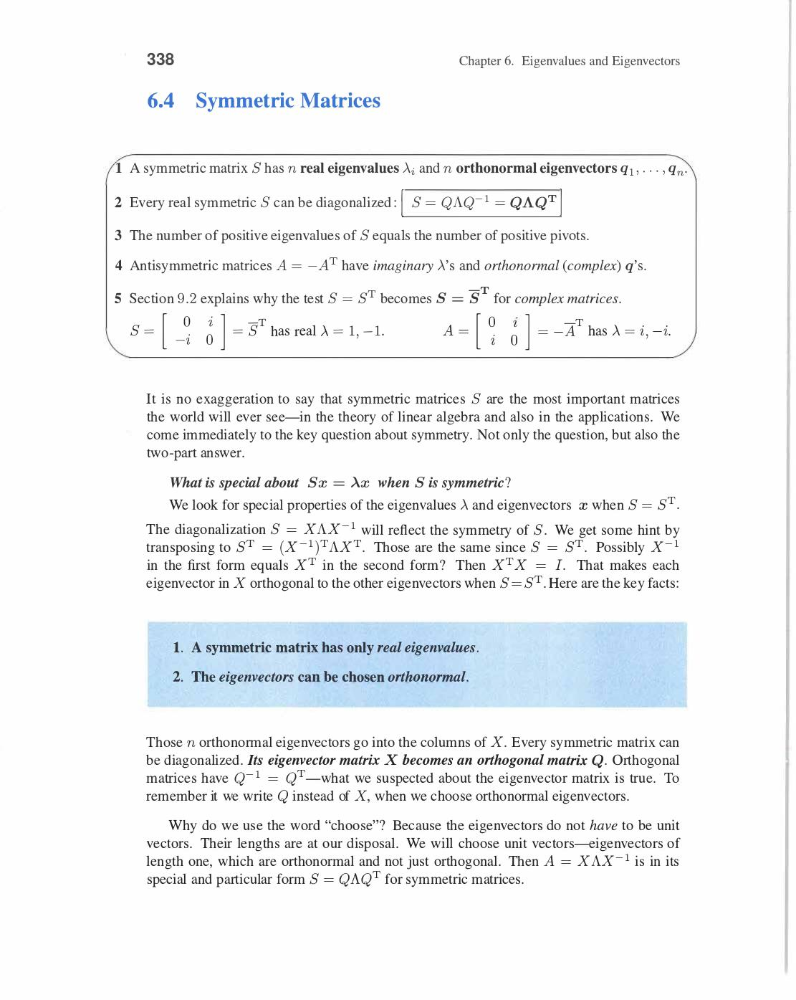
*Positive definite matrix S: five equivalent tests. (1) All eigenvalues λᵢ>0. (2) All pivots in elimination >0. (3) All subdeterminants (top-left k×k) >0. (4) xᵀSx>0 for all nonzero x. (5) S=AᵀA where A has independent columns. Energy function xᵀSx>0 is the most intuitive test.*

**2×2 Example:**

```
S = [a  b]     Positive definite iff:
    [b  c]

a > 0   AND   ac - b² > 0   (both leading minors positive)
```

Test: S = [2,1;1,2]. a=2>0, det=4-1=3>0. **Positive definite!**

Energy: xᵀSx = 2x₁² + 2x₁x₂ + 2x₂² — always > 0? Complete square:

```
= 2(x₁ + x₂/2)² + (3/2)x₂² > 0   ✓
```

Eigenvalues: λ₁=1, λ₂=3, both positive. ✓

Pivots: first pivot = 2, second pivot = 3/2 (both positive). ✓

**Cholesky Factorization:**

For positive definite A:

```
A = LLᵀ     (L = lower triangular with positive diagonal)
```

Half of A=LDLᵀ: D diagonal with positive pivots → D = diag(√d₁,...)² → A = (L√D)(L√D)ᵀ.

Example: S = [2,1;1,2].

A=LU: L=[1,0;1/2,1], U=[2,0;0,3/2]. D=[2,0;0,3/2].

Cholesky: L₀ = [√2, 0; 1/√2, √(3/2)]. Check: L₀L₀ᵀ = [2,1;1,2] ✓.

**Energy Interpretation:**

xᵀAx is the "energy" of state x. System stable ↔ energy always positive ↔ A positive definite.

Example: Spring-mass system energy = xᵀKx where K = stiffness matrix. K positive definite → stable.

**Connection to Least Squares:**

If A has independent columns: AᵀA is positive definite.

Proof: xᵀ(AᵀA)x = (Ax)ᵀ(Ax) = ‖Ax‖² > 0 for x ≠ 0 (when A has independent columns). ✓

**Worked Example (Strang's tridiagonal test matrix):**

```
S = [ 2  -1   0]
    [-1   2  -1]
    [ 0  -1   2]
```

Leading minors: det[2]=2>0, det[2,-1;-1,2]=3>0, det(S)=4>0. **Positive definite!**

Eigenvalues: 2-√2 ≈ 0.586, 2, 2+√2 ≈ 3.414 — all positive. ✓

Pivots: 2, 3/2, 4/3 — all positive. ✓

Product of pivots = 2·(3/2)·(4/3) = 4 = det(S). ✓

**Positive Semidefinite:**

xᵀAx ≥ 0 (zero allowed). Eigenvalues ≥ 0.

Example: projection matrix P. xᵀPx = ‖Px‖² ≥ 0. Eigenvalues = 0 or 1.

Review of Key Ideas (Section 6.5):

1. A positive definite ↔ xᵀAx > 0 ↔ all λᵢ > 0 ↔ all pivots > 0 ↔ all leading minors > 0
2. Cholesky: A = LLᵀ (numerically very stable for positive definite A)
3. AᵀA always positive semidefinite; positive definite iff A has independent columns
4. Positive definite ↔ ellipsoid xᵀAx = 1 (axes = eigenvectors, lengths = 1/√λᵢ)

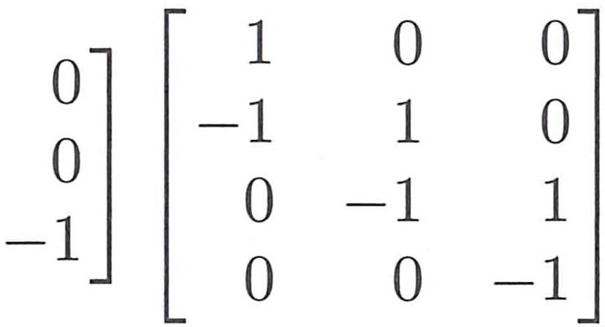
*6.5 Example 1: S = [-1,2,-1 tridiagonal] — pivots 2, 3/2, 4/3 sab positive. Determinants 2, 3, 4 positive. Eigenvalues 2-√2, 2, 2+√2 positive. S = A₁ᵀA₁ (first differences) ya Cholesky A₂ ya Q√ΛQᵀ — teeno ways show karte hain S positive definite hai.*

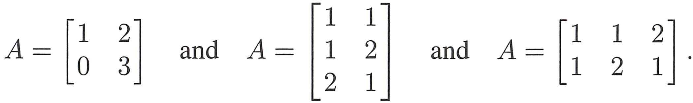
*Problem Set 6.5: Positive definite tests — a>0 aur ac-b²>0. Ellipse xᵀSx=1 ke axes eigenvectors ke along hote hain, half-lengths 1/√λ. Applications: minimum of F(x,y) iff S (second derivative matrix) positive definite. Energy + geometry ek saath milte hain.*

This chapter ka end book ke most important conceptual checkpoints me se ek hai.

---
