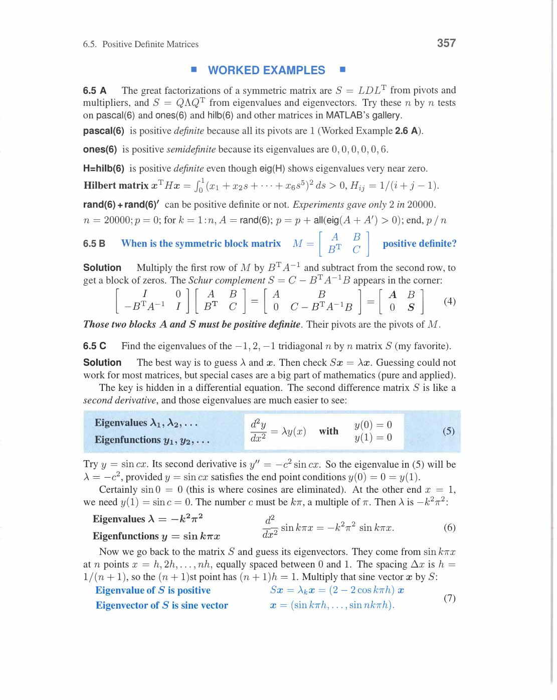
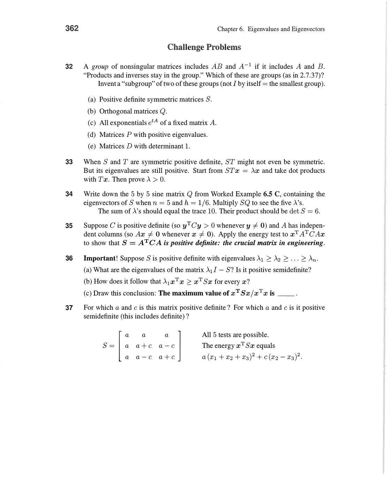
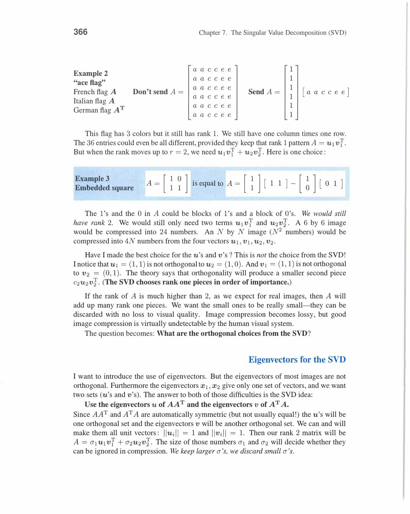
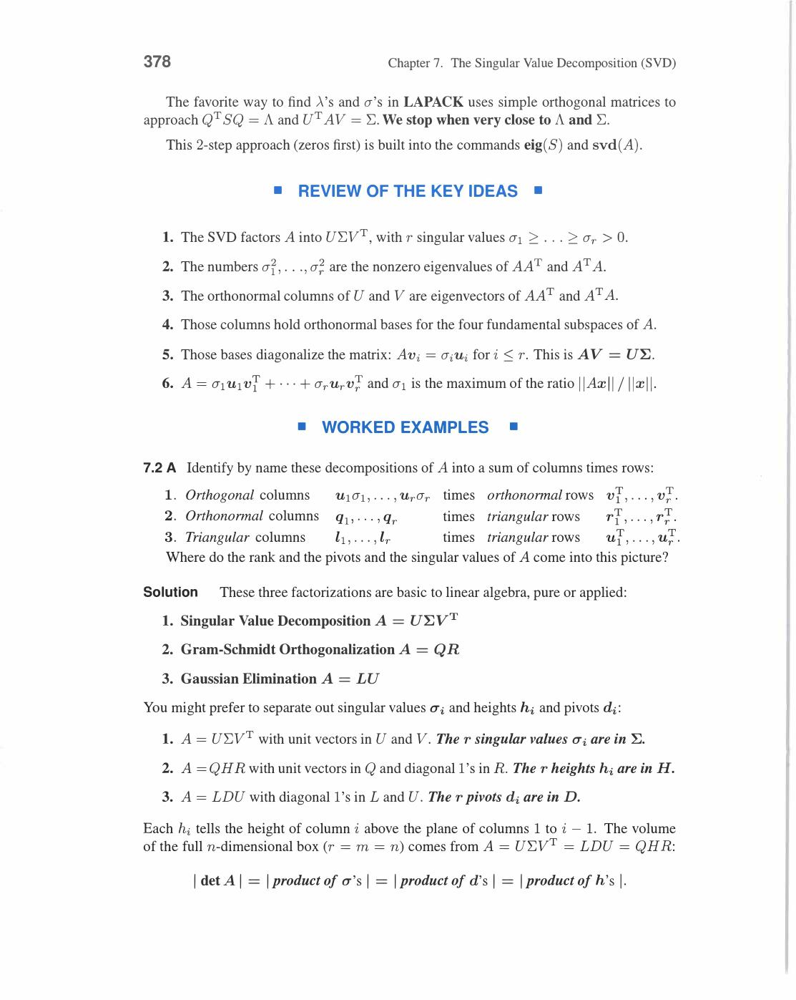
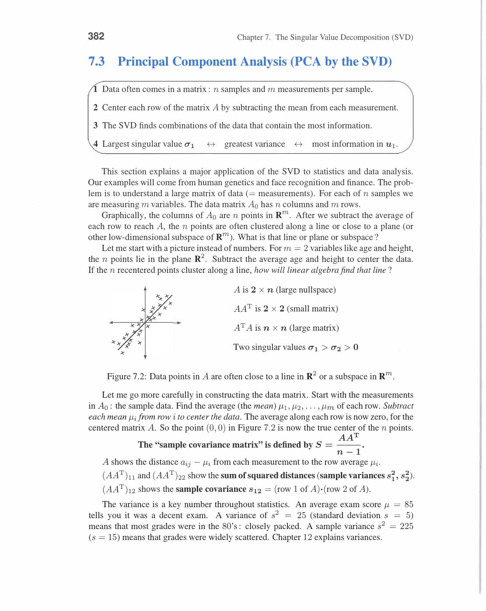
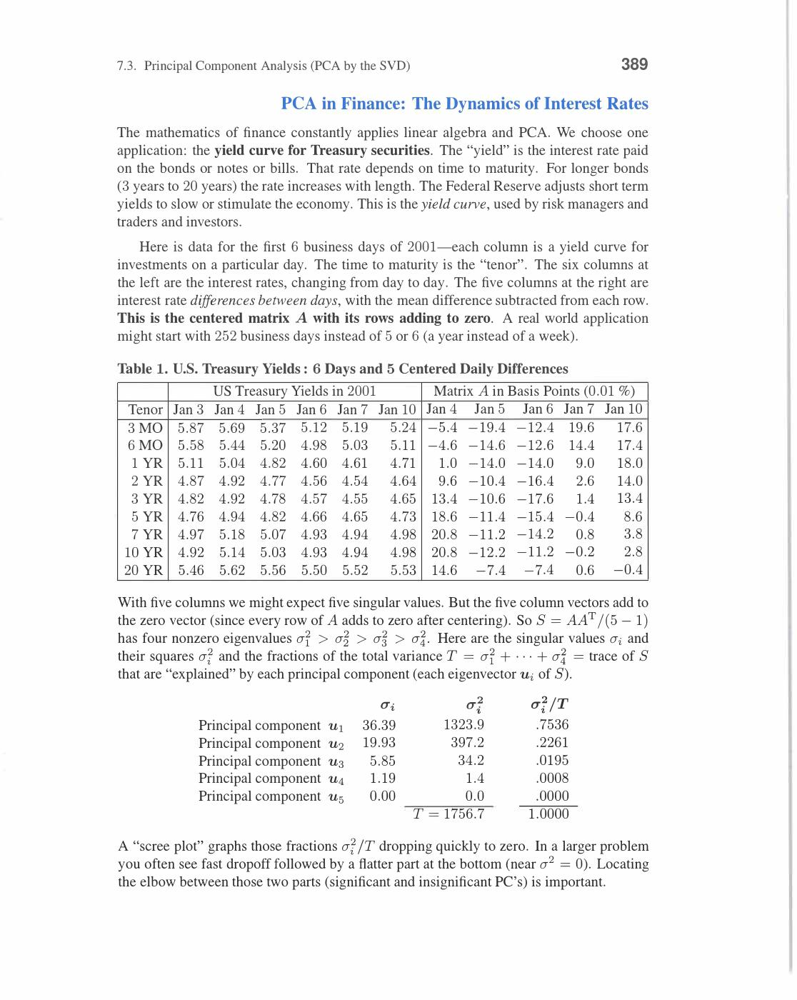

# Chapter 7 - The Singular Value Decomposition (SVD)

Visual gallery: [`07-the-singular-value-decomposition.md`](../visuals/07-the-singular-value-decomposition.md)

Chapter 7 modern data science ka most important tool hai.

**SVD: Every matrix A (m×n) can be written:**

```
A = UΣVᵀ

U = m×m orthogonal (left singular vectors)
Σ = m×n diagonal (singular values σ₁ ≥ σ₂ ≥ ... ≥ σᵣ > 0)
V = n×n orthogonal (right singular vectors)
```

SVD works even when:

- matrix square na ho (m ≠ n)
- matrix symmetric na ho
- matrix invertible na ho


*SVD: A = UΣVᵀ. U = left singular vectors (m×m orthogonal), Σ = singular values diagonal (m×n), V = right singular vectors (n×n orthogonal). Four subspaces: columns of V₁ = row space basis, columns of U₁ = column space basis. AV = UΣ: A maps vᵢ to σᵢuᵢ. Yahi SVD ka geometric meaning hai.*

**Key relationship to eigenvalues:**

```
AᵀA = (UΣVᵀ)ᵀ(UΣVᵀ) = VΣᵀUᵀUΣVᵀ = VΣ²Vᵀ
AAᵀ = UΣ²Uᵀ
```

So:

- V = eigenvectors of AᵀA (symmetric → orthogonal eigenvectors)
- U = eigenvectors of AAᵀ
- σᵢ = √(eigenvalue of AᵀA) = √λᵢ

Singular values σᵢ ≥ 0 always! (because σᵢ² = eigenvalue of AᵀA ≥ 0 — positive semidefinite)

## 7.1 Image Processing by Linear Algebra

**Image = Matrix:** Each pixel = one matrix entry (intensity or RGB value).

SVD breaks image into rank-1 pieces:

```
A = σ₁u₁v₁ᵀ + σ₂u₂v₂ᵀ + ... + σᵣuᵣvᵣᵀ
```

Each σₖuₖvₖᵀ = rank-1 matrix = one "layer" of the image.

**Rank-k approximation:**

```
Aₖ = σ₁u₁v₁ᵀ + ... + σₖuₖvₖᵀ
```

Best possible rank-k approximation (Eckart-Young theorem): Aₖ minimizes ‖A - B‖ over all rank-k matrices B.

**Error**: ‖A - Aₖ‖ = σₖ₊₁ (next singular value).

**Compression ratio:** Original image: m×n numbers. Rank-k approximation: k(m+n+1) numbers.

For a 1000×1000 image with k=50: need 50×2001 ≈ 100,050 vs 1,000,000. **10× compression!**


*Image compression: rank-k approximation Aₖ = σ₁u₁v₁ᵀ + ... + σₖuₖvₖᵀ. Eckart-Young theorem: ‖A-Aₖ‖₂ = σₖ₊₁ (best possible rank-k approximation). Large σ → important singular vectors. Small σ → less important, drop them. k chota → compression, k bada → quality.*

**Four fundamental subspaces from SVD:**

```
Column space C(A)   = span{u₁,...,uᵣ}   (left singular vectors, dimension r)
Left nullspace N(Aᵀ) = span{uᵣ₊₁,...,uₘ} (remaining u's)
Row space C(Aᵀ)     = span{v₁,...,vᵣ}   (right singular vectors, dimension r)
Nullspace N(A)      = span{vᵣ₊₁,...,vₙ} (remaining v's)
```

SVD gives orthonormal bases for all four subspaces simultaneously!


*Image compression me: rank-k approximation ke baad reconstruction karte hain. Zero columns dikhate hain discarded singular directions ko. A⁻¹ = VΣ⁻¹Uᵀ — SVD se directly inverse milta hai jab A invertible ho. Yahi image processing ka core idea hai.*


*Concrete example: A = [1,0;1,1] ke liye Av₁ = [1,0;1,1][σ₁;1] = σ₁[1;σ₁]. Right singular vector v₁ map hota hai left singular vector u₁ par, scaled by σ₁. Yahi Avi = σiui ka direct demonstration hai.*

## 7.2 Bases and Matrices in the SVD

**Core SVD equations:**

```
Avᵢ = σᵢuᵢ     (right singular vectors map to left singular vectors, scaled by σᵢ)

In matrix form: AV = UΣ   →   A = UΣVᵀ
```

**Compact/Reduced SVD (Strang's preferred form):**

```
A = Uᵣ Σᵣ Vᵣᵀ

where Uᵣ (m×r), Σᵣ (r×r), Vᵣ (n×r) — only keep r nonzero singular values
```

**Concrete 2×2 SVD Example:**

```
A = [3  0]
    [4  5]
```

Step 1: Compute AᵀA:

```
AᵀA = [3,4;0,5]ᵀ·[3,4;0,5]... wait, A is [3,0;4,5]

AᵀA = [3,4;0,5] · [3,0;4,5] = [9+16, 0+20; 0+20, 0+25] = [25, 20; 20, 25]
```

Step 2: Eigenvalues of AᵀA:

det(AᵀA - λI) = (25-λ)² - 400 = 0 → (25-λ) = ±20

λ₁ = 45, λ₂ = 5

Singular values: σ₁ = √45 = 3√5, σ₂ = √5.

Step 3: V (eigenvectors of AᵀA):

For λ₁ = 45: (AᵀA - 45I)v = 0 → [-20,20;20,-20]v = 0 → v₁ = (1,1)/√2

For λ₂ = 5: (AᵀA - 5I)v = 0 → [20,20;20,20]v = 0 → v₂ = (1,-1)/√2

Step 4: U = AV/Σ:

u₁ = Av₁/σ₁ = A(1,1)ᵀ/(√2 · 3√5) = (3,9)ᵀ/(3√10) = (1,3)/√10

u₂ = Av₂/σ₂ = A(1,-1)ᵀ/(√2 · √5) = (3,-1)ᵀ/√10 = (3,-1)/√10

Check: A = UΣVᵀ. ✓


*SVD computation: Step 1 — AᵀA ke eigenvalues = σᵢ² (singular values squared), eigenvectors = vᵢ (V columns). Step 2 — uᵢ = Avᵢ/σᵢ (left singular vectors). AᵀA symmetric → real eigenvalues guaranteed. All eigenvalues ≥ 0 (positive semidefinite).*

**Pseudoinverse A⁺:**

```
A⁺ = VΣ⁺Uᵀ

Σ⁺: replace each nonzero σᵢ by 1/σᵢ, transpose
```

Properties:

- A⁺A = Vᵣ Vᵣᵀ = projection onto row space
- AA⁺ = Uᵣ Uᵣᵀ = projection onto column space
- Least squares: x̂ = A⁺b (minimum norm solution)

If A has full column rank: A⁺ = (AᵀA)⁻¹Aᵀ (same as least squares formula!).

Review of Key Ideas (Section 7.2):

1. A = UΣVᵀ: U,V orthogonal, Σ diagonal with σ₁≥...≥σᵣ>0
2. σᵢ² = eigenvalue of AᵀA; V = eigenvectors of AᵀA; U = eigenvectors of AAᵀ
3. Rank r = number of nonzero singular values
4. A⁺ = VΣ⁺Uᵀ: pseudoinverse for least squares and minimum norm solutions

![Compact SVD formula — A[v₁···vr] = [u₁···ur][Σ] (book p.371)](../assets/strang/07-the-singular-value-decomposition/page-381-img-003.jpg)
*Compact SVD: A[v₁···vr] = [u₁···ur] times diagonal Σ. Matlab: A ke r right singular vectors V_r par apply karne se r left singular vectors U_r scaled by σ milte hain. Yahi AV_r = U_rΣ_r form hai — full SVD se yeh reduced form bahut useful hai.*


*Example 3: U = 4×4 matrix (permutation structure), Σ = diag(3,2,1,0). Singular values 3,2,1 nonzero — rank 3. Last singular value 0 means matrix rank-deficient. U columns = orthonormal basis for column space + left nullspace. Yahi SVD ka full picture hai.*

## 7.3 Principal Component Analysis (PCA by the SVD)

**PCA Setup:**

Data matrix X (n samples, p features). Center by subtracting mean: X̃ = X - mean.

Sample covariance matrix: S = X̃ᵀX̃ / (n-1) (p×p symmetric positive semidefinite).

**PCA Goal:** Find directions of maximum variance in data.

SVD of X̃ = UΣVᵀ gives:

- **Principal directions** = columns of V (eigenvectors of S)
- **Singular values** σᵢ → variance explained = σᵢ²/(n-1)
- **Principal components** = X̃V (new coordinates in PC space)

**Rank-k PCA:** Keep top k singular values/vectors:

```
X̃ ≈ UₖΣₖVₖᵀ

Variance explained by k components = (σ₁² + ... + σₖ²) / (σ₁² + ... + σₚ²)
```

**Scree plot:** Plot σᵢ vs i. "Elbow" shows how many components to keep.

**Concrete Example:**

5 data points in 2D: (1,1), (2,3), (3,2), (4,4), (5,3).

Mean = (3,2.6). Subtract mean → centered data.

SVD of centered matrix → first PC = direction of max spread ≈ (1,1)/√2.

Project onto first PC → 1D representation capturing most variance.

**Applications:**

- face recognition (eigenfaces = left singular vectors of face matrix)
- document analysis (latent semantic indexing)
- genomics (detecting population structure)
- any high-dimensional data visualization


*PCA: Data matrix X (n samples, p features). Center: subtract mean. Covariance matrix S = XᵀX/(n-1). SVD: X = UΣVᵀ → principal components = columns of V. First PC = direction of maximum variance = first right singular vector v₁. Projection onto k PCs = Xₖ = U_k Σ_k V_kᵀ.*


*PCA application: face image ko matrix samjho. Top singular vectors/values se image reconstruct karo — thode singular values se bhi recognizable face milta hai. Jitne zyada singular values use karo, utna better approximation. Yahi PCA ka intuition hai — important directions kam hain.*

## 7.4 The Geometry of the SVD

**Geometric Meaning:**

Unit sphere Vᵀx = unit vectors in Rⁿ → under A maps to ellipsoid in Rᵐ.

Ellipsoid semi-axes: σ₁, σ₂, ..., σᵣ (singular values = axis lengths).

Axis directions: u₁, u₂, ..., uᵣ (left singular vectors).

```
A maps: vᵢ (unit input) → σᵢuᵢ (axis of output ellipsoid)
```

**Polar Decomposition:**

Any matrix A = QS where:

- Q = UVᵀ (orthogonal: rotation)
- S = VΣVᵀ (symmetric positive semidefinite: stretch)

Proof: A = UΣVᵀ = (UVᵀ)(VΣVᵀ) = QS. ✓

Analogy: complex number z = re^(iθ) = magnitude times rotation.


*Polar decomposition: A = QS jahan Q orthogonal aur S symmetric positive semidefinite. From SVD: Q = UVᵀ (rotation), S = VΣVᵀ (stretch). Analogous to complex: z = r·e^(iθ) = (e^(iθ))(r). Polar decomposition separates rotation Q from stretching S.*

**Example:**

```
A = [2  1]      AᵀA = [4,2;2,5]... 
    [1  2]

Eigenvalues of AᵀA: λ₁=6, λ₂=2. Singular values: σ₁=√6, σ₂=√2.
```

Polar: S = VΣVᵀ = symmetric stretch, Q = UVᵀ = rotation.

**Condition Number:**

```
κ(A) = σ₁/σᵣ    (ratio of largest to smallest singular value)
```

- κ = 1: perfectly conditioned (orthogonal matrix, preserves all directions equally)
- κ large: ill-conditioned (one direction stretched much more than another)
- κ → ∞: nearly singular

In least squares, conditioning of AᵀA = κ(A)². So SVD-based methods are numerically preferred.

**Pseudoinverse Geometry:**

A⁺ = VΣ⁺Uᵀ:

- Projects b onto column space (via Uᵣ Uᵣᵀ)
- Inverts the stretch by 1/σᵢ
- Expresses in row space basis (via V)
- Gives minimum norm solution among all least squares solutions


*Pseudoinverse A⁺ = VΣ⁺Uᵀ: Σ⁺ replaces each nonzero σᵢ with 1/σᵢ, zeros stay zero. A⁺b = minimum-norm least squares solution. For full column rank A: A⁺ = (AᵀA)⁻¹Aᵀ (matches old formula). Pseudoinverse always exists — generalizes inverse to any matrix.*

Review of Key Ideas (Section 7.4):

1. A maps unit sphere to ellipsoid; semi-axes = singular values, directions = singular vectors
2. Polar decomposition: A = QS (rotation Q = UVᵀ, stretch S = VΣVᵀ)
3. Condition number κ = σ₁/σᵣ measures matrix sensitivity
4. A⁺ = VΣ⁺Uᵀ: minimum norm least squares solution x̂ = A⁺b

![Polar decomposition A = QS — S = √5[2,1;1,2] example (book p.394)](../assets/strang/07-the-singular-value-decomposition/page-404-img-002.jpg)
*Polar decomposition: A = QS jahan Q orthogonal aur S = √5[2,1;1,2] symmetric positive definite. S = VΣVᵀ (stretch part), Q = UVᵀ (rotation part). Yeh decomposition SVD se directly aata hai — geometry of linear maps ka core result.*

![Pseudoinverse Σ⁺Σ = [I 0; 0 0] — Σ⁺ times Σ gives truncated identity (book p.395)](../assets/strang/07-the-singular-value-decomposition/page-405-img-002.jpg)
*Pseudoinverse: Σ⁺ = [0,0;1/3,0;0,0] aur Σ = [2,0,0;0,3,0;0,0,0]. Product Σ⁺Σ = [1,0,0;0,1,0;0,0,0] = [I 0;0 0]. Yeh truncated identity hai — rank r directions me identity, zero directions me zero. A⁺ = VΣ⁺Uᵀ isi se banta hai.*

![Pseudoinverse formula A₁⁺ = (A₁ᵀA₁)⁻¹A₁ᵀ = (1/√8)[2 2] (book p.398)](../assets/strang/07-the-singular-value-decomposition/page-408-img-001.jpg)
*Pseudoinverse example: A₁⁺ = (A₁ᵀA₁)⁻¹A₁ᵀ = (1/√8)[2 2]. Full column rank ke case me yeh left inverse hai. A⁺A = I (identity on row space). Least squares solution x̂ = A⁺b — yahi pseudoinverse ka main use hai.*

---
