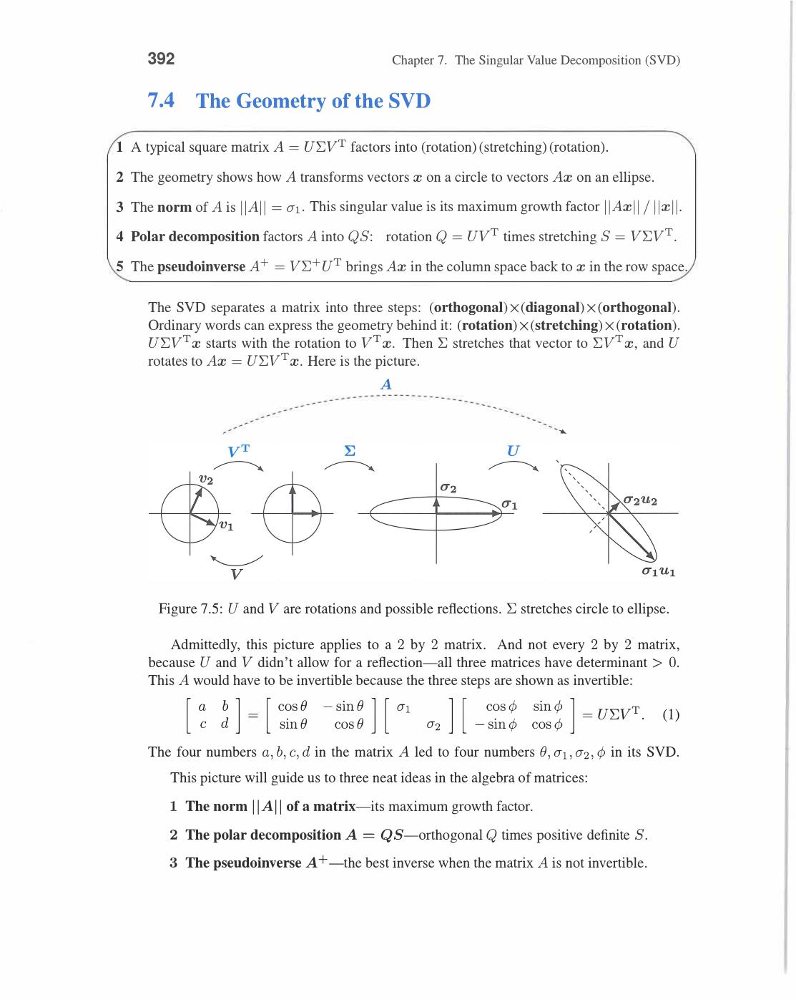
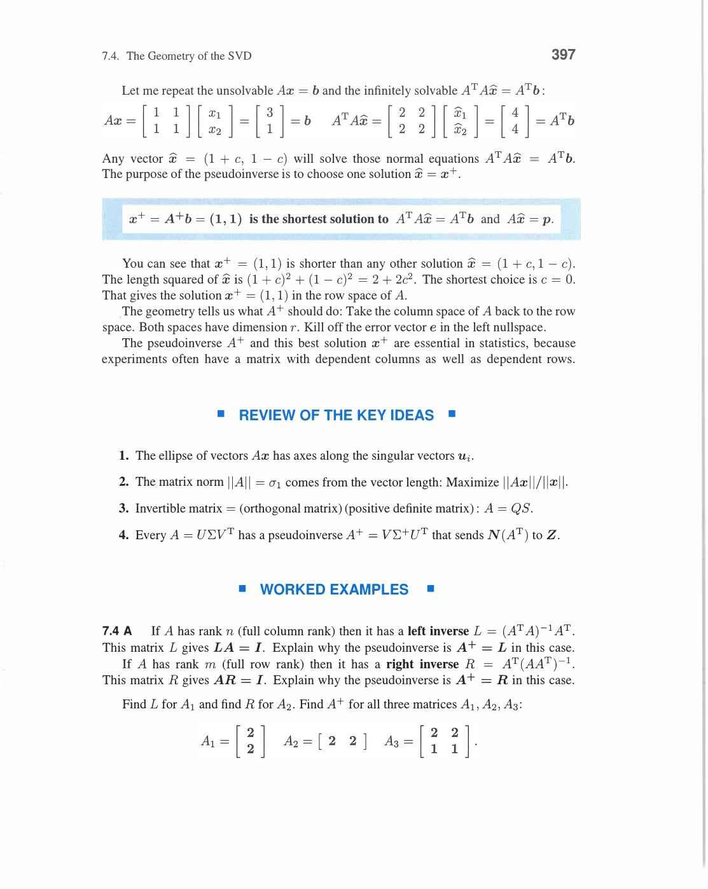
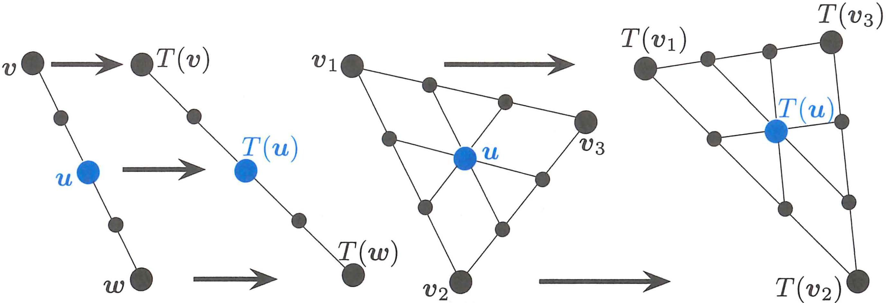
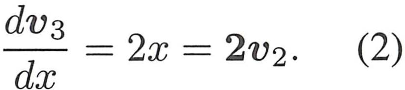
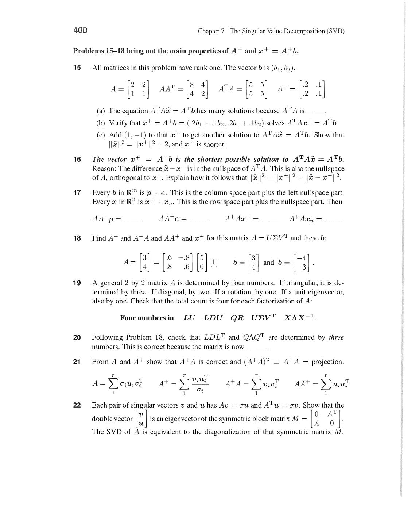
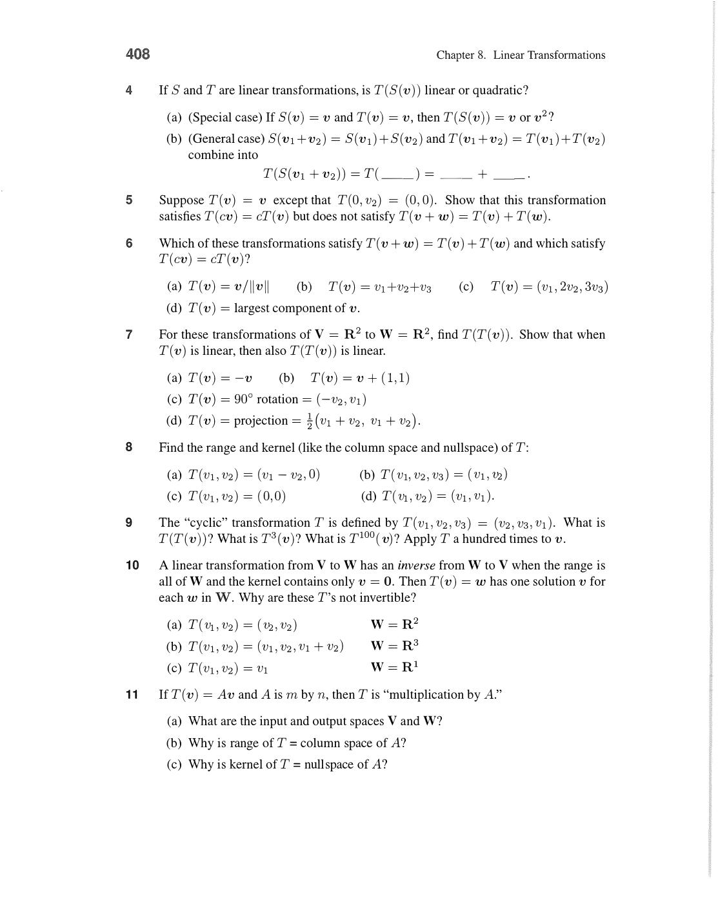
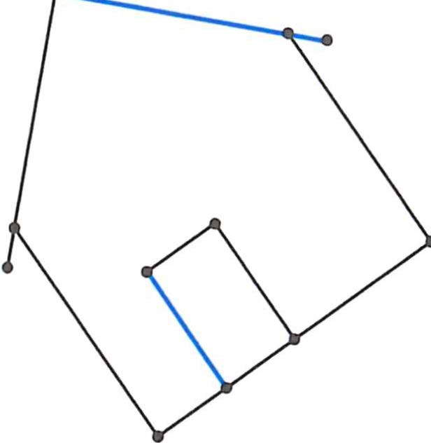
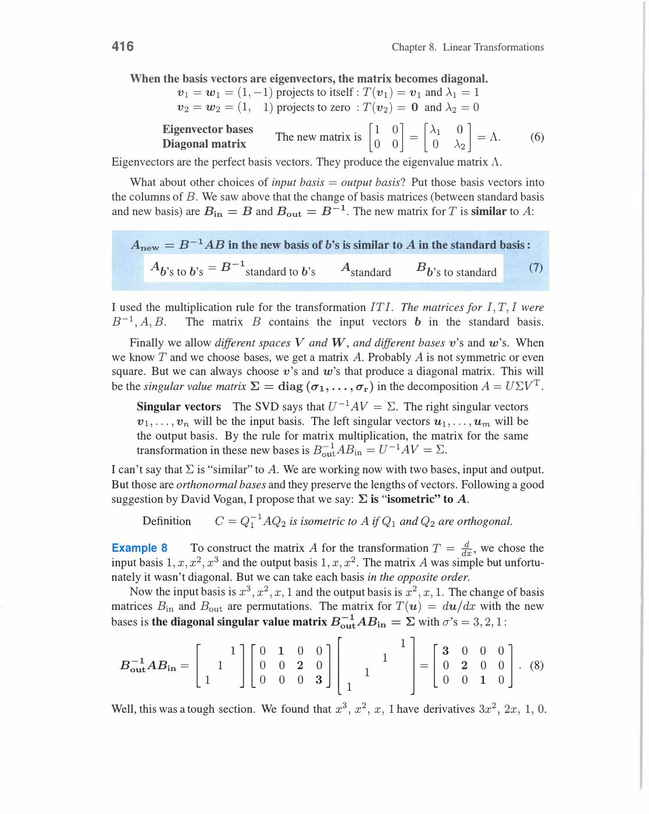
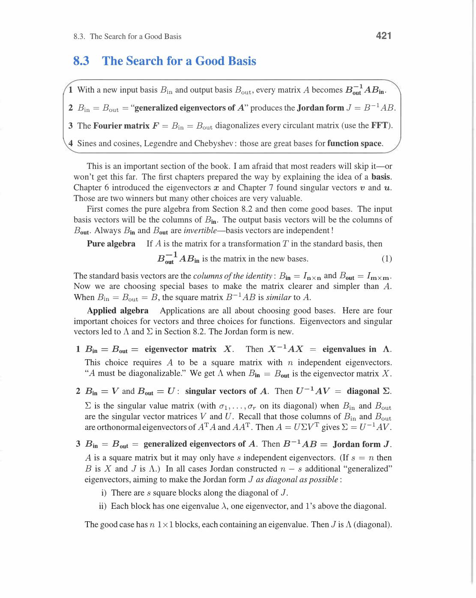
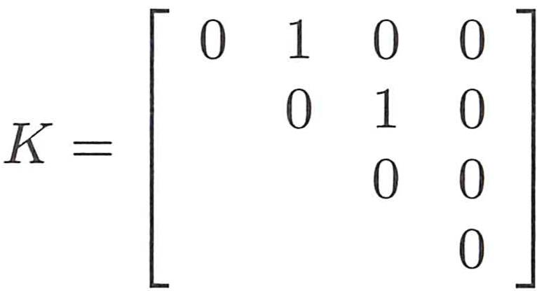

# Chapter 8 - Linear Transformations

Visual gallery: [`08-linear-transformations.md`](../visuals/08-linear-transformations.md)

Ab focus matrices se thoda shift karke transformations par aata hai.

Big idea:

- matrix ek transformation ko represent karti hai
- but transformation basis-independent idea hai
- same transformation, different bases → different matrices

## 8.1 The Idea of a Linear Transformation

**Definition:** T: V → W is linear if for all vectors u, v and scalars c:

```
T(u + v) = T(u) + T(v)     (additivity)
T(cu) = cT(u)               (homogeneity)

Combined: T(cu + dv) = cT(u) + dT(v)
```

**T(0) = 0** always! (set c=0 above → T(0) = 0·T(v) = 0)


*Linear transformation T: do rules (1) T(u+v) = T(u)+T(v) aur (2) T(cu) = cT(u). Together: T(cu+dv) = cT(u)+dT(v). Non-examples: T(v)=v+b (translation, fails T(0)=0), T(v)=‖v‖ (length, fails addition). Differentiation, integration, rotation sab linear transformations hain.*

**Examples of linear transformations:**

| Transformation | Formula | Linear? |
|---|---|---|
| Matrix multiply | T(x) = Ax | Yes |
| Differentiation | T(f) = df/dx | Yes |
| Integration | T(f) = ∫f dx | Yes |
| Rotation by θ | T(x) = Rθx | Yes |
| Translation | T(x) = x + c (c≠0) | **No!** (T(0) ≠ 0) |
| Squaring | T(x) = x² | **No!** (T(x+y) ≠ T(x)+T(y)) |
| Shift function | T(f(x)) = f(x+1) | Yes |

**Differentiation as Linear Transformation:**

Domain: polynomials of degree ≤ n. Basis: {1, x, x², x³}.

```
T(1) = 0 = 0·1 + 0·x + 0·x²
T(x) = 1 = 1·1 + 0·x + 0·x²
T(x²) = 2x = 0·1 + 2·x + 0·x²
T(x³) = 3x² = 0·1 + 0·x + 3·x²
```

Matrix (in basis {1,x,x²,x³} → {1,x,x²}):

```
A = [0  1  0  0]
    [0  0  2  0]
    [0  0  0  3]
```

Apply to f = 3 + 2x + x³: coefficients = (3,2,0,1).

A·(3,2,0,1)ᵀ = (2,0,3)ᵀ → df/dx = 2 + 3x². ✓

**Rotation Matrix (2D):**

```
Rθ = [cos θ  -sin θ]
     [sin θ   cos θ]
```

R₉₀° = [0,-1;1,0]: (1,0) → (0,1), (0,1) → (-1,0). Quarter turn counterclockwise.

**Key Geometric Transformations (2D):**

```
Reflection over x-axis:   [1  0]    Projection onto x-axis: [1  0]
                           [0 -1]                             [0  0]

Shear:   [1  k]            Scaling:  [s  0]
         [0  1]                      [0  s]
```


*Standard 2D linear transformations: Rotation by θ → [cosθ,-sinθ; sinθ,cosθ]. Reflection over x-axis → [1,0;0,-1]. Projection onto x-axis → [1,0;0,0]. Shear → [1,k;0,1]. Every linear transformation R²→R² has a 2×2 matrix. Matrix columns = where e₁ and e₂ go.*

**Null space and range of T:**

- Kernel(T) = {v : T(v) = 0} — analogous to null space
- Range(T) = {T(v) : v ∈ V} — analogous to column space
- Rank-Nullity: dim(Kernel) + dim(Range) = dim(domain)

Review of Key Ideas (Section 8.1):

1. T linear ↔ T(cu+dv) = cT(u) + dT(v). T(0) = 0 always
2. Differentiation, integration, rotation = linear transformations
3. Translation (x → x+c), squaring = NOT linear
4. dim(kernel) + dim(range) = dim(domain) — same as rank-nullity theorem


*Figure 8.1: Linear transformation T graph nodes par apply hoti hai. Simple path: v,u,w map hote hain T(v),T(u),T(w) par. Triangle mesh: v₁,v₂,v₃,u → T(v₁),T(v₂),T(v₃),T(u). T ka rule same hai — addition aur scaling preserve hote hain, chahe input koi bhi ho.*


*Differentiation ek linear transformation hai: d/dx(v₃) = d(x²)/dx = 2x = 2v₂. Basis {1, x, x²} me d/dx ek matrix se represent hoti hai. T(v+w) = T(v)+T(w) aur T(cv) = cT(v) — dono rules differentiation satisfy karta hai.*

## 8.2 The Matrix of a Linear Transformation

**Key theorem:** Once you choose input basis (v₁,...,vₙ) and output basis (w₁,...,wₘ), every linear T is completely described by a matrix.

**How to find the matrix:**

1. Apply T to each input basis vector vⱼ
2. Express T(vⱼ) as a linear combination of output basis vectors: T(vⱼ) = Σᵢ aᵢⱼwᵢ
3. The coefficients form column j of matrix A

```
Matrix A column j = coordinates of T(vⱼ) in output basis
```


*Matrix of transformation T w.r.t. basis B: column j = coordinates of T(vⱼ) in output basis. Different basis → different matrix, same transformation. M = [T(v₁) | T(v₂) | ... | T(vₙ)] written in terms of output basis. Basis choice can make matrix diagonal!*

**Integration as Matrix:**

Input basis: {1, x} (polynomials degree ≤ 1).
Output basis: {x, x²/2} (antiderivatives).

T(1) = x = 1·x + 0·(x²/2)
T(x) = x²/2 = 0·x + 1·(x²/2)

```
A = [1  0]    (integration matrix)
    [0  1]
```

T(3 + 5x) = ∫(3+5x)dx = 3x + 5x²/2. In basis: coefficients = (3, 5). Matrix gives (3, 5). ✓

**Basis Change Formula:**

Same transformation T, two different bases (old: v₁,...,vₙ and new: w₁,...,wₙ):

```
A_new = M⁻¹ A_old M

M = change-of-basis matrix (columns = old basis in new coordinates)
```

This is the fundamental formula connecting different matrix representations of the same T.

**Concrete Example:**

T = differentiation on {1, x, x²}. In standard basis:

```
A = [0  1  0]
    [0  0  2]
    [0  0  0]
```

Switch to basis {1, x+1, x²}: M = [1,1,0; 0,1,0; 0,0,1] (how new basis expressed in old).

A_new = M⁻¹AM (same transformation, different coordinate system).


*Similar matrices: B = M⁻¹AM. A and B represent same transformation T, but in different bases. M = change-of-basis matrix. Similar matrices have same eigenvalues! det(B-λI) = det(M⁻¹AM-λI) = det(M⁻¹(A-λI)M) = det(A-λI). Yahi diagonalization hai: B = Λ (diagonal) when M = eigenvector matrix.*

**Differentiation ↔ Integration:**

Derivative matrix D and integral matrix D⁺ satisfy: D·D⁺ = I (integration then differentiation = identity).

But D⁺·D ≠ I (differentiation then integration adds constant → not exactly inverse!).

This is because: ker(D) ≠ {0} (constants have zero derivative).

Review of Key Ideas (Section 8.2):

1. Matrix of T depends on chosen basis — column j = T(vⱼ) expressed in output basis
2. Same T, different bases: A_new = M⁻¹A_old M (similar matrices)
3. Differentiation and integration are inverse operations (one-sided inverse)
4. Rank(T) = rank(matrix) independent of basis choice

![Integration transformation — A⁺v = [0;D;E/2] for input D + Ex (book p.405)](../assets/strang/08-linear-transformations/page-415-img-001.jpg)
*Integration as matrix: input v = D + Ex, antiderivative transformation A⁺ = [0,0; 1,0; 0,1/2]. A⁺v = [0; D; E/2] — represents Dx + Ex²/2. Polynomial basis {1,x,x²} me integration ek upper triangular matrix se represent hoti hai. Yahi T ka matrix form hai.*


*Figure 8.2: Linear transformation ka geometric effect — house shape (polygon) ek naye distorted polygon me map hoti hai. Blue edges corresponding mapped edges hain. Straight lines straight rehti hain, parallel lines parallel nahi rehti necessarily — yahi linear aur affine transformation ka fark hai.*

![Input basis [v₁ v₂] = [3,6;3,8] — matrix of T depends on chosen basis (book p.412)](../assets/strang/08-linear-transformations/page-422-img-001.jpg)
*Basis change: input basis columns v₁ = [3;3] aur v₂ = [6;8]. Agar different basis choose karo, same transformation T ka matrix representation change ho jata hai. Yahi key insight hai — T ek hi hai, par usका matrix basis par depend karta hai.*

![Differentiation matrix in polynomial basis — [1,0,0;0,2,0;0,0,3][c₁;c₂;c₃;c₄] = [c₂;2c₃;3c₄] (book p.413)](../assets/strang/08-linear-transformations/page-423-img-002.jpg)
*Differentiation matrix in basis {1,x,x²,x³}: [1,0,0; 0,2,0; 0,0,3] times coefficients [c₁;c₂;c₃;c₄] gives [c₂; 2c₃; 3c₄]. d/dx(c₁ + c₂x + c₃x² + c₄x³) = c₂ + 2c₃x + 3c₄x². Matrix entries = transformation T of each basis vector expressed in output basis.*

## 8.3 The Search for a Good Basis

**Similarity:** Two matrices A and B represent the same transformation in different bases:

```
B = M⁻¹AM   ← "A similar to B"
```

Similar matrices have:
- same eigenvalues (trace, det preserved)
- same rank
- same characteristic polynomial
- different eigenvectors (basis-dependent)

**Best basis = eigenvector basis:**

If A has n independent eigenvectors → B = M⁻¹AM = Λ (diagonal!).

Diagonal form is "simplest" representation — transformation just scales each basis direction.

**Jordan Normal Form (when eigenvectors aren't enough):**

For defective matrices (not enough independent eigenvectors):

```
B⁻¹AB = J = Jordan form

J = block diagonal: diag(J₁, J₂, ..., Jₛ)

Jordan block: Jₖ = [λ  1  0  ...]
                    [0  λ  1  ...]
                    [0  0  λ  ...]   (eigenvalue λ on diagonal, 1s above)
```

Example (2×2 defective):

```
A = [3  1]    only eigenvector x₁ = (1,0)
    [0  3]

Jordan: J = [3  1]  (already in Jordan form — 1 on superdiagonal)
            [0  3]
```

**Generalized eigenvectors:** For Jordan block with eigenvalue λ:

```
(A - λI)x₁ = 0         (regular eigenvector)
(A - λI)x₂ = x₁        (generalized eigenvector, level 1)
(A - λI)x₃ = x₂        (generalized eigenvector, level 2)
...
```


*Jordan normal form: defective matrix A ke liye A = MJM⁻¹ jahan J Jordan blocks. Jordan block size k: [λ,1,0,...; 0,λ,1,...; ...] (eigenvalue on diagonal, 1s above). Generalized eigenvectors: (A-λI)ᵏx=0 but (A-λI)^(k-1)x≠0. Every matrix similar to its Jordan form — most general "diagonal" form.*

**Powers of Jordan block:**

```
Jₖᵏ = [λᵏ   kλᵏ⁻¹   C(k,2)λᵏ⁻²  ...]
      [0    λᵏ        kλᵏ⁻¹      ...]
      [0    0          λᵏ         ...]
```


*Nilpotent matrix K: Kᵐ=0 for some m (all eigenvalues = 0). Example: K=[0,1;0,0] → K²=0. Jordan block [0,1;0,0] is nilpotent. Nilpotent contribution decays in finite steps. General A = diagonal part + nilpotent part (from Jordan form). In continuous time: e^(Kt) = I + Kt + K²t²/2! + ... (finite sum!)*

**SVD basis = optimal basis for geometry:**

For A = UΣVᵀ: V is best input basis, U is best output basis.

In these bases: A acts as simple scaling (by σᵢ) in each direction — the purest geometric picture.

**Practical choices:**

| Goal | Best basis |
|---|---|
| Simplify matrix | Eigenvectors (→ diagonal Λ) |
| Orthogonal computation | Gram-Schmidt (→ QR) |
| Understand geometry | Singular vectors (→ SVD) |
| Handle defective matrices | Generalized eigenvectors (→ Jordan) |

Review of Key Ideas (Section 8.3):

1. Similar matrices B = M⁻¹AM represent same T in different bases
2. Best basis for diagonalizable A = eigenvectors → diagonal Λ
3. Jordan form: best basis for defective matrices — nearly diagonal with 1s above diagonal
4. SVD basis = orthogonal bases showing pure geometric scaling

![Jordan Normal Form — B⁻¹AB = [J₁...Js] = J (book p.423)](../assets/strang/08-linear-transformations/page-433-img-001.jpg)
*Jordan Normal Form: B⁻¹AB = J = block diagonal with Jordan blocks J₁,...,Js. Jab repeated eigenvalues hone par independent eigenvectors poore basis nahi bana sakte, Jordan form best simplification hai. B ke columns = generalized eigenvectors. Yahi "good basis" ka final answer hai for any matrix.*


*Jordan block K = [0,1,0,0; 0,0,1,0; 0,0,0,0; 0,0,0,0] — eigenvalue 0, algebraic multiplicity 4, geometric multiplicity 1. K² ≠ 0, K³ = 0 (nilpotent). Yeh structure tab aata hai jab repeated eigenvalue ke liye enough independent eigenvectors na hon — ek chain of generalized eigenvectors milti hai.*

---
