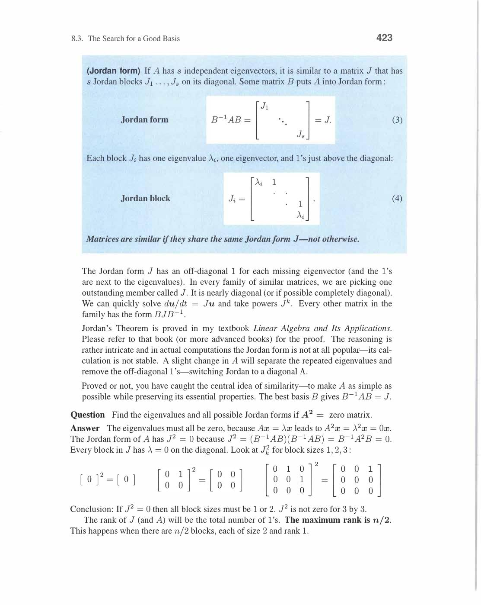
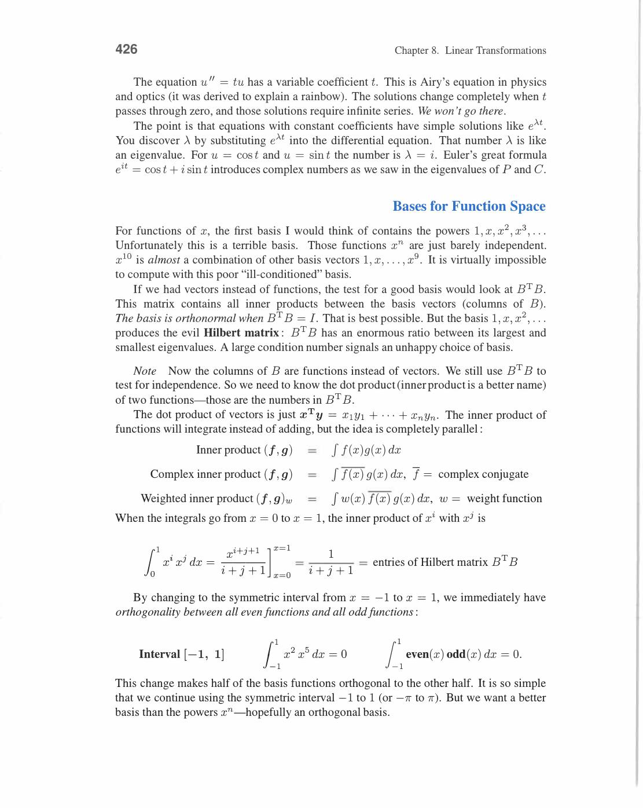
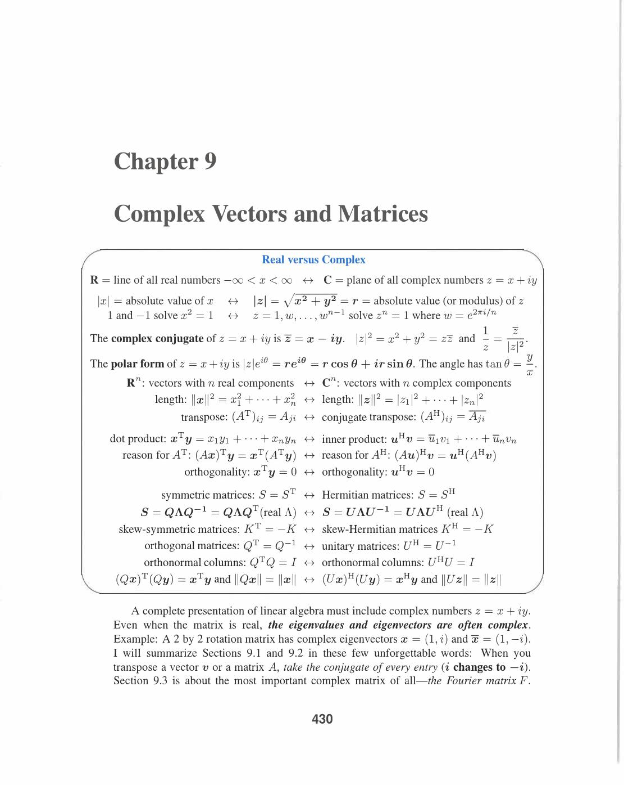
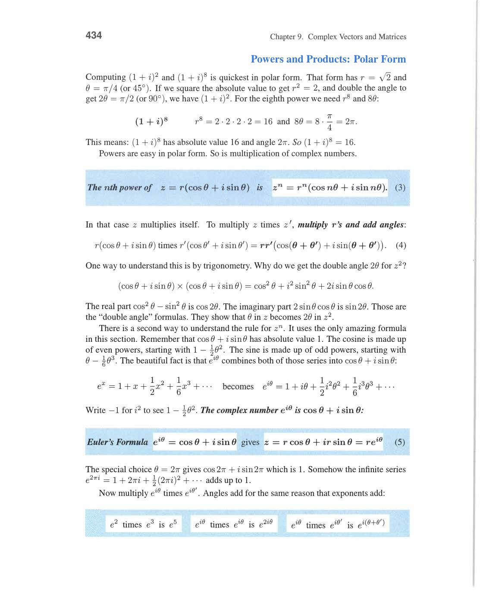
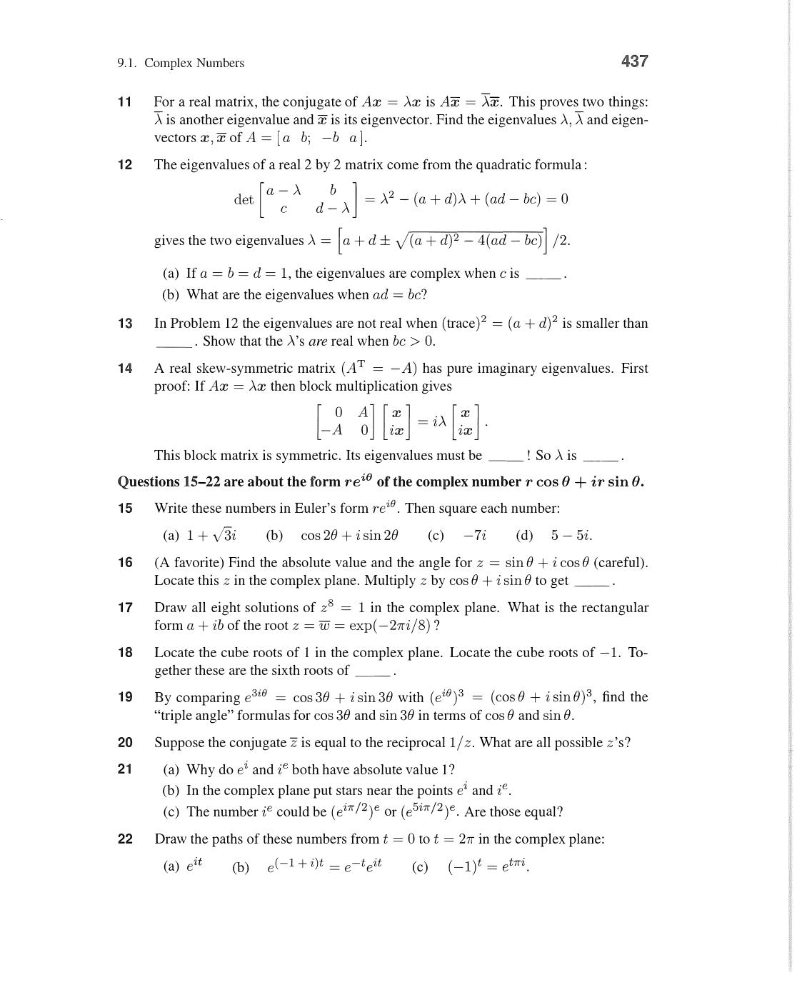
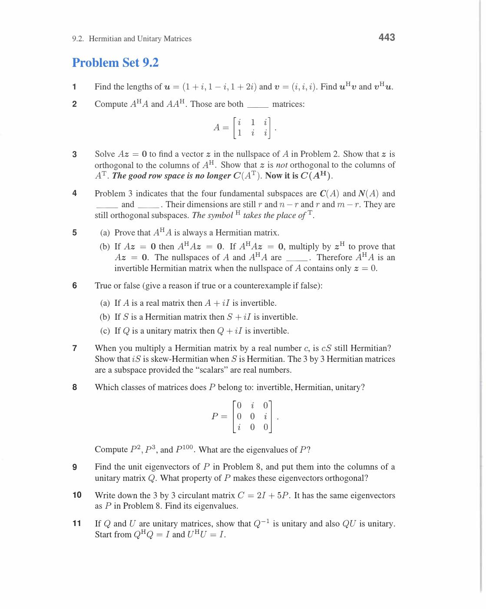

# Chapter 9 - Complex Vectors and Matrices

Visual gallery: [`09-complex-vectors-and-matrices.md`](../visuals/09-complex-vectors-and-matrices.md)

Chapter 9 real numbers se complex numbers tak extension hai.

Reason:

- many oscillatory systems naturally complex form me simpler hote hain
- Fourier analysis naturally complex numbers use karta hai
- eigenvalues of rotation matrices are complex (±i)

## 9.1 Complex Numbers

**Basics:**

```
z = a + ib    (a = real part, b = imaginary part, i² = -1)

Conjugate: z̄ = a - ib

Modulus: |z| = √(a² + b²) = √(zz̄)

Argument: θ = arctan(b/a)

Polar form: z = |z|e^(iθ) = |z|(cos θ + i sin θ)   ← Euler's formula
```

**Euler's Formula:**

```
e^(iθ) = cos θ + i sin θ
```

Most important formula in mathematics! Special values:


*Euler formula: e^(iθ) = cosθ + i sinθ. On unit circle: |e^(iθ)| = 1 for all real θ. Special values: e^(iπ) = -1 (Euler's identity!), e^(iπ/2) = i, e^(0) = 1. Complex multiplication = rotation: e^(iθ)·e^(iφ) = e^(i(θ+φ)). Ab complex numbers geometry ban jaate hain.*

- e^(iπ) = -1 (Euler's identity: e^(iπ) + 1 = 0)
- e^(i·0) = 1
- e^(iπ/2) = i
- e^(iπ) = -1
- e^(3iπ/2) = -i

**Complex multiplication = rotation + scaling:**

```
z₁ · z₂: multiply moduli, add arguments

z₁ = r₁e^(iθ₁), z₂ = r₂e^(iθ₂)
z₁z₂ = r₁r₂ · e^(i(θ₁+θ₂))
```

Multiplying by e^(iθ) = rotating by angle θ (without scaling).

**nth roots of unity:**

Solutions to zⁿ = 1: z_k = e^(2πik/n) for k = 0, 1, ..., n-1.

n = 4 (4th roots): 1, i, -1, -i — equally spaced at 90° on unit circle.

n = 3 (cube roots): 1, e^(2πi/3), e^(4πi/3) at 120° spacing.

**Key property:** Sum of all nth roots = 0.

Proof: geometric series 1 + ω + ω² + ... + ωⁿ⁻¹ = (1 - ωⁿ)/(1-ω) = 0 for ω = e^(2πi/n) ≠ 1.


*Nth roots of unity: e^(2πik/n) for k=0,1,...,n-1. Equally spaced on unit circle, separated by angle 2π/n. Sum of all nth roots = 0 (cancel out). Product = (-1)^(n+1). DFT matrix F uses these as entries. n=4: {1, i, -1, -i} — four 90° rotations.*

**Complex vectors:**

```
z = [z₁, z₂, ..., zₙ]ᵀ    (complex entries)

Length: ‖z‖² = z̄₁z₁ + z̄₂z₂ + ... + z̄ₙzₙ = z*z   (NOT zᵀz!)

where z* = z̄ᵀ = conjugate transpose
```

For complex vectors: zᵀz can be negative or zero even for z ≠ 0! Must use z*z.

Review of Key Ideas (Section 9.1):

1. z = a+ib, |z| = √(a²+b²), Euler: e^(iθ) = cosθ + i sinθ
2. Complex multiplication = rotation + scaling
3. nth roots of unity: ωᵏ = e^(2πik/n), equally spaced, sum to 0
4. Complex vector length: ‖z‖² = z*z (conjugate transpose, not regular transpose)


*Complex plane (Argand diagram): unit circle par i, -1, -i, 1 marked hain. Blue line: positive angle wala complex number. Gray line: conjugate direction. Modulus = distance from origin, argument = angle. z = re^{iθ} = r(cosθ + i sinθ) — polar form.*


*Complex multiplication = rotation: e^{iθ} aur e^{iθ'} ko multiply karo to angles add hote hain → e^{i(θ+θ')}. Semicircle par angles θ aur θ' dikhaye gaye hain. Yahi Euler's formula ka geometric meaning hai — complex multiplication rotates in the plane.*

## 9.2 Hermitian and Unitary Matrices

**Key replacements for complex case:**

| Real | Complex |
|---|---|
| Transpose Aᵀ | Conjugate transpose A* = Āᵀ |
| Symmetric Aᵀ=A | Hermitian A*=A |
| Orthogonal QᵀQ=I | Unitary Q*Q=I |
| Inner product uᵀv | Hermitian inner product u*v = Σūᵢvᵢ |


*Complex inner product: u̅ᵀv = ūᵀv (conjugate of u, then dot with v). Length: ‖u‖² = u̅ᵀu = Σ|uᵢ|² (always real!). Hermitian matrix H = H̄ᵀ (complex equivalent of symmetric). Unitary matrix Q̄ᵀQ = I (complex equivalent of orthogonal). All 4 standard facts generalize using conjugate transpose.*

**Hermitian matrix (A* = A):**

Diagonal entries must be real (since āᵢᵢ = aᵢᵢ).

Example:

```
H = [2    3-i ]    H* = [2     3+i] ... wait...
    [3+i  5   ]         [3-i   5  ]
```

Wait: H*ᵢⱼ = H̄ⱼᵢ. So H₁₂ = 3-i means H*₂₁ = 3̄-ī = 3+i. For Hermitian: H₂₁ = H*₁₂ = 3̄-ī = 3+i. ✓

**Hermitian eigenvalues are real!**

Proof: Hz = λz. Take Hermitian inner product with z:

z*Hz = λ(z*z)

But z*Hz is real for Hermitian H (since (z*Hz)* = z*H*z = z*Hz). And z*z = ‖z‖² > 0.

So λ = (z*Hz)/(z*z) is real. ✓

**Hermitian eigenvectors for distinct eigenvalues are orthogonal!**

Same proof as symmetric matrices but with z* replacing xᵀ.


*Hermitian H = H̄ᵀ: eigenvalues sab real hain. Proof: Hx = λx → take conjugate transpose: x̄ᵀHx = λ(x̄ᵀx). But x̄ᵀHx real (H=H̄ᵀ). And x̄ᵀx = ‖x‖² > 0. So λ real. Eigenvectors for different eigenvalues orthogonal (complex inner product). Spectral theorem: H = QΛQ̄ᵀ with real Λ.*

**Unitary matrix (Q*Q = I):**

- |Qz| = |z| for all z (preserves complex lengths)
- eigenvalues all have |λ| = 1 (on unit circle)
- columns are orthonormal: qᵢ*qⱼ = δᵢⱼ

Most important unitary matrix: Fourier matrix F.

**Spectral theorem for Hermitian:**

```
H = QΛQ*    (Q unitary, Λ diagonal real)
```

Every Hermitian matrix orthogonally diagonalizable with real eigenvalues.

**Example — Hermitian 2×2:**

```
H = [3    2-i]    Eigenvalues:
    [2+i  1  ]

det(H-λI) = (3-λ)(1-λ) - (2-i)(2+i) = λ² - 4λ + 3 - 5 = λ² - 4λ - 2 = 0

λ = (4 ± √24)/2 = 2 ± √6    (real! ✓)
```

Review of Key Ideas (Section 9.2):

1. Replace transpose by conjugate transpose A* = Āᵀ throughout
2. Hermitian (A*=A): real eigenvalues, orthogonal eigenvectors, A = QΛQ*
3. Unitary (Q*Q=I): |eigenvalues|=1, preserves complex length
4. Inner product: u*v = Σūᵢvᵢ — the correct complex version


*Hermitian inner product formula: u^H v = [ū₁ ··· ūn][v₁;...;vn] = ū₁v₁ + ··· + ūnvn. u^H matlab conjugate transpose of u. Real vectors ke liye yeh sab uᵀv ban jaata hai. Complex inner product me conjugate lena zaroori hai taaki length ‖v‖² = v^H v ≥ 0 ho.*


*Hermitian matrix ke complex eigenvectors: top system [3-3i;-3][z₁;z₂]=0 aur bottom [3-3i;6][y₁;y₂]=0. Conjugate eigenvalues give conjugate eigenvectors. Hermitian matrix ke liye eigenvalues real hote hain — complex eigenvector equations real eigenvalue pe solve hoti hain.*


*Cube roots of unity: 1, e^{2πi/3}, e^{4πi/3} — unit circle par 120° equal spacing. In three points ka sum = 0. Yeh DFT matrix ke columns ke roots hain. N-th roots of unity w^0, w^1,...,w^(N-1) jahan w = e^{2πi/N} — yahi Fourier matrix ka base hai.*

## 9.3 The Fast Fourier Transform

**Fourier Matrix Fₙ:**

The most important matrix in applied mathematics.

```
(Fₙ)ⱼₖ = ωʲᵏ    for j,k = 0, 1, ..., n-1

where ω = e^(2πi/n)    (primitive nth root of unity)
```

**F₄ explicitly (ω = e^(2πi/4) = i):**

```
F₄ = [1    1    1    1  ]
     [1    i    i²   i³ ]    =   [1   1   1   1 ]
     [1    i²   i⁴   i⁶ ]        [1   i  -1  -i ]
     [1    i³   i⁶   i⁹ ]        [1  -1   1  -1 ]
                                  [1  -i  -1   i ]
```


*DFT matrix Fₙ: (j,k) entry = ω^(jk) where ω = e^(2πi/n). F₄ = [1,1,1,1; 1,i,-1,-i; 1,-1,1,-1; 1,-i,-1,i]/2. F̄ᵀF = I: columns orthogonal! Inverse DFT = (1/n)F̄ᵀ. F₄ᵀF₄ = 4I → divide by 2 each column to get Q (unitary). DFT: x → Fx converts signal to frequency domain.*

**Orthogonality:** F*F = nI → F/√n is unitary.

Proof: (F*F)ⱼₖ = Σₘ ω̄ᵐʲ·ωᵐᵏ = Σₘ ω^(m(k-j)).

For j=k: sum = n. For j≠k: geometric series with ratio ω^(k-j) ≠ 1 → sum = 0. ✓

So F⁻¹ = F*/n = F̄/n.

**Discrete Fourier Transform (DFT):**

```
c = F₄f    (forward: f → frequency domain c)
f = F₄⁻¹c = F̄₄c/4    (inverse: c → time domain f)
```

For signal f = (f₀, f₁, f₂, f₃):

```
cₖ = Σⱼ fⱼ ωʲᵏ = f₀ + f₁ωᵏ + f₂ω²ᵏ + f₃ω³ᵏ
```

**Naive DFT cost:** n² multiplications (matrix-vector multiply Fₙf).

**FFT: Divide and conquer to get O(n log n):**

Key factorization: Fₙ = [I D; I -D] · [Fₙ/₂  0; 0  Fₙ/₂] · Pₙ

where:
- Pₙ = permutation separating even/odd indices
- D = diagonal matrix with entries 1, ω, ω², ..., ω^(n/2-1)

```
F₈ = [I  D₄] [F₄  0] [P₈]
     [I -D₄] [0  F₄]
```

**FFT Example (n=4):**

Input f = (f₀, f₁, f₂, f₃). Permute: even (f₀,f₂), odd (f₁,f₃).

```
Step 1: F₂ on evens: [f₀+f₂, f₀-f₂]
Step 2: F₂ on odds:  [f₁+f₃, f₁-f₃]
Step 3: Combine with D = diag(1,i):
  c₀ = (f₀+f₂) + 1·(f₁+f₃)
  c₁ = (f₀-f₂) + i·(f₁-f₃)
  c₂ = (f₀+f₂) - 1·(f₁+f₃)
  c₃ = (f₀-f₂) - i·(f₁-f₃)
```

Only 8 multiplications instead of 16! (factor of 2 savings at n=4).


*FFT butterfly: Fₙ = [I, D; I, -D][F_{n/2}, 0; 0, F_{n/2}] jahan D = diag(1,ω,...,ω^(n/2-1)). Recursion: n-point DFT → two n/2-point DFTs + n multiplications. Cost: O(n log₂ n) vs O(n²) for direct DFT. n=1024: 10240 vs 1,048,576 operations! Butterfly pattern from divide-and-conquer.*

**General FFT complexity:**

T(n) = 2T(n/2) + n → T(n) = n log₂(n).

For n = 2²⁰ ≈ 10⁶:

- Naive: n² ≈ 10¹² operations (1000 seconds at 10⁹ ops/sec)
- FFT: n log n ≈ 20×10⁶ operations (0.02 seconds!)

**Cooley-Tukey FFT:** Named after 1965 paper. One of the most important algorithms ever discovered.

**Applications of FFT:**

| Field | Use |
|---|---|
| Signal processing | Filter design, spectrum analysis |
| Audio | MP3 compression, noise reduction |
| Image processing | JPEG compression (DCT ≈ FFT) |
| Communications | OFDM (WiFi, 4G, 5G) |
| Scientific computing | Solving PDEs (convolution theorem) |
| Number theory | Fast polynomial multiplication |

**Connection to continuous Fourier transform:**

Fourier series: f(x) = Σ cₖ e^(ikx). Coefficients: cₖ = (1/2π) ∫ f(x) e^(-ikx) dx.

DFT is the discrete version — same idea, n equally spaced samples instead of continuous function.

Review of Key Ideas (Section 9.3):

1. Fₙ has entries ωʲᵏ where ω = e^(2πi/n). Columns orthogonal: F*F = nI
2. DFT: c = Ff (n² work naive). FFT: O(n log n) via divide-and-conquer
3. FFT splits n-DFT into two (n/2)-DFTs plus O(n) combine step
4. Most important algorithm for digital signal processing and communications


*F₄ Fourier matrix: rows [1,w³;w⁶;w⁹] = [1,1,1,1; 1,i,i²,i³; 1,i²,i⁴,i⁶; 1,i³,i⁶,i⁹] where w = e^{2πi/4} = i. Entry (j,k) = w^{jk}. Columns orthogonal: F₄^H F₄ = 4I. Yahi 4-point DFT matrix hai — n² multiplications se n log n tak FFT reduce karta hai.*


*FFT butterfly diagram: crossing lines aur labels -1, i signal flow graph hai. Butterfly = do inputs combine karte hain do outputs banane ke liye: x+ωy aur x-ωy. Yeh recursive structure FFT ko O(n²) se O(n log n) banata hai. Har stage par butterfly operations n/2 hote hain.*

![F₆ factorization — F₆ = [I D; I -D][F₃; F₃][P] (book p.450)](../assets/strang/09-complex-vectors-and-matrices/page-460-img-001.jpg)
*FFT factorization: F₆ = [I,D; I,-D][F₃ 0; 0 F₃][P]. F₆ ko do F₃ computations me tod dete hain plus permutation P aur diagonal D. Yahi divide-and-conquer: n-point DFT → 2 times (n/2)-point DFTs. Recursively apply karo → O(n log n) total operations.*

---
