# Chapter 10 - Applications

Visual gallery: [`10-applications.md`](../visuals/10-applications.md)

This chapter book ka application showcase hai.

Purpose:

- show that linear algebra isolated theory nahi hai
- it appears in networks, engineering, economics, graphics, signal processing, cryptography
- har application me same linear algebra ideas, different physical context

## 10.1 Graphs and Networks

**Setup:**

Graph: nodes (vertices) + edges (directed connections).

- n nodes = potential differences (voltages) x₁, ..., xₙ
- m edges = currents y₁, ..., yₘ

**Incidence Matrix A (m×n):**

For each edge from node j to node i:

```
A(edge, j) = -1   (edge leaves node j)
A(edge, i) = +1   (edge enters node i)
```

**Concrete 4-node, 5-edge example:**

```
Node 1 → Node 2 (edge 1)
Node 1 → Node 3 (edge 2)
Node 2 → Node 4 (edge 3)
Node 3 → Node 2 (edge 4)
Node 3 → Node 4 (edge 5)
```

```
A = [-1  1  0  0]   edge 1: 1→2
    [-1  0  1  0]   edge 2: 1→3
    [ 0 -1  0  1]   edge 3: 2→4
    [ 0  1 -1  0]   edge 4: 3→2
    [ 0  0 -1  1]   edge 5: 3→4
```

**Key: A times all-ones = 0!** (each row sums to 0: -1 for leaving, +1 for entering)

dim(nullspace of A) = 1 (constant potential shifts — ground node).

**Kirchhoff's Laws via Linear Algebra:**

Voltage law: y = Ax (potential differences across edges).

Current law: Aᵀf = 0 (no current piles up at node — current in = current out).

Ohm's law: y = Ce (e = voltage differences, C = conductance diagonal matrix).

Combined system:

```
AᵀCAx = f    ← K = AᵀCA is stiffness/Laplacian matrix

K is symmetric positive semidefinite!
(Because xᵀKx = xᵀAᵀCAx = (Ax)ᵀC(Ax) = sum of conductance × voltage² ≥ 0)
```

**Graph Laplacian:**

```
L = AᵀA    (when C = I, all conductances = 1)

Lᵢᵢ = degree of node i
Lᵢⱼ = -1 if edge between i,j, else 0
```

L has eigenvalue 0 (all-ones vector in nullspace). Second smallest eigenvalue = Fiedler value → measures graph connectivity.

**Nullspace and Connectivity:**

```
dim(N(A)) = number of connected components
dim(N(Aᵀ)) = number of independent loops = m - n + 1   (Euler's formula)
```

Review of Key Ideas (Section 10.1):

1. Incidence matrix A: edges × nodes, entries ±1 for directed graph
2. Ax = potential differences (voltages), Aᵀf = 0 (current balance)
3. K = AᵀCA = graph Laplacian — symmetric positive semidefinite
4. Euler: loops = edges - nodes + components

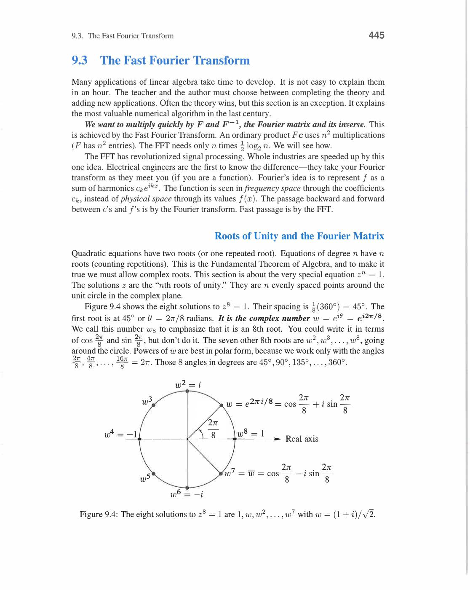
*Incidence matrix A: rows = edges, columns = nodes. Each edge row: +1 at head node, -1 at tail node. 5-edge 4-node graph: A is 5×4, rank 3 = nodes-1 (tree). Aᵀy = 0 → y = constant (Kirchhoff's law interpretation). Graph me loop hone par dependent rows.*

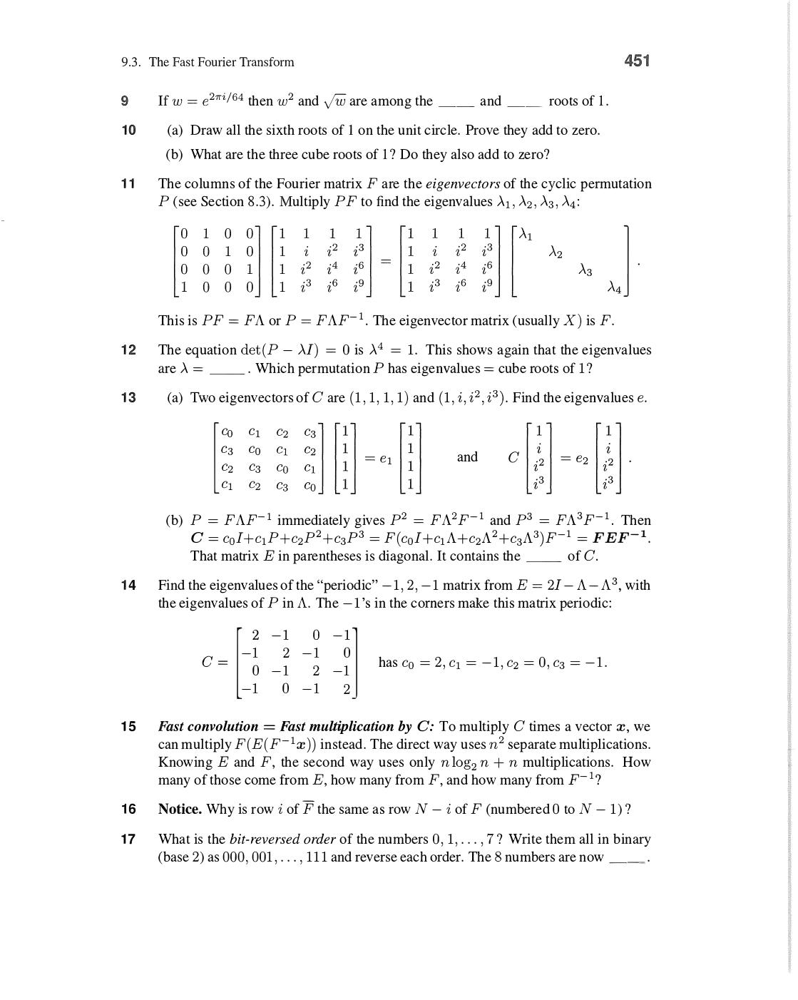
*Kirchhoff's laws matrix form: Ay = b (current conservation at nodes — KCL). e = Ax (voltage differences across edges). Ohm's law: y = Ce (current = conductance × voltage). Combine: AᵀCAx = AᵀCb → graph Laplacian L = AᵀCA. Network equations = linear algebra!*

![Incidence matrix A times [1;1;1;1] = [0;0;0] — Kirchhoff's current law (book p.454)](../assets/strang/10-applications/page-464-img-001.jpg)
*Incidence matrix property: A times all-ones vector = [0;0;0;0]. Last row [0,0,0,1] times [1;1;1;1] = [0]. Matlab: every edge enters one node and leaves another — rows sum to zero. Yahi Kirchhoff's current law ka matrix form hai: zero net flow at each node.*

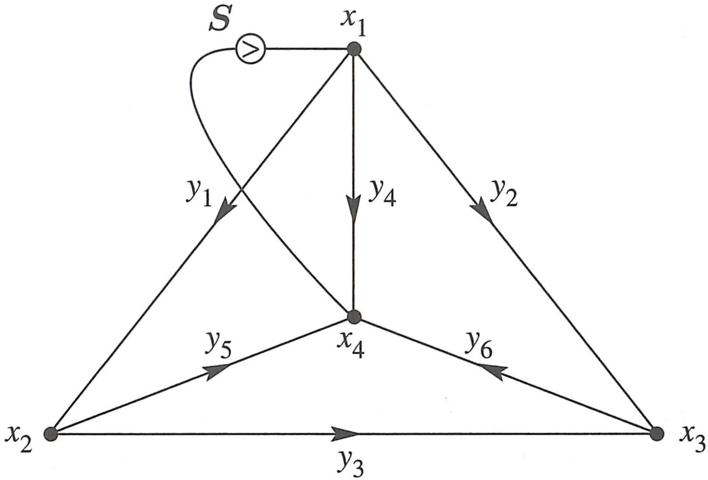
*Network graph: 4 nodes (x₁,x₂,x₃,x₄) aur 6 directed edges (y₁,...,y₆). Source S at x₁ (self-loop). Edge yj node potentials se current define karta hai. Incidence matrix A: entry = +1 jahan edge nikalta hai, -1 jahan enter karta hai. Ax = b → Kirchhoff equations.*

## 10.2 Matrices in Engineering

**Spring-Mass System:**

n masses connected by springs. Displacement vector u = (u₁,...,uₙ).

Stiffness matrix K:

```
K = AᵀCA

A = incidence matrix (how springs connect masses)
C = diag(c₁,...,cₘ) (spring constants)
```

Force balance: **Ku = f** (static equilibrium).

**Concrete 3-spring, 3-mass example (fixed at wall):**

Springs: wall-m₁ (c₁), m₁-m₂ (c₂), m₂-m₃ (c₃).

```
A = [ 1  0  0]     C = [c₁  0   0]
    [-1  1  0]         [0   c₂  0]
    [ 0 -1  1]         [0   0   c₃]

K = AᵀCA = [c₁+c₂  -c₂    0  ]
            [-c₂    c₂+c₃ -c₃ ]
            [0      -c₃   c₃  ]
```

K is tridiagonal, symmetric, positive definite (wall fixes one end → no rigid body motion).

**Equal springs (c₁=c₂=c₃=c), gravity loads f = mg(1,1,1)ᵀ:**

```
K = c [2 -1  0]      x = K⁻¹f
      [-1 2 -1]
      [0 -1  1]

K⁻¹ = (1/c)[1 1 1]
             [1 2 2]
             [1 2 3]

x = (mg/c)(3,5,6)ᵀ
```

Bottom mass (m₃) displaces most: u₃ = 6mg/c (carries weight of all 3 masses above it). Physical intuition confirms!

**Vibration (dynamic case):**

```
Mü + Ku = 0   (M = mass matrix, K = stiffness)

Assume u(t) = xe^(iωt):   (K - ω²M)x = 0
```

Natural frequencies: det(K - ω²M) = 0 → generalized eigenvalue problem.

Review of Key Ideas (Section 10.2):

1. K = AᵀCA: stiffness matrix from geometry (A) and material (C)
2. Static: Ku = f → solve for displacements
3. Dynamic: Mü + Ku = 0 → natural frequencies from det(K - ω²M) = 0
4. K symmetric positive definite when structure properly supported

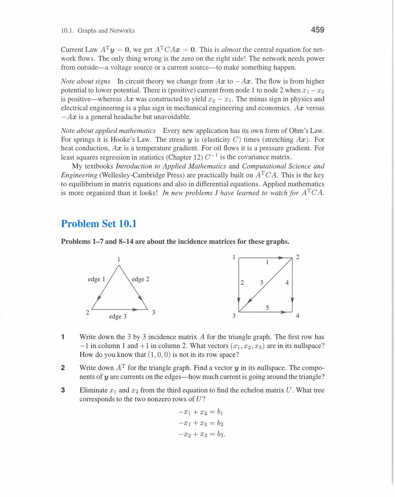
*Spring-mass system: K = AᵀCA stiffness matrix. A = incidence matrix (geometry), C = diagonal stiffness matrix (material properties), AᵀCA = structural stiffness. Ku = f: u = displacements, f = forces. Same structure as electrical networks! Universal pattern: AᵀCA appears in FEM, circuits, statistics.*

![Stiffness matrix AᵀCA = [c₁+c₂, -c₂; ...] for spring system (book p.465)](../assets/strang/10-applications/page-475-img-002.jpg)
*Stiffness matrix formula: AᵀCA = [c₁+c₂, -c₂; ...]. A = incidence matrix, C = diagonal spring constants matrix. AᵀCA symmetric positive definite hai — yahi structural engineering ka stiffness matrix hai. Forces = AᵀCAu = f — linear system for displacements u.*

![Spring-mass displacement — u = K₁⁻¹f = (mg/c)[3;5;6] (book p.470)](../assets/strang/10-applications/page-480-img-005.jpg)
*Spring-mass solution: u = K₁⁻¹f = (1/c)[1,1,1;1,2,2;1,2,3][mg;mg;mg] = (mg/c)[3;5;6]. Gravity load f = [mg;mg;mg]. K₁⁻¹ = compliance matrix. Bottom mass sab se zyada displaces (6mg/c) — physical intuition matches linear algebra solution.*

## 10.3 Markov Matrices, Population, and Economics

**Markov Matrix:**

Transition matrix M where each column sums to 1 (probability distribution preserved):

```
M = [m₁₁  m₁₂  m₁₃]     each column: mᵢⱼ ≥ 0 and Σᵢmᵢⱼ = 1
    [m₂₁  m₂₂  m₂₃]
    [m₃₁  m₃₂  m₃₃]
```

State at step k: uₖ₊₁ = Muₖ.

After k steps: uₖ = Mᵏu₀.

**Key eigenvalue fact:** Every Markov matrix has λ = 1 as eigenvalue!

Proof: (1,1,...,1)M = (1,1,...,1) because columns sum to 1 → λ=1 for row vector → same eigenvalue for column version.

Steady state = eigenvector of M with λ = 1.

**Concrete 2-state example:**

```
M = [.8  .3]    States: "in city" and "in suburbs"
    [.2  .7]

λ₁ = 1: Mx = x → [-.2,.3;.2,-.3]x = 0 → x₁ = (.6,.4)   (steady state: 60% city, 40% suburbs)
λ₂ = 0.5: decaying transient
```

After many steps: Mᵏu₀ → (.6,.4) regardless of start. ✓

**PageRank (Google's algorithm):**

Web pages = nodes, links = edges. Markov matrix: each column = link probabilities from that page.

Steady state of random surfer = PageRank vector = eigenvector with λ = 1.

Teleportation (damping factor α):

```
G = αM + (1-α)(1/n)·ones matrix
```

λ = 1 still exists, and convergence is fast. This is the billion-dollar eigenvalue.

**Leontief Input-Output Model:**

x = Ax + d (production = consumption by industries + final demand)

```
(I - A)x = d
x = (I - A)⁻¹d = (I + A + A² + A³ + ...)d
```

Geometric series converges when ‖A‖ < 1 (each industry consumes less than it produces).

Economic interpretation: each extra unit of demand ripples through economy as series of rounds of production.

Review of Key Ideas (Section 10.3):

1. Markov matrix: column sums = 1, all entries ≥ 0, λ=1 always an eigenvalue
2. Steady state = eigenvector for λ = 1 (uₖ → this as k → ∞)
3. Convergence rate = |λ₂| (second eigenvalue)
4. Leontief: x = (I-A)⁻¹d uses geometric series of matrix powers

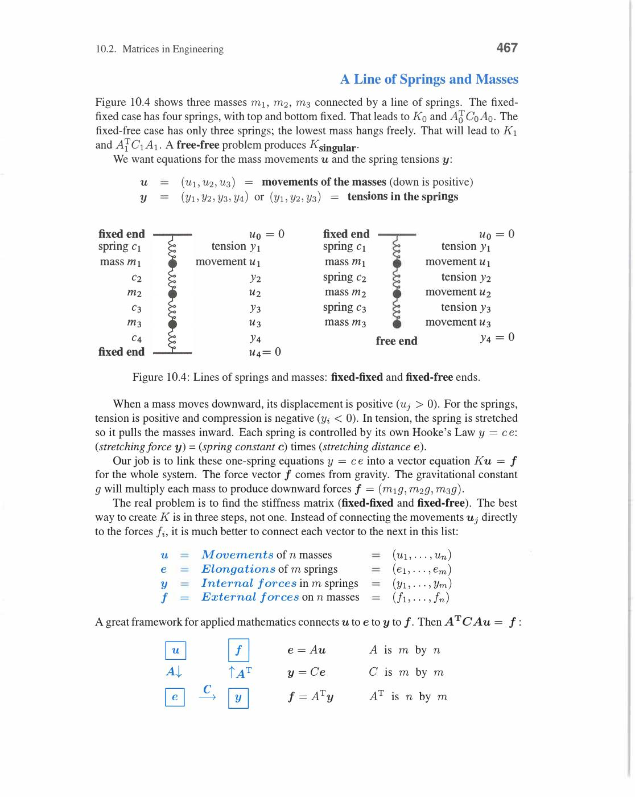
*Markov matrix: columns sum to 1, all entries ≥ 0. Always has eigenvalue λ=1. Steady state = eigenvector for λ=1 (normalized). All other |λ|≤1 → transient modes decay. Aᵏx₀ → steady state as k→∞. Google PageRank = Markov chain steady state on web graph.*

![Markov transition — [1/2;1/2;0][p₁;p₂;p₃] = [p₂/2+p₃/2; p₁/2+p₃/2; p₁/2+p₂/2] (book p.476)](../assets/strang/10-applications/page-486-img-003.jpg)
*Markov transition equations: [1/2;1/2;0] column means state 1 → state 2 and 3 equally. Ap = p (steady state): p₁ = p₂/2 + p₃/2, p₂ = p₁/2 + p₃/2, p₃ = p₁/2 + p₂/2. Eigenvalue λ=1 ka eigenvector = steady state distribution. Sab equal → p = [1/3;1/3;1/3].*

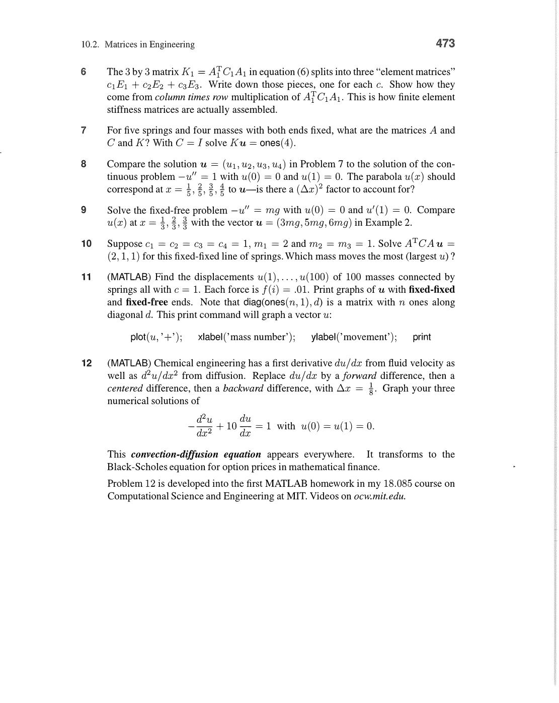
*Leontief input-output model: (I-A)x = d where A = consumption matrix, d = external demand, x = total production. Solution: x = (I-A)⁻¹d = (I + A + A² + ...)d (geometric series!). Converges when spectral radius ρ(A) < 1 (all sectors use less than they produce). Economic equilibrium = linear algebra.*

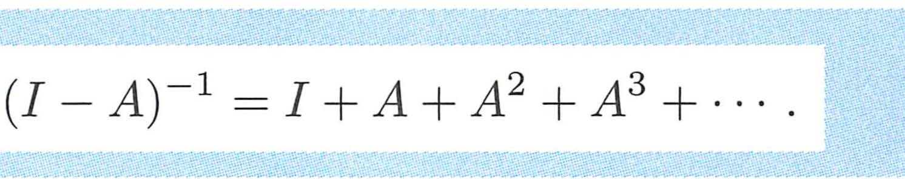
*(I-A)⁻¹ = I + A + A² + ··· — geometric series of matrices. Leontief model: x = Ax + d, jahan A = consumption matrix, d = demand. Solution: x = (I-A)⁻¹d. Series converges jab A ke eigenvalues |λ| < 1 hon. Yahi economics me input-output analysis hai.*

## 10.4 Linear Programming

**Standard Form:**

```
Minimize:    cᵀx
Subject to:  Ax = b
             x ≥ 0
```

c = cost vector, A = constraint matrix, b = resource limits, x = decision variables.

**Geometric interpretation:**

- Feasible region = convex polyhedron (intersection of halfspaces)
- Optimal solution = always at a corner vertex (if it exists)

**Simplex Method (Dantzig, 1947):**

Move from corner to corner along edges, always improving objective.

1. Start at any corner (basic feasible solution)
2. Check if any neighbor is better (reduced costs)
3. If yes: move to best neighbor
4. If no: STOP — current corner is optimal

**Example (2D):**

```
Maximize: 5x + 4y
Subject to: 6x + 4y ≤ 24
            x + 2y ≤ 6
            x, y ≥ 0
```

Corner vertices: (0,0), (4,0), (3,3/2), (0,3). Objective values: 0, 20, 21, 12.

Optimal: (3, 3/2), objective = 21.

**Duality:**

Every LP has a dual LP:

```
Primal: min cᵀx s.t. Ax=b, x≥0
Dual:   max bᵀy s.t. Aᵀy≤c
```

Strong duality theorem: optimal primal value = optimal dual value.

Interpretation: dual variables = shadow prices (how much objective improves per unit increase in resource b).

Review of Key Ideas (Section 10.4):

1. LP: linear objective, linear constraints (equalities + nonnegativity)
2. Feasible region = convex polyhedron; optimal is at a vertex
3. Simplex moves corner to corner improving objective
4. Strong duality: primal min = dual max at optimality

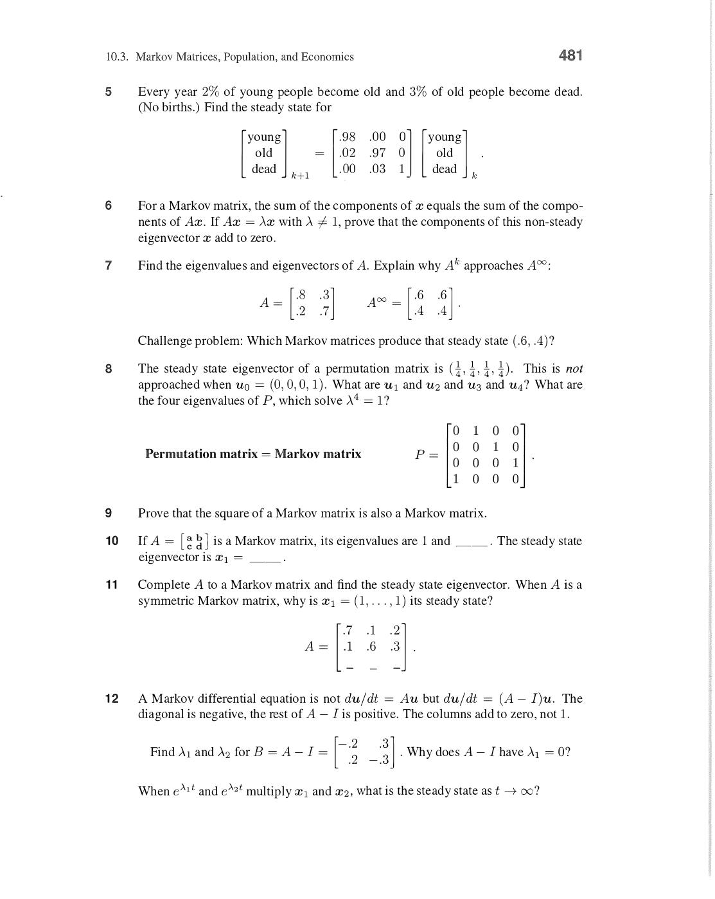
*Linear programming: maximize cᵀx subject to Ax ≤ b, x ≥ 0. Optimal solution always at corner of feasible region (polytope vertex). Simplex method: move along edges to adjacent corners. 2D: feasible region = polygon, optimal at vertex. Dual problem: minimize bᵀy s.t. Aᵀy ≥ c.*

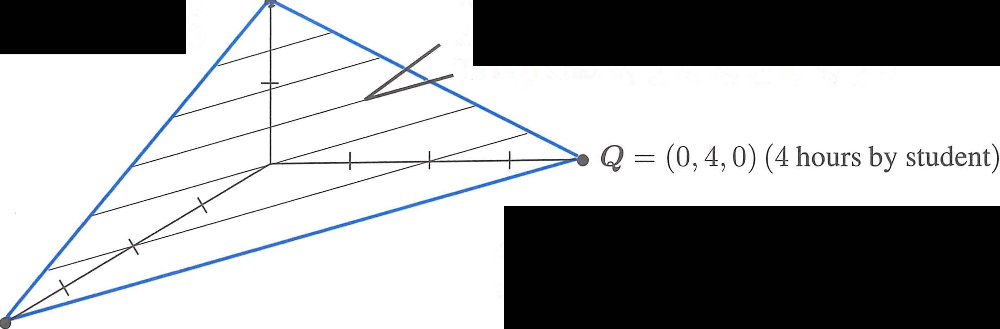
*Linear programming feasible region: 3D triangle (simplex) with vertex Q=(0,4,0) = "4 hours by student". Blue boundary = constraint edges. Feasible region convex hai — optimal solution kisi corner vertex par milta hai. Yahi simplex method ka geometric basis hai.*

## 10.5 Fourier Series: Linear Algebra for Functions

**Function Space as Vector Space:**

Functions f: [0, 2π] → ℝ form a vector space (can add functions, multiply by scalars).

Inner product:

```
⟨f, g⟩ = (1/2π) ∫₀²π f(x)g(x) dx
```

**Orthonormal basis of trig functions:**

```
{1, cos x, sin x, cos 2x, sin 2x, cos 3x, sin 3x, ...}
```

These are orthogonal w.r.t. the inner product above!

Check: ⟨cos mx, cos nx⟩ = 0 for m ≠ n (orthogonality of sinusoids).

**Fourier Series:**

```
f(x) = a₀/2 + Σₙ [aₙ cos(nx) + bₙ sin(nx)]

aₙ = (1/π) ∫₀²π f(x) cos(nx) dx    ← projection onto cos(nx)
bₙ = (1/π) ∫₀²π f(x) sin(nx) dx    ← projection onto sin(nx)
```

These are exactly the projection formulas from Chapter 4! Same idea, infinite-dimensional space.

**Example: Square wave**

```
f(x) = +1 for 0 < x < π
f(x) = -1 for π < x < 2π

Fourier series: f(x) = (4/π)[sin x + sin(3x)/3 + sin(5x)/5 + ...]
```

Gibbs phenomenon: near discontinuity, partial sums overshoot by ~9% — never goes away even with more terms.

**Parseval's Theorem (energy conservation):**

```
(1/2π) ∫|f(x)|² dx = |a₀|²/4 + Σₙ (|aₙ|² + |bₙ|²)/2
```

Total energy in time domain = total energy in frequency domain.

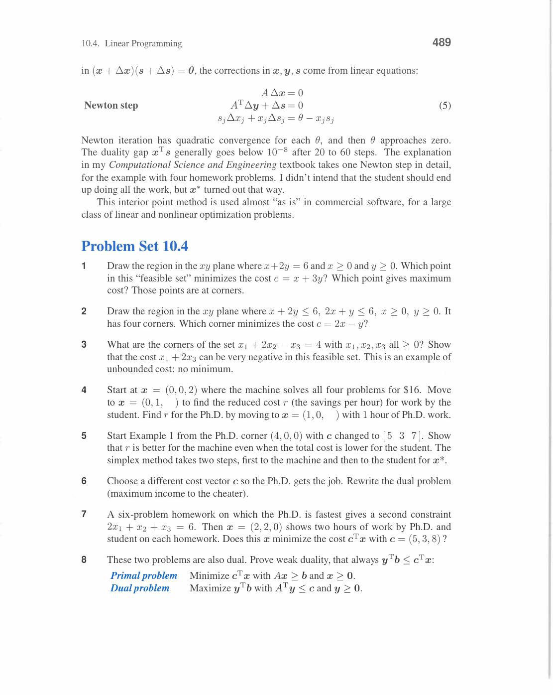
*Fourier series: f(x) = a₀ + Σ(aₙcos(nx) + bₙsin(nx)). Orthogonal basis on [0,2π]: ∫cos(nx)cos(mx)dx = πδₙₘ. Coefficients: aₙ = (1/π)∫f(x)cos(nx)dx (projection!). Least squares interpretation: project f onto orthogonal basis. Same idea as projections in Chapter 4.*

## 10.6 Computer Graphics

**Homogeneous Coordinates:**

2D transformations combined using 3×3 matrices (homogeneous form):

Point (x, y) → (x, y, 1) in homogeneous coordinates.

**Key transformation matrices:**

```
Rotation by θ:     [cosθ  -sinθ  0]
                   [sinθ   cosθ  0]
                   [0      0     1]

Translation by (tx,ty): [1  0  tx]
                         [0  1  ty]
                         [0  0   1]

Scaling by (sx,sy):  [sx  0  0]
                      [0   sy 0]
                      [0   0  1]
```

Why homogeneous: translation cannot be expressed as 2×2 linear map! Homogeneous coordinates make everything linear.

**Compose transformations:** Just multiply matrices (right to left = last applied first).

Rotate then translate: T·R (not T+R — composition is multiplication).

**3D Graphics:**

Perspective projection (view from camera at z = d):

```
Projection: (x, y, z) → (dx/z, dy/z)

In homogeneous: [d 0 0 0] [x]   [dx]
                [0 d 0 0] [y] = [dy]
                [0 0 1 0] [z]   [z ]
                          [1]
```

Divide by 3rd component to get (dx/z, dy/z) — perspective foreshortening.

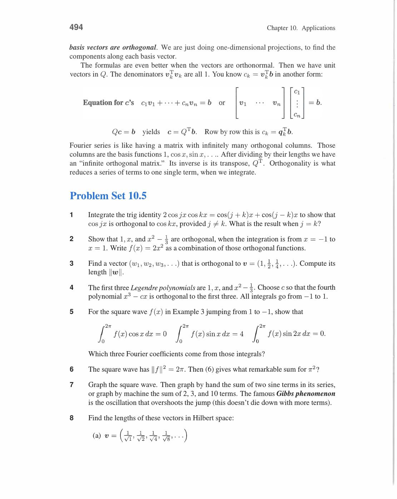
*Homogeneous coordinates: 2D point (x,y) → (x,y,1) in 3D. Translation [1,0,tx;0,1,ty;0,0,1] now linear in 3D! Rotation + translation combined in one 3×3 matrix (instead of separate). Computer graphics: chain transformations by matrix multiplication. OpenGL uses 4×4 homogeneous matrices for 3D.*

## 10.7 Linear Algebra for Cryptography

**Hill Cipher:**

Convert message to numbers (A=0, B=1, ..., Z=25).

Block message into vectors of length k.

Encrypt: **c = Am mod 26** (matrix multiply, then mod 26).

Decrypt: **m = A⁻¹c mod 26** (inverse must exist mod 26).

**Condition for decryption to work:**

det(A) must be coprime to 26 (gcd(det(A), 26) = 1). Then A⁻¹ mod 26 exists.

**Example (k=2):**

```
Key: A = [3  3]    Message: "HI" = (7, 8)
         [2  5]

Encrypt: A·(7,8)ᵀ mod 26 = (45, 54)ᵀ mod 26 = (19, 2)ᵀ → "TC"

det(A) = 15-6 = 9. gcd(9, 26) = 1 → invertible mod 26.
```

Modern cryptography doesn't use Hill cipher (easy to break with known plaintext). But it illustrates that same matrix ideas work over modular arithmetic (finite fields).

**Main lesson:** Same linear algebra, different "number system" (Zₚ instead of ℝ).

![Encryption matrix A = [a₁₁; a₂₁; a₃₁; a₄₁] — key matrix column in Hill cipher (book p.497)](../assets/strang/10-applications/page-507-img-001.jpg)
*Hill cipher key matrix A: columns like [a₁₁; a₂₁; a₃₁; a₄₁] store encryption key. Message vector multiply hota hai A se modulo p. Decryption ke liye A⁻¹ mod p chahiye. Yahi linear algebra modular arithmetic me — same matrix operations, different number system.*

---
