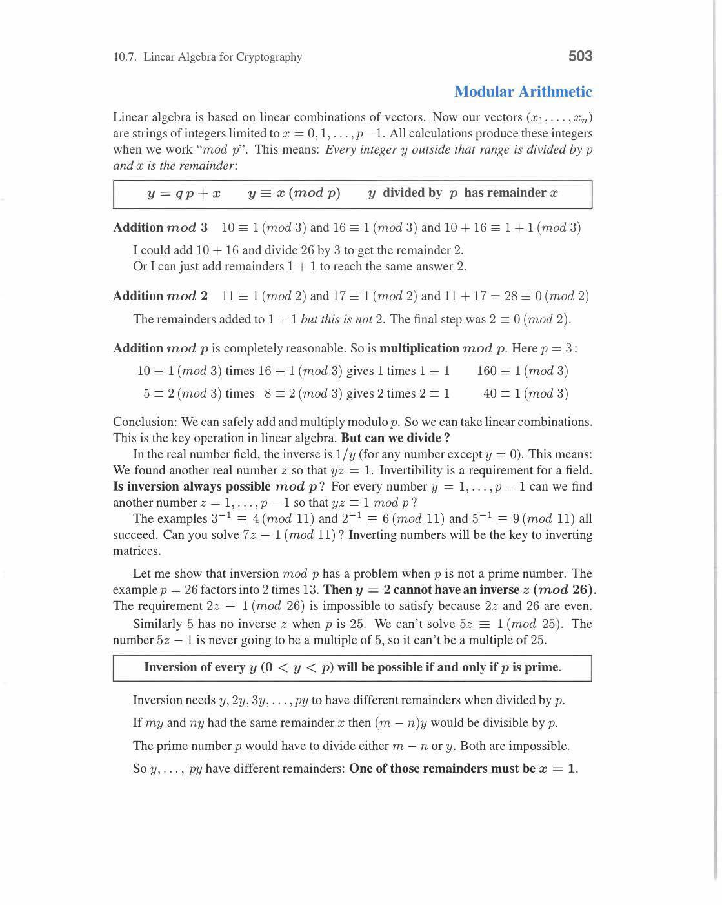
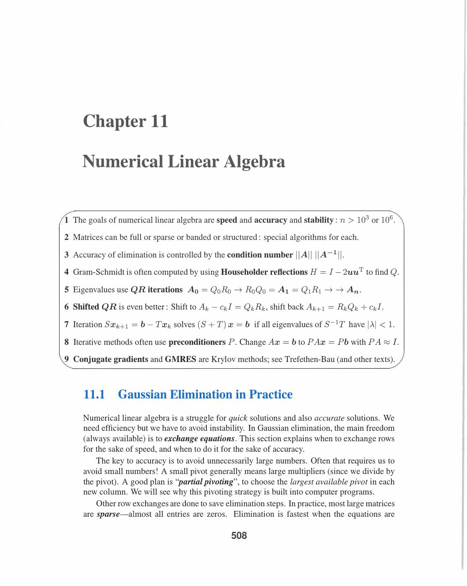
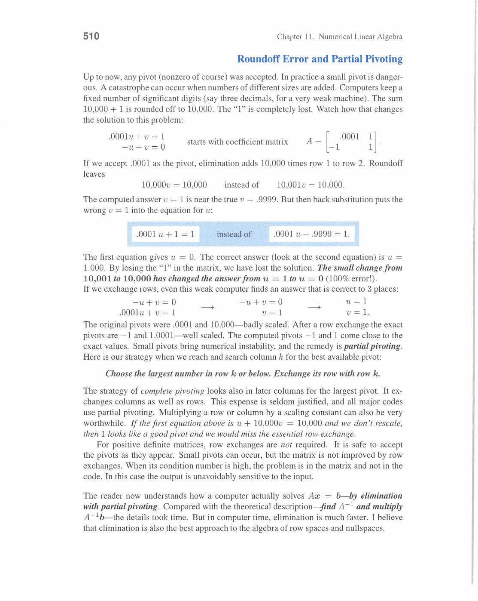
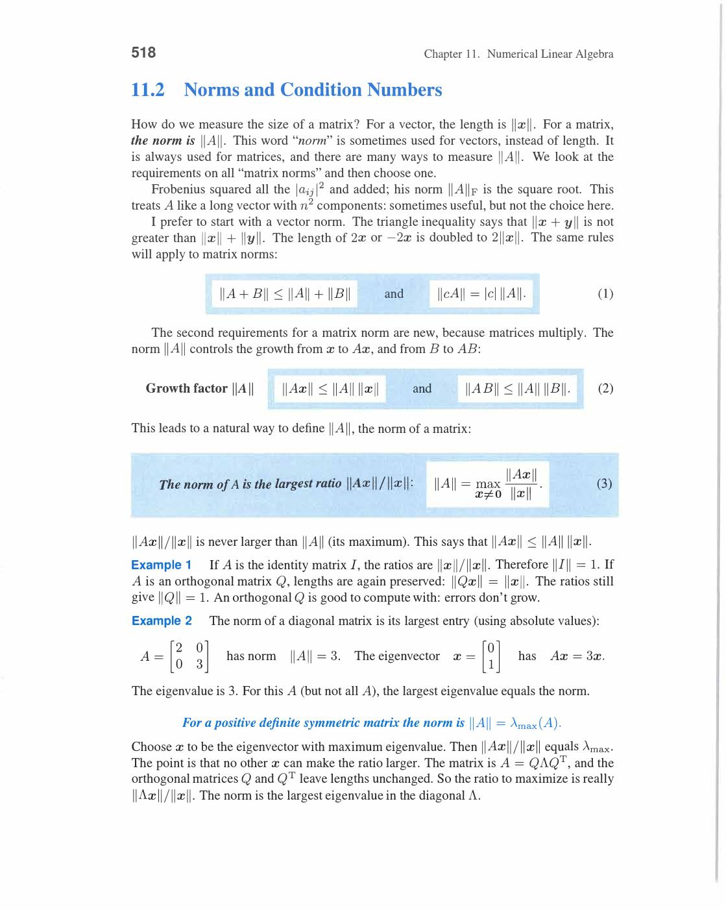
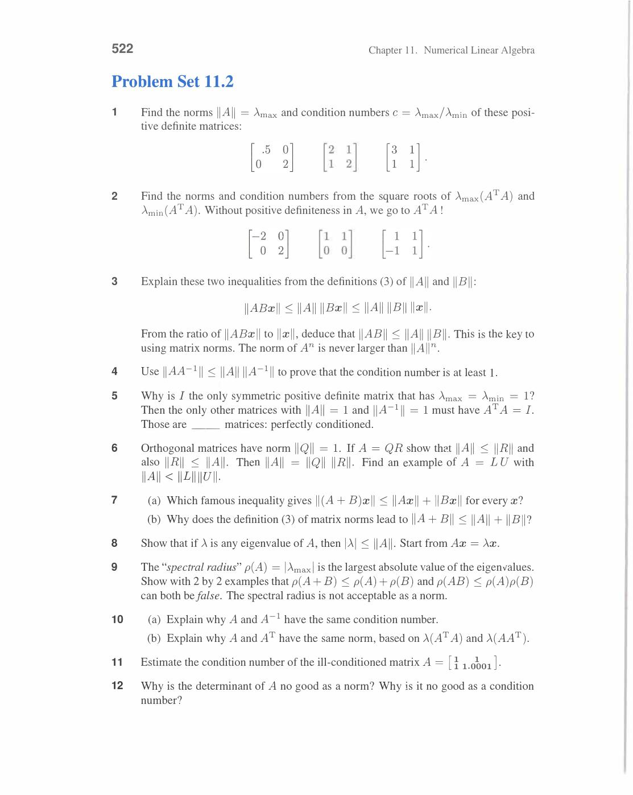
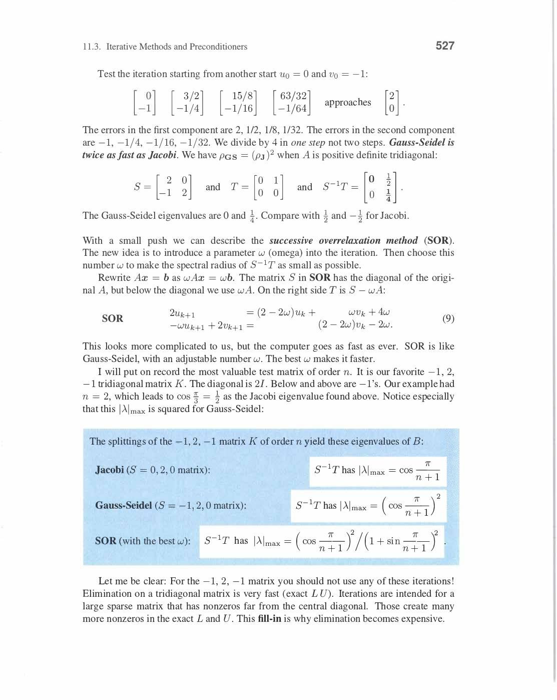
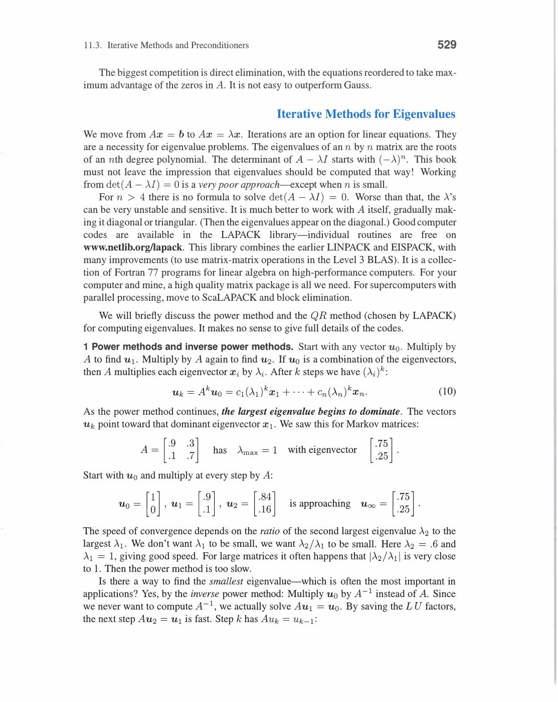

# Chapter 11 - Numerical Linear Algebra

Visual gallery: [`11-numerical-linear-algebra.md`](../visuals/11-numerical-linear-algebra.md)

Yeh chapter theory se practical computing ke constraints tak aata hai.

Main concern:

- exact math aur actual floating-point computation same nahi hote
- 64-bit double precision: ~16 significant digits, but errors accumulate!

Three big themes:

- **Speed**: How many operations? O(n²) vs O(n³) vs O(n log n)
- **Accuracy**: How close to true solution?
- **Stability**: Do small input errors stay small in output?

## 11.1 Gaussian Elimination in Practice

**Floating-Point Arithmetic:**

Computer stores numbers as: ±mantissa × 2^(exponent).

Machine epsilon ε_mach ≈ 10⁻¹⁶ (double precision). Every arithmetic operation has relative error ≤ ε_mach.

After n operations: errors accumulate — can be much larger than ε_mach.

**Why Pivoting Matters:**

Small pivot → large multiplier → error amplification.

```
System: [ε  1][x] = [1+ε]    True solution: x₁ = 1, x₂ = 1
        [1  1][y]   [2  ]

Without pivoting: pivot = ε (tiny!)
  Multiplier = 1/ε (huge!)
  Row 2 → [0, 1-1/ε][x,y] ≈ [0, -1/ε]  (catastrophic rounding!)

With partial pivoting: swap rows first → pivot = 1 (safe)
  Row 2 → [0, 1-ε] ≈ [0, 1]  (accurate!)
```

**Partial Pivoting (GEPP — Gaussian Elimination with Partial Pivoting):**

At each step: among all rows from current row down, pick the largest |entry| in that column as pivot. Swap that row up.

This is what MATLAB's `\` operator, LAPACK, and virtually all production codes use.

**Growth factor g:**

```
g = max|entry in U| / max|entry in A|
```

GEPP guarantees g ≤ 2^(n-1) theoretically, but in practice g ≈ small constant.

Worst case (artificially constructed): g = 2^(n-1). Never seen in practice.

**LU with Partial Pivoting: PA = LU**

P = permutation from row swaps. L lower triangular with |lᵢⱼ| ≤ 1. U upper triangular.

Solve Ax = b in two steps:

1. Ly = Pb (forward substitution — O(n²))
2. Ux = y (back substitution — O(n²))

Total cost: O(n³/3) for factorization, O(n²) for each solve.

**Banded Matrices:**

Real physics simulations often produce banded matrices (bandwidth w « n):

```
Aᵢⱼ = 0 whenever |i-j| > w
```

- LU of banded matrix: stays banded with bandwidth w
- Cost: O(nw²) instead of O(n³) — huge savings when w « n

Example: 1D PDE → tridiagonal (w=1), 2D PDE → banded with w=√n.

**Householder Reflections (numerically stable QR):**

Gram-Schmidt unstable for nearly-dependent columns. Householder QR is stable.

Householder reflector:

```
H = I - 2vvᵀ/vᵀv    (reflection across hyperplane ⊥ v)
```

Choose v so that Ha = (‖a‖, 0, 0, ..., 0)ᵀ — zeroes out everything below first entry.

Apply sequence of Householder reflectors: HₙHₙ₋₁...H₁A = R (upper triangular).

Q = H₁H₂...Hₙ (product of reflectors = orthogonal matrix).

This is how MATLAB's `qr()` function works.

Review of Key Ideas (Section 11.1):

1. Small pivots → large multipliers → error amplification. Partial pivoting: choose largest pivot
2. PA = LU with |lᵢⱼ| ≤ 1. Cost O(n³/3). Banded: O(nw²)
3. Householder QR: numerically stable QR, better than Gram-Schmidt
4. Floating-point errors O(ε_mach) per operation; design algorithms to not amplify them


*Partial pivoting: at each step, swap rows to bring largest magnitude entry to pivot position. |ℓᵢⱼ| ≤ 1 guaranteed → multipliers bounded. Prevents catastrophic cancellation from tiny pivots. PA = LU: P records all row swaps. Growth factor 2^n worst case (rare in practice). Numerically stable standard algorithm.*


*PA = LU backward stability: computed result = exact factorization of a slightly perturbed matrix (A + ΔA) where ‖ΔA‖ ≈ machine_epsilon × ‖A‖. Backward stable ≠ forward stable: small ΔA in A can cause large Δx in solution if κ(A) large. Condition number κ = ‖A‖·‖A⁻¹‖ = σ₁/σₙ.*


*Banded matrix: nonzeros only in bandwidth w (w diagonals above/below main diagonal). LU factorization cost: O(nw²) instead of O(n³). Fill-in stays within band. Tridiagonal (w=1): O(n) — ultra fast! FEM, PDE discretization give banded matrices. Bandwidth determines computational cost.*


*Banded matrix structure: nonzero entries sirf main diagonal ke w distance tak hain. Left = wider band, right = narrower band. Banded matrices ka LU factorization band ke andar rehta hai — n² entries ki jagah sirf O(nw) kaam lagta hai. Real physics simulations me matrices almost always banded hoti hain.*

![Elimination step — [1;0;2] → [1,1,1;0,3,2;0,2,4] (book p.514)](../assets/strang/11-numerical-linear-algebra/page-524-img-001.jpg)
*Gaussian elimination in action: first column [1;0;2] ke baad update hoti hai matrix to [1,1,1;0,3,2;0,2,4]. Zero already tha, 2 eliminate hua. Yeh ek step hai — partial result dikhata hai ki elimination column by column zeros create karta hai while U ban rahi hai.*


*Householder reflection: H₁a₁ = [‖a₁‖; 0; ...; 0] or [-‖a₁‖; 0; ...; 0] = r₁. H₁ ek orthogonal reflection matrix hai jo column a₁ ko first standard basis direction me map karta hai. QR factorization ka numerically stable method — Gram-Schmidt se zyada stable hai floating-point me.*

![Nearly-singular system — [ε,1;1,1][x₁;x₂]=[1+ε;2] showing ill-conditioning (book p.516)](../assets/strang/11-numerical-linear-algebra/page-526-img-002.jpg)
*Ill-conditioned example: [ε,1;1,1][x₁;x₂] = [1+ε;2] where ε ≈ 0. Pivot = ε (very small) → huge multiplier 1/ε → catastrophic rounding. Pivoting fix: row swap pehle karo. Yahi partial pivoting ka reason hai — large pivot choose karo for numerical stability.*

## 11.2 Norms and Condition Numbers

**Vector Norms:**

```
‖x‖₁ = |x₁| + |x₂| + ... + |xₙ|     (sum of absolutes)
‖x‖₂ = √(x₁² + ... + xₙ²)           (Euclidean norm, most common)
‖x‖∞ = max(|x₁|, ..., |xₙ|)          (max absolute value)
```

All norms equivalent for finite-dimensional spaces (same topology, different constants).

**Matrix Norms:**

```
‖A‖ = max{‖Ax‖ / ‖x‖ : x ≠ 0}   ← operator norm (induced by vector norm)
```

For 2-norm: **‖A‖₂ = σ₁** (largest singular value!).

For Frobenius norm: **‖A‖_F = √(Σσᵢ²)** = √(trace(AᵀA)).

**Condition Number:**

```
κ(A) = ‖A‖ · ‖A⁻¹‖ = σ₁/σₙ   (ratio of largest to smallest singular value)
```

**Error amplification theorem:**

```
‖Δx‖/‖x‖ ≤ κ(A) · ‖Δb‖/‖b‖
```

If b has 1% relative error and κ(A) = 1000: solution x can have 1000% error!

**Concrete example:**

```
A = [1    1   ]     Ax = [2; 2+ε]
    [1   1+ε  ]

True solution: (1, 1).

Perturb b by ε: new solution (1-1/ε, 1/ε) ≈ (-∞, +∞) for small ε!

κ(A) ≈ 4/ε → huge condition number → ill-conditioned system.
```

**When is problem well-conditioned vs ill-conditioned:**

| κ(A) | Interpretation |
|---|---|
| κ ≈ 1 | Perfectly conditioned (orthogonal matrix) |
| κ ≈ 10² | Lose 2 digits of accuracy |
| κ ≈ 10⁸ | Lose 8 digits (only 8 good digits in double precision!) |
| κ ≈ 10¹⁶ | Completely unreliable with double precision |

**Key insight:** Bad result can come from bad algorithm (unstable) OR bad problem (ill-conditioned). Must distinguish!

- Gaussian elimination with pivoting is backward stable: solves (A + ΔA)x̂ = b exactly with ‖ΔA‖/‖A‖ ≈ ε_mach. Reliable for well-conditioned A.
- Ill-conditioned problem: even perfect algorithm can't help.

Review of Key Ideas (Section 11.2):

1. ‖A‖₂ = σ₁, κ(A) = σ₁/σₙ — both from SVD
2. Error bound: ‖Δx‖/‖x‖ ≤ κ(A) · ‖Δb‖/‖b‖
3. Bad algorithm (unstable) vs bad problem (ill-conditioned) — completely different problems
4. Double precision has ~16 digits; κ = 10ᵏ loses k digits of accuracy


*Condition number κ(A) = ‖A‖·‖A⁻¹‖ = σ₁/σₙ (ratio of largest to smallest singular value). Well-conditioned: κ small (close to 1). Ill-conditioned: κ large (close to singular). If κ ≈ 10ᵏ: lose k digits of accuracy in solution. Identity matrix: κ=1 (perfectly conditioned).*


*Error bound: ‖Δx‖/‖x‖ ≤ κ(A) · ‖Δb‖/‖b‖. Relative error in solution ≤ κ × relative error in data. Ill-conditioned system (large κ): small measurement error → large solution error. κ=10⁶: 1% error in b → up to 10⁶% error in x! This is why condition number matters.*


*Condition number c = ‖A‖·‖A⁻¹‖. Bound: relative error in x ≤ c × relative error in b. Large c → small error in b amplifies to large error in x. c = 1 for orthogonal matrices (best case). c = ∞ for singular matrices. Yeh decide karta hai ki problem solvable hai ya nahi with floating-point.*

![Jordan block power — [λ,1;0,λ]^k = [λ^k, kλ^{k-1}; 0, λ^k] (book p.525)](../assets/strang/11-numerical-linear-algebra/page-535-img-002.jpg)
*Jordan block raised to power k: [λ,1;0,λ]^k shows λ^k on diagonal. Off-diagonal grows as kλ^{k-1}. Even when |λ| < 1 (eigenvalue decays), transient growth from off-diagonal can cause issues. Yahi repeated eigenvalues ki numerical sensitivity explain karta hai — condition number depends on Jordan structure.*

## 11.3 Iterative Methods and Preconditioners

**Why Iterative Methods?**

For n = 10⁶ unknowns: direct elimination costs O(n³) = 10¹⁸ operations — impossible!

Iterative: start with guess x₀, update repeatedly until ‖xₖ₊₁ - xₖ‖ < tolerance.

**Splitting Methods:**

Write A = M - N where M easy to invert. Then Ax = b → Mx = Nx + b.

Iteration: Mxₖ₊₁ = Nxₖ + b.

**Jacobi Method:**

M = D (diagonal part of A):

```
xᵢ^(k+1) = (bᵢ - Σⱼ≠ᵢ aᵢⱼxⱼᵏ) / aᵢᵢ
```

Update all components simultaneously using old values.

**Gauss-Seidel Method:**

M = L (lower triangular part). Update component i using already-updated i-1, i-2, ..., 1.

```
xᵢ^(k+1) = (bᵢ - Σⱼ<ᵢ aᵢⱼxⱼ^(k+1) - Σⱼ>ᵢ aᵢⱼxⱼᵏ) / aᵢᵢ
```

Uses updated values immediately → faster convergence than Jacobi.

**Convergence Example:**

```
A = [3  1]    b = [7]    True solution: x = (2, 1)
    [1  3]        [7]

Jacobi iteration starting from (0, 0):
x₁^(1) = 7/3 ≈ 2.33,  x₂^(1) = 7/3 ≈ 2.33
x₁^(2) = (7-2.33)/3 ≈ 1.56,  x₂^(2) ≈ 1.56
→ converges to (2, 1) ✓

Convergence: |λ₁(D⁻¹(L+U))| = 1/3 < 1 → converges!
```

**Convergence Guarantee:**

Jacobi/Gauss-Seidel converge if A is **diagonally dominant**: |aᵢᵢ| > Σⱼ≠ᵢ|aᵢⱼ| for all i.

Also converges for symmetric positive definite A (for Gauss-Seidel).

**Krylov Methods (modern iterative methods):**

Conjugate Gradient (CG): for symmetric positive definite A.

```
At each step: minimize ‖x - x*‖_A over Krylov subspace {r₀, Ar₀, A²r₀, ..., Aᵏr₀}
```

Key property: converges in at most n steps (exact) or much faster in practice.

Convergence rate: depends on κ(A) — better conditioned → faster convergence.

**Preconditioner P:**

Transform Ax = b → P⁻¹Ax = P⁻¹b.

κ(P⁻¹A) should be much smaller than κ(A).

P should be:
1. Easy to invert (low cost per iteration)
2. Close to A (so P⁻¹A ≈ I)

Common: incomplete LU (ILU), diagonal scaling, multigrid.

**GMRES (General Minimal RESidual):**

For non-symmetric A. Minimizes ‖Axₖ - b‖ over Krylov subspace. Most widely used iterative solver.

**Summary: direct vs iterative:**

| | Direct (LU) | Iterative (CG/GMRES) |
|---|---|---|
| Cost per solve | O(n³) | O(n·k·cost per Av) |
| Memory | O(n²) | O(n) |
| Good for | Dense A, small n, multiple b | Sparse A, large n |
| Reliability | Always works if A invertible | Depends on preconditioner |

Review of Key Ideas (Section 11.3):

1. Jacobi: update all components simultaneously. Gauss-Seidel: use updated values immediately (faster)
2. Convergence rate = spectral radius of iteration matrix. Must be < 1
3. Krylov methods (CG, GMRES): optimal over Krylov subspace → fast for large sparse systems
4. Preconditioner P: transform A → P⁻¹A with smaller condition number


*Jacobi: use old values for all updates (parallel). Gauss-Seidel: use new values as soon as available (sequential). Gauss-Seidel typically converges 2x faster than Jacobi. Both converge if matrix diagonally dominant (|aᵢᵢ| > Σⱼ≠ᵢ|aᵢⱼ|). Convergence rate = spectral radius ρ of iteration matrix.*


*Conjugate Gradient (CG): for symmetric positive definite A. Builds Krylov subspace Kₖ = span{b, Ab, A²b, ..., A^(k-1)b}. Minimizes ‖x-x*‖_A over Kₖ. Converges in n steps (exact) or fewer if eigenvalues clustered. Much faster than Jacobi/Gauss-Seidel for large sparse systems. GMRES generalizes to non-symmetric.*

![Gauss-Seidel iterations — [0;0] → [2;-1] → [3/2;0] → [2;-1/4] converging (book p.526)](../assets/strang/11-numerical-linear-algebra/page-536-img-002.jpg)
*Gauss-Seidel iteration vectors: [0;0] → [2;-1] → [3/2;0] → [2;-1/4]. Solution pe converge ho raha hai step by step. Each iteration updated values immediately use karta hai — Jacobi se faster convergence. Convergence tabhi guaranteed jab matrix diagonally dominant ya symmetric positive definite ho.*

![Gauss-Seidel split — [3,0;-1,3]x_{k+1} = [0,1;0,0]x_k + b (book p.531)](../assets/strang/11-numerical-linear-algebra/page-541-img-001.jpg)
*Iterative split: A = L - U, Lx_{k+1} = Ux_k + b. Here [3,0;-1,3]x_{k+1} = [0,1;0,0]x_k + b. L = lower triangular (diagonal + lower), U = strictly upper part. Each step: solve lower triangular system with previous x_k on right. Convergence rate = spectral radius of L⁻¹U.*

---
