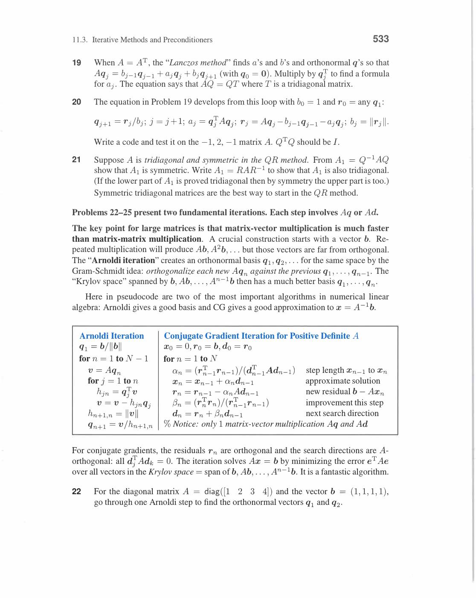
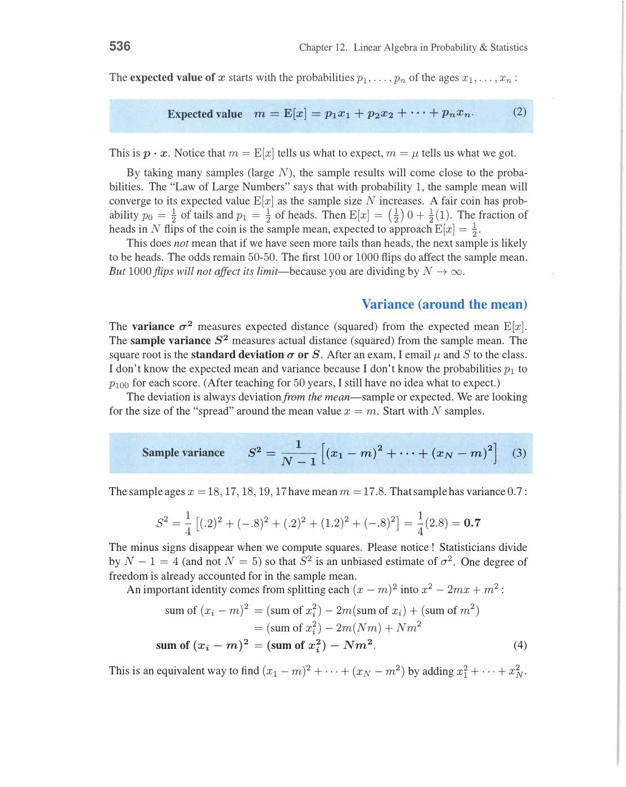
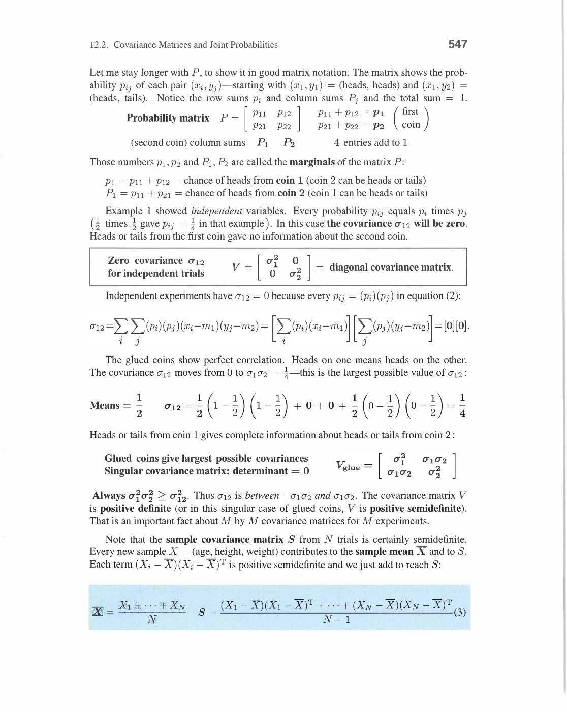
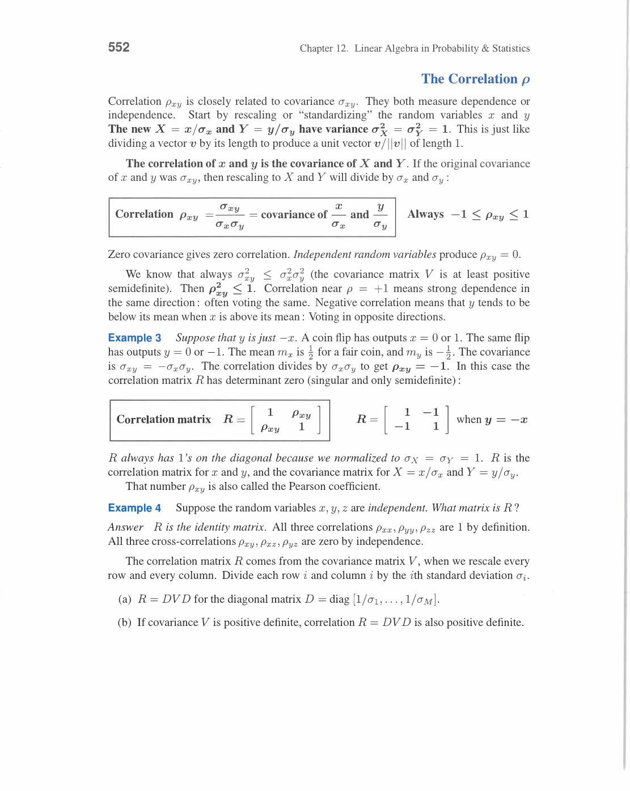
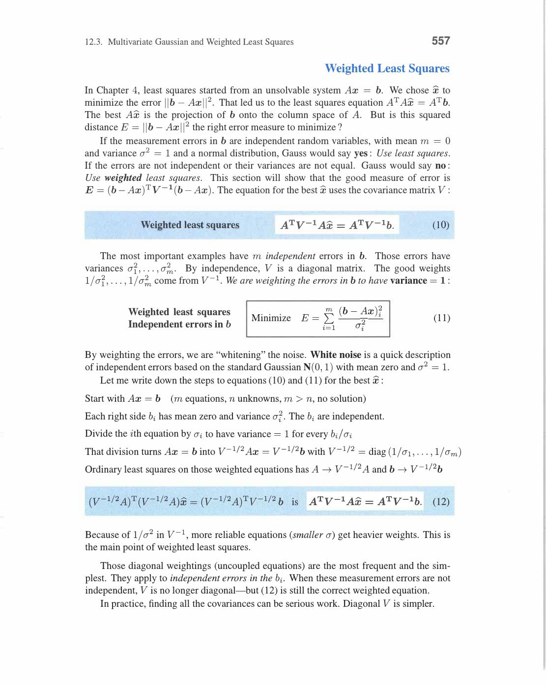

# Chapter 12 - Linear Algebra in Probability and Statistics

Visual gallery: [`12-probability-and-statistics.md`](../visuals/12-probability-and-statistics.md)

Final chapter data and uncertainty ko linear algebra se connect karta hai.

Main idea:

- random variables ko vector-like collections ki tarah study kar sakte hain
- covariance matrices symmetric positive semidefinite structure laati hain
- least squares aur Gaussian distributions naturally connect hote hain

## 12.1 Mean, Variance, and Probability

**Basic Probability:**

Sample space Ω. Event A ⊆ Ω. Probability P(A) ∈ [0,1], P(Ω) = 1.

**Discrete random variable X:**

Takes values x₁, x₂, ..., xₙ with probabilities p₁, p₂, ..., pₙ. Σpᵢ = 1.

```
Mean (Expected Value): μ = E[X] = Σᵢ xᵢpᵢ

Variance: σ² = Var(X) = E[(X-μ)²] = Σᵢ (xᵢ-μ)²pᵢ = E[X²] - μ²

Standard deviation: σ = √(Var(X))
```

**Continuous random variable:**

Probability density function (PDF) f(x) ≥ 0 with ∫f(x)dx = 1.

```
E[X] = ∫ x f(x) dx
Var(X) = ∫ (x-μ)² f(x) dx
```

CDF: F(x) = P(X ≤ x) = ∫₋∞ˣ f(t) dt (ramp function, goes 0 to 1).

**Linearity of Expectation (KEY!):**

```
E[aX + bY] = aE[X] + bE[Y]
```

Works always, even for dependent X, Y! This is the central theorem.

Matrix form: E[Ax] = AE[x]. Linear algebra directly applies.

**Normal (Gaussian) Distribution:**

```
f(x) = (1/(σ√2π)) exp(-(x-μ)²/(2σ²))

N(μ, σ²): mean μ, variance σ²
```

Properties:

- 68% of data within 1σ of mean
- 95% within 2σ
- 99.7% within 3σ

**Central Limit Theorem:** Average of n independent random variables → N(μ, σ²/n) as n → ∞. Explains why Gaussian appears everywhere!

**Binomial Distribution:**

n coin flips, P(head) = p. Number of heads k:

```
P(X = k) = C(n,k) pᵏ(1-p)^(n-k)

E[X] = np,   Var(X) = np(1-p)
```

For n=4, p=1/2: P(k heads) = {1/16, 4/16, 6/16, 4/16, 1/16} — Pascal's triangle row!

As n → ∞: binomial → Gaussian (CLT).

Review of Key Ideas (Section 12.1):

1. Mean = E[X] = Σxᵢpᵢ, Variance = E[(X-μ)²] = E[X²] - μ²
2. Linearity: E[aX+bY] = aE[X]+bE[Y] — fundamental law
3. Normal N(μ,σ²): f(x) = (1/σ√2π)exp(-(x-μ)²/2σ²)
4. CLT: sample means → Gaussian (explains ubiquity of normal distribution)

![Mean E[X] and variance Var(X) = E[X^2]-mu^2 (book p.540)](../assets/strang/12-probability-and-statistics/page-540-img-001.jpg)
*Mean μ = E[X] = Σxₖpₖ (discrete) or ∫x·f(x)dx (continuous). Variance σ² = E[(X-μ)²] = E[X²] - μ². Standard deviation σ = √(Var X). E[aX+b] = aE[X]+b (linearity). Var(aX+b) = a²Var(X) (shift doesn't change variance). Yeh basic statistics ka linear algebra view hai.*


*Normal distribution N(μ,σ²): bell curve f(x) = (1/σ√2π)e^(-(x-μ)²/2σ²). CLT: sum of independent random variables → Normal. Standardize: Z = (X-μ)/σ ~ N(0,1). 68-95-99.7 rule: 1σ contains 68%, 2σ contains 95%, 3σ contains 99.7%. Most important distribution in statistics.*


*Cumulative distribution function (CDF): ramp shape — 0 se start hokar F=1 par end hota hai. Uniform distribution ka CDF triangle/ramp hota hai. Area under probability density = 1. Yahi probability theory ka foundation hai jahan linear algebra integrate hota hai.*


*(1/2+1/2)⁴ = 1. Binomial expansion: 4 fair coin flips me 0,1,2,3,4 heads ki probabilities = 1/16, 4/16, 6/16, 4/16, 1/16. Pascal's triangle coefficients (1,4,6,4,1) = C(4,k). Center weight 6/16 sabse zyada — yahi bell curve ki taraf convergence dikhata hai.*

## 12.2 Covariance Matrices and Joint Probabilities

**Covariance:**

```
Cov(X, Y) = E[(X-μₓ)(Y-μᵧ)] = E[XY] - μₓμᵧ
```

- Cov(X,X) = Var(X) = σ²
- Cov(X,Y) > 0: X and Y tend to move together
- Cov(X,Y) < 0: X and Y tend to move oppositely
- Cov(X,Y) = 0: uncorrelated (but not necessarily independent!)

**Correlation coefficient:**

```
ρ(X,Y) = Cov(X,Y) / (σₓσᵧ)    with -1 ≤ ρ ≤ 1
```

**Covariance Matrix V (for random vector X = (X₁,...,Xₙ)):**

```
Vᵢⱼ = Cov(Xᵢ, Xⱼ) = E[(Xᵢ-μᵢ)(Xⱼ-μⱼ)]

V = E[(X-μ)(X-μ)ᵀ]    ← outer product of centered X
```

**Properties of covariance matrix:**

1. **Symmetric**: Vᵢⱼ = Vⱼᵢ (Cov(X,Y) = Cov(Y,X))
2. **Positive semidefinite**: aᵀVa = Var(aᵀX) ≥ 0 for all a
3. Diagonal entries = individual variances σᵢ²
4. Off-diagonal = pairwise covariances

**Joint probability:**

Joint distribution P(X=xᵢ, Y=yⱼ) = pᵢⱼ (matrix of probabilities, entries sum to 1).

Marginals: P(X=xᵢ) = Σⱼ pᵢⱼ (sum over rows), P(Y=yⱼ) = Σᵢ pᵢⱼ (sum over columns).

Independence: X ⊥ Y ↔ pᵢⱼ = P(X=xᵢ)·P(Y=yⱼ) for all i,j.

Matrix form: P = p_X pᵧᵀ (rank-1 matrix). Independent ↔ joint matrix is rank 1!

**Concrete Example:**

X, Y each take values {0,1} with equal probability.

```
Joint (independent): P = [1/4  1/4]    (rank 1 — factorizes as (1/2,1/2)(1/2,1/2)ᵀ)
                         [1/4  1/4]

Joint (correlated): P = [1/2  0  ]    (rank 2 — X=Y always, highly dependent)
                        [0    1/2]
```

For correlated case: Cov(X,Y) = E[XY] - E[X]E[Y] = 1/2 - (1/2)(1/2) = 1/4 > 0. Positive covariance!

**Covariance under linear transformation:**

If Y = AX: Cov(Y) = A · Cov(X) · Aᵀ.

This is THE key formula for understanding how uncertainty propagates through linear systems.

Review of Key Ideas (Section 12.2):

1. Covariance matrix V = E[(X-μ)(X-μ)ᵀ] — symmetric positive semidefinite
2. Diagonal = variances, off-diagonal = covariances
3. Independence ↔ joint probability matrix is rank 1
4. Linear transform: Cov(AX) = A·Cov(X)·Aᵀ — fundamental propagation formula


*Joint probability matrix P: Pᵢⱼ = P(X=i, Y=j). Marginals: row sums = P(X=i), col sums = P(Y=j). X,Y independent ↔ P = (row vector)(col vector) ↔ P has rank 1! Dependence = rank > 1. Linear algebra view: independence = rank-1 structure in joint probability matrix.*

![Covariance matrix V = E[(X-mu)(X-mu)T] (book p.551)](../assets/strang/12-probability-and-statistics/page-551-img-001.jpg)
*Covariance matrix V = E[(X-μ)(X-μ)ᵀ]: n×n symmetric positive semidefinite matrix. Diagonal entries = variances, off-diagonal = covariances. V = AᵀA form (symmetric PSD). Cov(AX) = AVAᵀ (transformation rule). Eigendecomposition of V reveals principal directions of variability.*

![Joint probability matrix P = [1/4,1/4;1/4,1/4] — independent uniform variables (book p.546)](../assets/strang/12-probability-and-statistics/page-556-img-001.jpg)
*Joint probability matrix: P = [p₁₁,p₁₂;p₂₁,p₂₂] = [1/4,1/4;1/4,1/4]. Sab entries equal → X aur Y independent hain. Each takes values {0,1} with equal probability. Rank-1 matrix p₁p₂ᵀ = independent joint distribution. Covariance = 0 when independent.*

![Covariance as outer product — (xᵢ-m₁)(yⱼ-m₂) terms give V = E[(X-m)(X-m)ᵀ] (book p.549)](../assets/strang/12-probability-and-statistics/page-559-img-002.jpg)
*Covariance matrix outer product form: (xᵢ-m₁)(yⱼ-m₂) aur (yⱼ-m₂)² terms = [xᵢ-m₁; yⱼ-m₂][xᵢ-m₁, yⱼ-m₂]. V = E[(X-m)(X-m)ᵀ]. Yahi symmetric positive semidefinite matrix naturally aati hai statistics se — Chapter 6 ki positive definiteness yahan concrete ho jaati hai.*


*Linearity of expectation: mean of sum = sum of means. (1/N)∑(xᵢ+yᵢ) = m₁ + m₂. Yeh linear algebra ka core property hai applied to statistics. E[aX + bY] = aE[X] + bE[Y] — expectation is a linear operator. Matrix operations aur probability calculations same linearity follow karte hain.*

## 12.3 Multivariate Gaussian and Weighted Least Squares

**Multivariate Gaussian Distribution:**

Random vector X ∈ Rⁿ with mean μ and covariance matrix V:

```
f(x) = (1/((2π)^(n/2) |V|^(1/2))) exp(-½(x-μ)ᵀV⁻¹(x-μ))
```

Notation: X ~ N(μ, V).

**Geometric interpretation:**

Level sets f(x) = const are ellipsoids: (x-μ)ᵀV⁻¹(x-μ) = c.

Ellipsoid axes = eigenvectors of V.
Axis half-lengths ∝ √(eigenvalues of V) = √(variances in principal directions).

For V = diag(σ₁², σ₂²): axis aligned with coordinate axes, independent variables.

For general V: rotation (eigenvectors) + scaling (eigenvalues) of ellipsoid.

**Bivariate Gaussian example:**

```
μ = (0,0), V = [σ₁²   ρσ₁σ₂]
               [ρσ₁σ₂  σ₂²  ]

f(x₁,x₂) = (1/(2πσ₁σ₂√(1-ρ²))) exp(-1/(2(1-ρ²)) [(x₁/σ₁)² - 2ρ(x₁/σ₁)(x₂/σ₂) + (x₂/σ₂)²])
```

For ρ = 0: V diagonal → independent Gaussians → ellipse axes aligned with coordinates.
For ρ = 1: singular V (perfect correlation) → degenerate 1D Gaussian on line x₁σ₂ = x₂σ₁.

**Weighted Least Squares:**

Standard least squares: minimize ‖Ax - b‖².

Weighted least squares: measurements have different reliability (variance).

```
Minimize: (Ax-b)ᵀ W (Ax-b)    where W = weight matrix (diagonal, Wᵢᵢ = 1/σᵢ²)
```

Normal equations: AᵀWAx̂ = AᵀWb.

Solution: x̂ = (AᵀWA)⁻¹AᵀWb.

**Statistical justification (Gauss-Markov theorem):**

If errors εᵢ have zero mean and covariance V = σ²W⁻¹:

Weighted least squares x̂ = (AᵀV⁻¹A)⁻¹AᵀV⁻¹b is the **Best Linear Unbiased Estimator (BLUE)**.

"Best" = minimum variance among all linear unbiased estimators.

**Concrete weighted example:**

Two measurements of unknown θ:

```
b₁ = θ + ε₁    (precision σ₁² = 1, so weight w₁ = 1)
b₂ = θ + ε₂    (precision σ₂² = 4, so weight w₂ = 1/4)

A = [1; 1], W = diag(1, 1/4)

x̂ = (AᵀWA)⁻¹AᵀWb = ((1)(1)+(1)(1/4))⁻¹ (1·b₁ + 1/4·b₂)
   = (5/4)⁻¹ (b₁ + b₂/4)
   = (4/5)b₁ + (1/5)b₂
```

First measurement gets 4× more weight (4× more precise). Makes sense!

**Connection to Kalman Filter:**

Sequential Bayes estimation: update estimate as new measurements arrive.

```
Prior: x̂₀, P₀ (initial estimate, covariance)
Measurement: y = Cx + v (v ~ N(0, R))
Update: x̂₁ = x̂₀ + K(y - Cx̂₀)   where K = P₀Cᵀ(CP₀Cᵀ + R)⁻¹
```

K = Kalman gain. This is weighted least squares applied recursively.

Review of Key Ideas (Section 12.3):

1. X ~ N(μ, V): level sets = ellipsoids with axes = eigenvectors of V
2. Weighted LS: minimize (Ax-b)ᵀW(Ax-b) → x̂ = (AᵀWA)⁻¹AᵀWb
3. Gauss-Markov theorem: weighted LS = BLUE when weights = inverse variances
4. Kalman filter: sequential weighted LS — fundamental in navigation, tracking, control


*Multivariate Gaussian N(μ, V): f(x) ∝ exp(-(x-μ)ᵀV⁻¹(x-μ)/2). Level curves = ellipsoids. Shape = eigenvectors of V (principal axes), size = eigenvalues (axis lengths). When V = I: spherical (isotropic). PCA diagonalizes V by rotating to eigenvector basis.*


*Weighted least squares: minimize eᵀV⁻¹e where V = covariance matrix of errors. Normal equations: AᵀV⁻¹Ax̂ = AᵀV⁻¹b. Weight = 1/variance: high-variance measurements get low weight. Reduces to ordinary LS when V = I. Gauss-Markov: BLUE estimator. Statistics me maximum likelihood = weighted LS.*


*Gauss-Markov theorem: weighted least squares x̂ = (AᵀV⁻¹A)⁻¹AᵀV⁻¹b is BLUE — Best Linear Unbiased Estimator. "Best" = minimum variance among all linear unbiased estimators. No assumption of normality needed! Just E[e]=0 and Cov(e)=V. Normal equations = maximum likelihood when errors Gaussian.*

![Bivariate Gaussian exponent — -(x-m₁)²/2σ₁² - (y-m₂)²/2σ₂² = -(1/2)[x-m₁,...] (book p.555)](../assets/strang/12-probability-and-statistics/page-565-img-003.jpg)
*Bivariate Gaussian density exponent: -(x-m₁)²/(2σ₁²) - (y-m₂)²/(2σ₂²) = -(1/2)(X-m)ᵀV⁻¹(X-m). V = diag(σ₁²,σ₂²) covariance matrix. Independent variables: V diagonal. Level curves = ellipses aligned with axes. V ke eigenvectors = ellipse axes, eigenvalues = axis lengths. Yahi positive definite matrix geometrically appear hoti hai.*

![Weighted least squares — [A₀ᵀ;A₁ᵀ][V₀⁻¹;V₁⁻¹][A₀;A₁]x̂₁ = ... (book p.560)](../assets/strang/12-probability-and-statistics/page-570-img-001.jpg)
*Weighted least squares formula: [A₀ᵀ A₁ᵀ][V₀⁻¹ 0; 0 V₁⁻¹][A₀; A₁]x̂₁ = ... Two measurement sets with covariances V₀ and V₁. Less reliable measurements (larger V) get smaller weight V⁻¹. Yahi statistics ka Gauss-Markov theorem hai — optimal unbiased estimator = weighted LS. AᵀV⁻¹A x̂ = AᵀV⁻¹b.*

![Weighted LS setup — [1,0;0,1;a,b][1;0] design matrix structure (book p.553)](../assets/strang/12-probability-and-statistics/page-563-img-002.jpg)
*Regression/weighted setup: design matrix [I; A₁] structure jahan bottom rows [a,b] additional constraints add karte hain. [1,0;0,1;a,b] applied to [1;0] picks out first column. Yeh weighted least squares ka building block hai — different measurement equations stack hoti hain.*

---

# Final Big Picture

If you finish this book properly, you should be able to see these links clearly:

- `Ax = b` <-> linear combinations of columns
- elimination <-> triangular systems <-> LU
- nullspace <-> free variables <-> dependence
- row space and column space <-> orthogonality pairs
- least squares <-> projections <-> normal equations
- determinant <-> singularity <-> volume scaling
- eigenvalues <-> dynamics <-> diagonalization
- symmetric matrices <-> orthogonal eigenvectors <-> positive definiteness
- SVD <-> best low-rank approximation <-> PCA
- complex matrices <-> Fourier transform
- applications <-> graphs, Markov chains, graphics, cryptography
- numerical linear algebra <-> stability and conditioning
- statistics <-> covariance matrices and weighted least squares

Short summary of the whole book:

- Chapter 1-2 teach you how to speak matrix language
- Chapter 3-4 teach you the space structure behind that language
- Chapter 5-6 teach you deeper invariants and matrix behavior
- Chapter 7-9 expand that language to modern data and signals
- Chapter 10-12 show why the subject matters in the real world

---

# What To Do Next

Recommended use inside this repo:

1. Read the matching chapter here
2. Open the PDF for examples
3. Open the corresponding notebook in `notebooks/`
4. Use `src/strang_la/` functions to experiment
5. Solve review problems from the book

Pairing:

- Chapter 1 notes -> `week01_ch01_vectors.ipynb`
- Chapter 2 notes -> `week02_ch02_elimination.ipynb`
- Chapter 3 notes -> `week03_ch03_vector_spaces.ipynb`
- Chapter 4 notes -> `week04_ch04_orthogonality.ipynb`
- Chapter 5 notes -> `week05_ch05_determinants.ipynb`
- Chapter 6 notes -> `week06_ch06_eigenvalues.ipynb`
- Chapter 7 notes -> `week07_ch07_svd_pca.ipynb`
- Chapter 8 notes -> `week08_ch08_transformations.ipynb`
- Chapter 9 notes -> `week09_ch09_complex_fft.ipynb`
- Chapter 10 notes -> `week10_ch10_applications.ipynb`
- Chapter 11 notes -> `week11_ch11_numerical_la.ipynb`
- Chapter 12 notes -> `week12_ch12_probability_stats.ipynb`

That gives you one clean flow:

`book -> hinglish notes -> notebook -> exercises -> revision`
