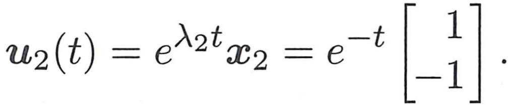
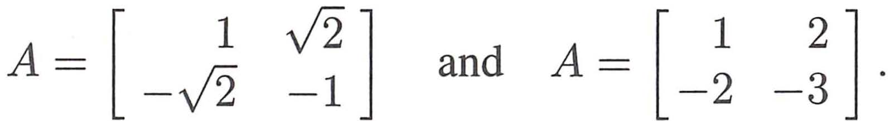

# Chapter 6 Visual Gallery

These are representative visuals extracted from **Eigenvalues and Eigenvectors**.

Use them with the chapter notes and original PDF.

## PDF Page 299

## PDF Page 308

## PDF Page 319

## PDF Page 330

## PDF Page 334

## PDF Page 346

## PDF Page 363

## PDF Page 368

