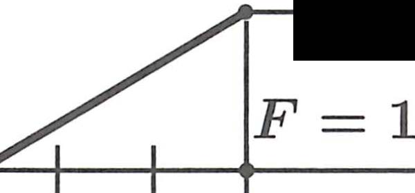
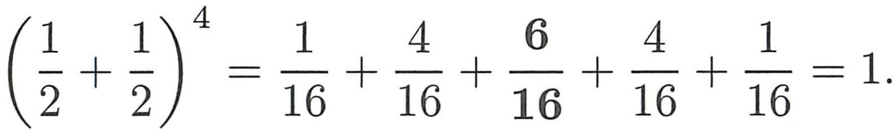
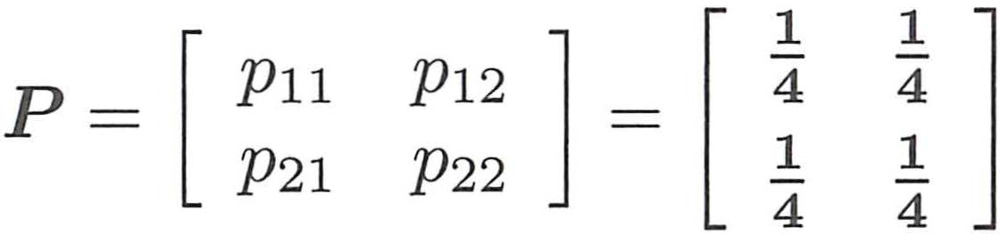
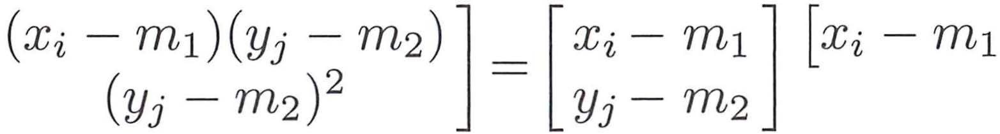
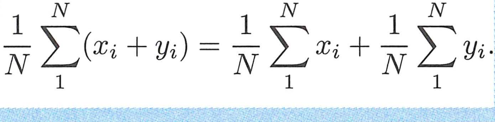
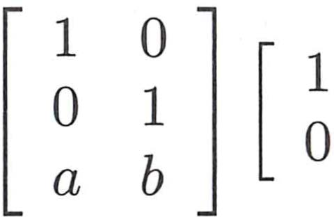
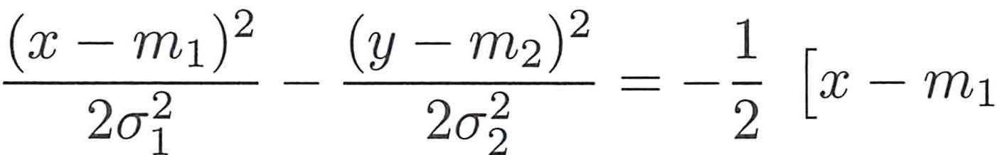
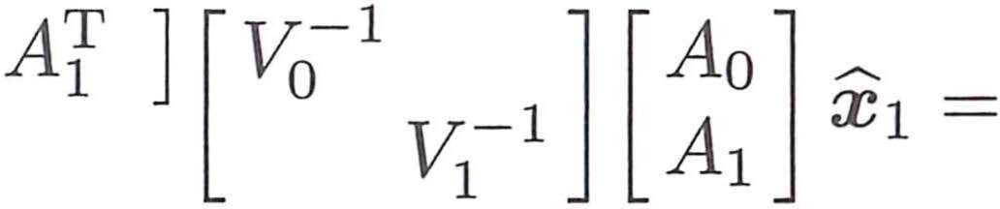

# Chapter 12 Visual Gallery

These are representative visuals extracted from **Linear Algebra in Probability & Statistics**.

Use them with the chapter notes and original PDF.

## PDF Page 548

## PDF Page 552

## PDF Page 556

## PDF Page 559

## PDF Page 560

## PDF Page 563

## PDF Page 565

## PDF Page 570

